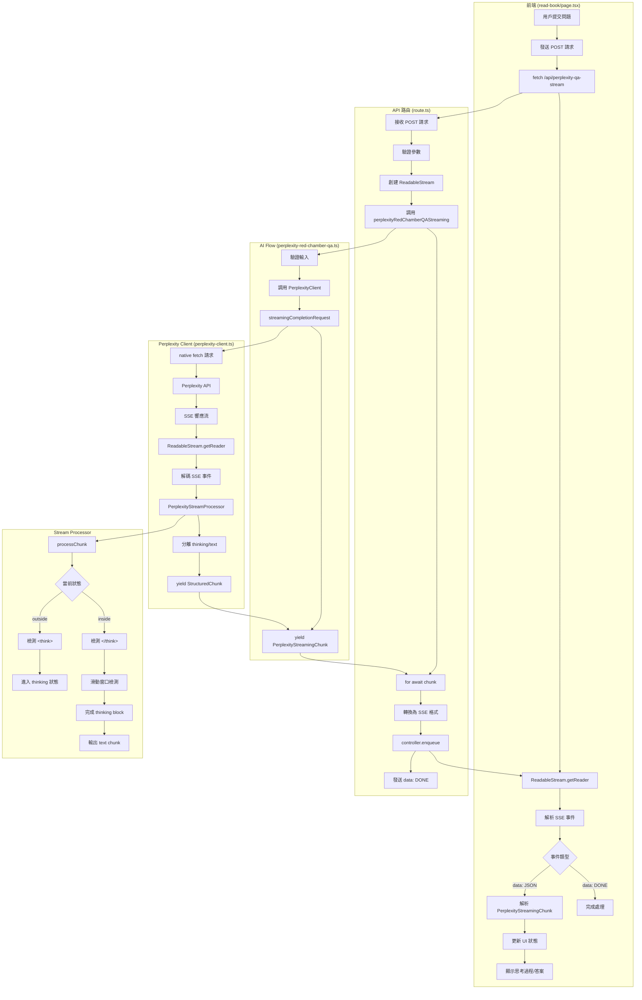
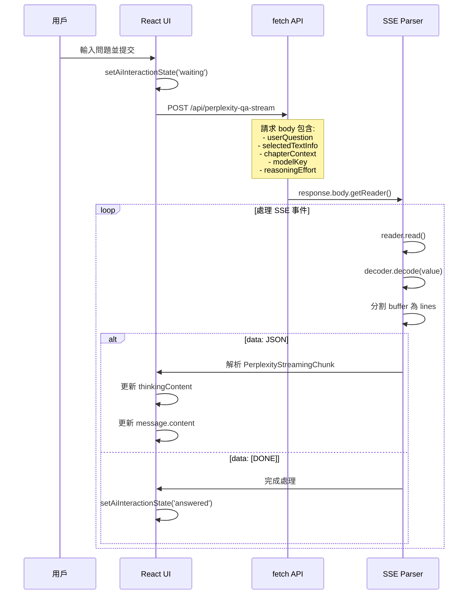
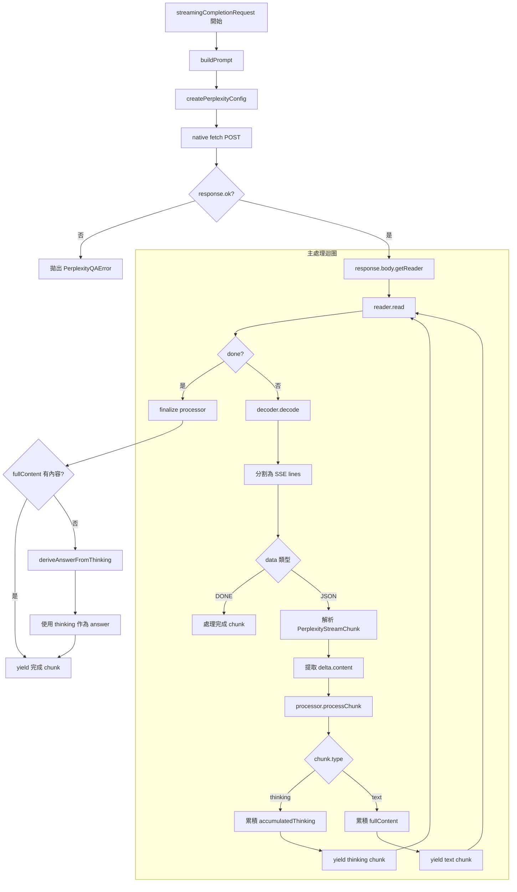
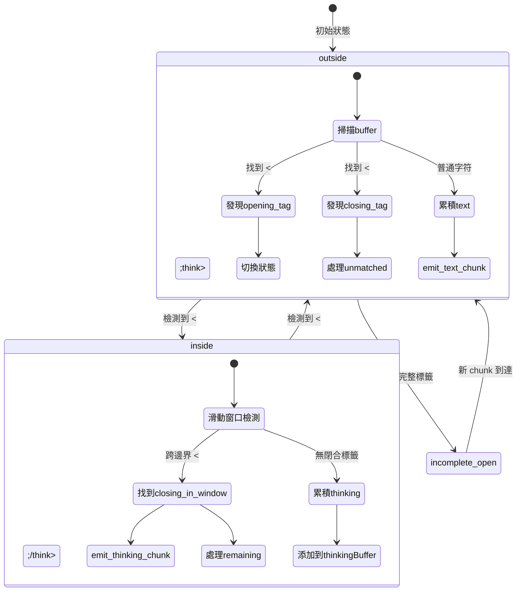
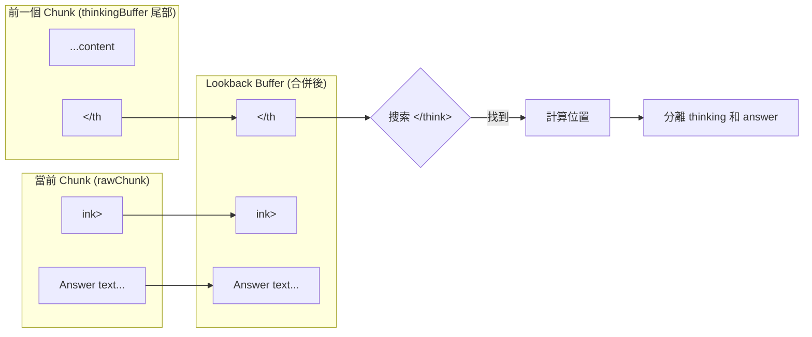
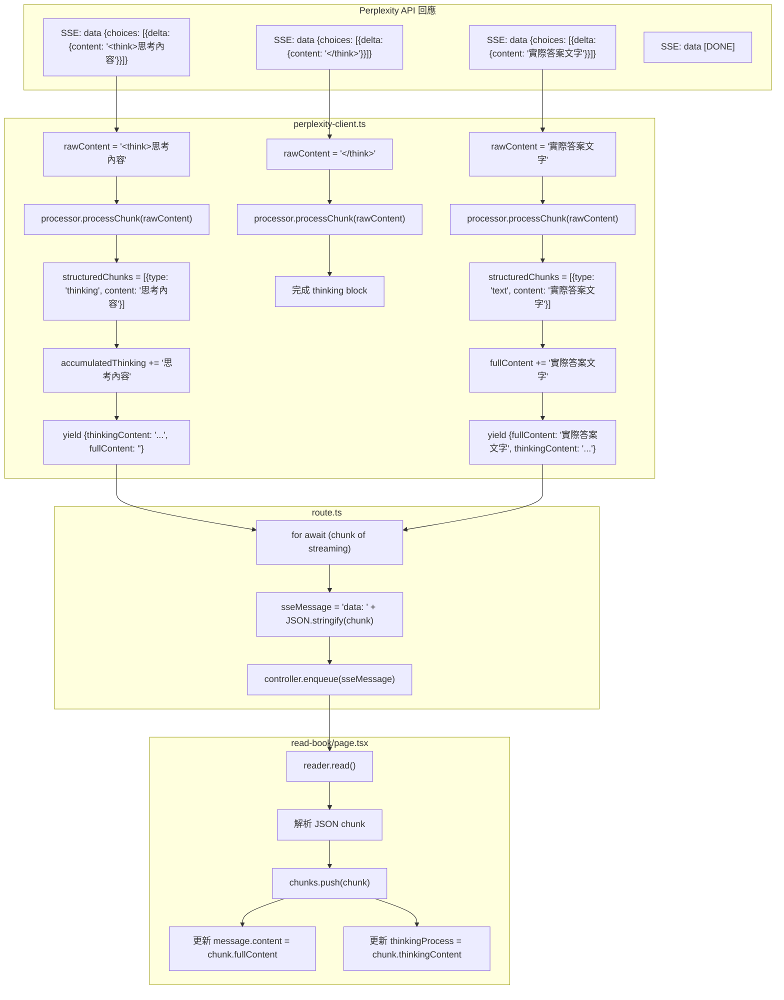

# Perplexity AI Q&A Streaming 處理流程分析

## 問題描述

AI 問答模塊在某些情況下無法正確輸出完整答案內容（fullContent），導致用戶看到空白或不完整的回應。本文檔詳細分析 streaming 處理的完整流程，協助定位問題根源。

---

## 系統架構總覽



---

## 詳細流程說明

### 1. 前端請求階段 (read-book/page.tsx)



**關鍵程式碼位置**: `src/app/(main)/read-book/page.tsx:1936-2359`

**重要狀態變數**:
- `chunks`: 累積所有收到的 PerplexityStreamingChunk
- `latestThinkingText`: 最新的思考內容
- `thinkingContent`: 顯示在 UI 上的思考過程

---

### 2. API 路由處理階段 (route.ts)

```mermaid
flowchart TD
    A[POST 請求進入] --> B{驗證 userQuestion}
    B -->|無效| C[返回 400 錯誤]
    B -->|有效| D[創建 PerplexityQAInput]
    D --> E[計算 adaptiveTimeout]
    E --> F[創建 ReadableStream]

    subgraph StreamProcessing["Stream 處理"]
        F --> G[設置 timeout handler]
        G --> H[for await perplexityRedChamberQAStreaming]
        H --> I{chunk.isComplete?}
        I -->|否| J[發送 SSE: data JSON]
        J --> H
        I -->|是| K[清除 timeout]
        K --> L[發送 SSE: data DONE]
    end

    L --> M[controller.close]

    subgraph ErrorHandling["錯誤處理"]
        N[捕獲異常] --> O[classifyError]
        O --> P[formatErrorForUser]
        P --> Q[發送錯誤 chunk]
        Q --> R[發送 DONE 並關閉]
    end
```



**關鍵程式碼位置**: `src/app/api/perplexity-qa-stream/route.ts:32-251`

**SSE 訊息格式**:
```
data: {"content":"...","fullContent":"...","thinkingContent":"...","isComplete":false,...}\n\n
data: [DONE]\n\n
```

---

### 3. Perplexity Client Streaming 處理



**關鍵程式碼位置**: `src/lib/perplexity-client.ts:506-1133`

**重要變數追蹤**:
- `fullContent`: 累積的答案文本
- `accumulatedThinking`: 累積的思考內容
- `rawContentChunkCount`: 原始內容 chunk 計數
- `sawThinkClose`: 是否看到 `</think>` 標籤

---

### 4. Stream Processor 核心邏輯



**關鍵程式碼位置**: `src/lib/streaming/perplexity-stream-processor.ts:65-598`

---

### 5. 滑動窗口閉合標籤檢測



**核心邏輯說明**:

當 `</think>` 標籤被分割在兩個 chunk 之間時（例如：前一個 chunk 以 `</th` 結尾，當前 chunk 以 `ink>` 開頭），單獨檢測任一 chunk 都無法找到完整標籤。

**滑動窗口解決方案**:
1. 取 `thinkingBuffer` 最後 8 個字符（`</think>` 長度）
2. 與當前 `rawChunk` 合併成 `lookbackBuffer`
3. 在 `lookbackBuffer` 中搜索 `</think>`
4. 計算標籤在原始 buffer 中的實際位置
5. 正確分離 thinking 內容和 answer 內容

---

## 可能的問題點分析

### 問題假設 A：StreamProcessor 未正確檢測 `</think>`

**症狀**: `fullContent` 為空或非常短，但 `thinkingContent` 包含完整回答

**可能原因**:
1. 滑動窗口計算錯誤
2. `actualLookbackSize` 與 `maxLookbackSize` 混淆
3. `remainingStartInRaw` 計算導致答案內容被截斷

**診斷日誌位置**:
```typescript
// perplexity-stream-processor.ts:205-226
console.log('[StreamProcessor] 🔍 REMAINING CALCULATION DEBUG:');
```

### 問題假設 B：後端 chunk 未包含正確的 fullContent

**症狀**: 前端收到的 chunk 中 `fullContent` 始終為空

**可能原因**:
1. `processChunk` 未返回 `text` 類型的 chunk
2. 所有內容都被歸類為 `thinking`
3. `</think>` 後的內容未被遞歸處理

**診斷日誌位置**:
```typescript
// perplexity-client.ts:838-873
console.log('[HYPOTHESIS B] 🅱️ StreamProcessor Output Analysis');
```

### 問題假設 C：前端處理邏輯錯誤

**症狀**: 後端日誌顯示 `fullContent` 正確，但前端顯示錯誤

**可能原因**:
1. SSE 解析錯誤
2. chunk 合併邏輯問題
3. 狀態更新時機問題

**診斷日誌位置**:
```typescript
// read-book/page.tsx:2237-2271
console.log('[HYPOTHESIS B - Frontend] 🅱️ Chunk Received from Backend');
```

---

## 完整資料流圖



---

## 關鍵檔案索引

| 檔案路徑 | 職責 | 關鍵函數/行號 |
|---------|------|-------------|
| `src/app/(main)/read-book/page.tsx` | 前端 UI 與 SSE 消費 | `handleAskQuestion` (L1920-2400) |
| `src/app/api/perplexity-qa-stream/route.ts` | API 路由，SSE 生成 | `POST` handler (L32-251) |
| `src/ai/flows/perplexity-red-chamber-qa.ts` | AI Flow 入口 | `perplexityRedChamberQAStreaming` (L188-336) |
| `src/lib/perplexity-client.ts` | Perplexity API 客戶端 | `streamingCompletionRequest` (L506-1133) |
| `src/lib/streaming/perplexity-stream-processor.ts` | `<think>` 標籤處理 | `processChunk` (L101-466) |
| `src/lib/perplexity-thinking-utils.ts` | 思考內容清理工具 | `sanitizeThinkingContent` (L78-103) |
| `src/types/perplexity-qa.ts` | 類型定義 | `PerplexityStreamingChunk` (L130-157) |

---

## 調試建議

### 1. 啟用詳細日誌
```bash
# 設置環境變數
PERPLEXITY_DEBUG=true
```

### 2. 檢查關鍵日誌輸出

**後端 (Vercel Functions Logs / 終端機)**:
- `[StreamProcessor] 🔎 Sliding window check`
- `[StreamProcessor] 🔍 REMAINING CALCULATION DEBUG`
- `[HYPOTHESIS B] 🅱️ StreamProcessor Output Analysis`
- `[DONE] STREAM END SUMMARY`

**前端 (瀏覽器 F12 Console)**:
- `[QA Module] 🚀 AI 問答已觸發！`
- `[HYPOTHESIS B - Frontend] 🅱️ Chunk Received from Backend`
- `[QA Module] 🏁 FINAL STATE on [DONE]`

### 3. 驗證資料完整性

檢查最終 chunk 的 `fullContent` 是否包含預期的答案內容：
```javascript
// 在 [DONE] 時檢查
console.log('Final fullContent:', chunk.fullContent?.substring(0, 500));
console.log('Final thinkingContent:', chunk.thinkingContent?.substring(0, 200));
console.log('contentDerivedFromThinking:', chunk.contentDerivedFromThinking);
```

---

## 文件更新記錄

| 日期 | 版本 | 更新內容 |
|------|------|---------|
| 2025-12-03 | v1.0 | 初始版本：完整 streaming 流程分析 |
