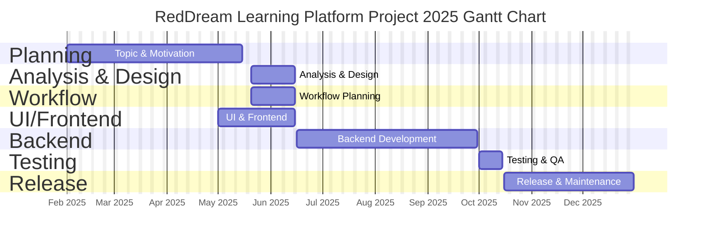

# RedDream Learning Platform Project 2025 甘特圖

這是RedDream學習平台專案2025年的開發時程規劃甘特圖，涵蓋從規劃、分析設計、工作流程、前端開發、後端開發、測試到發布維護的完整開發週期。

## 專案時程說明

### 規劃階段 (Planning)
- **主題與動機研究** (2025/02/01 - 2025/05/15): 確定專案方向和研究動機，進行需求調研

### 分析與設計階段 (Analysis & Design)
- **分析與設計** (2025/05/20 - 2025/06/15): 系統架構設計和需求分析

### 工作流程階段 (Workflow)
- **工作流程規劃** (2025/05/20 - 2025/06/15): 開發流程和協作方式制定

### 前端開發階段 (UI/Frontend)
- **UI與前端開發** (2025/05/01 - 2025/06/15): 用戶介面設計和前端功能實作

### 後端開發階段 (Backend)
- **後端開發** (2025/06/16 - 2025/09/30): 核心業務邏輯和資料庫設計實作

### 測試階段 (Testing)
- **測試與品質保證** (2025/10/01 - 2025/10/15): 功能測試、整合測試和效能測試

### 發布階段 (Release)
- **發布與維護** (2025/10/16 - 2025/12/31): 系統上線和後續維護支援
