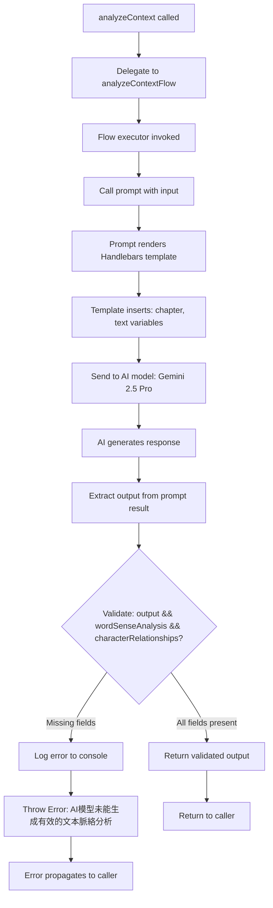

# Module: `context-aware-analysis`

## 1. Module Summary

The `context-aware-analysis` module implements a GenKit-based AI flow that provides comprehensive literary analysis of text passages from "Dream of the Red Chamber" by performing word sense disambiguation and character relationship mapping. This module helps students understand difficult classical Chinese vocabulary within specific chapter contexts while simultaneously tracking complex character dynamics and interactions. The flow generates dual-aspect analysis (vocabulary and relationships) formatted in Traditional Chinese markdown for rich text display in the educational interface.

## 2. Module Dependencies

* **Internal Dependencies:**
  * `@/ai/genkit` - Core GenKit instance (`ai`) providing `definePrompt` and `defineFlow` APIs for AI orchestration
* **External Dependencies:**
  * `genkit` - GenKit framework providing `z` (Zod) schema validation re-export and flow definition utilities

## 3. Public API / Exports

* `analyzeContext(input: ContextAnalysisInput): Promise<ContextAnalysisOutput>` - Main async function delegating to `analyzeContextFlow` for comprehensive text analysis
* `ContextAnalysisInput` - TypeScript type for input parameters containing text passage and chapter information
* `ContextAnalysisOutput` - TypeScript type for output containing word sense analysis and character relationship descriptions

## 4. Code File Breakdown

### 4.1. `context-aware-analysis.ts`

* **Purpose:** This server-side file implements intelligent text analysis by combining two critical aspects of classical Chinese literature comprehension: lexical understanding (word sense disambiguation for archaic terms) and narrative understanding (character relationship tracking). The module uses GenKit's prompt engineering and flow definition patterns to structure AI requests with explicit schema validation, ensuring type-safe inputs and outputs. By analyzing vocabulary and relationships simultaneously, this flow provides holistic context-aware assistance that adapts to the user's current reading position in the novel's 120 chapters.

* **Functions:**
    * `analyzeContext(input: ContextAnalysisInput): Promise<ContextAnalysisOutput>` - Public async function serving as the entry point for context analysis requests. Simply delegates execution to the internal `analyzeContextFlow` with the provided input and returns the Promise directly. Does not perform additional validation or transformation; acts as a clean API boundary. Throws errors propagated from the underlying flow.

* **Key Classes / Constants / Variables:**
    * `ContextAnalysisInputSchema`: Zod object schema defining two required string fields:
      - `text` (string): Current passage being read by the student, should be a meaningful segment with sufficient context for analysis
      - `chapter` (string): Current chapter number or title being read, used for broader narrative context
      Schema includes detailed descriptions guiding AI on expected input semantics.

    * `ContextAnalysisInput`: Exported TypeScript type inferred from input schema using `z.infer<typeof ContextAnalysisInputSchema>`. Ensures compile-time type safety for function parameters throughout the application.

    * `ContextAnalysisOutputSchema`: Zod object schema defining two required string fields, both markdown-formatted:
      - `wordSenseAnalysis` (string): Detailed analysis of difficult words, phrases, literary devices with classical Chinese terminology explanations, historical context, and literary significance. Must use markdown formatting (## headers, - lists, **bold**, *italic*)
      - `characterRelationships` (string): Analysis of character relationships and interactions relevant to current passage, describing family connections, romantic relationships, social hierarchies, and conflicts. Must use markdown formatting for clear structure
      Schema descriptions explicitly require Traditional Chinese markdown output with specific formatting elements.

    * `ContextAnalysisOutput`: Exported TypeScript type inferred from output schema. Defines the contract for AI-generated analysis results.

    * `prompt`: GenKit prompt definition created via `ai.definePrompt()` with configuration object:
      - `name: 'contextAnalysisPrompt'` - Unique identifier for the prompt template
      - `input: {schema: ContextAnalysisInputSchema}` - Binds input validation schema
      - `output: {schema: ContextAnalysisOutputSchema}` - Binds output validation schema
      - `prompt: string` (multiline template) - Handlebars-style template instructing AI to assist students reading chapter `{{{chapter}}}` with text `{{{text}}}`, requesting word sense analysis for difficult terms and character relationship descriptions including plot summaries. Explicitly requests Traditional Chinese markdown formatting with examples (## 標題, - 項目, **重要文字**, *強調文字*).

    * `analyzeContextFlow`: GenKit flow definition created via `ai.defineFlow()` with:
      - `name: 'analyzeContextFlow'` - Unique flow identifier for tracking and debugging
      - `inputSchema: ContextAnalysisInputSchema` - Schema for validating incoming requests
      - `outputSchema: ContextAnalysisOutputSchema` - Schema for validating AI responses
      - `async (input) => {...}` - Flow executor function that:
        1. Invokes `prompt(input)` to generate AI response
        2. Validates output completeness (checks for `wordSenseAnalysis` and `characterRelationships`)
        3. Logs error and throws Chinese error message if validation fails
        4. Returns validated output object
      Flow is private (not exported) and only accessed through public `analyzeContext()` function.

## 5. System and Data Flow

### 5.1. System Flowchart (Control Flow)



### 5.2. Data Flow Diagram (Data Transformation)

```mermaid
graph LR
    UserReading[User Reading Novel] -- text + chapter --> APICall[analyzeContext call]

    APICall -- ContextAnalysisInput --> FlowEntry[analyzeContextFlow]

    FlowEntry -- input --> PromptInvoke[prompt invocation]
    Template[Handlebars Template] --> PromptInvoke
    PromptInvoke -- Rendered Prompt --> AIModel[Gemini 2.5 Pro Model]

    AIModel -- AI Response --> OutputExtract[Extract output]
    OutputSchema[ContextAnalysisOutputSchema] --> Validation[Schema Validation]
    OutputExtract -- output object --> Validation

    Validation -- Valid --> Structure[Structured Output]
    Structure -- wordSenseAnalysis --> MarkdownField1[Word Analysis Markdown]
    Structure -- characterRelationships --> MarkdownField2[Relationships Markdown]

    MarkdownField1 --> FinalOutput[ContextAnalysisOutput]
    MarkdownField2 --> FinalOutput

    Validation -- Invalid --> ErrorThrow[Throw Error]
    ErrorThrow --> ErrorHandling[Caller Error Handling]

    FinalOutput --> UIRender[UI Markdown Rendering]
```



## 6. Usage Example & Testing

* **Usage:**
```typescript
import { analyzeContext } from '@/ai/flows/context-aware-analysis';

const result = await analyzeContext({
  text: "寶玉聽了，喜不自禁，連說：「有趣，有趣！」",
  chapter: "第三回"
});

console.log(result.wordSenseAnalysis);
// ## 詞語分析\n- **喜不自禁**: 高興得控制不住自己...

console.log(result.characterRelationships);
// ## 人物關係\n- 賈寶玉與林黛玉初次相見...
```

* **Testing:** This module is tested through GenKit's development UI (`npm run genkit:dev`) where the `analyzeContextFlow` is registered and can be executed with test inputs. No dedicated unit test file exists for this flow. Integration testing occurs through the reading interface API routes that consume this analysis function. Developers can verify schema validation by providing incomplete inputs and confirming error messages. Manual testing involves comparing AI-generated analysis quality against sample passages from the novel to ensure literary accuracy and markdown formatting compliance.
