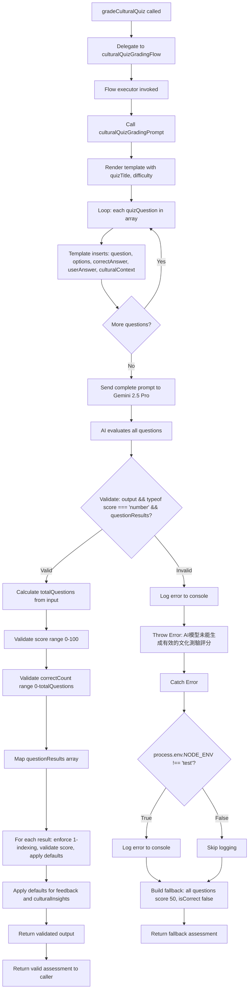

# Module: `cultural-quiz-grading`

## 1. Module Summary

The `cultural-quiz-grading` module implements an AI-powered multi-question quiz grading system for assessing user understanding of Qing Dynasty cultural knowledge, social customs, and historical context depicted in "Dream of the Red Chamber". This GenKit-based flow evaluates both multiple-choice and open-ended questions with differentiated scoring (100/0 for multiple-choice, 0-100 scaled for open-ended based on accuracy and completeness), provides detailed per-question explanations in Traditional Chinese, and generates cultural insights to deepen historical literacy. The module enables efficient batch grading of multiple quiz questions while offering educational feedback that connects cultural facts to the novel's narrative.

## 2. Module Dependencies

* **Internal Dependencies:**
  * `@/ai/genkit` - Core GenKit instance (`ai`) providing `definePrompt` and `defineFlow` APIs
* **External Dependencies:**
  * `genkit` - GenKit framework providing `z` (Zod) schema validation re-export

## 3. Public API / Exports

* `gradeCulturalQuiz(input: CulturalQuizGradingInput): Promise<CulturalQuizGradingOutput>` - Main async function for grading cultural knowledge quizzes
* `CulturalQuizGradingInput` - TypeScript type for input containing quiz title, question array, and difficulty
* `CulturalQuizGradingOutput` - TypeScript type for output containing overall score, correct count, per-question results, feedback, and cultural insights

## 4. Code File Breakdown

### 4.1. `cultural-quiz-grading.ts`

* **Purpose:** This server-side file implements batch quiz assessment for cultural knowledge evaluation, processing multiple questions (both multiple-choice and open-ended) in a single AI flow execution for efficiency. The module uses nested Zod schemas to validate individual questions within the quiz array, applies differentiated scoring logic (binary for multiple-choice, scaled for open-ended based on completeness), and provides educational explanations that not only indicate correctness but also enrich cultural understanding through contextual background information. By generating comprehensive cultural insights as markdown output, this flow transforms quiz assessment from mere score reporting into an educational experience that deepens appreciation of Qing Dynasty culture and its representation in the novel.

* **Functions:**
    * `gradeCulturalQuiz(input: CulturalQuizGradingInput): Promise<CulturalQuizGradingOutput>` - Public async function serving as API entry point, delegates to internal `culturalQuizGradingFlow` with provided input. Returns Promise directly without transformation. Throws errors propagated from underlying flow.

* **Key Classes / Constants / Variables:**
    * `QuizQuestionSchema`: Nested Zod object schema defining individual question structure with 5 fields:
      - `question` (string, required): Quiz question about cultural aspects of Red Mansion era
      - `options` (string array, optional): Multiple choice options if applicable, empty for open-ended questions
      - `correctAnswer` (string, required): Correct answer or key points that should be included
      - `userAnswer` (string, required): User's response to this question
      - `culturalContext` (string, required): Background information about the cultural aspect being tested

    * `CulturalQuizGradingInputSchema`: Zod object schema with 3 fields:
      - `quizTitle` (string, required): Title or theme of cultural quiz (e.g., "清代服飾文化", "賈府禮儀規範")
      - `quizQuestions` (array of QuizQuestionSchema, required): Array of quiz questions with correct answers and user responses
      - `difficulty` (enum: 'easy' | 'medium' | 'hard', required): Quiz difficulty affecting scoring strictness

    * `CulturalQuizGradingInput`: Exported TypeScript type inferred from input schema.

    * `QuestionResultSchema`: Nested Zod object schema defining individual question result with 4 fields:
      - `questionNumber` (number, required): Question number (1-indexed)
      - `isCorrect` (boolean, required): Whether user's answer is correct
      - `score` (number, 0-100, required): Score for this question
      - `explanation` (string, required): Traditional Chinese explanation (for correct: praise + cultural knowledge supplement 50-80 chars; for incorrect: explain right answer + cultural background 80-120 chars)

    * `CulturalQuizGradingOutputSchema`: Zod object schema with 6 fields:
      - `score` (number, 0-100, required): Overall quiz score (average of all question scores)
      - `correctCount` (number, >=0, required): Number of questions answered correctly
      - `totalQuestions` (number, >=1, required): Total number of questions in quiz
      - `questionResults` (array of QuestionResultSchema, required): Detailed results for each question
      - `feedback` (string, required): Overall Traditional Chinese feedback (100-150 chars) summarizing performance and encouraging further learning
      - `culturalInsights` (string, required): Markdown-formatted cultural learning insights (250-350 chars) explaining interesting cultural facts, historical context in Red Mansion, recommended extension topics

    * `CulturalQuizGradingOutput`: Exported TypeScript type inferred from output schema.

    * `culturalQuizGradingPrompt`: GenKit prompt definition with:
      - `name: 'culturalQuizGradingPrompt'`
      - Role: Scholar expert in Chinese classical culture and Red Mansion era background
      - Template variables: `{{quizTitle}}`, `{{difficulty}}`, `{{#each quizQuestions}}` loop iterating question/options/correctAnswer/userAnswer/culturalContext
      - Scoring standards:
        * Multiple choice: Completely correct 100 points, wrong 0 points
        * Open-ended: Scored 0-100 based on accuracy and completeness (easy: 70+ for basic points; medium: 60-85 for accurate and fairly complete; hard: 50-90 for deep understanding and detailed explanation)
      - Per-question output: questionNumber (1-indexed), isCorrect (boolean), score (0-100), explanation (correct: short praise + cultural knowledge 50-80 chars; incorrect: explain correct answer + cultural background 80-120 chars)
      - Overall output: score (average), correctCount, totalQuestions, questionResults array, feedback (100-150 chars encouragement), culturalInsights (250-350 chars Markdown with bold emphasis on key cultural facts, list format for Red Mansion manifestations, extension reading topics)

    * `culturalQuizGradingFlow`: GenKit flow definition executing assessment:
      - Invokes `culturalQuizGradingPrompt(input)`
      - Validates output completeness (checks `typeof score === 'number' && questionResults exists`)
      - Throws Chinese error if validation fails
      - Calculates `totalQuestions` from `input.quizQuestions.length`
      - Validates score within 0-100 range
      - Validates correctCount within 0-totalQuestions range
      - Maps questionResults array with validation for each result: enforces 1-indexed questionNumber (`index + 1`), defaults isCorrect to false, clamps score 0-100, provides default explanation
      - Provides defaults for feedback and culturalInsights
      - Catches errors (logged only in non-test environments)
      - Returns fallback assessment on error: score 50, correctCount 0, all questions marked incorrect with score 50, apologetic feedback, system message cultural insights

## 5. System and Data Flow

### 5.1. System Flowchart (Control Flow)



### 5.2. Data Flow Diagram (Data Transformation)

```mermaid
graph LR
    QuizData[Quiz Task Data] -- title + questions array + difficulty --> Input[CulturalQuizGradingInput]
    Input --> Flow[culturalQuizGradingFlow]

    Flow -- input --> Prompt[culturalQuizGradingPrompt]
    ScholarRole[Cultural Scholar Persona] --> Prompt
    Prompt -- Rendered Instructions for All Questions --> AI[Gemini 2.5 Pro]

    AI -- Evaluate Each Question --> MultipleChoiceLogic[Multiple Choice: 100 or 0]
    AI -- Evaluate Each Question --> OpenEndedLogic[Open-ended: 0-100 scaled]
    AI -- Generate Explanations --> PerQuestionExplain[Per-Question Explanations]
    AI -- Calculate Average --> OverallScore[Overall Score Calculation]
    AI -- Generate Cultural Context --> CulturalInsights[Cultural Insights Markdown]

    MultipleChoiceLogic --> ResultsArray[Question Results Array]
    OpenEndedLogic --> ResultsArray
    PerQuestionExplain --> ResultsArray
    OverallScore --> Validation{Output Validation}
    ResultsArray --> Validation
    CulturalInsights --> Validation

    Validation -- Valid --> ArrayMapping[Map & Validate Each Result]
    ArrayMapping --> IndexEnforcement[Enforce 1-indexed questionNumber]
    IndexEnforcement --> ScoreClamping[Clamp each score 0-100]
    ScoreClamping --> DefaultsApp[Apply defaults for missing fields]

    DefaultsApp -- score --> ScoreField[score: number]
    DefaultsApp -- correctCount --> CountField[correctCount: number]
    DefaultsApp -- totalQuestions --> TotalField[totalQuestions: number]
    DefaultsApp -- questionResults --> ResultsArrayField[questionResults: array]
    DefaultsApp -- feedback --> FeedbackField[feedback: string]
    DefaultsApp -- culturalInsights --> InsightsField[culturalInsights: markdown]

    ScoreField --> Output[CulturalQuizGradingOutput]
    CountField --> Output
    TotalField --> Output
    ResultsArrayField --> Output
    FeedbackField --> Output
    InsightsField --> Output

    Validation -- Invalid --> ErrorHandler[Error Handling]
    ErrorHandler --> FallbackBuilder[Build Fallback: all scores 50]
    FallbackBuilder --> Output

    Output --> TaskService[DailyTaskService]
    TaskService --> QuizResults[Quiz Results Display with Per-Question Breakdown]
```



## 6. Usage Example & Testing

* **Usage:**
```typescript
import { gradeCulturalQuiz } from '@/ai/flows/cultural-quiz-grading';

const result = await gradeCulturalQuiz({
  quizTitle: "清代服飾與禮儀",
  quizQuestions: [
    {
      question: "賈府女眷在正式場合應穿什麼服飾？",
      options: ["旗袍", "襖裙", "鳳冠霞帔", "便服"],
      correctAnswer: "襖裙",
      userAnswer: "襖裙",
      culturalContext: "清代女性服飾分為禮服和便服，襖裙是正式場合的標準裝束。"
    },
    {
      question: "描述賈府的長幼尊卑禮儀體現在哪些方面？",
      options: [],
      correctAnswer: "座次安排、稱呼方式、用餐順序、行禮規矩",
      userAnswer: "主要體現在座位的安排和稱呼上，長輩坐上座，晚輩要用敬稱。",
      culturalContext: "封建大家族有嚴格的等級制度，體現在日常生活的方方面面。"
    }
  ],
  difficulty: "medium"
});

console.log(result.score); // 87 (average of all questions)
console.log(result.correctCount); // 1
console.log(result.totalQuestions); // 2
console.log(result.questionResults[0]); // { questionNumber: 1, isCorrect: true, score: 100, explanation: "..."}
console.log(result.culturalInsights); // "## 清代服飾文化\n\n清代服飾體現了滿漢文化融合..."
```

* **Testing:** This module is tested through DailyTaskService integration tests which invoke cultural quiz grading with various question types and answer qualities. No dedicated unit test file exists. The GenKit development UI (`npm run genkit:dev`) enables manual testing with sample quiz questions. Testing strategy includes: verifying differentiated scoring for multiple-choice (binary 100/0) vs open-ended (scaled 0-100), confirming per-question result array indexing starts at 1, validating average score calculation across multiple questions, testing difficulty-adaptive scoring for open-ended questions, ensuring cultural insights provide educational value beyond correctness feedback, and checking fallback behavior maintains consistent array structure when AI services fail.
