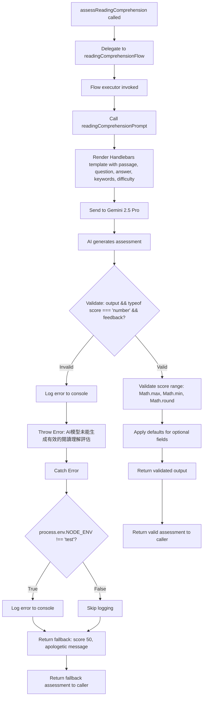

# Module: `daily-reading-comprehension`

## 1. Module Summary

The `daily-reading-comprehension` module implements an AI-powered assessment system for evaluating user responses to daily morning reading comprehension tasks from "Dream of the Red Chamber" using GenKit with Gemini 2.5 Pro. This module assesses comprehension depth, accuracy, literary insight, and keyword coverage to generate numerical scores (0-100), constructive feedback in Traditional Chinese, and detailed analysis with improvement suggestions. The flow uses difficulty-adaptive scoring criteria to ensure fair evaluation across easy, medium, and hard tasks while providing fallback assessments when AI services are unavailable.

## 2. Module Dependencies

* **Internal Dependencies:**
  * `@/ai/genkit` - Core GenKit instance (`ai`) providing `definePrompt` and `defineFlow` APIs
* **External Dependencies:**
  * `genkit` - GenKit framework providing `z` (Zod) schema validation re-export

## 3. Public API / Exports

* `assessReadingComprehension(input: ReadingComprehensionInput): Promise<ReadingComprehensionOutput>` - Main async function for grading reading comprehension submissions
* `ReadingComprehensionInput` - TypeScript type for input containing passage, question, answer, keywords, and difficulty
* `ReadingComprehensionOutput` - TypeScript type for output containing score, feedback, covered/missed points, and detailed analysis

## 4. Code File Breakdown

### 4.1. `daily-reading-comprehension.ts`

* **Purpose:** This server-side file implements educational assessment AI using GenKit's prompt engineering to evaluate student comprehension of classical Chinese literature passages. The module follows a weighted rubric (Accuracy 30%, Completeness 25%, Depth 25%, Literary Literacy 20%) with difficulty-adaptive scoring where easy tasks are more lenient (70+ for basic correctness) while hard tasks require deep analysis for similar scores. By generating both quantitative scores and qualitative feedback, this flow enables the daily task system to provide meaningful learning experiences with actionable improvement guidance.

* **Functions:**
    * `assessReadingComprehension(input: ReadingComprehensionInput): Promise<ReadingComprehensionOutput>` - Public async function serving as the API entry point that delegates to internal `readingComprehensionFlow` with provided input. Returns Promise directly without additional processing. Throws errors propagated from the underlying flow.

* **Key Classes / Constants / Variables:**
    * `ReadingComprehensionInputSchema`: Zod object schema with 5 required fields:
      - `passage` (string): Text passage from Red Mansion providing context for answer evaluation
      - `question` (string): Comprehension question asked to user, determines if answer is on-topic
      - `userAnswer` (string): User's written response to evaluate for accuracy, depth, and insight
      - `expectedKeywords` (string array): Key concepts/terms for complete answers, assesses coverage
      - `difficulty` (enum: 'easy' | 'medium' | 'hard'): Task difficulty affecting scoring criteria and feedback tone

    * `ReadingComprehensionInput`: Exported TypeScript type inferred from input schema.

    * `ReadingComprehensionOutputSchema`: Zod object schema with 5 required fields:
      - `score` (number, 0-100): Overall comprehension score based on rubric (accuracy, completeness, depth, keyword coverage)
      - `feedback` (string): Constructive Traditional Chinese feedback (encouraging, educational tone)
      - `keyPointsCovered` (string array): List of keywords/points user successfully addressed
      - `keyPointsMissed` (string array): Important points user didn't mention, guides improvement
      - `detailedAnalysis` (string): Markdown-formatted detailed evaluation (200-300 chars) with strengths, improvement suggestions, and extension reading recommendations

    * `ReadingComprehensionOutput`: Exported TypeScript type inferred from output schema.

    * `readingComprehensionPrompt`: GenKit prompt definition with:
      - `name: 'readingComprehensionPrompt'`
      - Handlebars template instructing AI as professional Red Mansion literature teacher
      - Variables: `{{{passage}}}`, `{{{question}}}`, `{{{userAnswer}}}`, `{{#each expectedKeywords}}`, `{{difficulty}}`
      - Rubric: Accuracy (30%), Completeness (25%), Depth (25%), Literary Literacy (20%)
      - Difficulty-specific guidance: easy (70+ for 1-2 keywords), medium (70+ for accuracy + most keywords + analysis), hard (70+ for deep analysis + full coverage + literary insight)
      - Output requirements: score (0-100 integer), feedback (50-100 chars encouragement), keyPointsCovered/Missed arrays, detailedAnalysis (200-300 chars Markdown with bold highlights, list format suggestions, extension reading)

    * `readingComprehensionFlow`: GenKit flow definition executing assessment:
      - Invokes `readingComprehensionPrompt(input)`
      - Validates output completeness (checks `score` is number and `feedback` exists)
      - Throws Chinese error if validation fails
      - Validates score within 0-100 range using `Math.max(0, Math.min(100, Math.round(output.score)))`
      - Provides defaults for optional fields if AI returns incomplete output
      - Catches errors (logged only in non-test environments)
      - Returns fallback assessment on error: score 50, apologetic feedback, empty covered points, all keywords as missed, system message analysis

## 5. System and Data Flow

### 5.1. System Flowchart (Control Flow)



### 5.2. Data Flow Diagram (Data Transformation)

```mermaid
graph LR
    TaskData[Daily Task Data] -- passage, question, userAnswer, keywords, difficulty --> Input[ReadingComprehensionInput]
    Input --> Flow[readingComprehensionFlow]

    Flow -- input --> Prompt[readingComprehensionPrompt]
    Template[Handlebars Template + Rubric] --> Prompt
    Prompt -- Rendered Prompt --> AI[Gemini 2.5 Pro]

    AI -- AI Response --> Extract[Extract output]
    Extract --> Validate{Validation}

    Validate -- Valid --> ScoreValidation[Clamp score 0-100]
    ScoreValidation --> DefaultApplication[Apply defaults]

    DefaultApplication -- score --> NumericScore[score: number]
    DefaultApplication -- feedback --> FeedbackText[feedback: string]
    DefaultApplication -- keyPointsCovered --> CoveredArray[covered: string[]]
    DefaultApplication -- keyPointsMissed --> MissedArray[missed: string[]]
    DefaultApplication -- detailedAnalysis --> AnalysisMarkdown[analysis: markdown]

    NumericScore --> Output[ReadingComprehensionOutput]
    FeedbackText --> Output
    CoveredArray --> Output
    MissedArray --> Output
    AnalysisMarkdown --> Output

    Validate -- Invalid --> ErrorPath[Error Handling]
    ErrorPath --> FallbackBuilder[Build Fallback Assessment]
    FallbackBuilder -- score: 50 --> Output

    Output --> TaskService[DailyTaskService]
    TaskService --> UserDisplay[User Dashboard]
```

## 6. Usage Example & Testing

* **Usage:**
```typescript
import { assessReadingComprehension } from '@/ai/flows/daily-reading-comprehension';

const result = await assessReadingComprehension({
  passage: "寶玉聽了這話，不覺將前情盡忘，喜不自禁...",
  question: "寶玉對黛玉的態度在這段中有什麼轉變？",
  userAnswer: "寶玉聽到黛玉的話後非常高興，完全忘記了之前的不快。",
  expectedKeywords: ["態度轉變", "喜不自禁", "前情盡忘"],
  difficulty: "medium"
});

console.log(result.score); // 85
console.log(result.feedback); // "您的回答準確把握了寶玉的情緒變化..."
console.log(result.keyPointsCovered); // ["喜不自禁", "前情盡忘"]
console.log(result.keyPointsMissed); // ["態度轉變"]
```

* **Testing:** This module is tested through the DailyTaskService integration tests which invoke this assessment function with various answer qualities and difficulty levels. No dedicated unit test file exists for this flow. The GenKit development UI (`npm run genkit:dev`) allows manual testing with sample passages and answers. Testing strategy includes: verifying score ranges (0-100), confirming difficulty-adaptive scoring (easy tasks score higher for equivalent answers), validating markdown formatting in detailed analysis, checking fallback behavior by forcing AI errors, and ensuring keyword tracking accuracy.
