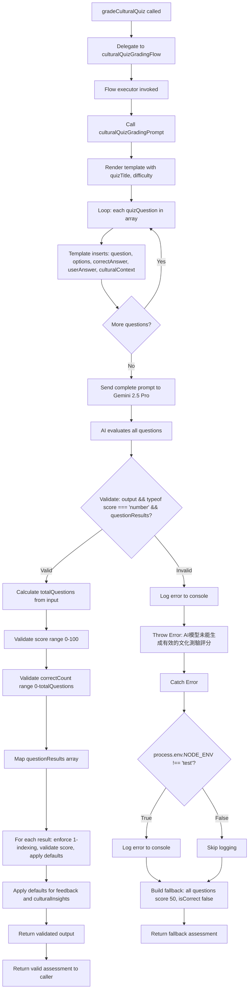

```mermaid
graph LR
    PoetryTask[Poetry Task Data] -- original + recitation + metadata --> Input[PoetryQualityInput]
    Input --> Flow[poetryQualityFlow]

    Flow -- input --> Prompt[poetryQualityPrompt]
    ExpertRole[Classical Poetry Expert Persona] --> Prompt
    Prompt -- Rendered Instructions --> AI[Gemini 2.5 Pro]

    AI -- Character Comparison --> AccuracyCalc[Calculate Accuracy %]
    AI -- Line/Verse Check --> CompletenessCalc[Calculate Completeness %]
    AI -- Holistic Review --> OverallScore[Calculate Overall Score]
    AI -- Error Detection --> MistakesList[Build Mistakes Array]

    AccuracyCalc --> Validation[Score Validation]
    CompletenessCalc --> Validation
    OverallScore --> Validation
    MistakesList --> Validation

    Validation -- Valid --> Clamping[Clamp scores 0-100]
    Clamping --> DefaultsApp[Apply defaults for optionals]

    DefaultsApp -- accuracy --> AccField[accuracy: number]
    DefaultsApp -- completeness --> CompField[completeness: number]
    DefaultsApp -- overallScore --> ScoreField[overallScore: number]
    DefaultsApp -- mistakes --> MistakesArray[mistakes: array]
    DefaultsApp -- feedback --> FeedbackText[feedback: string]
    DefaultsApp -- literaryAnalysis --> AnalysisMarkdown[analysis: markdown]

    AccField --> Output[PoetryQualityOutput]
    CompField --> Output
    ScoreField --> Output
    MistakesArray --> Output
    FeedbackText --> Output
    AnalysisMarkdown --> Output

    Validation -- Invalid --> ErrorHandler[Error Handling]
    ErrorHandler --> FallbackBuilder[Build Fallback: scores 50]
    FallbackBuilder --> Output

    Output --> TaskService[DailyTaskService]
    TaskService --> UserUI[Poetry Task Results Display]
```

```mermaid
graph LR
    QuizData[Quiz Task Data] -- title + questions array + difficulty --> Input[CulturalQuizGradingInput]
    Input --> Flow[culturalQuizGradingFlow]

    Flow -- input --> Prompt[culturalQuizGradingPrompt]
    ScholarRole[Cultural Scholar Persona] --> Prompt
    Prompt -- Rendered Instructions for All Questions --> AI[Gemini 2.5 Pro]

    AI -- Evaluate Each Question --> MultipleChoiceLogic[Multiple Choice: 100 or 0]
    AI -- Evaluate Each Question --> OpenEndedLogic[Open-ended: 0-100 scaled]
    AI -- Generate Explanations --> PerQuestionExplain[Per-Question Explanations]
    AI -- Calculate Average --> OverallScore[Overall Score Calculation]
    AI -- Generate Cultural Context --> CulturalInsights[Cultural Insights Markdown]

    MultipleChoiceLogic --> ResultsArray[Question Results Array]
    OpenEndedLogic --> ResultsArray
    PerQuestionExplain --> ResultsArray
    OverallScore --> Validation[Output Validation]
    ResultsArray --> Validation
    CulturalInsights --> Validation

    Validation -- Valid --> ArrayMapping[Map & Validate Each Result]
    ArrayMapping --> IndexEnforcement[Enforce 1-indexed questionNumber]
    IndexEnforcement --> ScoreClamping[Clamp each score 0-100]
    ScoreClamping --> DefaultsApp[Apply defaults for missing fields]

    DefaultsApp -- score --> ScoreField[score: number]
    DefaultsApp -- correctCount --> CountField[correctCount: number]
    DefaultsApp -- totalQuestions --> TotalField[totalQuestions: number]
    DefaultsApp -- questionResults --> ResultsArrayField[questionResults: array]
    DefaultsApp -- feedback --> FeedbackField[feedback: string]
    DefaultsApp -- culturalInsights --> InsightsField[culturalInsights: markdown]

    ScoreField --> Output[CulturalQuizGradingOutput]
    CountField --> Output
    TotalField --> Output
    ResultsArrayField --> Output
    FeedbackField --> Output
    InsightsField --> Output

    Validation -- Invalid --> ErrorHandler[Error Handling]
    ErrorHandler --> FallbackBuilder[Build Fallback: all scores 50]
    FallbackBuilder --> Output

    Output --> TaskService[DailyTaskService]
    TaskService --> QuizResults[Quiz Results Display with Per-Question Breakdown]
```

# Module: `character-analysis-scoring`

## 1. Module Summary

The `character-analysis-scoring` module implements an AI-powered evaluation system for assessing user analyses of characters from "Dream of the Red Chamber" by measuring depth of understanding, psychological insight, and literary interpretation quality. This GenKit-based flow evaluates character analyses across multiple dimensions (superficial/moderate/profound depth, 0-100 insight score, 0-100 quality score) while tracking theme coverage to provide comprehensive feedback that guides students toward deeper character understanding. The module emphasizes literary criticism skills by assessing whether analyses move beyond surface descriptions to explore complex personality, motivations, symbolic significance, and character development arcs.

## 2. Module Dependencies

* **Internal Dependencies:**
  * `@/ai/genkit` - Core GenKit instance (`ai`) providing `definePrompt` and `defineFlow` APIs
* **External Dependencies:**
  * `genkit` - GenKit framework providing `z` (Zod) schema validation re-export

## 3. Public API / Exports

* `scoreCharacterAnalysis(input: CharacterAnalysisScoringInput): Promise<CharacterAnalysisScoringOutput>` - Main async function for grading character analysis submissions
* `CharacterAnalysisScoringInput` - TypeScript type for input containing character info, analysis prompt, user analysis, expected themes, and difficulty
* `CharacterAnalysisScoringOutput` - TypeScript type for output containing quality score, depth assessment, insight score, themes covered/missed, feedback, and detailed analysis

## 4. Code File Breakdown

### 4.1. `character-analysis-scoring.ts`

* **Purpose:** This server-side file implements sophisticated literary criticism assessment by evaluating how deeply students understand character psychology, motivations, and narrative significance in the novel. The module distinguishes between superficial descriptions (external behaviors only), moderate analyses (personality and motivations explored), and profound insights (psychological depth, growth trajectories, symbolic meanings uncovered) to encourage advanced literary interpretation skills. By tracking theme coverage and providing targeted guidance for deeper exploration, this flow helps students develop critical thinking and analytical writing abilities essential for classical literature study.

* **Functions:**
    * `scoreCharacterAnalysis(input: CharacterAnalysisScoringInput): Promise<CharacterAnalysisScoringOutput>` - Public async function serving as API entry point, delegates to internal `characterAnalysisScoringFlow` with provided input. Returns Promise directly without transformation. Throws errors propagated from underlying flow.

* **Key Classes / Constants / Variables:**
    * `CharacterAnalysisScoringInputSchema`: Zod object schema with 6 fields:
      - `characterName` (string, required): Name of character being analyzed from Red Mansion
      - `characterDescription` (string, required): Background information about character providing evaluation context
      - `analysisPrompt` (string, required): Specific question or prompt given to user about the character
      - `userAnalysis` (string, required): User's written analysis to evaluate for depth, insight, and quality
      - `expectedThemes` (string array, required): Key themes/aspects for complete analysis (e.g., personality, relationships, symbolism)
      - `difficulty` (enum: 'easy' | 'medium' | 'hard', required): Task difficulty affecting scoring criteria

    * `CharacterAnalysisScoringInput`: Exported TypeScript type inferred from input schema.

    * `CharacterAnalysisScoringOutputSchema`: Zod object schema with 7 fields:
      - `qualityScore` (number, 0-100): Overall quality score based on depth, insight, accuracy, literary awareness
      - `depth` (enum: 'superficial' | 'moderate' | 'profound'): Analysis depth assessment:
        * superficial (表面): Only describes external behaviors and simple features
        * moderate (中等): Attempts to explore personality and motivations but not deep enough
        * profound (深刻): Deep analysis of psychology, motivations, growth trajectory, symbolic significance
      - `insight` (number, 0-100): Insight score measuring psychological understanding and character motivation interpretation
      - `themesCovered` (string array): Expected themes user successfully addressed in analysis
      - `themesMissed` (string array): Important themes/aspects user didn't explore
      - `feedback` (string): Constructive Traditional Chinese feedback (80-120 chars) highlighting strengths and suggesting deeper exploration areas
      - `detailedAnalysis` (string): Markdown-formatted detailed evaluation (250-350 chars) including analysis highlights in bold, deepening angles in lists, recommended reading chapters, extended thinking directions

    * `CharacterAnalysisScoringOutput`: Exported TypeScript type inferred from output schema.

    * `characterAnalysisScoringPrompt`: GenKit prompt definition with:
      - `name: 'characterAnalysisScoringPrompt'`
      - Role: Literary critic specializing in Red Mansion character research
      - Template variables: `{{characterName}}`, `{{{characterDescription}}}`, `{{{analysisPrompt}}}`, `{{{userAnalysis}}}`, `{{#each expectedThemes}}`, `{{difficulty}}`
      - Evaluation criteria:
        * Depth assessment (superficial: only external behaviors; moderate: explores personality/motivations but shallow; profound: deep psychological analysis, growth trajectories, symbolic meanings)
        * Insight measurement (0-100): Understanding character contradictions/complexity, noticing character growth/change, understanding symbolic significance in story
        * Quality score (0-100): Comprehensive assessment combining depth, insight, literary literacy
      - Difficulty-specific scoring: easy (70+ for basic personality description + 1-2 themes), medium (70-85 for multiple themes + some insight), hard (high scores require profound insight + full theme coverage + literary analysis)
      - Output requirements: qualityScore (0-100), depth (enum value), insight (0-100), themesCovered/themesMissed arrays, feedback (80-120 chars encouragement), detailedAnalysis (250-350 chars Markdown with analysis strengths in bold, deepening angles as lists, recommended chapters, extended thinking directions)

    * `characterAnalysisScoringFlow`: GenKit flow definition executing assessment:
      - Invokes `characterAnalysisScoringPrompt(input)`
      - Validates output completeness (checks `typeof qualityScore === 'number' && depth exists`)
      - Throws Chinese error if validation fails
      - Validates scores within 0-100 range using `Math.max(0, Math.min(100, Math.round()))`
      - Provides defaults for optional fields (depth defaults to 'moderate', insight to 50, empty theme arrays, default feedback/analysis)
      - Catches errors (logged only in non-test environments)
      - Returns fallback assessment on error: qualityScore 50, depth 'moderate', insight 50, empty themesCovered, all expected themes as missed, apologetic feedback, system message analysis

## 5. System and Data Flow

### 5.1. System Flowchart (Control Flow)

```mermaid
flowchart TD
    A[scoreCharacterAnalysis called] --> B[Delegate to characterAnalysisScoringFlow]
    B --> C[Flow executor invoked]
    C --> D[Call characterAnalysisScoringPrompt]
    D --> E[Render template: character, description, prompt, analysis, themes, difficulty]
    E --> F[Send to Gemini 2.5 Pro]

    F --> G[AI evaluates depth and insight]
    G --> H{Validate: output && typeof qualityScore === 'number' && depth?}
    H -- Invalid --> I[Log error to console]
    I --> J[Throw Error: AI模型未能生成有效的人物分析評分]

    H -- Valid --> K[Validate qualityScore range 0-100]
    K --> L[Validate insight range 0-100]
    L --> M[Apply defaults: depth || 'moderate', insight || 50]
    M --> N[Apply defaults for theme arrays and feedback]
    N --> O[Return validated output]

    J --> P[Catch Error]
    P --> Q{process.env.NODE_ENV !== 'test'?}
    Q -- True --> R[Log error to console]
    Q -- False --> S[Skip logging]
    R --> T[Return fallback: all scores/depth moderate]
    S --> T
    T --> U[Return fallback to caller]
    O --> V[Return valid assessment to caller]
```

### 5.2. Data Flow Diagram (Data Transformation)

```mermaid
graph LR
    CharAnalysisTask[Character Analysis Task] -- character info + user analysis + themes --> Input[CharacterAnalysisScoringInput]
    Input --> Flow[characterAnalysisScoringFlow]

    Flow -- input --> Prompt[characterAnalysisScoringPrompt]
    CriticRole[Literary Critic Persona] --> Prompt
    Prompt -- Evaluation Instructions --> AI[Gemini 2.5 Pro]

    AI -- Surface vs Deep Analysis --> DepthAssess[Assess Depth: superficial/moderate/profound]
    AI -- Psychological Understanding --> InsightCalc[Calculate Insight Score 0-100]
    AI -- Holistic Quality --> QualityCalc[Calculate Quality Score 0-100]
    AI -- Theme Tracking --> ThemeAnalysis[Identify Covered/Missed Themes]

    DepthAssess --> Validation[Output Validation]
    InsightCalc --> Validation
    QualityCalc --> Validation
    ThemeAnalysis --> Validation

    Validation -- Valid --> ScoreClamping[Clamp scores 0-100]
    ScoreClamping --> DefaultsApp[Apply defaults for optionals]

    DefaultsApp -- qualityScore --> QualField[qualityScore: number]
    DefaultsApp -- depth --> DepthField[depth: enum]
    DefaultsApp -- insight --> InsightField[insight: number]
    DefaultsApp -- themesCovered --> CoveredArray[covered: string[]]
    DefaultsApp -- themesMissed --> MissedArray[missed: string[]]
    DefaultsApp -- feedback --> FeedbackText[feedback: string]
    DefaultsApp -- detailedAnalysis --> AnalysisMarkdown[analysis: markdown]

    QualField --> Output[CharacterAnalysisScoringOutput]
    DepthField --> Output
    InsightField --> Output
    CoveredArray --> Output
    MissedArray --> Output
    FeedbackText --> Output
    AnalysisMarkdown --> Output

    Validation -- Invalid --> ErrorHandler[Error Handling]
    ErrorHandler --> FallbackBuilder[Build Fallback: moderate depth, scores 50]
    FallbackBuilder --> Output

    Output --> TaskService[DailyTaskService]
    TaskService --> UserDashboard[Character Analysis Results Display]
```

## 6. Usage Example & Testing

* **Usage:**
```typescript
import { scoreCharacterAnalysis } from '@/ai/flows/character-analysis-scoring';

const result = await scoreCharacterAnalysis({
  characterName: "林黛玉",
  characterDescription: "賈母的外孫女，寄居賈府，多愁善感，才華橫溢...",
  analysisPrompt: "分析林黛玉的性格特點和悲劇命運的關係",
  userAnalysis: "林黛玉性格敏感多疑，這種性格源於她寄人籬下的處境。她的才華使她自尊心強，但同時也讓她更加孤獨。她與寶玉的愛情注定悲劇...",
  expectedThemes: ["性格特點", "寄居身份", "才華與自尊", "愛情悲劇", "命運象徵"],
  difficulty: "hard"
});

console.log(result.qualityScore); // 88
console.log(result.depth); // "profound"
console.log(result.insight); // 85
console.log(result.themesCovered); // ["性格特點", "寄居身份", "才華與自尊", "愛情悲劇"]
console.log(result.themesMissed); // ["命運象徵"]
```

* **Testing:** This module is tested through DailyTaskService integration tests which invoke character analysis assessment with varying analysis depths. No dedicated unit test file exists. The GenKit development UI (`npm run genkit:dev`) enables manual testing with sample character analyses. Testing strategy includes: verifying depth classification accuracy (superficial vs profound distinction), confirming insight scoring reflects psychological understanding, validating theme tracking against expected themes, testing difficulty-adaptive scoring (easy: basic = 70+, hard: requires profound insights), ensuring markdown formatting in detailed analysis includes bold highlights and list recommendations, and checking fallback behavior maintains user experience when AI services fail.


# Module: `commentary-interpretation`

## 1. Module Summary

The `commentary-interpretation` module implements an AI-powered evaluation system for assessing user interpretations of Zhiyanzhai (脂硯齋) commentaries - critical annotations that provide profound insights into "Dream of the Red Chamber's" hidden meanings, symbolism, and authorial intent. This GenKit-based flow measures interpretation quality across four insight levels (surface, moderate, deep, profound), calculates literary sensitivity scores (0-100) for symbolic language understanding, and provides authoritative explanations of commentary meanings to guide students into advanced Red Mansion scholarship. The module bridges student interpretations with scholarly understanding through detailed feedback that highlights captured insights, missed symbolic meanings, and research methodology guidance.

## 2. Module Dependencies

* **Internal Dependencies:**
  * `@/ai/genkit` - Core GenKit instance (`ai`) providing `definePrompt` and `defineFlow` APIs
* **External Dependencies:**
  * `genkit` - GenKit framework providing `z` (Zod) schema validation re-export

## 3. Public API / Exports

* `scoreCommentaryInterpretation(input: CommentaryInterpretationInput): Promise<CommentaryInterpretationOutput>` - Main async function for grading Zhiyanzhai commentary interpretations
* `CommentaryInterpretationInput` - TypeScript type for input containing commentary text, related passage, chapter context, user interpretation, hints, and difficulty
* `CommentaryInterpretationOutput` - TypeScript type for output containing score, insight level, literary sensitivity, captured/missed insights, feedback, detailed analysis, and authoritative commentary explanation

## 4. Code File Breakdown

### 4.1. `commentary-interpretation.ts`

* **Purpose:** This server-side file implements advanced literary criticism assessment by evaluating how well students decode Zhiyanzhai commentaries - one of the most sophisticated aspects of Red Mansion scholarship requiring understanding of foreshadowing, symbolism, metaphor, hidden narrative layers, and authorial intent signals. The module uses a four-tier insight classification system (surface: literal understanding only; moderate: notices some implications; deep: understands major symbolism/foreshadowing; profound: grasps multilayered meanings and literary value) to differentiate between basic comprehension and scholarly interpretation. By providing authoritative commentary explanations alongside student assessment, this flow serves both evaluation and education functions, enabling students to compare their interpretations with scholarly consensus and learn the methodology of reading annotated classical texts.

* **Functions:**
    * `scoreCommentaryInterpretation(input: CommentaryInterpretationInput): Promise<CommentaryInterpretationOutput>` - Public async function serving as API entry point, delegates to internal `commentaryInterpretationFlow` with provided input. Returns Promise directly without transformation. Throws errors propagated from underlying flow.

* **Key Classes / Constants / Variables:**
    * `CommentaryInterpretationInputSchema`: Zod object schema with 6 fields:
      - `commentaryText` (string, required): Original Zhiyanzhai commentary text from Red Mansion, the annotation being interpreted
      - `relatedPassage` (string, required): Text passage from novel that commentary refers to, provides context for interpretation
      - `chapterContext` (string, required): Chapter number and context information, helps understand narrative position
      - `userInterpretation` (string, required): User's interpretation/explanation of commentary meaning to be evaluated for insight and accuracy
      - `interpretationHints` (string array, required): Key themes or symbolic meanings commentary typically reveals (e.g., foreshadowing, symbolism, character fate)
      - `difficulty` (enum: 'easy' | 'medium' | 'hard', required): Task difficulty affecting scoring criteria

    * `CommentaryInterpretationInput`: Exported TypeScript type inferred from input schema.

    * `CommentaryInterpretationOutputSchema`: Zod object schema with 8 fields:
      - `score` (number, 0-100, required): Overall interpretation quality score based on insight, accuracy, literary sensitivity
      - `insightLevel` (enum: 'surface' | 'moderate' | 'deep' | 'profound', required): Depth of interpretation insight
        * surface (表面): Only literal understanding, doesn't touch deep meanings
        * moderate (中等): Notices some implied meanings but not deep enough
        * deep (深入): Understands major symbolism and foreshadowing significance
        * profound (透徹): Deeply grasps multilayered meanings and literary value
      - `literarySensitivity` (number, 0-100, required): Literary sensitivity score measuring understanding of symbolic language, metaphor, hidden meanings
      - `keyInsightsCaptured` (string array, required): Key interpretations or symbolic meanings user successfully identified
      - `keyInsightsMissed` (string array, required): Important insights or symbolic meanings user didn't mention
      - `feedback` (string, required): Constructive Traditional Chinese feedback (100-150 chars) praising insightful observations and guiding toward deeper understanding
      - `detailedAnalysis` (string, required): Markdown-formatted detailed evaluation (250-350 chars) including interpretation strengths in bold, deepening angles as lists, research methodology guidance
      - `commentaryExplanation` (string, required): Authoritative explanation (200-300 chars) of what Zhiyanzhai commentary actually reveals, helps users understand correct interpretation

    * `CommentaryInterpretationOutput`: Exported TypeScript type inferred from output schema.

    * `commentaryInterpretationPrompt`: GenKit prompt definition with:
      - `name: 'commentaryInterpretationPrompt'`
      - Role: Scholar specializing in Zhiyanzhai commentary research
      - Template variables: `{{chapterContext}}`, `{{{relatedPassage}}}`, `{{{commentaryText}}}`, `{{{userInterpretation}}}`, `{{#each interpretationHints}}`, `{{difficulty}}`
      - Commentary significance explanation: Zhiyanzhai commentaries often reveal character fate foreshadowing/hints, symbolic significance and metaphorical techniques, Cao Xueqin's writing intentions, story ending clues, deep textual layer meanings
      - Evaluation criteria:
        * insightLevel (4-tier): surface (literal only), moderate (some implications noticed), deep (main symbolism understood), profound (multilayered meanings grasped)
        * literarySensitivity (0-100): Perception ability for symbolism, metaphor, foreshadowing
        * score (0-100): Comprehensive assessment based on insight level, literary sensitivity, accuracy
      - Difficulty-specific scoring: easy (65+ for basic meaning + 1 key insight), medium (60-80 for multilayered understanding + symbolism), hard (high scores require thorough understanding of metaphor, foreshadowing, deep implications)
      - Output requirements: score (0-100), insightLevel (enum), literarySensitivity (0-100), keyInsightsCaptured/Missed arrays, feedback (100-150 chars encouragement), detailedAnalysis (250-350 chars Markdown with interpretation highlights in bold, deepening angles as lists, research methodology), commentaryExplanation (200-300 chars authoritative explanation clarifying true meaning, symbolic significance, literary value)

    * `commentaryInterpretationFlow`: GenKit flow definition executing assessment:
      - Invokes `commentaryInterpretationPrompt(input)`
      - Validates output completeness (checks `typeof score === 'number' && insightLevel exists`)
      - Throws Chinese error if validation fails
      - Validates score and literarySensitivity within 0-100 range using `Math.max(0, Math.min(100, Math.round()))`
      - Provides defaults for optional fields (insightLevel defaults to 'moderate', literarySensitivity to 50, empty insight arrays, default feedback/analysis/explanation)
      - Catches errors (logged only in non-test environments)
      - Returns fallback assessment on error: score 50, insightLevel 'moderate', literarySensitivity 50, empty keyInsightsCaptured, all hints as missed, apologetic feedback, system message analysis and explanation

## 5. System and Data Flow

### 5.1. System Flowchart (Control Flow)

```mermaid
flowchart TD
    A[scoreCommentaryInterpretation called] --> B[Delegate to commentaryInterpretationFlow]
    B --> C[Flow executor invoked]
    C --> D[Call commentaryInterpretationPrompt]
    D --> E[Render template: chapterContext, relatedPassage, commentaryText, userInterpretation, hints, difficulty]
    E --> F[Send to Gemini 2.5 Pro]

    F --> G[AI evaluates interpretation depth]
    G --> H{Validate: output && typeof score === 'number' && insightLevel?}
    H -- Invalid --> I[Log error to console]
    I --> J[Throw Error: AI模型未能生成有效的脂批解讀評分]

    H -- Valid --> K[Validate score range 0-100]
    K --> L[Validate literarySensitivity range 0-100]
    L --> M[Apply defaults: insightLevel || 'moderate', literarySensitivity || 50]
    M --> N[Apply defaults for insight arrays, feedback, analysis, explanation]
    N --> O[Return validated output]

    J --> P[Catch Error]
    P --> Q{process.env.NODE_ENV !== 'test'?}
    Q -- True --> R[Log error to console]
    Q -- False --> S[Skip logging]
    R --> T[Return fallback: moderate insight, scores 50]
    S --> T
    T --> U[Return fallback to caller]
    O --> V[Return valid assessment to caller]
```

### 5.2. Data Flow Diagram (Data Transformation)

```mermaid
graph LR
    CommentaryTask[Commentary Decoding Task] -- commentary + passage + user interpretation + hints --> Input[CommentaryInterpretationInput]
    Input --> Flow[commentaryInterpretationFlow]

    Flow -- input --> Prompt[commentaryInterpretationPrompt]
    ScholarRole[Zhiyanzhai Scholar Persona] --> Prompt
    Prompt -- Evaluation Instructions --> AI[Gemini 2.5 Pro]

    AI -- Interpret Depth Analysis --> InsightLevelCalc[Classify: surface/moderate/deep/profound]
    AI -- Symbolic Understanding --> LiterarySensCalc[Calculate Literary Sensitivity 0-100]
    AI -- Holistic Assessment --> ScoreCalc[Calculate Score 0-100]
    AI -- Compare Interpretations --> InsightsTracking[Track Captured/Missed Insights]
    AI -- Generate Authoritative Explanation --> CommentaryExplain[Commentary Explanation]

    InsightLevelCalc --> Validation[Output Validation]
    LiterarySensCalc --> Validation
    ScoreCalc --> Validation
    InsightsTracking --> Validation
    CommentaryExplain --> Validation

    Validation -- Valid --> ScoreClamping[Clamp scores 0-100]
    ScoreClamping --> DefaultsApp[Apply defaults for optionals]

    DefaultsApp -- score --> ScoreField[score: number]
    DefaultsApp -- insightLevel --> InsightField[insightLevel: enum]
    DefaultsApp -- literarySensitivity --> SensField[literarySensitivity: number]
    DefaultsApp -- keyInsightsCaptured --> CapturedArray[captured: string[]]
    DefaultsApp -- keyInsightsMissed --> MissedArray[missed: string[]]
    DefaultsApp -- feedback --> FeedbackText[feedback: string]
    DefaultsApp -- detailedAnalysis --> AnalysisMarkdown[analysis: markdown]
    DefaultsApp -- commentaryExplanation --> ExplanationMarkdown[explanation: markdown]

    ScoreField --> Output[CommentaryInterpretationOutput]
    InsightField --> Output
    SensField --> Output
    CapturedArray --> Output
    MissedArray --> Output
    FeedbackText --> Output
    AnalysisMarkdown --> Output
    ExplanationMarkdown --> Output

    Validation -- Invalid --> ErrorHandler[Error Handling]
    ErrorHandler --> FallbackBuilder[Build Fallback: moderate, scores 50]
    FallbackBuilder --> Output

    Output --> TaskService[DailyTaskService]
    TaskService --> CommentaryResults[Commentary Decoding Results Display]
```

## 6. Usage Example & Testing

* **Usage:**
```typescript
import { scoreCommentaryInterpretation } from '@/ai/flows/commentary-interpretation';

const result = await scoreCommentaryInterpretation({
  commentaryText: "此回之文，草蛇灰線，伏延千里。",
  relatedPassage: "黛玉聽了，不覺一征，細嚼此語...",
  chapterContext: "第五回：賈寶玉神遊太虛境",
  userInterpretation: "這個批語說明這一回的內容有很多伏筆，會影響後面的故事發展。作者的寫作手法很隱晦，讀者需要仔細體會才能發現。",
  interpretationHints: ["伏筆手法", "命運暗示", "象徵意義", "文本多層含義"],
  difficulty: "hard"
});

console.log(result.score); // 75
console.log(result.insightLevel); // "deep"
console.log(result.literarySensitivity); // 78
console.log(result.keyInsightsCaptured); // ["伏筆手法", "文本多層含義"]
console.log(result.keyInsightsMissed); // ["命運暗示", "象徵意義"]
console.log(result.commentaryExplanation); // Authoritative explanation of the commentary
```

* **Testing:** This module is tested through DailyTaskService integration tests which invoke commentary interpretation assessment with varying interpretation depths. No dedicated unit test file exists. The GenKit development UI (`npm run genkit:dev`) enables manual testing with sample Zhiyanzhai commentaries. Testing strategy includes: verifying 4-tier insight level classification accuracy (distinguishing surface from profound), confirming literary sensitivity reflects symbolic understanding, validating authoritative commentary explanation provides scholarly consensus, testing difficulty-adaptive scoring (easy: 65+ for basic; hard: requires profound understanding for high scores), ensuring markdown formatting includes research methodology guidance, and checking that fallback maintains educational value with system message explanations.


# Module: `poetry-quality-assessment`

## 1. Module Summary

The `poetry-quality-assessment` module implements an AI-powered grading system for evaluating user recitations or compositions of poetry from "Dream of the Red Chamber" using character-by-character comparison against original texts. This GenKit-based flow assesses accuracy percentage, completeness percentage, and overall quality through weighted scoring while identifying specific mistakes (missing lines, incorrect characters, extra content) with line-by-line error tracking. The module provides literary analysis and appreciation guidance in Traditional Chinese markdown to deepen students' understanding of classical Chinese poetry aesthetics.

## 2. Module Dependencies

* **Internal Dependencies:**
  * `@/ai/genkit` - Core GenKit instance (`ai`) providing `definePrompt` and `defineFlow` APIs
* **External Dependencies:**
  * `genkit` - GenKit framework providing `z` (Zod) schema validation re-export

## 3. Public API / Exports

* `assessPoetryQuality(input: PoetryQualityInput): Promise<PoetryQualityOutput>` - Main async function for grading poetry recitations/compositions
* `PoetryQualityInput` - TypeScript type for input containing poem title, original text, user recitation, author, and difficulty
* `PoetryQualityOutput` - TypeScript type for output containing accuracy, completeness, overall score, mistakes array, feedback, and literary analysis

## 4. Code File Breakdown

### 4.1. `poetry-quality-assessment.ts`

* **Purpose:** This server-side file implements specialized AI assessment for classical Chinese poetry by performing detailed character-level comparison between original poems and user recitations. The module employs a multi-metric evaluation system (accuracy percentage for character matching, completeness percentage for verse/line inclusion, overall quality combining both metrics) to provide nuanced feedback that helps students improve memorization and appreciation of Red Mansion poetry. By categorizing errors into three types (missing, incorrect, extra) with specific line references, this flow enables targeted improvement guidance while the literary analysis component enhances cultural and aesthetic understanding.

* **Functions:**
    * `assessPoetryQuality(input: PoetryQualityInput): Promise<PoetryQualityOutput>` - Public async function serving as API entry point, delegates to internal `poetryQualityFlow` with provided input. Returns Promise directly without additional transformation. Throws errors propagated from underlying flow.

* **Key Classes / Constants / Variables:**
    * `PoetryQualityInputSchema`: Zod object schema with 5 fields:
      - `poemTitle` (string, required): Title of poem from Red Mansion for context and reference
      - `originalPoem` (string, required): Original correct poem text as gold standard for comparison
      - `userRecitation` (string, required): User's recitation/writing to compare against original
      - `author` (string, optional): Author or character who composed the poem, adds evaluation context
      - `difficulty` (enum: 'easy' | 'medium' | 'hard', required): Task difficulty affecting scoring strictness and feedback tone

    * `PoetryQualityInput`: Exported TypeScript type inferred from input schema.

    * `PoetryQualityOutputSchema`: Zod object schema with 6 fields:
      - `accuracy` (number, 0-100): Character-level accuracy percentage measuring character matches
      - `completeness` (number, 0-100): Completeness percentage measuring verse/line inclusion
      - `overallScore` (number, 0-100): Overall quality score (weighted combination of accuracy, completeness, literary quality)
      - `mistakes` (array of objects): List of specific mistakes, each containing:
        * `line` (number): Line number where mistake occurred (1-indexed)
        * `expected` (string): Correct text that should have been written
        * `actual` (string): What user actually wrote
        * `type` (enum: 'missing' | 'incorrect' | 'extra'): Mistake classification
      - `feedback` (string): Constructive Traditional Chinese feedback (80-120 chars) highlighting achievements and improvement guidance
      - `literaryAnalysis` (string): Markdown-formatted literary appreciation (200-300 chars) explaining beauty, themes, techniques in Traditional Chinese

    * `PoetryQualityOutput`: Exported TypeScript type inferred from output schema.

    * `poetryQualityPrompt`: GenKit prompt definition with:
      - `name: 'poetryQualityPrompt'`
      - Role: Senior classical Chinese poetry expert evaluating student recitations
      - Template variables: `{{poemTitle}}`, `{{#if author}}{{author}}{{/if}}`, `{{{originalPoem}}}`, `{{{userRecitation}}}`, `{{difficulty}}`
      - Evaluation criteria: Accuracy (character-by-character comparison), Completeness (missing verses/lines check), Overall Score (comprehensive quality assessment)
      - Difficulty-specific scoring: easy (80+ with 1-2 small errors), medium (70-90 range with some errors but high completeness), hard (errors significantly impact score)
      - Error types: missing (omitted lines), incorrect (wrong characters), extra (added content)
      - Output requirements: accuracy %, completeness %, overallScore, mistakes array with line/expected/actual/type, feedback (80-120 chars encouragement), literaryAnalysis (200-300 chars Markdown with theme/mood in bold, rhetorical devices in lists, significance in Red Mansion context)

    * `poetryQualityFlow`: GenKit flow definition executing assessment:
      - Invokes `poetryQualityPrompt(input)`
      - Validates output completeness (checks `typeof overallScore === 'number'`)
      - Throws Chinese error if validation fails
      - Validates all three scores within 0-100 range using `Math.max(0, Math.min(100, Math.round()))`
      - Provides defaults for optional fields (empty mistakes array, default feedback/analysis)
      - Catches errors (logged only in non-test environments)
      - Returns fallback assessment on error: accuracy 50, completeness 50, overallScore 50, empty mistakes, apologetic feedback, system message analysis

## 5. System and Data Flow

### 5.1. System Flowchart (Control Flow)

```mermaid
flowchart TD
    A[assessPoetryQuality called] --> B[Delegate to poetryQualityFlow]
    B --> C[Flow executor invoked]
    C --> D[Call poetryQualityPrompt]
    D --> E[Render template: poemTitle, author?, originalPoem, userRecitation, difficulty]
    E --> F[Send to Gemini 2.5 Pro]

    F --> G[AI performs character comparison]
    G --> H{Validate: output && typeof overallScore === 'number'?}
    H -- Invalid --> I[Log error to console]
    I --> J[Throw Error: AI模型未能生成有效的詩詞質量評估]

    H -- Valid --> K[Validate accuracy range: Math.max 0, Math.min 100]
    K --> L[Validate completeness range]
    L --> M[Validate overallScore range]
    M --> N[Apply defaults: mistakes || , feedback || default, literaryAnalysis || default]
    N --> O[Return validated output]

    J --> P[Catch Error]
    P --> Q{process.env.NODE_ENV !== 'test'?}
    Q -- True --> R[Log error to console]
    Q -- False --> S[Skip logging]
    R --> T[Return fallback: all scores 50, empty mistakes]
    S --> T
    T --> U[Return fallback to caller]
    O --> V[Return valid assessment to caller]
```

### 5.2. Data Flow Diagram (Data Transformation)



## 6. Usage Example & Testing

* **Usage:**
```typescript
import { assessPoetryQuality } from '@/ai/flows/poetry-quality-assessment';

const result = await assessPoetryQuality({
  poemTitle: "葬花吟",
  originalPoem: "花謝花飛花滿天，紅消香斷有誰憐？\n游絲軟繫飄春榭，落絮輕沾撲繡簾。",
  userRecitation: "花謝花飛花滿天，紅消香斷有誰憐？\n游絲軟繫飄春榭，落絮輕黏撲繡簾。",
  author: "林黛玉",
  difficulty: "medium"
});

console.log(result.accuracy); // 97 (one character error: 黏 vs 沾)
console.log(result.completeness); // 100
console.log(result.overallScore); // 95
console.log(result.mistakes); // [{ line: 4, expected: "沾", actual: "黏", type: "incorrect" }]
console.log(result.literaryAnalysis); // Markdown analysis of poem's beauty
```

* **Testing:** This module is tested through the DailyTaskService integration tests which invoke poetry assessment with various recitation qualities and error types. No dedicated unit test file exists. The GenKit development UI (`npm run genkit:dev`) enables manual testing with sample poems. Testing strategy includes: verifying character-level accuracy calculation, confirming completeness detection for missing verses, validating mistake categorization (missing/incorrect/extra), checking line number accuracy in error tracking, testing difficulty-adaptive scoring (lenient for easy, strict for hard), and ensuring literary analysis provides cultural context.


# Module: `cultural-quiz-grading`

## 1. Module Summary

The `cultural-quiz-grading` module implements an AI-powered multi-question quiz grading system for assessing user understanding of Qing Dynasty cultural knowledge, social customs, and historical context depicted in "Dream of the Red Chamber". This GenKit-based flow evaluates both multiple-choice and open-ended questions with differentiated scoring (100/0 for multiple-choice, 0-100 scaled for open-ended based on accuracy and completeness), provides detailed per-question explanations in Traditional Chinese, and generates cultural insights to deepen historical literacy. The module enables efficient batch grading of multiple quiz questions while offering educational feedback that connects cultural facts to the novel's narrative.

## 2. Module Dependencies

* **Internal Dependencies:**
  * `@/ai/genkit` - Core GenKit instance (`ai`) providing `definePrompt` and `defineFlow` APIs
* **External Dependencies:**
  * `genkit` - GenKit framework providing `z` (Zod) schema validation re-export

## 3. Public API / Exports

* `gradeCulturalQuiz(input: CulturalQuizGradingInput): Promise<CulturalQuizGradingOutput>` - Main async function for grading cultural knowledge quizzes
* `CulturalQuizGradingInput` - TypeScript type for input containing quiz title, question array, and difficulty
* `CulturalQuizGradingOutput` - TypeScript type for output containing overall score, correct count, per-question results, feedback, and cultural insights

## 4. Code File Breakdown

### 4.1. `cultural-quiz-grading.ts`

* **Purpose:** This server-side file implements batch quiz assessment for cultural knowledge evaluation, processing multiple questions (both multiple-choice and open-ended) in a single AI flow execution for efficiency. The module uses nested Zod schemas to validate individual questions within the quiz array, applies differentiated scoring logic (binary for multiple-choice, scaled for open-ended based on completeness), and provides educational explanations that not only indicate correctness but also enrich cultural understanding through contextual background information. By generating comprehensive cultural insights as markdown output, this flow transforms quiz assessment from mere score reporting into an educational experience that deepens appreciation of Qing Dynasty culture and its representation in the novel.

* **Functions:**
    * `gradeCulturalQuiz(input: CulturalQuizGradingInput): Promise<CulturalQuizGradingOutput>` - Public async function serving as API entry point, delegates to internal `culturalQuizGradingFlow` with provided input. Returns Promise directly without transformation. Throws errors propagated from underlying flow.

* **Key Classes / Constants / Variables:**
    * `QuizQuestionSchema`: Nested Zod object schema defining individual question structure with 5 fields:
      - `question` (string, required): Quiz question about cultural aspects of Red Mansion era
      - `options` (string array, optional): Multiple choice options if applicable, empty for open-ended questions
      - `correctAnswer` (string, required): Correct answer or key points that should be included
      - `userAnswer` (string, required): User's response to this question
      - `culturalContext` (string, required): Background information about the cultural aspect being tested

    * `CulturalQuizGradingInputSchema`: Zod object schema with 3 fields:
      - `quizTitle` (string, required): Title or theme of cultural quiz (e.g., "清代服飾文化", "賈府禮儀規範")
      - `quizQuestions` (array of QuizQuestionSchema, required): Array of quiz questions with correct answers and user responses
      - `difficulty` (enum: 'easy' | 'medium' | 'hard', required): Quiz difficulty affecting scoring strictness

    * `CulturalQuizGradingInput`: Exported TypeScript type inferred from input schema.

    * `QuestionResultSchema`: Nested Zod object schema defining individual question result with 4 fields:
      - `questionNumber` (number, required): Question number (1-indexed)
      - `isCorrect` (boolean, required): Whether user's answer is correct
      - `score` (number, 0-100, required): Score for this question
      - `explanation` (string, required): Traditional Chinese explanation (for correct: praise + cultural knowledge supplement 50-80 chars; for incorrect: explain right answer + cultural background 80-120 chars)

    * `CulturalQuizGradingOutputSchema`: Zod object schema with 6 fields:
      - `score` (number, 0-100, required): Overall quiz score (average of all question scores)
      - `correctCount` (number, >=0, required): Number of questions answered correctly
      - `totalQuestions` (number, >=1, required): Total number of questions in quiz
      - `questionResults` (array of QuestionResultSchema, required): Detailed results for each question
      - `feedback` (string, required): Overall Traditional Chinese feedback (100-150 chars) summarizing performance and encouraging further learning
      - `culturalInsights` (string, required): Markdown-formatted cultural learning insights (250-350 chars) explaining interesting cultural facts, historical context in Red Mansion, recommended extension topics

    * `CulturalQuizGradingOutput`: Exported TypeScript type inferred from output schema.

    * `culturalQuizGradingPrompt`: GenKit prompt definition with:
      - `name: 'culturalQuizGradingPrompt'`
      - Role: Scholar expert in Chinese classical culture and Red Mansion era background
      - Template variables: `{{quizTitle}}`, `{{difficulty}}`, `{{#each quizQuestions}}` loop iterating question/options/correctAnswer/userAnswer/culturalContext
      - Scoring standards:
        * Multiple choice: Completely correct 100 points, wrong 0 points
        * Open-ended: Scored 0-100 based on accuracy and completeness (easy: 70+ for basic points; medium: 60-85 for accurate and fairly complete; hard: 50-90 for deep understanding and detailed explanation)
      - Per-question output: questionNumber (1-indexed), isCorrect (boolean), score (0-100), explanation (correct: short praise + cultural knowledge 50-80 chars; incorrect: explain correct answer + cultural background 80-120 chars)
      - Overall output: score (average), correctCount, totalQuestions, questionResults array, feedback (100-150 chars encouragement), culturalInsights (250-350 chars Markdown with bold emphasis on key cultural facts, list format for Red Mansion manifestations, extension reading topics)

    * `culturalQuizGradingFlow`: GenKit flow definition executing assessment:
      - Invokes `culturalQuizGradingPrompt(input)`
      - Validates output completeness (checks `typeof score === 'number' && questionResults exists`)
      - Throws Chinese error if validation fails
      - Calculates `totalQuestions` from `input.quizQuestions.length`
      - Validates score within 0-100 range
      - Validates correctCount within 0-totalQuestions range
      - Maps questionResults array with validation for each result: enforces 1-indexed questionNumber (`index + 1`), defaults isCorrect to false, clamps score 0-100, provides default explanation
      - Provides defaults for feedback and culturalInsights
      - Catches errors (logged only in non-test environments)
      - Returns fallback assessment on error: score 50, correctCount 0, all questions marked incorrect with score 50, apologetic feedback, system message cultural insights

## 5. System and Data Flow

### 5.1. System Flowchart (Control Flow)



### 5.2. Data Flow Diagram (Data Transformation)



## 6. Usage Example & Testing

* **Usage:**
```typescript
import { gradeCulturalQuiz } from '@/ai/flows/cultural-quiz-grading';

const result = await gradeCulturalQuiz({
  quizTitle: "清代服飾與禮儀",
  quizQuestions: [
    {
      question: "賈府女眷在正式場合應穿什麼服飾？",
      options: ["旗袍", "襖裙", "鳳冠霞帔", "便服"],
      correctAnswer: "襖裙",
      userAnswer: "襖裙",
      culturalContext: "清代女性服飾分為禮服和便服，襖裙是正式場合的標準裝束。"
    },
    {
      question: "描述賈府的長幼尊卑禮儀體現在哪些方面？",
      options: [],
      correctAnswer: "座次安排、稱呼方式、用餐順序、行禮規矩",
      userAnswer: "主要體現在座位的安排和稱呼上，長輩坐上座，晚輩要用敬稱。",
      culturalContext: "封建大家族有嚴格的等級制度，體現在日常生活的方方面面。"
    }
  ],
  difficulty: "medium"
});

console.log(result.score); // 87 (average of all questions)
console.log(result.correctCount); // 1
console.log(result.totalQuestions); // 2
console.log(result.questionResults[0]); // { questionNumber: 1, isCorrect: true, score: 100, explanation: "..."}
console.log(result.culturalInsights); // "## 清代服飾文化\n\n清代服飾體現了滿漢文化融合..."
```

* **Testing:** This module is tested through DailyTaskService integration tests which invoke cultural quiz grading with various question types and answer qualities. No dedicated unit test file exists. The GenKit development UI (`npm run genkit:dev`) enables manual testing with sample quiz questions. Testing strategy includes: verifying differentiated scoring for multiple-choice (binary 100/0) vs open-ended (scaled 0-100), confirming per-question result array indexing starts at 1, validating average score calculation across multiple questions, testing difficulty-adaptive scoring for open-ended questions, ensuring cultural insights provide educational value beyond correctness feedback, and checking fallback behavior maintains consistent array structure when AI services fail.

