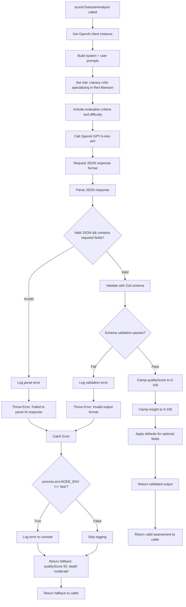

# AI Flow Modules - Evaluation and Grading (Updated 2025-11-21)

**Migration Status:** All evaluation and grading flows migrated from GenKit/Gemini to OpenAI GPT-5-mini on 2025-10-30.

**Current Architecture:** Direct OpenAI GPT-5-mini API integration with JSON-structured responses for reliable scoring and grading tasks.

---

# Module: `character-analysis-scoring`

## 1. Module Summary

The `character-analysis-scoring` module implements an AI-powered evaluation system for assessing user analyses of characters from "Dream of the Red Chamber" by measuring depth of understanding, psychological insight, and literary interpretation quality. This OpenAI GPT-5-mini-powered flow evaluates character analyses across multiple dimensions (superficial/moderate/profound depth, 0-100 insight score, 0-100 quality score) while tracking theme coverage to provide comprehensive feedback that guides students toward deeper character understanding. The module emphasizes literary criticism skills by assessing whether analyses move beyond surface descriptions to explore complex personality, motivations, symbolic significance, and character development arcs.

## 2. Module Dependencies

* **Internal Dependencies:**
  * `@/lib/openai-client` - OpenAI client instance (`getOpenAIClient`) providing GPT-5-mini API access
* **External Dependencies:**
  * `openai` - Official OpenAI SDK for API communication
  * `zod` - Schema validation library for type-safe inputs and outputs

## 3. Public API / Exports

* `scoreCharacterAnalysis(input: CharacterAnalysisScoringInput): Promise<CharacterAnalysisScoringOutput>` - Main async function for grading character analysis submissions
* `CharacterAnalysisScoringInput` - TypeScript type for input containing character info, analysis prompt, user analysis, expected themes, and difficulty
* `CharacterAnalysisScoringOutput` - TypeScript type for output containing quality score, depth assessment, insight score, themes covered/missed, feedback, and detailed analysis

## 4. Code File Breakdown

### 4.1. `character-analysis-scoring.ts`

* **Purpose:** This server-side file implements sophisticated literary criticism assessment by evaluating how deeply students understand character psychology, motivations, and narrative significance in the novel. The module distinguishes between superficial descriptions (external behaviors only), moderate analyses (personality and motivations explored), and profound insights (psychological depth, growth trajectories, symbolic meanings uncovered) to encourage advanced literary interpretation skills. By tracking theme coverage and providing targeted guidance for deeper exploration, this flow helps students develop critical thinking and analytical writing abilities essential for classical literature study.

* **Functions:**
    * `scoreCharacterAnalysis(input: CharacterAnalysisScoringInput): Promise<CharacterAnalysisScoringOutput>` - Public async function that calls OpenAI GPT-5-mini with structured prompts, parses JSON responses, validates output schema, and returns character analysis scoring results.

* **Key Classes / Constants / Variables:**
    * `CharacterAnalysisScoringInputSchema`: Zod object schema with 6 fields:
      - `characterName` (string, required): Name of character being analyzed from Red Mansion
      - `characterDescription` (string, required): Background information about character providing evaluation context
      - `analysisPrompt` (string, required): Specific question or prompt given to user about the character
      - `userAnalysis` (string, required): User's written analysis to evaluate for depth, insight, and quality
      - `expectedThemes` (string array, required): Key themes/aspects for complete analysis (e.g., personality, relationships, symbolism)
      - `difficulty` (enum: 'easy' | 'medium' | 'hard', required): Task difficulty affecting scoring criteria

    * `CharacterAnalysisScoringInput`: Exported TypeScript type inferred from input schema.

    * `CharacterAnalysisScoringOutputSchema`: Zod object schema with 7 fields:
      - `qualityScore` (number, 0-100): Overall quality score based on depth, insight, accuracy, literary awareness
      - `depth` (enum: 'superficial' | 'moderate' | 'profound'): Analysis depth assessment:
        * superficial (表面): Only describes external behaviors and simple features
        * moderate (中等): Attempts to explore personality and motivations but not deep enough
        * profound (深刻): Deep analysis of psychology, motivations, growth trajectory, symbolic significance
      - `insight` (number, 0-100): Insight score measuring psychological understanding and character motivation interpretation
      - `themesCovered` (string array): Expected themes user successfully addressed in analysis
      - `themesMissed` (string array): Important themes/aspects user didn't explore
      - `feedback` (string): Constructive Traditional Chinese feedback (80-120 chars) highlighting strengths and suggesting deeper exploration areas
      - `detailedAnalysis` (string): Markdown-formatted detailed evaluation (250-350 chars) including analysis highlights in bold, deepening angles in lists, recommended reading chapters, extended thinking directions

    * `CharacterAnalysisScoringOutput`: Exported TypeScript type inferred from output schema.

## 5. System and Data Flow

### 5.1. System Flowchart (Control Flow)



### 5.2. Data Flow Diagram (Data Transformation)

```mermaid
graph LR
    CharAnalysisTask[Character Analysis Task] -- character info + user analysis + themes --> Input[CharacterAnalysisScoringInput]
    Input --> Validation[Zod Input Validation]

    Validation -- validated input --> PromptBuilder[Prompt Builder]
    CriticRole[Literary Critic System Prompt] --> PromptBuilder
    DifficultyRules[Difficulty-Specific Criteria] --> PromptBuilder

    PromptBuilder -- system + user messages --> OpenAI[OpenAI GPT-5-mini]
    JSONFormat[response_format: json_object] --> OpenAI

    OpenAI -- JSON string --> Parser[JSON.parse]
    Parser -- parsed object --> SchemaVal[Zod Schema Validation]

    SchemaVal -- qualityScore --> ScoreClamping[Clamp 0-100]
    SchemaVal -- depth --> DepthField[depth: enum]
    SchemaVal -- insight --> InsightClamping[Clamp 0-100]
    SchemaVal -- themesCovered --> CoveredArray[covered: string[]]
    SchemaVal -- themesMissed --> MissedArray[missed: string[]]
    SchemaVal -- feedback --> FeedbackText[feedback: string]
    SchemaVal -- detailedAnalysis --> AnalysisMarkdown[analysis: markdown]

    ScoreClamping --> Output[CharacterAnalysisScoringOutput]
    DepthField --> Output
    InsightClamping --> Output
    CoveredArray --> Output
    MissedArray --> Output
    FeedbackText --> Output
    AnalysisMarkdown --> Output

    Parser -- Parse Error --> ErrorHandler[Error Handling]
    SchemaVal -- Validation Error --> ErrorHandler
    ErrorHandler --> FallbackBuilder[Build Fallback: moderate depth, scores 50]
    FallbackBuilder --> Output

    Output --> TaskService[DailyTaskService]
    TaskService --> UserDashboard[Character Analysis Results Display]
```

## 6. Usage Example & Testing

* **Usage:**
```typescript
import { scoreCharacterAnalysis } from '@/ai/flows/character-analysis-scoring';

const result = await scoreCharacterAnalysis({
  characterName: "林黛玉",
  characterDescription: "賈母的外孫女，寄居賈府，多愁善感，才華橫溢...",
  analysisPrompt: "分析林黛玉的性格特點和悲劇命運的關係",
  userAnalysis: "林黛玉性格敏感多疑，這種性格源於她寄人籬下的處境。她的才華使她自尊心強，但同時也讓她更加孤獨。她與寶玉的愛情注定悲劇...",
  expectedThemes: ["性格特點", "寄居身份", "才華與自尊", "愛情悲劇", "命運象徵"],
  difficulty: "hard"
});

console.log(result.qualityScore); // 88
console.log(result.depth); // "profound"
console.log(result.insight); // 85
console.log(result.themesCovered); // ["性格特點", "寄居身份", "才華與自尊", "愛情悲劇"]
console.log(result.themesMissed); // ["命運象徵"]
```

* **Testing:** This module is tested through Jest unit tests in `/tests/ai/flows/character-analysis-scoring.test.ts` which mock OpenAI API responses to verify schema validation, score clamping, and error handling. Testing strategy includes: verifying depth classification accuracy (superficial vs profound distinction), confirming insight scoring reflects psychological understanding, validating theme tracking against expected themes, testing difficulty-adaptive scoring (easy: basic = 70+, hard: requires profound insights), ensuring markdown formatting in detailed analysis includes bold highlights and list recommendations, and checking fallback behavior maintains user experience when API calls fail.


---

# Module: `commentary-interpretation`

## 1. Module Summary

The `commentary-interpretation` module implements an AI-powered evaluation system for assessing user interpretations of Zhiyanzhai (脂硯齋) commentaries - critical annotations that provide profound insights into "Dream of the Red Chamber's" hidden meanings, symbolism, and authorial intent. This OpenAI GPT-5-mini-powered flow measures interpretation quality across four insight levels (surface, moderate, deep, profound), calculates literary sensitivity scores (0-100) for symbolic language understanding, and provides authoritative explanations of commentary meanings to guide students into advanced Red Mansion scholarship. The module bridges student interpretations with scholarly understanding through detailed feedback that highlights captured insights, missed symbolic meanings, and research methodology guidance.

## 2. Module Dependencies

* **Internal Dependencies:**
  * `@/lib/openai-client` - OpenAI client instance (`getOpenAIClient`) providing GPT-5-mini API access
* **External Dependencies:**
  * `openai` - Official OpenAI SDK for API communication
  * `zod` - Schema validation library for type-safe inputs and outputs

## 3. Public API / Exports

* `scoreCommentaryInterpretation(input: CommentaryInterpretationInput): Promise<CommentaryInterpretationOutput>` - Main async function for grading Zhiyanzhai commentary interpretations
* `CommentaryInterpretationInput` - TypeScript type for input containing commentary text, related passage, chapter context, user interpretation, hints, and difficulty
* `CommentaryInterpretationOutput` - TypeScript type for output containing score, insight level, literary sensitivity, captured/missed insights, feedback, detailed analysis, and authoritative commentary explanation

## 4. Code File Breakdown

### 4.1. `commentary-interpretation.ts`

* **Purpose:** This server-side file implements advanced literary criticism assessment by evaluating how well students decode Zhiyanzhai commentaries - one of the most sophisticated aspects of Red Mansion scholarship requiring understanding of foreshadowing, symbolism, metaphor, hidden narrative layers, and authorial intent signals. The module uses a four-tier insight classification system (surface: literal understanding only; moderate: notices some implications; deep: understands major symbolism/foreshadowing; profound: grasps multilayered meanings and literary value) to differentiate between basic comprehension and scholarly interpretation. By providing authoritative commentary explanations alongside student assessment, this flow serves both evaluation and education functions, enabling students to compare their interpretations with scholarly consensus and learn the methodology of reading annotated classical texts.

* **Functions:**
    * `scoreCommentaryInterpretation(input: CommentaryInterpretationInput): Promise<CommentaryInterpretationOutput>` - Public async function that calls OpenAI GPT-5-mini with structured prompts for commentary interpretation evaluation, parses JSON responses, and returns validated scoring results.

* **Key Classes / Constants / Variables:**
    * `CommentaryInterpretationInputSchema`: Zod object schema with 6 fields (commentaryText, relatedPassage, chapterContext, userInterpretation, interpretationHints, difficulty)
    * `CommentaryInterpretationOutputSchema`: Zod object schema with 8 fields (score, insightLevel with 4-tier enum, literarySensitivity, keyInsightsCaptured/Missed arrays, feedback, detailedAnalysis, commentaryExplanation)

## 5. Testing

* **Testing:** This module is tested through Jest unit tests in `/tests/ai/flows/commentary-interpretation.test.ts` with mocked OpenAI responses. Testing includes: 4-tier insight level classification, literary sensitivity scoring, authoritative commentary explanation generation, difficulty-adaptive scoring, markdown formatting validation, and error fallback behavior.


---

# Module: `poetry-quality-assessment` (DEPRECATED)

## 1. Module Summary

> [!WARNING]
> **DEPRECATED:** This module has been deprecated as of 2025-10-30. Poetry recitation tasks were removed from the daily task system due to the inability to prevent copy-paste cheating. This documentation is retained for historical reference only.

The `poetry-quality-assessment` module implements an AI-powered grading system for evaluating user recitations or compositions of poetry from "Dream of the Red Chamber" using character-by-character comparison against original texts. This OpenAI GPT-5-mini-powered flow assesses accuracy percentage, completeness percentage, and overall quality through weighted scoring while identifying specific mistakes (missing lines, incorrect characters, extra content) with line-by-line error tracking. The module provides literary analysis and appreciation guidance in Traditional Chinese markdown to deepen students' understanding of classical Chinese poetry aesthetics.

## 2. Module Dependencies

* **Internal Dependencies:**
  * `@/lib/openai-client` - OpenAI client instance (`getOpenAIClient`) providing GPT-5-mini API access
* **External Dependencies:**
  * `openai` - Official OpenAI SDK for API communication
  * `zod` - Schema validation library for type-safe inputs and outputs

## 3. Public API / Exports

* `assessPoetryQuality(input: PoetryQualityInput): Promise<PoetryQualityOutput>` - Main async function for grading poetry recitations/compositions
* `PoetryQualityInput` - TypeScript type for input containing poem title, original text, user recitation, author, and difficulty
* `PoetryQualityOutput` - TypeScript type for output containing accuracy, completeness, overall score, mistakes array, feedback, and literary analysis

## 4. Code File Breakdown

### 4.1. `poetry-quality-assessment.ts`

* **Purpose:** This server-side file implements specialized AI assessment for classical Chinese poetry by performing detailed character-level comparison between original poems and user recitations through OpenAI GPT-5-mini's JSON-structured responses. The module employs a multi-metric evaluation system (accuracy percentage for character matching, completeness percentage for verse/line inclusion, overall quality combining both metrics) to provide nuanced feedback that helps students improve memorization and appreciation of Red Mansion poetry.

* **Key Output Fields:**
    * `accuracy` (number, 0-100): Character-level accuracy percentage
    * `completeness` (number, 0-100): Verse/line inclusion percentage
    * `overallScore` (number, 0-100): Weighted combination score
    * `mistakes` (array): Each mistake includes line number, expected text, actual text, and type (missing/incorrect/extra)
    * `feedback` (string): 80-120 chars Traditional Chinese encouragement
    * `literaryAnalysis` (string): 200-300 chars Markdown with poetry appreciation

## 5. Testing

* **Testing:** Tested through Jest unit tests in `/tests/ai/flows/poetry-quality-assessment.test.ts` with mocked OpenAI responses. Testing includes: character-level accuracy calculation, completeness detection, mistake categorization and line tracking, difficulty-adaptive scoring, and literary analysis quality.


---

# Module: `cultural-quiz-grading`

## 1. Module Summary

The `cultural-quiz-grading` module implements an AI-powered multi-question quiz grading system for assessing user understanding of Qing Dynasty cultural knowledge, social customs, and historical context depicted in "Dream of the Red Chamber". This OpenAI GPT-5-mini-powered flow evaluates both multiple-choice and open-ended questions with differentiated scoring (100/0 for multiple-choice, 0-100 scaled for open-ended based on accuracy and completeness), provides detailed per-question explanations in Traditional Chinese, and generates cultural insights to deepen historical literacy through JSON-structured responses.

## 2. Module Dependencies

* **Internal Dependencies:**
  * `@/lib/openai-client` - OpenAI client instance (`getOpenAIClient`) providing GPT-5-mini API access
* **External Dependencies:**
  * `openai` - Official OpenAI SDK for API communication
  * `zod` - Schema validation library for type-safe inputs and outputs

## 3. Public API / Exports

* `gradeCulturalQuiz(input: CulturalQuizGradingInput): Promise<CulturalQuizGradingOutput>` - Main async function for grading cultural knowledge quizzes
* `CulturalQuizGradingInput` - TypeScript type for input containing quiz title, question array, and difficulty
* `CulturalQuizGradingOutput` - TypeScript type for output containing overall score, correct count, per-question results, feedback, and cultural insights

## 4. Code File Breakdown

### 4.1. `cultural-quiz-grading.ts`

* **Purpose:** This server-side file implements batch quiz assessment for cultural knowledge evaluation, processing multiple questions (both multiple-choice and open-ended) in a single OpenAI API call for efficiency. The module uses nested Zod schemas to validate individual questions within the quiz array, applies differentiated scoring logic (binary for multiple-choice, scaled for open-ended based on completeness), and provides educational explanations that not only indicate correctness but also enrich cultural understanding through contextual background information.

* **Key Nested Schemas:**
    * `QuizQuestionSchema`: Individual question structure (question, options, correctAnswer, userAnswer, culturalContext)
    * `QuestionResultSchema`: Individual result structure (questionNumber, isCorrect, score, explanation)
    * Output includes `questionResults` array with per-question breakdown and overall `culturalInsights` markdown

## 5. Testing

* **Testing:** Tested through Jest unit tests in `/tests/ai/flows/cultural-quiz-grading.test.ts` with mocked OpenAI responses. Testing includes: differentiated scoring for multiple-choice vs open-ended, 1-indexed question numbering, average score calculation, difficulty-adaptive scoring, cultural insights quality, and array structure consistency in fallback scenarios.


---

## Migration Notes (2025-10-30)

### Changes from GenKit/Gemini Architecture

1. **Framework Removed:** Eliminated GenKit orchestration layer for simpler, more maintainable code
2. **API Provider Changed:** Migrated from Google Gemini 2.5 Pro to OpenAI GPT-5-mini for all scoring tasks
3. **Response Format:** Now using OpenAI's `response_format: { type: 'json_object' }` for reliable JSON-structured outputs
4. **Error Handling:** Simplified error handling with direct try-catch blocks instead of GenKit flow error handling
5. **Testing Approach:** Migrated from GenKit Development UI manual testing to Jest unit tests with mocked API responses
6. **Dependencies Updated:** Replaced `@/ai/genkit` and `genkit` imports with `@/lib/openai-client` and `openai`

### Benefits of Migration

- **Cost Efficiency:** GPT-5-mini provides excellent quality at lower cost than Gemini 2.5 Pro
- **JSON Reliability:** OpenAI's json_object mode ensures consistent, parseable JSON responses
- **Simplified Architecture:** No framework overhead, direct API calls are easier to debug and maintain
- **Better Testing:** Standard Jest mocking patterns are simpler than GenKit testing workflows
- **Performance:** Removed framework processing overhead for faster response times

### Testing Migration

All flows now tested through standard Jest unit tests with mocked OpenAI API responses:
- `/tests/ai/flows/character-analysis-scoring.test.ts`
- `/tests/ai/flows/commentary-interpretation.test.ts`
- `/tests/ai/flows/poetry-quality-assessment.test.ts`
- `/tests/ai/flows/cultural-quiz-grading.test.ts`

Run tests: `npm test -- tests/ai/flows/`

---

**Document Version:** 2.1
**Last Updated:** 2025-11-21 (Verification)
**Migration Date:** 2025-10-30
**Previous Version:** GenKit/Gemini-based (see git history before 2025-10-30)
