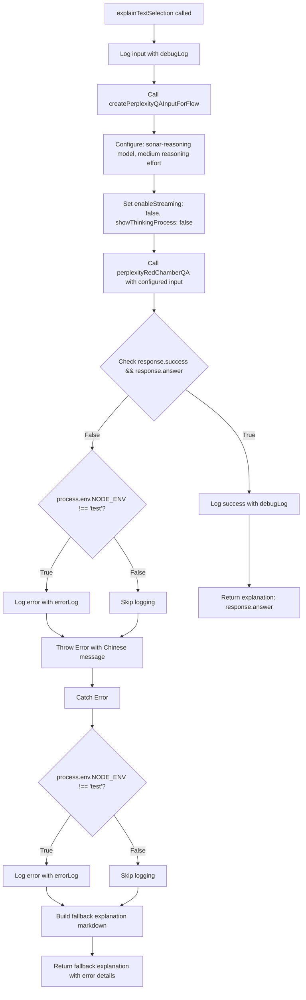
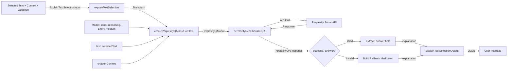

# Module: `explain-text-selection`

## 1. Module Summary

The `explain-text-selection` module provides AI-powered explanations for user-selected text passages from "Dream of the Red Chamber" by processing user questions through the Perplexity AI integration. This module serves as a wrapper flow that transforms text selection requests into Perplexity Q&A operations, enabling students to receive detailed Traditional Chinese explanations for complex classical Chinese passages with contextual understanding of chapter content. The module implements comprehensive error handling with fallback responses to ensure users always receive meaningful feedback even when the AI service fails.

## 2. Module Dependencies

* **Internal Dependencies:**
  * `@/ai/flows/perplexity-red-chamber-qa` - Core Perplexity integration providing `perplexityRedChamberQA()` function and `createPerplexityQAInputForFlow()` helper
  * `@/lib/terminal-logger` - Logging utilities for debugging (`debugLog`, `errorLog`)
* **External Dependencies:**
  * `zod` - Schema validation library for input/output type safety and runtime validation

## 3. Public API / Exports

* `explainTextSelection(input: ExplainTextSelectionInput): Promise<ExplainTextSelectionOutput>` - Main async function that processes text explanation requests by delegating to Perplexity AI
* `ExplainTextSelectionInput` - TypeScript type for input parameters containing selected text, chapter context, and user question
* `ExplainTextSelectionOutput` - TypeScript type for output containing AI-generated markdown explanation

## 4. Code File Breakdown

### 4.1. `explain-text-selection.ts`

* **Purpose:** This server-side file implements a specialized AI flow for explaining selected text passages from the novel by integrating with the Perplexity Q&A system. It serves as an adapter that converts text selection events (text snippet + user question + chapter context) into properly formatted Perplexity API requests with appropriate model selection and reasoning configuration. The file ensures robust error handling by providing Chinese markdown fallback responses when AI services are unavailable, maintaining user experience continuity.

* **Functions:**
    * `explainTextSelection(input: ExplainTextSelectionInput): Promise<ExplainTextSelectionOutput>` - Async function that accepts selected text, chapter context, and user question, then orchestrates the complete explanation workflow. Internally calls `createPerplexityQAInputForFlow()` with `sonar-reasoning` model and medium reasoning effort, executes `perplexityRedChamberQA()` for AI processing, validates the success status and answer presence, and returns formatted explanation. Throws `Error` with Chinese message if Perplexity response indicates failure. Catches all errors and returns fallback markdown explanation including user's question, apologetic message, troubleshooting suggestions, and error details. Never throws errors to calling code; always returns valid output structure.

* **Key Classes / Constants / Variables:**
    * `ExplainTextSelectionInputSchema`: Zod object schema defining three required string fields:
      - `selectedText` (string): The text snippet selected by the user from the novel
      - `chapterContext` (string): Surrounding chapter content providing contextual information
      - `userQuestion` (string): User's specific question about the selected text in Traditional Chinese
      Used for runtime validation and TypeScript type inference through `z.infer<>`.

    * `ExplainTextSelectionInput`: Exported TypeScript type inferred from input schema. Ensures type safety for function parameters and API contracts.

    * `ExplainTextSelectionOutputSchema`: Zod object schema defining single field:
      - `explanation` (string): AI-generated answer in Markdown format with Traditional Chinese text, structured using headers (##), lists (-), bold (**), and italic (*) formatting
      Schema description explicitly instructs AI to use markdown elements for content organization.

    * `ExplainTextSelectionOutput`: Exported TypeScript type inferred from output schema. Defines the contract for function return values.

## 5. System and Data Flow

### 5.1. System Flowchart (Control Flow)



### 5.2. Data Flow Diagram (Data Transformation)



## 6. Usage Example & Testing

* **Usage:**
```typescript
import { explainTextSelection } from '@/ai/flows/explain-text-selection';

const result = await explainTextSelection({
  selectedText: "黛玉聽了，半晌說道：「你心裡自然有我，我心裡也自然有你。」",
  chapterContext: "第三十二回：訴肺腑心迷活寶玉...",
  userQuestion: "這段對話體現了寶黛之間怎樣的感情？"
});
console.log(result.explanation); // Markdown formatted Chinese explanation
```

* **Testing:** This module does not have dedicated unit tests as it primarily serves as an integration wrapper. Integration testing occurs through the `/src/app/api/` routes that consume this flow (likely in reading interface endpoints). Manual testing is performed using the GenKit development UI (`npm run genkit:dev`) or by triggering text selection events in the reading interface. The Perplexity integration is tested through `perplexity-red-chamber-qa` module tests. Error handling logic can be validated by mocking `perplexityRedChamberQA` to return failure responses.
