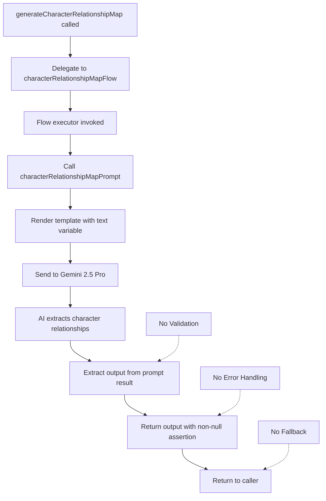
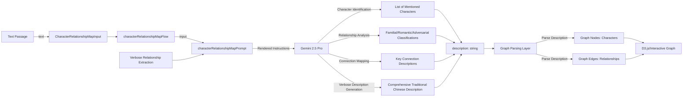

# Module: `interactive-character-relationship-map`

## 1. Module Summary

The `interactive-character-relationship-map` module implements a streamlined AI-powered flow for extracting and describing character relationships from text passages to support interactive graph visualization in the Red Mansion learning platform. This GenKit-based flow analyzes a given text passage, identifies all mentioned characters, and generates comprehensive Traditional Chinese descriptions of their relationships (familial, romantic, adversarial) structured for easy parsing and rendering as interactive network graphs. The module provides verbose, detailed relationship descriptions to ensure rich graph node and edge labels that help students visualize and understand the complex character dynamics across the novel's 400+ characters.

## 2. Module Dependencies

* **Internal Dependencies:**
  * `@/ai/genkit` - Core GenKit instance (`ai`) providing `definePrompt` and `defineFlow` APIs
* **External Dependencies:**
  * `genkit` - GenKit framework providing `z` (Zod) schema validation re-export

## 3. Public API / Exports

* `generateCharacterRelationshipMap(input: CharacterRelationshipMapInput): Promise<CharacterRelationshipMapOutput>` - Main async function for generating character relationship descriptions from text
* `CharacterRelationshipMapInput` - TypeScript type for input containing text passage for relationship extraction
* `CharacterRelationshipMapOutput` - TypeScript type for output containing relationship description suitable for graph rendering

## 4. Code File Breakdown

### 4.1. `interactive-character-relationship-map.ts`

* **Purpose:** This server-side file implements a focused AI flow specifically designed to power interactive character relationship visualizations by extracting relationship information from text passages and formatting it for graph rendering engines (likely D3.js or similar). The module intentionally generates verbose, comprehensive descriptions rather than structured data because relationship complexity in classical literature requires rich contextual descriptions that structured JSON would oversimplify. By focusing on key connections and their nature (familial, romantic, adversarial), this flow enables the knowledge graph feature to visualize narrative structure and help students navigate the overwhelming number of interpersonal relationships in the 120-chapter novel.

* **Functions:**
    * `generateCharacterRelationshipMap(input: CharacterRelationshipMapInput): Promise<CharacterRelationshipMapOutput>` - Public async function serving as API entry point, delegates to internal `characterRelationshipMapFlow` with provided input. Returns Promise directly without transformation. Throws errors propagated from underlying flow (note: unlike other flows, this one doesn't implement fallback error handling).

* **Key Classes / Constants / Variables:**
    * `CharacterRelationshipMapInputSchema`: Minimal Zod object schema with single field:
      - `text` (string, required): Current text from which to extract character relationships

    * `CharacterRelationshipMapInput`: Exported TypeScript type inferred from input schema.

    * `CharacterRelationshipMapOutputSchema`: Minimal Zod object schema with single field:
      - `description` (string, required): Description of character relationships in text, suitable for rendering as interactive graph. Format emphasizes key connections and relationship nature for visualization purposes.

    * `CharacterRelationshipMapOutput`: Exported TypeScript type inferred from output schema.

    * `characterRelationshipMapPrompt`: GenKit prompt definition with:
      - `name: 'characterRelationshipMapPrompt'`
      - Template variable: `{{{text}}}`
      - Instruction: Extract and describe relationships between mentioned characters, structure description for easy parsing and graph rendering, focus on key connections and relationship nature (familial, romantic, adversarial)
      - Output directive: Be as comprehensive as possible, be as verbose as possible, respond in Traditional Chinese (請以繁體中文描述)
      - Note: Deliberately requests verbose output for rich graph labels

    * `characterRelationshipMapFlow`: GenKit flow definition with minimal implementation:
      - `name: 'characterRelationshipMapFlow'`
      - Invokes `characterRelationshipMapPrompt(input)`
      - Extracts output and returns directly with `output!` (non-null assertion)
      - No validation, no error handling, no fallback - assumes AI always returns valid output
      - Private flow accessed only through public `generateCharacterRelationshipMap()` function

## 5. System and Data Flow

### 5.1. System Flowchart (Control Flow)



### 5.2. Data Flow Diagram (Data Transformation)



## 6. Usage Example & Testing

* **Usage:**
```typescript
import { generateCharacterRelationshipMap } from '@/ai/flows/interactive-character-relationship-map';

const result = await generateCharacterRelationshipMap({
  text: `寶玉見黛玉來了，便笑道：「來了，我正想你。」黛玉聽了，臉一紅。旁邊寶釵見了，心中暗嘆。王夫人看著這三個孩子，心中各有所思。`
});

console.log(result.description);
// "在這段文字中，賈寶玉與林黛玉之間存在濃厚的情感聯繫，表現為寶玉的主動關懷和黛玉的羞澀回應，
//  屬於**浪漫關係（romantic）**。薛寶釵作為旁觀者，對寶黛之間的情感有所察覺，心中暗嘆，
//  暗示她與這兩人形成微妙的三角關係，兼具**競爭關係（adversarial）**和**家族關係（familial）**的複雜性。
//  王夫人作為長輩，對三個晚輩各有關注，體現**家族長幼關係（familial）**..."
```

* **Testing:** This module is tested through integration with the knowledge graph visualization feature which consumes the relationship descriptions. No dedicated unit test file exists. The GenKit development UI (`npm run genkit:dev`) enables manual testing with sample text passages. Testing strategy includes: verifying all mentioned characters are identified in description, confirming relationship types (familial/romantic/adversarial) are classified correctly, validating Traditional Chinese output quality, checking description verbosity provides sufficient detail for rich graph rendering, testing with passages containing different relationship complexities (2-10+ characters), and ensuring output format is parseable by graph rendering logic. Note: Unlike other flows, this module lacks error handling and fallback mechanisms, requiring robust error handling in consuming code.
