# Module: `poetry-quality-assessment`

## 1. Module Summary

The `poetry-quality-assessment` module implements an AI-powered grading system for evaluating user recitations or compositions of poetry from "Dream of the Red Chamber" using character-by-character comparison against original texts. This GenKit-based flow assesses accuracy percentage, completeness percentage, and overall quality through weighted scoring while identifying specific mistakes (missing lines, incorrect characters, extra content) with line-by-line error tracking. The module provides literary analysis and appreciation guidance in Traditional Chinese markdown to deepen students' understanding of classical Chinese poetry aesthetics.

## 2. Module Dependencies

* **Internal Dependencies:**
  * `@/ai/genkit` - Core GenKit instance (`ai`) providing `definePrompt` and `defineFlow` APIs
* **External Dependencies:**
  * `genkit` - GenKit framework providing `z` (Zod) schema validation re-export

## 3. Public API / Exports

* `assessPoetryQuality(input: PoetryQualityInput): Promise<PoetryQualityOutput>` - Main async function for grading poetry recitations/compositions
* `PoetryQualityInput` - TypeScript type for input containing poem title, original text, user recitation, author, and difficulty
* `PoetryQualityOutput` - TypeScript type for output containing accuracy, completeness, overall score, mistakes array, feedback, and literary analysis

## 4. Code File Breakdown

### 4.1. `poetry-quality-assessment.ts`

* **Purpose:** This server-side file implements specialized AI assessment for classical Chinese poetry by performing detailed character-level comparison between original poems and user recitations. The module employs a multi-metric evaluation system (accuracy percentage for character matching, completeness percentage for verse/line inclusion, overall quality combining both metrics) to provide nuanced feedback that helps students improve memorization and appreciation of Red Mansion poetry. By categorizing errors into three types (missing, incorrect, extra) with specific line references, this flow enables targeted improvement guidance while the literary analysis component enhances cultural and aesthetic understanding.

* **Functions:**
    * `assessPoetryQuality(input: PoetryQualityInput): Promise<PoetryQualityOutput>` - Public async function serving as API entry point, delegates to internal `poetryQualityFlow` with provided input. Returns Promise directly without additional transformation. Throws errors propagated from underlying flow.

* **Key Classes / Constants / Variables:**
    * `PoetryQualityInputSchema`: Zod object schema with 5 fields:
      - `poemTitle` (string, required): Title of poem from Red Mansion for context and reference
      - `originalPoem` (string, required): Original correct poem text as gold standard for comparison
      - `userRecitation` (string, required): User's recitation/writing to compare against original
      - `author` (string, optional): Author or character who composed the poem, adds evaluation context
      - `difficulty` (enum: 'easy' | 'medium' | 'hard', required): Task difficulty affecting scoring strictness and feedback tone

    * `PoetryQualityInput`: Exported TypeScript type inferred from input schema.

    * `PoetryQualityOutputSchema`: Zod object schema with 6 fields:
      - `accuracy` (number, 0-100): Character-level accuracy percentage measuring character matches
      - `completeness` (number, 0-100): Completeness percentage measuring verse/line inclusion
      - `overallScore` (number, 0-100): Overall quality score (weighted combination of accuracy, completeness, literary quality)
      - `mistakes` (array of objects): List of specific mistakes, each containing:
        * `line` (number): Line number where mistake occurred (1-indexed)
        * `expected` (string): Correct text that should have been written
        * `actual` (string): What user actually wrote
        * `type` (enum: 'missing' | 'incorrect' | 'extra'): Mistake classification
      - `feedback` (string): Constructive Traditional Chinese feedback (80-120 chars) highlighting achievements and improvement guidance
      - `literaryAnalysis` (string): Markdown-formatted literary appreciation (200-300 chars) explaining beauty, themes, techniques in Traditional Chinese

    * `PoetryQualityOutput`: Exported TypeScript type inferred from output schema.

    * `poetryQualityPrompt`: GenKit prompt definition with:
      - `name: 'poetryQualityPrompt'`
      - Role: Senior classical Chinese poetry expert evaluating student recitations
      - Template variables: `{{poemTitle}}`, `{{#if author}}{{author}}{{/if}}`, `{{{originalPoem}}}`, `{{{userRecitation}}}`, `{{difficulty}}`
      - Evaluation criteria: Accuracy (character-by-character comparison), Completeness (missing verses/lines check), Overall Score (comprehensive quality assessment)
      - Difficulty-specific scoring: easy (80+ with 1-2 small errors), medium (70-90 range with some errors but high completeness), hard (errors significantly impact score)
      - Error types: missing (omitted lines), incorrect (wrong characters), extra (added content)
      - Output requirements: accuracy %, completeness %, overallScore, mistakes array with line/expected/actual/type, feedback (80-120 chars encouragement), literaryAnalysis (200-300 chars Markdown with theme/mood in bold, rhetorical devices in lists, significance in Red Mansion context)

    * `poetryQualityFlow`: GenKit flow definition executing assessment:
      - Invokes `poetryQualityPrompt(input)`
      - Validates output completeness (checks `typeof overallScore === 'number'`)
      - Throws Chinese error if validation fails
      - Validates all three scores within 0-100 range using `Math.max(0, Math.min(100, Math.round()))`
      - Provides defaults for optional fields (empty mistakes array, default feedback/analysis)
      - Catches errors (logged only in non-test environments)
      - Returns fallback assessment on error: accuracy 50, completeness 50, overallScore 50, empty mistakes, apologetic feedback, system message analysis

## 5. System and Data Flow

### 5.1. System Flowchart (Control Flow)

```mermaid
flowchart TD
    A[assessPoetryQuality called] --> B[Delegate to poetryQualityFlow]
    B --> C[Flow executor invoked]
    C --> D[Call poetryQualityPrompt]
    D --> E[Render template: poemTitle, author?, originalPoem, userRecitation, difficulty]
    E --> F[Send to Gemini 2.5 Pro]

    F --> G[AI performs character comparison]
    G --> H{Validate: output && typeof overallScore === 'number'?}
    H -- Invalid --> I[Log error to console]
    I --> J[Throw Error: AI模型未能生成有效的詩詞質量評估]

    H -- Valid --> K[Validate accuracy range: Math.max 0, Math.min 100]
    K --> L[Validate completeness range]
    L --> M[Validate overallScore range]
    M --> N[Apply defaults: mistakes || , feedback || default, literaryAnalysis || default]
    N --> O[Return validated output]

    J --> P[Catch Error]
    P --> Q{process.env.NODE_ENV !== 'test'?}
    Q -- True --> R[Log error to console]
    Q -- False --> S[Skip logging]
    R --> T[Return fallback: all scores 50, empty mistakes]
    S --> T
    T --> U[Return fallback to caller]
    O --> V[Return valid assessment to caller]
```

### 5.2. Data Flow Diagram (Data Transformation)

```mermaid
graph LR
    PoetryTask[Poetry Task Data] -- original + recitation + metadata --> Input[PoetryQualityInput]
    Input --> Flow[poetryQualityFlow]

    Flow -- input --> Prompt[poetryQualityPrompt]
    ExpertRole[Classical Poetry Expert Persona] --> Prompt
    Prompt -- Rendered Instructions --> AI[Gemini 2.5 Pro]

    AI -- Character Comparison --> AccuracyCalc[Calculate Accuracy %]
    AI -- Line/Verse Check --> CompletenessCalc[Calculate Completeness %]
    AI -- Holistic Review --> OverallScore[Calculate Overall Score]
    AI -- Error Detection --> MistakesList[Build Mistakes Array]

    AccuracyCalc --> Validation{Score Validation}
    CompletenessCalc --> Validation
    OverallScore --> Validation
    MistakesList --> Validation

    Validation -- Valid --> Clamping[Clamp scores 0-100]
    Clamping --> DefaultsApp[Apply defaults for optionals]

    DefaultsApp -- accuracy --> AccField[accuracy: number]
    DefaultsApp -- completeness --> CompField[completeness: number]
    DefaultsApp -- overallScore --> ScoreField[overallScore: number]
    DefaultsApp -- mistakes --> MistakesArray[mistakes: array]
    DefaultsApp -- feedback --> FeedbackText[feedback: string]
    DefaultsApp -- literaryAnalysis --> AnalysisMarkdown[analysis: markdown]

    AccField --> Output[PoetryQualityOutput]
    CompField --> Output
    ScoreField --> Output
    MistakesArray --> Output
    FeedbackText --> Output
    AnalysisMarkdown --> Output

    Validation -- Invalid --> ErrorHandler[Error Handling]
    ErrorHandler --> FallbackBuilder[Build Fallback: scores 50]
    FallbackBuilder --> Output

    Output --> TaskService[DailyTaskService]
    TaskService --> UserUI[Poetry Task Results Display]
```



## 6. Usage Example & Testing

* **Usage:**
```typescript
import { assessPoetryQuality } from '@/ai/flows/poetry-quality-assessment';

const result = await assessPoetryQuality({
  poemTitle: "葬花吟",
  originalPoem: "花謝花飛花滿天，紅消香斷有誰憐？\n游絲軟繫飄春榭，落絮輕沾撲繡簾。",
  userRecitation: "花謝花飛花滿天，紅消香斷有誰憐？\n游絲軟繫飄春榭，落絮輕黏撲繡簾。",
  author: "林黛玉",
  difficulty: "medium"
});

console.log(result.accuracy); // 97 (one character error: 黏 vs 沾)
console.log(result.completeness); // 100
console.log(result.overallScore); // 95
console.log(result.mistakes); // [{ line: 4, expected: "沾", actual: "黏", type: "incorrect" }]
console.log(result.literaryAnalysis); // Markdown analysis of poem's beauty
```

* **Testing:** This module is tested through the DailyTaskService integration tests which invoke poetry assessment with various recitation qualities and error types. No dedicated unit test file exists. The GenKit development UI (`npm run genkit:dev`) enables manual testing with sample poems. Testing strategy includes: verifying character-level accuracy calculation, confirming completeness detection for missing verses, validating mistake categorization (missing/incorrect/extra), checking line number accuracy in error tracking, testing difficulty-adaptive scoring (lenient for easy, strict for hard), and ensuring literary analysis provides cultural context.
