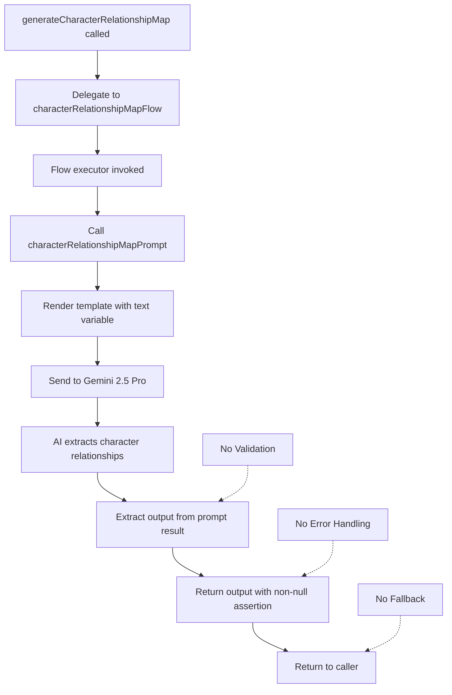
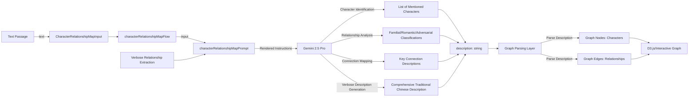

# Module: `perplexity-red-chamber-qa`

## 1. Module Summary

The `perplexity-red-chamber-qa` module implements the core AI-powered question answering system for "Dream of the Red Chamber" analysis using Perplexity Sonar API with real-time web search grounding capabilities. This module provides three operational modes (standard request, streaming response, and batch processing) along with extensive helper functions for input creation, model capability queries, and response formatting. The module serves as the primary interface between the educational platform and Perplexity's reasoning-capable AI models (sonar-pro, sonar-reasoning, sonar-reasoning-pro), enabling students to receive comprehensive literary analysis with citations, web-grounded research, and adaptive reasoning based on question complexity.

## 2. Module Dependencies

* **Internal Dependencies:**
  * `@/types/perplexity-qa` - Type definitions and validation functions (`PerplexityQAInput`, `PerplexityQAResponse`, `PerplexityStreamingChunk`, `PerplexityBatchQAInput`, `PerplexityBatchQAResponse`, `createPerplexityQAInput`, `validatePerplexityQAInput`, `DEFAULT_PERPLEXITY_QA_CONFIG`)
  * `@/lib/perplexity-client` - HTTP client for Perplexity API (`PerplexityClient`, `getDefaultPerplexityClient`)
  * `@/ai/perplexity-config` - Configuration constants and utilities (`PERPLEXITY_CONFIG`, `supportsReasoning`, type exports for `PerplexityModelKey`, `ReasoningEffort`, `QuestionContext`)
  * `@/lib/terminal-logger` - Comprehensive logging utilities (`terminalLogger`, `debugLog`, `errorLog`, `traceLog`)
* **External Dependencies:**
  * `zod` - Schema validation library for runtime type checking and validation

## 3. Public API / Exports

* `perplexityRedChamberQA(input: PerplexityQAInput): Promise<PerplexityQAResponse>` - Main async function for standard non-streaming Q&A requests with complete response
* `perplexityRedChamberQAStreaming(input: PerplexityQAInput): AsyncGenerator<PerplexityStreamingChunk>` - Async generator function for real-time streaming responses with progressive content delivery
* `perplexityRedChamberQABatch(input: PerplexityBatchQAInput): Promise<PerplexityBatchQAResponse>` - Async function for processing multiple questions concurrently with controlled parallelism
* `createPerplexityQAInputForFlow(userQuestion, selectedTextInfo?, chapterContextSnippet?, currentChapter?, options?): Promise<PerplexityQAInput>` - Helper function to create properly formatted input from flow parameters
* `getModelCapabilities(modelKey: PerplexityModelKey): Promise<object>` - Helper function returning capability flags for specified model
* `getSuggestedQuestions(): Promise<Record<QuestionContext, string[]>>` - Helper function providing pre-written example questions for each context type
* `formatPerplexityResponse(response: PerplexityQAResponse): Promise<object>` - Helper function formatting responses for UI display
* `getPerplexityQAInputSchema(): Promise<ZodSchema>` - Async function returning input validation schema (Server Actions compatibility)
* `getPerplexityQAOutputSchema(): Promise<ZodSchema>` - Async function returning output validation schema (Server Actions compatibility)

## 4. Code File Breakdown

### 4.1. `perplexity-red-chamber-qa.ts`

* **Purpose:** This server-side file serves as the comprehensive orchestration layer for all Perplexity AI integration in the Red Mansion learning platform, providing three distinct operational patterns (request/response, streaming, batch) to support different UI interaction models. The module implements sophisticated input validation using Zod schemas with 13 configurable parameters, manages API communication through the PerplexityClient abstraction, and provides extensive error handling with fallback responses to ensure resilient user experiences. By exposing helper functions for input creation, capability checking, and response formatting, this module enables consistent Perplexity integration across multiple features while centralizing configuration and error handling logic.

* **Functions:**
    * `perplexityRedChamberQA(input: PerplexityQAInput): Promise<PerplexityQAResponse>` - Main Q&A function that validates input using `validatePerplexityQAInput()`, applies defaults via `createPerplexityQAInput()`, retrieves default Perplexity client, executes `client.completionRequest()`, logs request/response metadata (question length, model, success status, answer length, citation count, processing time), and returns complete response object. On error, catches exceptions, logs only in non-test environments, and returns error response object with `success: false`, error message in Chinese, empty citations/grounding arrays, and metadata placeholders. Never throws errors; always returns valid `PerplexityQAResponse` structure.

    * `perplexityRedChamberQAStreaming(input: PerplexityQAInput): AsyncGenerator<PerplexityStreamingChunk>` - Async generator function for real-time streaming that validates input, forces `enableStreaming: true` in processed input, retrieves Perplexity client, invokes `client.streamingCompletionRequest()` which returns an async iterable, validates that returned value has `Symbol.asyncIterator` (throws TypeError if not async iterable), iterates over chunks with `for await`, yields each chunk to caller, logs completion when `chunk.isComplete === true`, breaks iteration on completion. Extensive debug logging at each step using `terminalLogger.logAsyncGeneratorStart()`, `debugLog()`, and `terminalLogger.logForAwaitStart()`. On error, catches exceptions, logs with `terminalLogger.logAsyncGeneratorError()`, and yields single error chunk with Chinese error message, empty arrays, and `isComplete: true`. Used by streaming API endpoints for progressive UI updates.

    * `perplexityRedChamberQABatch(input: PerplexityBatchQAInput): Promise<PerplexityBatchQAResponse>` - Batch processing function that accepts array of questions with shared config, implements semaphore-based concurrency control (default 3 concurrent requests), processes each question by merging with `sharedConfig`, calls `perplexityRedChamberQA()` for each, tracks successes/failures, releases semaphore slots after completion, waits for all promises with `Promise.all()`, calculates total and average processing times, returns batch response with all individual responses, metadata summary (total/successful/failed counts, timing), success flag, and error array if any failures occurred. Enables efficient processing of multiple questions while respecting API rate limits through controlled concurrency.

    * `createPerplexityQAInputForFlow(userQuestion: string, selectedTextInfo?: {text: string; position: any; range: any} | null, chapterContextSnippet?: string, currentChapter?: string, options?: Partial<PerplexityQAInput>): Promise<PerplexityQAInput>` - Helper function that constructs properly formatted `PerplexityQAInput` by extracting text from `selectedTextInfo?.text`, passing chapter context and current chapter, merging additional options, and delegating to core `createPerplexityQAInput()` function from types module. Used by other AI flows (like explain-text-selection) to consistently format inputs without understanding full Perplexity schema details.

    * `getModelCapabilities(modelKey: PerplexityModelKey): Promise<object>` - Async helper function returning static capability object for specified model with four boolean flags: `supportsReasoning` (determined by calling `supportsReasoning(modelKey)`), `supportsStreaming: true` (all models support streaming), `supportsCitations: true` (all models support citations), `supportsWebSearch: true` (all models support web search grounding). Used by UI to conditionally render features based on selected model.

    * `getSuggestedQuestions(): Promise<Record<QuestionContext, string[]>>` - Async helper function returning hard-coded object mapping each of 4 question contexts (`character`, `plot`, `theme`, `general`) to arrays of 4 example questions in Traditional Chinese. Questions are domain-specific literary analysis queries about Red Mansion (e.g., character personality questions for 'character' context, plot structure questions for 'plot' context). Used by UI to provide question templates and inspire user queries.

    * `formatPerplexityResponse(response: PerplexityQAResponse): Promise<object>` - Async helper function that enhances response object with additional formatted fields for UI display: `formattedAnswer` (unchanged answer), `citationSummary` (Chinese string "找到 X 個引用來源"), `processingInfo` (Chinese string "處理時間: X.XX秒"), `modelInfo` (Chinese string combining model key and optional reasoning effort). Returns augmented object with original response fields plus new display fields.

    * `getPerplexityQAInputSchema(): Promise<ZodSchema>` - Async function wrapper around `PerplexityQAInputSchemaObject` constant, required for Next.js Server Actions compatibility which cannot directly export Zod schemas. Returns the input validation schema for runtime use.

    * `getPerplexityQAOutputSchema(): Promise<ZodSchema>` - Async function wrapper around `PerplexityQAOutputSchemaObject` constant, required for Server Actions compatibility. Returns the output validation schema.

* **Key Classes / Constants / Variables:**
    * `PerplexityQAInputSchemaObject`: Comprehensive Zod object schema with 13 fields defining complete input contract:
      - `userQuestion` (string, 1-1000 chars, required): User's question about Red Mansion
      - `selectedText` (string, optional): Selected text snippet from novel
      - `chapterContext` (string, optional): Current chapter context snippet
      - `currentChapter` (string, optional): Current chapter name/number
      - `modelKey` (enum: 'sonar-pro' | 'sonar-reasoning' | 'sonar-reasoning-pro', optional): Preferred model
      - `reasoningEffort` (enum: 'low' | 'medium' | 'high', optional): Reasoning intensity for reasoning-capable models
      - `questionContext` (enum: 'character' | 'plot' | 'theme' | 'general', optional): Question context type for specialized prompting
      - `enableStreaming` (boolean, default true): Enable streaming responses
      - `includeDetailedCitations` (boolean, default true): Include detailed citation information
      - `showThinkingProcess` (boolean, default true): Display AI reasoning process
      - `temperature` (number, 0-1, optional): Generation randomness
      - `maxTokens` (number, 1-8000, optional): Maximum response tokens
      All descriptions in Traditional Chinese. Used for runtime validation and TypeScript inference.

    * `PerplexityQAOutputSchemaObject`: Comprehensive Zod object schema with 20 fields defining complete response contract including: `question`, `answer`, `rawAnswer`, `citations` (array of citation objects with number/title/url/type/snippet/publishDate/domain), `groundingMetadata` (searchQueries/webSources/confidenceScore/groundingSuccessful/rawMetadata), `modelUsed`, `modelKey`, `reasoningEffort`, `questionContext`, `processingTime`, `success`, `streaming`, `chunkCount`, `stoppedByUser`, `timestamp`, `answerLength`, `questionLength`, `citationCount`, `error`, `metadata`. All descriptions in Traditional Chinese.

## 5. System and Data Flow

### 5.1. System Flowchart (Control Flow)

```mermaid
flowchart TD
    A[perplexityRedChamberQA called] --> B[Log request metadata]
    B --> C[Call validatePerplexityQAInput]
    C --> D{Validation valid?}
    D -- False --> E[Throw Error: 輸入驗證失敗]
    D -- True --> F[Call createPerplexityQAInput for defaults]

    F --> G[Get default Perplexity client]
    G --> H[Call client.completionRequest]

    H --> I[Log completion metadata]
    I --> J[Return response]

    E --> K[Catch Error]
    H --> K
    K --> L{process.env.NODE_ENV !== 'test'?}
    L -- True --> M[Log error to console]
    L -- False --> N[Skip logging]
    M --> O[Build error response object]
    N --> O
    O --> P[Return error response with success: false]

    Q[perplexityRedChamberQAStreaming called] --> R[Log streaming request]
    R --> S[Validate input]
    S --> T{Valid?}
    T -- False --> U[Yield error chunk]
    T -- True --> V[Force enableStreaming: true]
    V --> W[Get Perplexity client]
    W --> X[Call client.streamingCompletionRequest]
    X --> Y{Is AsyncIterable?}
    Y -- False --> Z[Throw TypeError]
    Y -- True --> AA[for await chunk of generator]
    AA --> AB[Yield chunk]
    AB --> AC{chunk.isComplete?}
    AC -- True --> AD[Log completion, break]
    AC -- False --> AA
    Z --> AE[Catch Error]
    AD --> AF[Generator complete]
    AE --> AG[Yield error chunk with isComplete: true]

    AH[perplexityRedChamberQABatch called] --> AI[Initialize semaphore array]
    AI --> AJ[Create processing promises for all questions]
    AJ --> AK{Wait for semaphore slot]
    AK -- Available --> AL[Merge question with sharedConfig]
    AL --> AM[Call perplexityRedChamberQA]
    AM --> AN[Track success/failure]
    AN --> AO[Release semaphore slot]
    AO --> AP{More questions?}
    AP -- Yes --> AK
    AP -- No --> AQ[Wait Promise.all]
    AQ --> AR[Calculate timing metrics]
    AR --> AS[Return batch response]
```

### 5.2. Data Flow Diagram (Data Transformation)

```mermaid
graph LR
    UserQ[User Question + Context] -- Raw Input --> Validator[validatePerplexityQAInput]
    Validator -- ValidationResult --> Decision{valid?}
    Decision -- True --> DefaultApplier[createPerplexityQAInput]
    Decision -- False --> ErrorBuilder[Build Error]

    DefaultApplier -- PerplexityQAInput --> ClientGetter[getDefaultPerplexityClient]
    ClientGetter -- PerplexityClient --> APICall[client.completionRequest]

    Config[PERPLEXITY_CONFIG] --> APICall
    ModelInfo[Model Capabilities] --> APICall

    APICall -- HTTP Request --> PerplexityAPI[Perplexity Sonar API]
    PerplexityAPI -- HTTP Response --> ResponseParser[Response Parsing]

    ResponseParser -- answer --> AnswerField[Answer Field]
    ResponseParser -- citations --> CitationsArray[Citations Array]
    ResponseParser -- metadata --> MetadataObj[Grounding Metadata]

    AnswerField --> FinalResponse[PerplexityQAResponse]
    CitationsArray --> FinalResponse
    MetadataObj --> FinalResponse
    ProcessingTime[Timing Calculation] --> FinalResponse

    FinalResponse -- success: true --> UIDisplay[UI Display]
    ErrorBuilder -- success: false --> UIDisplay]

    StreamInput[Streaming Input] -- enableStreaming: true --> StreamClient[client.streamingCompletionRequest]
    StreamClient -- AsyncGenerator --> ChunkIterator[for await loop]
    ChunkIterator -- Progressive Chunks --> StreamYield[yield chunks]
    StreamYield --> UIStream[Progressive UI Updates]

    BatchInput[Question Array] --> Semaphore[Concurrency Control]
    Semaphore -- Controlled Parallel --> MultipleAPICalls[Multiple completionRequest calls]
    MultipleAPICalls -- Individual Responses --> ResponseAggregator[Aggregate Results]
    ResponseAggregator -- Batch Metadata --> BatchOutput[PerplexityBatchQAResponse]
```

## 6. Usage Example & Testing

* **Usage:**
```typescript
import {
  perplexityRedChamberQA,
  perplexityRedChamberQAStreaming,
  createPerplexityQAInputForFlow
} from '@/ai/flows/perplexity-red-chamber-qa';

// Standard request
const response = await perplexityRedChamberQA({
  userQuestion: "林黛玉的性格特點有哪些？",
  modelKey: 'sonar-reasoning-pro',
  reasoningEffort: 'high',
  questionContext: 'character'
});
console.log(response.answer);
console.log(response.citations);

// Streaming request
const stream = perplexityRedChamberQAStreaming({
  userQuestion: "《紅樓夢》的主要藝術成就有哪些？",
  enableStreaming: true,
  showThinkingProcess: true
});

for await (const chunk of stream) {
  console.log(chunk.content); // Progressive content
  if (chunk.isComplete) {
    console.log(chunk.citations);
    break;
  }
}

// Using helper for other flows
const input = await createPerplexityQAInputForFlow(
  "這段話是什麼意思？",
  { text: "黛玉聽了..." },
  "第三十二回內容...",
  "第三十二回",
  { reasoningEffort: 'medium' }
);
```

* **Testing:** This module is integration-tested through API route testing in `/src/app/api/perplexity-qa-stream/` which consumes the streaming function. The module uses environment variable checks (`process.env.NODE_ENV !== 'test'`) to suppress logging during test execution. Perplexity client interactions are mocked in tests through the `@/lib/perplexity-client` abstraction. Input validation is tested by providing invalid schemas and confirming validation error messages. Streaming behavior is tested by mocking async generator responses and verifying chunk yielding. Error handling is validated by forcing client errors and confirming fallback response structure matches expected schema.


# Module: `interactive-character-relationship-map`

## 1. Module Summary

The `interactive-character-relationship-map` module implements a streamlined AI-powered flow for extracting and describing character relationships from text passages to support interactive graph visualization in the Red Mansion learning platform. This GenKit-based flow analyzes a given text passage, identifies all mentioned characters, and generates comprehensive Traditional Chinese descriptions of their relationships (familial, romantic, adversarial) structured for easy parsing and rendering as interactive network graphs. The module provides verbose, detailed relationship descriptions to ensure rich graph node and edge labels that help students visualize and understand the complex character dynamics across the novel's 400+ characters.

## 2. Module Dependencies

* **Internal Dependencies:**
  * `@/ai/genkit` - Core GenKit instance (`ai`) providing `definePrompt` and `defineFlow` APIs
* **External Dependencies:**
  * `genkit` - GenKit framework providing `z` (Zod) schema validation re-export

## 3. Public API / Exports

* `generateCharacterRelationshipMap(input: CharacterRelationshipMapInput): Promise<CharacterRelationshipMapOutput>` - Main async function for generating character relationship descriptions from text
* `CharacterRelationshipMapInput` - TypeScript type for input containing text passage for relationship extraction
* `CharacterRelationshipMapOutput` - TypeScript type for output containing relationship description suitable for graph rendering

## 4. Code File Breakdown

### 4.1. `interactive-character-relationship-map.ts`

* **Purpose:** This server-side file implements a focused AI flow specifically designed to power interactive character relationship visualizations by extracting relationship information from text passages and formatting it for graph rendering engines (likely D3.js or similar). The module intentionally generates verbose, comprehensive descriptions rather than structured data because relationship complexity in classical literature requires rich contextual descriptions that structured JSON would oversimplify. By focusing on key connections and their nature (familial, romantic, adversarial), this flow enables the knowledge graph feature to visualize narrative structure and help students navigate the overwhelming number of interpersonal relationships in the 120-chapter novel.

* **Functions:**
    * `generateCharacterRelationshipMap(input: CharacterRelationshipMapInput): Promise<CharacterRelationshipMapOutput>` - Public async function serving as API entry point, delegates to internal `characterRelationshipMapFlow` with provided input. Returns Promise directly without transformation. Throws errors propagated from underlying flow (note: unlike other flows, this one doesn't implement fallback error handling).

* **Key Classes / Constants / Variables:**
    * `CharacterRelationshipMapInputSchema`: Minimal Zod object schema with single field:
      - `text` (string, required): Current text from which to extract character relationships

    * `CharacterRelationshipMapInput`: Exported TypeScript type inferred from input schema.

    * `CharacterRelationshipMapOutputSchema`: Minimal Zod object schema with single field:
      - `description` (string, required): Description of character relationships in text, suitable for rendering as interactive graph. Format emphasizes key connections and relationship nature for visualization purposes.

    * `CharacterRelationshipMapOutput`: Exported TypeScript type inferred from output schema.

    * `characterRelationshipMapPrompt`: GenKit prompt definition with:
      - `name: 'characterRelationshipMapPrompt'`
      - Template variable: `{{{text}}}`
      - Instruction: Extract and describe relationships between mentioned characters, structure description for easy parsing and graph rendering, focus on key connections and relationship nature (familial, romantic, adversarial)
      - Output directive: Be as comprehensive as possible, be as verbose as possible, respond in Traditional Chinese (請以繁體中文描述)
      - Note: Deliberately requests verbose output for rich graph labels

    * `characterRelationshipMapFlow`: GenKit flow definition with minimal implementation:
      - `name: 'characterRelationshipMapFlow'`
      - Invokes `characterRelationshipMapPrompt(input)`
      - Extracts output and returns directly with `output!` (non-null assertion)
      - No validation, no error handling, no fallback - assumes AI always returns valid output
      - Private flow accessed only through public `generateCharacterRelationshipMap()` function

## 5. System and Data Flow

### 5.1. System Flowchart (Control Flow)



### 5.2. Data Flow Diagram (Data Transformation)



## 6. Usage Example & Testing

* **Usage:**
```typescript
import { generateCharacterRelationshipMap } from '@/ai/flows/interactive-character-relationship-map';

const result = await generateCharacterRelationshipMap({
  text: `寶玉見黛玉來了，便笑道：「來了，我正想你。」黛玉聽了，臉一紅。旁邊寶釵見了，心中暗嘆。王夫人看著這三個孩子，心中各有所思。`
});

console.log(result.description);
// "在這段文字中，賈寶玉與林黛玉之間存在濃厚的情感聯繫，表現為寶玉的主動關懷和黛玉的羞澀回應，
//  屬於**浪漫關係（romantic）**。薛寶釵作為旁觀者，對寶黛之間的情感有所察覺，心中暗嘆，
//  暗示她與這兩人形成微妙的三角關係，兼具**競爭關係（adversarial）**和**家族關係（familial）**的複雜性。
//  王夫人作為長輩，對三個晚輩各有關注，體現**家族長幼關係（familial）**..."
```

* **Testing:** This module is tested through integration with the knowledge graph visualization feature which consumes the relationship descriptions. No dedicated unit test file exists. The GenKit development UI (`npm run genkit:dev`) enables manual testing with sample text passages. Testing strategy includes: verifying all mentioned characters are identified in description, confirming relationship types (familial/romantic/adversarial) are classified correctly, validating Traditional Chinese output quality, checking description verbosity provides sufficient detail for rich graph rendering, testing with passages containing different relationship complexities (2-10+ characters), and ensuring output format is parseable by graph rendering logic. Note: Unlike other flows, this module lacks error handling and fallback mechanisms, requiring robust error handling in consuming code.

