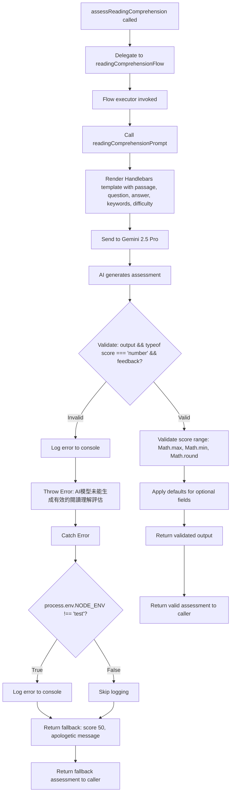
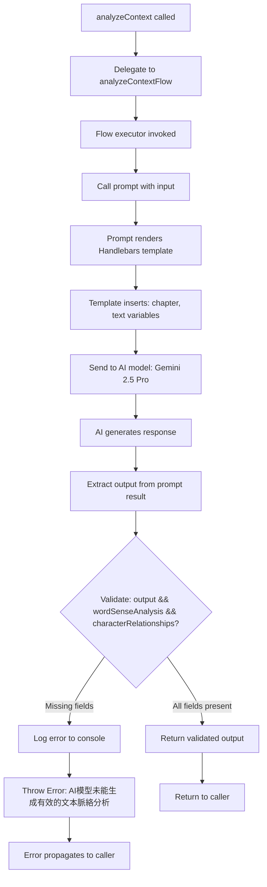
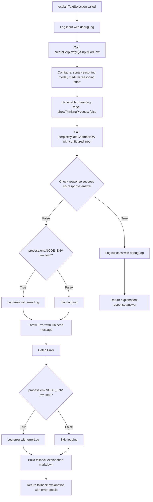
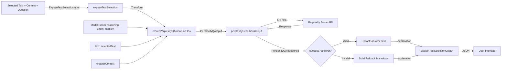

```mermaid
graph LR
    UserReading[User Reading Novel] -- text + chapter --> APICall[analyzeContext call]

    APICall -- ContextAnalysisInput --> FlowEntry[analyzeContextFlow]

    FlowEntry -- input --> PromptInvoke[prompt invocation]
    Template[Handlebars Template] --> PromptInvoke
    PromptInvoke -- Rendered Prompt --> AIModel[Gemini 2.5 Pro Model]

    AIModel -- AI Response --> OutputExtract[Extract output]
    OutputSchema[ContextAnalysisOutputSchema] --> Validation[Schema Validation]
    OutputExtract -- output object --> Validation

    Validation -- Valid --> Structure[Structured Output]
    Structure -- wordSenseAnalysis --> MarkdownField1[Word Analysis Markdown]
    Structure -- characterRelationships --> MarkdownField2[Relationships Markdown]

    MarkdownField1 --> FinalOutput[ContextAnalysisOutput]
    MarkdownField2 --> FinalOutput

    Validation -- Invalid --> ErrorThrow[Throw Error]
    ErrorThrow --> ErrorHandling[Caller Error Handling]

    FinalOutput --> UIRender[UI Markdown Rendering]
```

# Module: `daily-reading-comprehension`

## 1. Module Summary

The `daily-reading-comprehension` module implements an AI-powered assessment system for evaluating user responses to daily morning reading comprehension tasks from "Dream of the Red Chamber" using GenKit with Gemini 2.5 Pro. This module assesses comprehension depth, accuracy, literary insight, and keyword coverage to generate numerical scores (0-100), constructive feedback in Traditional Chinese, and detailed analysis with improvement suggestions. The flow uses difficulty-adaptive scoring criteria to ensure fair evaluation across easy, medium, and hard tasks while providing fallback assessments when AI services are unavailable.

## 2. Module Dependencies

* **Internal Dependencies:**
  * `@/ai/genkit` - Core GenKit instance (`ai`) providing `definePrompt` and `defineFlow` APIs
* **External Dependencies:**
  * `genkit` - GenKit framework providing `z` (Zod) schema validation re-export

## 3. Public API / Exports

* `assessReadingComprehension(input: ReadingComprehensionInput): Promise<ReadingComprehensionOutput>` - Main async function for grading reading comprehension submissions
* `ReadingComprehensionInput` - TypeScript type for input containing passage, question, answer, keywords, and difficulty
* `ReadingComprehensionOutput` - TypeScript type for output containing score, feedback, covered/missed points, and detailed analysis

## 4. Code File Breakdown

### 4.1. `daily-reading-comprehension.ts`

* **Purpose:** This server-side file implements educational assessment AI using GenKit's prompt engineering to evaluate student comprehension of classical Chinese literature passages. The module follows a weighted rubric (Accuracy 30%, Completeness 25%, Depth 25%, Literary Literacy 20%) with difficulty-adaptive scoring where easy tasks are more lenient (70+ for basic correctness) while hard tasks require deep analysis for similar scores. By generating both quantitative scores and qualitative feedback, this flow enables the daily task system to provide meaningful learning experiences with actionable improvement guidance.

* **Functions:**
    * `assessReadingComprehension(input: ReadingComprehensionInput): Promise<ReadingComprehensionOutput>` - Public async function serving as the API entry point that delegates to internal `readingComprehensionFlow` with provided input. Returns Promise directly without additional processing. Throws errors propagated from the underlying flow.

* **Key Classes / Constants / Variables:**
    * `ReadingComprehensionInputSchema`: Zod object schema with 5 required fields:
      - `passage` (string): Text passage from Red Mansion providing context for answer evaluation
      - `question` (string): Comprehension question asked to user, determines if answer is on-topic
      - `userAnswer` (string): User's written response to evaluate for accuracy, depth, and insight
      - `expectedKeywords` (string array): Key concepts/terms for complete answers, assesses coverage
      - `difficulty` (enum: 'easy' | 'medium' | 'hard'): Task difficulty affecting scoring criteria and feedback tone

    * `ReadingComprehensionInput`: Exported TypeScript type inferred from input schema.

    * `ReadingComprehensionOutputSchema`: Zod object schema with 5 required fields:
      - `score` (number, 0-100): Overall comprehension score based on rubric (accuracy, completeness, depth, keyword coverage)
      - `feedback` (string): Constructive Traditional Chinese feedback (encouraging, educational tone)
      - `keyPointsCovered` (string array): List of keywords/points user successfully addressed
      - `keyPointsMissed` (string array): Important points user didn't mention, guides improvement
      - `detailedAnalysis` (string): Markdown-formatted detailed evaluation (200-300 chars) with strengths, improvement suggestions, and extension reading recommendations

    * `ReadingComprehensionOutput`: Exported TypeScript type inferred from output schema.

    * `readingComprehensionPrompt`: GenKit prompt definition with:
      - `name: 'readingComprehensionPrompt'`
      - Handlebars template instructing AI as professional Red Mansion literature teacher
      - Variables: `{{{passage}}}`, `{{{question}}}`, `{{{userAnswer}}}`, `{{#each expectedKeywords}}`, `{{difficulty}}`
      - Rubric: Accuracy (30%), Completeness (25%), Depth (25%), Literary Literacy (20%)
      - Difficulty-specific guidance: easy (70+ for 1-2 keywords), medium (70+ for accuracy + most keywords + analysis), hard (70+ for deep analysis + full coverage + literary insight)
      - Output requirements: score (0-100 integer), feedback (50-100 chars encouragement), keyPointsCovered/Missed arrays, detailedAnalysis (200-300 chars Markdown with bold highlights, list format suggestions, extension reading)

    * `readingComprehensionFlow`: GenKit flow definition executing assessment:
      - Invokes `readingComprehensionPrompt(input)`
      - Validates output completeness (checks `score` is number and `feedback` exists)
      - Throws Chinese error if validation fails
      - Validates score within 0-100 range using `Math.max(0, Math.min(100, Math.round(output.score)))`
      - Provides defaults for optional fields if AI returns incomplete output
      - Catches errors (logged only in non-test environments)
      - Returns fallback assessment on error: score 50, apologetic feedback, empty covered points, all keywords as missed, system message analysis

## 5. System and Data Flow

### 5.1. System Flowchart (Control Flow)



### 5.2. Data Flow Diagram (Data Transformation)

```mermaid
graph LR
    TaskData[Daily Task Data] -- passage, question, userAnswer, keywords, difficulty --> Input[ReadingComprehensionInput]
    Input --> Flow[readingComprehensionFlow]

    Flow -- input --> Prompt[readingComprehensionPrompt]
    Template[Handlebars Template + Rubric] --> Prompt
    Prompt -- Rendered Prompt --> AI[Gemini 2.5 Pro]

    AI -- AI Response --> Extract[Extract output]
    Extract --> Validate[Validation]

    Validate -- Valid --> ScoreValidation[Clamp score 0-100]
    ScoreValidation --> DefaultApplication[Apply defaults]

    DefaultApplication -- score --> NumericScore[score: number]
    DefaultApplication -- feedback --> FeedbackText[feedback: string]
    DefaultApplication -- keyPointsCovered --> CoveredArray[covered: string[]]
    DefaultApplication -- keyPointsMissed --> MissedArray[missed: string[]]
    DefaultApplication -- detailedAnalysis --> AnalysisMarkdown[analysis: markdown]

    NumericScore --> Output[ReadingComprehensionOutput]
    FeedbackText --> Output
    CoveredArray --> Output
    MissedArray --> Output
    AnalysisMarkdown --> Output

    Validate -- Invalid --> ErrorPath[Error Handling]
    ErrorPath --> FallbackBuilder[Build Fallback Assessment]
    FallbackBuilder -- score: 50 --> Output

    Output --> TaskService[DailyTaskService]
    TaskService --> UserDisplay[User Dashboard]
```

## 6. Usage Example & Testing

* **Usage:**
```typescript
import { assessReadingComprehension } from '@/ai/flows/daily-reading-comprehension';

const result = await assessReadingComprehension({
  passage: "寶玉聽了這話，不覺將前情盡忘，喜不自禁...",
  question: "寶玉對黛玉的態度在這段中有什麼轉變？",
  userAnswer: "寶玉聽到黛玉的話後非常高興，完全忘記了之前的不快。",
  expectedKeywords: ["態度轉變", "喜不自禁", "前情盡忘"],
  difficulty: "medium"
});

console.log(result.score); // 85
console.log(result.feedback); // "您的回答準確把握了寶玉的情緒變化..."
console.log(result.keyPointsCovered); // ["喜不自禁", "前情盡忘"]
console.log(result.keyPointsMissed); // ["態度轉變"]
```

* **Testing:** This module is tested through the DailyTaskService integration tests which invoke this assessment function with various answer qualities and difficulty levels. No dedicated unit test file exists for this flow. The GenKit development UI (`npm run genkit:dev`) allows manual testing with sample passages and answers. Testing strategy includes: verifying score ranges (0-100), confirming difficulty-adaptive scoring (easy tasks score higher for equivalent answers), validating markdown formatting in detailed analysis, checking fallback behavior by forcing AI errors, and ensuring keyword tracking accuracy.


# Module: `context-aware-analysis`

## 1. Module Summary

The `context-aware-analysis` module implements a GenKit-based AI flow that provides comprehensive literary analysis of text passages from "Dream of the Red Chamber" by performing word sense disambiguation and character relationship mapping. This module helps students understand difficult classical Chinese vocabulary within specific chapter contexts while simultaneously tracking complex character dynamics and interactions. The flow generates dual-aspect analysis (vocabulary and relationships) formatted in Traditional Chinese markdown for rich text display in the educational interface.

## 2. Module Dependencies

* **Internal Dependencies:**
  * `@/ai/genkit` - Core GenKit instance (`ai`) providing `definePrompt` and `defineFlow` APIs for AI orchestration
* **External Dependencies:**
  * `genkit` - GenKit framework providing `z` (Zod) schema validation re-export and flow definition utilities

## 3. Public API / Exports

* `analyzeContext(input: ContextAnalysisInput): Promise<ContextAnalysisOutput>` - Main async function delegating to `analyzeContextFlow` for comprehensive text analysis
* `ContextAnalysisInput` - TypeScript type for input parameters containing text passage and chapter information
* `ContextAnalysisOutput` - TypeScript type for output containing word sense analysis and character relationship descriptions

## 4. Code File Breakdown

### 4.1. `context-aware-analysis.ts`

* **Purpose:** This server-side file implements intelligent text analysis by combining two critical aspects of classical Chinese literature comprehension: lexical understanding (word sense disambiguation for archaic terms) and narrative understanding (character relationship tracking). The module uses GenKit's prompt engineering and flow definition patterns to structure AI requests with explicit schema validation, ensuring type-safe inputs and outputs. By analyzing vocabulary and relationships simultaneously, this flow provides holistic context-aware assistance that adapts to the user's current reading position in the novel's 120 chapters.

* **Functions:**
    * `analyzeContext(input: ContextAnalysisInput): Promise<ContextAnalysisOutput>` - Public async function serving as the entry point for context analysis requests. Simply delegates execution to the internal `analyzeContextFlow` with the provided input and returns the Promise directly. Does not perform additional validation or transformation; acts as a clean API boundary. Throws errors propagated from the underlying flow.

* **Key Classes / Constants / Variables:**
    * `ContextAnalysisInputSchema`: Zod object schema defining two required string fields:
      - `text` (string): Current passage being read by the student, should be a meaningful segment with sufficient context for analysis
      - `chapter` (string): Current chapter number or title being read, used for broader narrative context
      Schema includes detailed descriptions guiding AI on expected input semantics.

    * `ContextAnalysisInput`: Exported TypeScript type inferred from input schema using `z.infer<typeof ContextAnalysisInputSchema>`. Ensures compile-time type safety for function parameters throughout the application.

    * `ContextAnalysisOutputSchema`: Zod object schema defining two required string fields, both markdown-formatted:
      - `wordSenseAnalysis` (string): Detailed analysis of difficult words, phrases, literary devices with classical Chinese terminology explanations, historical context, and literary significance. Must use markdown formatting (## headers, - lists, **bold**, *italic*)
      - `characterRelationships` (string): Analysis of character relationships and interactions relevant to current passage, describing family connections, romantic relationships, social hierarchies, and conflicts. Must use markdown formatting for clear structure
      Schema descriptions explicitly require Traditional Chinese markdown output with specific formatting elements.

    * `ContextAnalysisOutput`: Exported TypeScript type inferred from output schema. Defines the contract for AI-generated analysis results.

    * `prompt`: GenKit prompt definition created via `ai.definePrompt()` with configuration object:
      - `name: 'contextAnalysisPrompt'` - Unique identifier for the prompt template
      - `input: {schema: ContextAnalysisInputSchema}` - Binds input validation schema
      - `output: {schema: ContextAnalysisOutputSchema}` - Binds output validation schema
      - `prompt: string` (multiline template) - Handlebars-style template instructing AI to assist students reading chapter `{{{chapter}}}` with text `{{{text}}}`, requesting word sense analysis for difficult terms and character relationship descriptions including plot summaries. Explicitly requests Traditional Chinese markdown formatting with examples (## 標題, - 項目, **重要文字**, *強調文字*).

    * `analyzeContextFlow`: GenKit flow definition created via `ai.defineFlow()` with:
      - `name: 'analyzeContextFlow'` - Unique flow identifier for tracking and debugging
      - `inputSchema: ContextAnalysisInputSchema` - Schema for validating incoming requests
      - `outputSchema: ContextAnalysisOutputSchema` - Schema for validating AI responses
      - `async (input) => {...}` - Flow executor function that:
        1. Invokes `prompt(input)` to generate AI response
        2. Validates output completeness (checks for `wordSenseAnalysis` and `characterRelationships`)
        3. Logs error and throws Chinese error message if validation fails
        4. Returns validated output object
      Flow is private (not exported) and only accessed through public `analyzeContext()` function.

## 5. System and Data Flow

### 5.1. System Flowchart (Control Flow)



### 5.2. Data Flow Diagram (Data Transformation)



## 6. Usage Example & Testing

* **Usage:**
```typescript
import { analyzeContext } from '@/ai/flows/context-aware-analysis';

const result = await analyzeContext({
  text: "寶玉聽了，喜不自禁，連說：「有趣，有趣！」",
  chapter: "第三回"
});

console.log(result.wordSenseAnalysis);
// ## 詞語分析\n- **喜不自禁**: 高興得控制不住自己...

console.log(result.characterRelationships);
// ## 人物關係\n- 賈寶玉與林黛玉初次相見...
```

* **Testing:** This module is tested through GenKit's development UI (`npm run genkit:dev`) where the `analyzeContextFlow` is registered and can be executed with test inputs. No dedicated unit test file exists for this flow. Integration testing occurs through the reading interface API routes that consume this analysis function. Developers can verify schema validation by providing incomplete inputs and confirming error messages. Manual testing involves comparing AI-generated analysis quality against sample passages from the novel to ensure literary accuracy and markdown formatting compliance.


# Module: `explain-text-selection`

## 1. Module Summary

The `explain-text-selection` module provides AI-powered explanations for user-selected text passages from "Dream of the Red Chamber" by processing user questions through the Perplexity AI integration. This module serves as a wrapper flow that transforms text selection requests into Perplexity Q&A operations, enabling students to receive detailed Traditional Chinese explanations for complex classical Chinese passages with contextual understanding of chapter content. The module implements comprehensive error handling with fallback responses to ensure users always receive meaningful feedback even when the AI service fails.

## 2. Module Dependencies

* **Internal Dependencies:**
  * `@/ai/flows/perplexity-red-chamber-qa` - Core Perplexity integration providing `perplexityRedChamberQA()` function and `createPerplexityQAInputForFlow()` helper
  * `@/lib/terminal-logger` - Logging utilities for debugging (`debugLog`, `errorLog`)
* **External Dependencies:**
  * `zod` - Schema validation library for input/output type safety and runtime validation

## 3. Public API / Exports

* `explainTextSelection(input: ExplainTextSelectionInput): Promise<ExplainTextSelectionOutput>` - Main async function that processes text explanation requests by delegating to Perplexity AI
* `ExplainTextSelectionInput` - TypeScript type for input parameters containing selected text, chapter context, and user question
* `ExplainTextSelectionOutput` - TypeScript type for output containing AI-generated markdown explanation

## 4. Code File Breakdown

### 4.1. `explain-text-selection.ts`

* **Purpose:** This server-side file implements a specialized AI flow for explaining selected text passages from the novel by integrating with the Perplexity Q&A system. It serves as an adapter that converts text selection events (text snippet + user question + chapter context) into properly formatted Perplexity API requests with appropriate model selection and reasoning configuration. The file ensures robust error handling by providing Chinese markdown fallback responses when AI services are unavailable, maintaining user experience continuity.

* **Functions:**
    * `explainTextSelection(input: ExplainTextSelectionInput): Promise<ExplainTextSelectionOutput>` - Async function that accepts selected text, chapter context, and user question, then orchestrates the complete explanation workflow. Internally calls `createPerplexityQAInputForFlow()` with `sonar-reasoning` model and medium reasoning effort, executes `perplexityRedChamberQA()` for AI processing, validates the success status and answer presence, and returns formatted explanation. Throws `Error` with Chinese message if Perplexity response indicates failure. Catches all errors and returns fallback markdown explanation including user's question, apologetic message, troubleshooting suggestions, and error details. Never throws errors to calling code; always returns valid output structure.

* **Key Classes / Constants / Variables:**
    * `ExplainTextSelectionInputSchema`: Zod object schema defining three required string fields:
      - `selectedText` (string): The text snippet selected by the user from the novel
      - `chapterContext` (string): Surrounding chapter content providing contextual information
      - `userQuestion` (string): User's specific question about the selected text in Traditional Chinese
      Used for runtime validation and TypeScript type inference through `z.infer<>`.

    * `ExplainTextSelectionInput`: Exported TypeScript type inferred from input schema. Ensures type safety for function parameters and API contracts.

    * `ExplainTextSelectionOutputSchema`: Zod object schema defining single field:
      - `explanation` (string): AI-generated answer in Markdown format with Traditional Chinese text, structured using headers (##), lists (-), bold (**), and italic (*) formatting
      Schema description explicitly instructs AI to use markdown elements for content organization.

    * `ExplainTextSelectionOutput`: Exported TypeScript type inferred from output schema. Defines the contract for function return values.

## 5. System and Data Flow

### 5.1. System Flowchart (Control Flow)



### 5.2. Data Flow Diagram (Data Transformation)



## 6. Usage Example & Testing

* **Usage:**
```typescript
import { explainTextSelection } from '@/ai/flows/explain-text-selection';

const result = await explainTextSelection({
  selectedText: "黛玉聽了，半晌說道：「你心裡自然有我，我心裡也自然有你。」",
  chapterContext: "第三十二回：訴肺腑心迷活寶玉...",
  userQuestion: "這段對話體現了寶黛之間怎樣的感情？"
});
console.log(result.explanation); // Markdown formatted Chinese explanation
```

* **Testing:** This module does not have dedicated unit tests as it primarily serves as an integration wrapper. Integration testing occurs through the `/src/app/api/` routes that consume this flow (likely in reading interface endpoints). Manual testing is performed using the GenKit development UI (`npm run genkit:dev`) or by triggering text selection events in the reading interface. The Perplexity integration is tested through `perplexity-red-chamber-qa` module tests. Error handling logic can be validated by mocking `perplexityRedChamberQA` to return failure responses.

