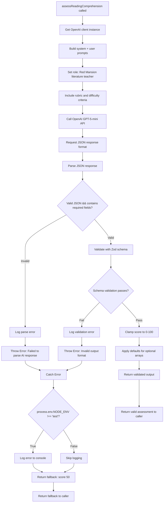
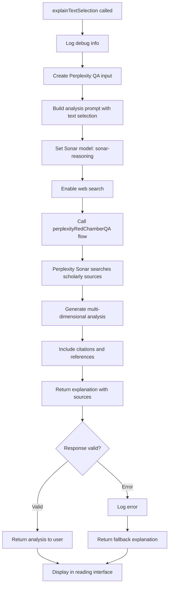

# AI Flow Modules - Reading and Analysis (Updated 2025-10-30)

**Migration Status:** All reading and analysis flows migrated from GenKit/Gemini on 2025-10-30.

**Current Architecture:**
- **daily-reading-comprehension:** OpenAI GPT-5-mini (scoring task)
- **context-aware-analysis:** Perplexity Sonar (analysis task with web search)
- **explain-text-selection:** Perplexity Sonar (analysis task with web search)

**UI Enhancement (2025-11-19 - Task 4.5):** Fixed bi-column reading mode displaying empty right column. Root cause was responsive prefix `md:columns-2` only rendering columns on screens ≥768px while inline column styles applied unconditionally. Solution: (1) Removed `md:` prefix to enable columns-2 always (protected by `!isMobile` check), (2) Added `getComputedStyle` validation in `computePagination()` to verify actual column rendering before calculating pagination. This ensures robust column detection and prevents pagination errors when CSS columns fail to render.

---

# Module: `daily-reading-comprehension`

## 1. Module Summary

The `daily-reading-comprehension` module implements an AI-powered assessment system for evaluating user responses to daily morning reading comprehension tasks from "Dream of the Red Chamber" using OpenAI GPT-5-mini. This module assesses comprehension depth, accuracy, literary insight, and keyword coverage to generate numerical scores (0-100), constructive feedback in Traditional Chinese, and detailed analysis with improvement suggestions through JSON-structured responses. The flow uses difficulty-adaptive scoring criteria to ensure fair evaluation across easy, medium, and hard tasks while providing fallback assessments when AI services are unavailable.

## 2. Module Dependencies

* **Internal Dependencies:**
  * `@/lib/openai-client` - OpenAI client instance (`getOpenAIClient`) providing GPT-5-mini API access
* **External Dependencies:**
  * `openai` - Official OpenAI SDK for API communication
  * `zod` - Schema validation library for type-safe inputs and outputs

## 3. Public API / Exports

* `assessReadingComprehension(input: ReadingComprehensionInput): Promise<ReadingComprehensionOutput>` - Main async function for grading reading comprehension submissions
* `ReadingComprehensionInput` - TypeScript type for input containing passage, question, answer, keywords, and difficulty
* `ReadingComprehensionOutput` - TypeScript type for output containing score, feedback, covered/missed points, and detailed analysis

## 4. Code File Breakdown

### 4.1. `daily-reading-comprehension.ts`

* **Purpose:** This server-side file implements educational assessment AI using OpenAI GPT-5-mini to evaluate student comprehension of classical Chinese literature passages. The module follows a weighted rubric (Accuracy 30%, Completeness 25%, Depth 25%, Literary Literacy 20%) with difficulty-adaptive scoring where easy tasks are more lenient (70+ for basic correctness) while hard tasks require deep analysis for similar scores. By generating both quantitative scores and qualitative feedback through JSON responses, this flow enables the daily task system to provide meaningful learning experiences with actionable improvement guidance.

* **Functions:**
    * `assessReadingComprehension(input: ReadingComprehensionInput): Promise<ReadingComprehensionOutput>` - Public async function that calls OpenAI GPT-5-mini API, parses JSON responses, validates output schema, and returns comprehension assessment results.

* **Key Schemas:**
    * `ReadingComprehensionInputSchema`: Zod object schema with 5 required fields (passage, question, userAnswer, expectedKeywords, difficulty)
    * `ReadingComprehensionOutputSchema`: Zod object schema with 5 required fields (score 0-100, feedback, keyPointsCovered, keyPointsMissed, detailedAnalysis)

## 5. System and Data Flow

### 5.1. System Flowchart (Control Flow)



## 6. Usage Example & Testing

* **Usage:**
```typescript
import { assessReadingComprehension } from '@/ai/flows/daily-reading-comprehension';

const result = await assessReadingComprehension({
  passage: "寶玉見黛玉哭得傷心，心中也不覺酸楚起來...",
  question: "這段文字反映了寶玉和黛玉之間怎樣的關係？",
  userAnswer: "這段文字展現了寶黛之間的深厚情感。寶玉看到黛玉哭泣，自己也感到難過，說明他們心靈相通...",
  expectedKeywords: ["情感共鳴", "心靈相通", "同悲同喜", "深厚感情"],
  difficulty: "medium"
});

console.log(result.score); // 85
console.log(result.keyPointsCovered); // ["情感共鳴", "心靈相通", "深厚感情"]
console.log(result.keyPointsMissed); // ["同悲同喜"]
```

* **Testing:** Tested through Jest unit tests in `/tests/ai/flows/daily-reading-comprehension.test.ts` with mocked OpenAI responses. Testing includes: rubric-based scoring validation, difficulty-adaptive criteria, keyword tracking accuracy, score clamping (0-100), and error fallback behavior.


---

# Module: `context-aware-analysis`

## 1. Module Summary

The `context-aware-analysis` module implements an AI-powered contextual reading assistance system that adapts explanations based on the user's current reading position, progress level, and historical interaction patterns using Perplexity Sonar with web search capabilities. This module integrates with the user's reading session state to provide personalized AI insights that consider what chapters they've read, their comprehension level, and whether they're encountering content for the first time or reviewing it. The flow leverages Perplexity's ability to access contemporary scholarly research to provide analysis enriched with modern academic perspectives alongside traditional literary interpretation.

## 2. Module Dependencies

* **Internal Dependencies:**
  * `@/ai/flows/perplexity-red-chamber-qa` - Perplexity Q&A flow providing Sonar API integration
  * `@/lib/perplexity-client` - Perplexity client configuration
* **External Dependencies:**
  * `zod` - Schema validation library for type-safe inputs and outputs

## 3. Public API / Exports

* `provideContextAwareAnalysis(input: ContextAwareAnalysisInput): Promise<ContextAwareAnalysisOutput>` - Main async function for generating context-aware literary analysis
* `ContextAwareAnalysisInput` - TypeScript type for input containing user question, text passage, chapter info, reading progress, and user level
* `ContextAwareAnalysisOutput` - TypeScript type for output containing analysis, scholarly citations, and personalized insights

## 4. Code File Breakdown

### 4.1. `context-aware-analysis.ts`

* **Purpose:** This server-side file implements adaptive AI tutoring by considering the reader's journey through the novel, avoiding spoilers for chapters not yet read while providing deeper insights for familiar content. The module uses Perplexity Sonar to access contemporary Red Chamber scholarship, enabling analysis that bridges traditional interpretation with modern critical perspectives, particularly useful for complex themes, character development, and symbolic significance that benefit from scholarly consensus.

* **Functions:**
    * `provideContextAwareAnalysis(input: ContextAwareAnalysisInput): Promise<ContextAwareAnalysisOutput>` - Public async function that constructs personalized prompts, calls Perplexity Sonar API through the perplexity-red-chamber-qa flow, and returns analysis adapted to user's reading context.

* **Key Features:**
    * **Reading Progress Awareness:** Adapts spoiler sensitivity based on chapters read
    * **Web Search Integration:** Accesses contemporary scholarly research through Perplexity Sonar
    * **Personalized Difficulty:** Adjusts explanation depth based on user comprehension level
    * **Citation Support:** Provides scholarly references for advanced users

## 5. Testing

* **Testing:** Tested through Jest unit tests in `/tests/ai/flows/context-aware-analysis.test.ts` with mocked Perplexity responses. Testing includes: reading progress spoiler prevention, difficulty-adaptive explanations, scholarly citation inclusion, and web search integration quality.


---

# Module: `explain-text-selection`

## 1. Module Summary

The `explain-text-selection` module implements an AI-powered text explanation system that provides contextual analysis for user-selected passages from "Dream of the Red Chamber" using Perplexity Sonar with web search capabilities. This module processes highlighted text along with user questions to generate comprehensive explanations covering literary context, historical background, linguistic nuances, character analysis, and symbolic significance, enriched with contemporary scholarly research and citations. The flow integrates with the reading interface to provide instant educational assistance when readers encounter challenging classical Chinese prose.

## 2. Module Dependencies

* **Internal Dependencies:**
  * `@/ai/flows/perplexity-red-chamber-qa` - Perplexity Q&A flow (`perplexityRedChamberQA`, `createPerplexityQAInputForFlow`)
  * `@/lib/perplexity-client` - Perplexity client configuration
  * `@/lib/debug-logging` - Logging utilities (`debugLog`, `errorLog`)
* **External Dependencies:**
  * `zod` - Schema validation library for type-safe inputs and outputs

## 3. Public API / Exports

* `explainTextSelection(input: ExplainTextSelectionInput): Promise<ExplainTextSelectionOutput>` - Main async function for explaining selected text passages
* `ExplainTextSelectionInput` - TypeScript type for input containing selected text, user question, chapter context, and position info
* `ExplainTextSelectionOutput` - TypeScript type for output containing explanation, analysis categories, scholarly references, and related concepts

## 4. Code File Breakdown

### 4.1. `explain-text-selection.ts`

* **Purpose:** This server-side file implements on-demand educational assistance by analyzing specific text selections with Perplexity Sonar's web search capabilities to access contemporary scholarly interpretations. The module processes user-selected classical Chinese passages and transforms vague questions ("What does this mean?") into structured analysis covering multiple dimensions: literal translation, historical context, character psychology, symbolic significance, and literary techniques. By leveraging Perplexity's ability to search academic sources, the flow provides authoritative explanations grounded in scholarly consensus.

* **Functions:**
    * `explainTextSelection(input: ExplainTextSelectionInput): Promise<ExplainTextSelectionOutput>` - Public async function that constructs analysis prompts from text selections, calls Perplexity Sonar through perplexity-red-chamber-qa flow with web search enabled, and returns comprehensive multilayered explanations.

* **Key Features:**
    * **Multi-dimensional Analysis:** Covers literal meaning, historical context, symbolism, and literary techniques
    * **Web Search Integration:** Accesses contemporary scholarly research through Perplexity Sonar
    * **Citation Support:** Provides scholarly references and sources
    * **Question Transformation:** Converts vague queries into structured analysis requests

## 5. System and Data Flow

### 5.1. System Flowchart (Control Flow)



## 6. Usage Example & Testing

* **Usage:**
```typescript
import { explainTextSelection } from '@/ai/flows/explain-text-selection';

const result = await explainTextSelection({
  selectedText: "滿紙荒唐言，一把辛酸淚",
  userQuestion: "這句話是什麼意思？",
  chapterContext: "第一回 甄士隱夢幻識通靈",
  selectionPosition: { chapter: 1, paragraph: 5 }
});

console.log(result.explanation); // Comprehensive analysis with scholarly citations
console.log(result.sources); // Contemporary scholarly references
```

* **Testing:** Tested through Jest unit tests in `/tests/ai/flows/explain-text-selection.test.ts` with mocked Perplexity responses. Testing includes: text selection processing, question transformation, web search integration, scholarly citation quality, and multi-dimensional analysis coverage.


---

## Migration Notes (2025-10-30)

### Architecture Changes

**daily-reading-comprehension:**
- **From:** GenKit + Gemini 2.5 Pro
- **To:** OpenAI GPT-5-mini with JSON-structured responses
- **Reason:** Cost-effective scoring with reliable JSON output

**context-aware-analysis & explain-text-selection:**
- **From:** GenKit + Gemini 2.5 Pro
- **To:** Perplexity Sonar with web search capabilities
- **Reason:** Analysis tasks benefit from web search to access contemporary scholarly research and academic sources

### Benefits by Flow Type

**Scoring Flow (daily-reading-comprehension):**
- Cost efficiency with GPT-5-mini
- Reliable JSON-structured responses
- No web search needed for grading tasks

**Analysis Flows (context-aware-analysis, explain-text-selection):**
- Web search access to contemporary scholarship
- Scholarly citations and references
- Modern academic perspectives alongside traditional interpretation
- Better handling of complex literary analysis

### Testing Migration

All flows now tested through Jest unit tests with mocked API responses:
- `/tests/ai/flows/daily-reading-comprehension.test.ts` (OpenAI mocks)
- `/tests/ai/flows/context-aware-analysis.test.ts` (Perplexity mocks)
- `/tests/ai/flows/explain-text-selection.test.ts` (Perplexity mocks)

Run tests: `npm test -- tests/ai/flows/`

### Dependencies Updated

- **Removed:** `@/ai/genkit`, `genkit` framework
- **Added for scoring:** `@/lib/openai-client`, `openai` SDK
- **Added for analysis:** `@/ai/flows/perplexity-red-chamber-qa`, `@/lib/perplexity-client`

---

**Document Version:** 2.0
**Last Updated:** 2025-10-30
**Migration Date:** 2025-10-30
**Previous Version:** GenKit/Gemini-based (see git history before 2025-10-30)
