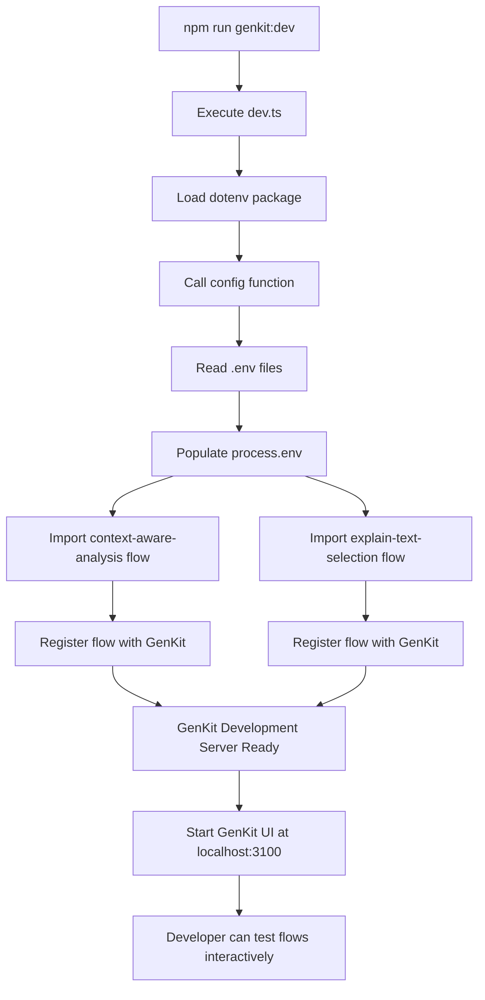
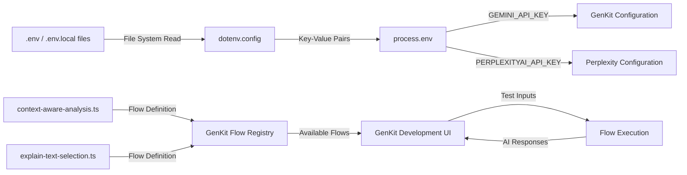

# Module: `dev`

## 1. Module Summary

The `dev` module serves as the development server entry point for GenKit AI flows, initializing the local testing environment and registering active AI flows for interactive development and debugging. This module loads environment variables from `.env` files, imports currently implemented AI flows to make them available in the GenKit development UI, and provides commented references to deprecated or planned flows for development tracking. The module is exclusively used during development via the `npm run genkit:dev` command and is not included in production builds.

## 2. Module Dependencies

* **Internal Dependencies:**
  * `@/ai/flows/context-aware-analysis` - AI flow for contextual text analysis based on reading position and user progress
  * `@/ai/flows/explain-text-selection` - AI flow for explaining selected text passages with user-provided questions
* **External Dependencies:**
  * `dotenv` - Environment variable loader for accessing `.env.local` configuration during development

## 3. Public API / Exports

This module has no exports. It serves as a side-effect module that registers AI flows with GenKit's development server through import statements.

## 4. Code File Breakdown

### 4.1. `dev.ts`

* **Purpose:** This file acts as the bootstrapping configuration for GenKit's development server, providing a centralized location to manage which AI flows are active and testable during development. By consolidating flow imports in a single file, developers can easily enable or disable flows for testing without modifying multiple configuration files, while commented imports serve as documentation for flows that have been removed or are pending implementation. The dotenv initialization at the file's start ensures that environment variables (like `GEMINI_API_KEY` and `PERPLEXITYAI_API_KEY`) are loaded before any AI flow modules attempt to access them, preventing configuration errors during development.

* **Functions:**
    * None - This module contains only import statements and comments. All functionality is provided through side effects of importing other modules.

* **Key Classes / Constants / Variables:**
    * `config`: Imported function from `dotenv` package, invoked immediately via `config()` to load environment variables from `.env`, `.env.local`, and other dotenv-supported files into `process.env`. This ensures API keys and configuration values are available to AI flows during development.

    * **Active Flow Imports** (2 flows currently enabled):
      - `@/ai/flows/context-aware-analysis.ts`: Contextual AI analysis flow that adapts based on user's current reading position, progress level, and historical interaction patterns
      - `@/ai/flows/explain-text-selection.ts`: Text explanation flow that provides detailed analysis of user-selected passages with Perplexity AI integration

    * **Deprecated Flow Comments** (5 flows removed):
      - `generate-special-topic-framework.ts`: Removed - not currently in use
      - `learning-analysis.ts`: Removed - not currently in use
      - `grounded-red-chamber-qa.ts`: Removed - migrated to Perplexity AI
      - `generate-goal-suggestions.ts`: Removed - not currently in use
      - `ai-companion-guidance.ts`: Removed - not currently in use
      - `connect-themes-to-modern-contexts.ts`: Removed - not currently in use

## 5. System and Data Flow

### 5.1. System Flowchart (Control Flow)



### 5.2. Data Flow Diagram (Data Transformation)



## 6. Usage Example & Testing

* **Usage:**
```bash
# Start the GenKit development server
npm run genkit:dev

# GenKit will execute dev.ts, which loads environment variables and imports flows
# Access the development UI at http://localhost:3100
# Select and test any registered AI flow interactively
```

* **Testing:** This module is not directly testable as it serves as a development server configuration entry point with no exported functions. Testing occurs through the GenKit development UI where developers can:
  1. Access `http://localhost:3100` after running `npm run genkit:dev`
  2. Select a registered flow (e.g., "explain-text-selection" or "context-aware-analysis")
  3. Provide test inputs matching the flow's schema
  4. Execute the flow and inspect AI responses, errors, and execution traces
  5. Verify environment variables are correctly loaded by checking if AI models respond without authentication errors

The effectiveness of this module is validated by whether the GenKit UI successfully loads and displays all imported flows with functional AI model connections.
