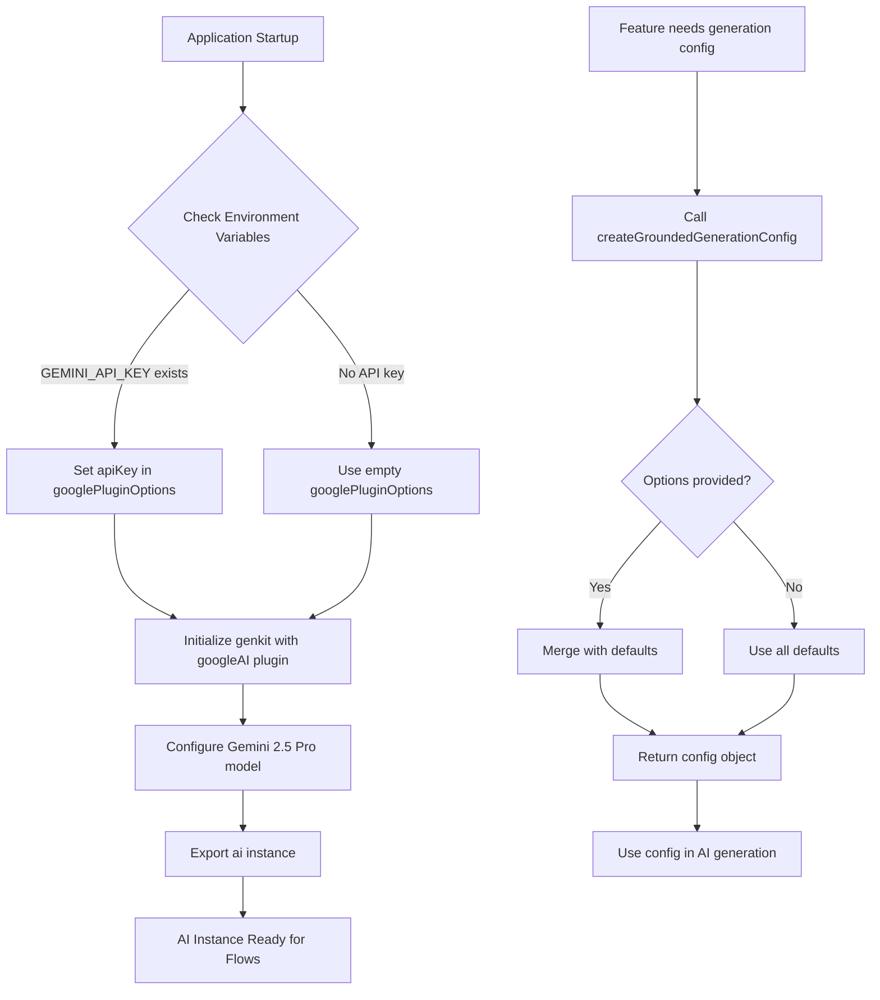
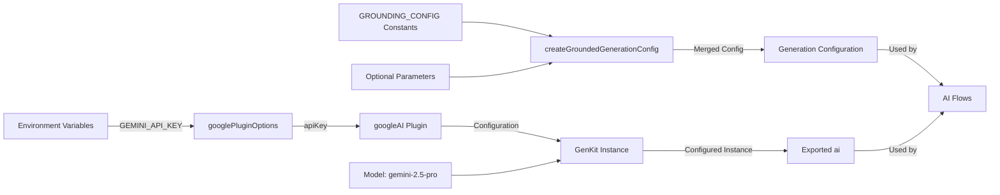

# Module: `genkit`

## 1. Module Summary

The `genkit` module serves as the core AI configuration foundation for the Red Mansion learning platform, initializing the Google GenKit framework with Gemini 2.5 Pro model capabilities. This module provides centralized AI configuration, grounding support for web-search enhanced responses, and reusable generation settings that power all AI-driven educational features including text analysis, character insights, and literary comprehension tasks. The module ensures consistent AI behavior across the application by exposing a single configured AI instance and standardized generation configuration helpers.

## 2. Module Dependencies

* **Internal Dependencies:** None (this is a foundational configuration module with no internal dependencies)
* **External Dependencies:**
  * `genkit` - Core GenKit framework for AI orchestration and flow management
  * `@genkit-ai/googleai` - Google AI plugin providing access to Gemini models

## 3. Public API / Exports

* `ai`: The configured GenKit instance with Gemini 2.5 Pro model and Google AI plugin integration
* `GROUNDING_CONFIG`: Configuration constants object defining default parameters for grounded AI responses including search result limits, temperature, token limits, timeouts, and citation parsing settings
* `createGroundedGenerationConfig(options?)`: Factory function that generates AI generation configuration with optional customization of temperature, max output tokens, and grounding enablement

## 4. Code File Breakdown

### 4.1. `genkit.ts`

* **Purpose:** This file establishes the primary AI infrastructure by configuring GenKit with Google's Gemini 2.5 Pro model, which is specifically chosen for its superior performance with classical Chinese text processing. It centralizes all AI configuration to ensure consistency across diverse educational features while providing flexible generation settings through the grounding configuration helpers. The file explicitly restricts API key access to server-side execution to prevent credential leakage in client bundles.

* **Functions:**
    * `createGroundedGenerationConfig(options?: { temperature?: number; maxOutputTokens?: number; enableGrounding?: boolean }): object` - Generates a standardized AI generation configuration object by accepting optional parameter overrides for temperature control (defaults to 0.7), maximum output token limits (defaults to 2048), and grounding enablement flag. Returns a configuration object containing temperature and maxOutputTokens properties suitable for GenKit generation calls. This function does not throw errors but applies sensible defaults when options are omitted.

* **Key Classes / Constants / Variables:**
    * `googlePluginOptions`: Private configuration object (Record<string, any>) constructed from environment variables to authenticate the Google AI plugin. Conditionally includes `apiKey` property if `GEMINI_API_KEY` environment variable exists, otherwise remains empty to allow fallback authentication methods like `GOOGLE_APPLICATION_CREDENTIALS`.

    * `ai`: Exported GenKit instance configured with Google AI plugin and Gemini 2.5 Pro model. This is the primary AI client used throughout the application for all GenKit-based AI operations. Configured with model identifier `googleai/gemini-2.5-pro` to ensure enhanced Chinese literature processing capabilities.

    * `GROUNDING_CONFIG`: Exported constant object (marked as `const` assertion for type safety) containing five key configuration parameters:
      - `DEFAULT_MAX_SEARCH_RESULTS: 10` - Maximum number of web search results to include in grounded responses
      - `DEFAULT_TEMPERATURE: 0.7` - Default creativity/randomness setting for AI generation (0.0 = deterministic, 1.0 = highly creative)
      - `DEFAULT_MAX_OUTPUT_TOKENS: 2048` - Default maximum length of AI-generated responses in tokens
      - `RESPONSE_TIMEOUT_SECONDS: 30` - Maximum wait time for AI response generation before timeout
      - `ENABLE_CITATION_PARSING: true` - Flag to enable automatic extraction and formatting of citations in grounded responses

## 5. System and Data Flow

### 5.1. System Flowchart (Control Flow)



### 5.2. Data Flow Diagram (Data Transformation)



## 6. Usage Example & Testing

* **Usage:**
```typescript
import { ai, createGroundedGenerationConfig } from '@/ai/genkit';

// Use the configured AI instance in a flow
const config = createGroundedGenerationConfig({
  temperature: 0.5,
  maxOutputTokens: 1500
});
const result = await ai.generate({ prompt: "Explain this text...", ...config });
```

* **Testing:** This module is a configuration module without unit tests. Integration testing occurs through the AI flows that consume this configuration (e.g., `explain-text-selection.ts`, `context-aware-analysis.ts`). The GenKit development server (`npm run genkit:dev`) provides interactive testing of the AI instance configuration through the GenKit UI at `http://localhost:3100`.
