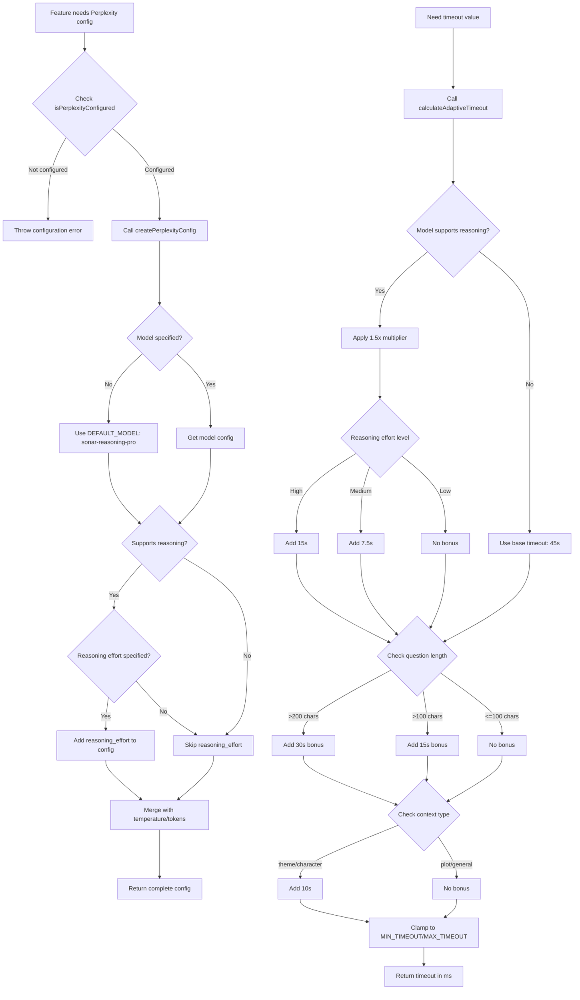
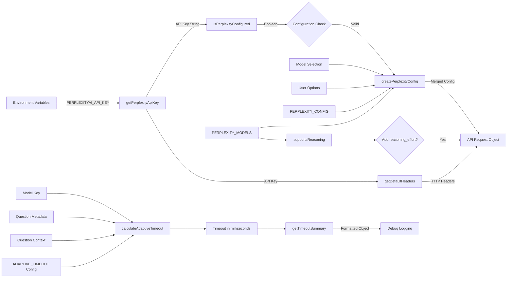

# Module: `perplexity-config`

## 1. Module Summary

The `perplexity-config` module provides comprehensive configuration infrastructure for integrating Perplexity Sonar API into the Red Mansion learning platform, enabling AI-powered question answering with real-time web search grounding and enhanced reasoning capabilities. This module defines three distinct Sonar model configurations (pro, reasoning, reasoning-pro), implements an adaptive timeout calculation algorithm that adjusts based on question complexity and model type, and exports 15+ helper functions for model validation, configuration generation, and timeout management. The configuration system ensures optimal performance by matching model capabilities to question requirements while maintaining reliability through intelligent timeout and retry strategies.

## 2. Module Dependencies

* **Internal Dependencies:** None (this is a configuration module with no internal dependencies)
* **External Dependencies:** None (pure TypeScript configuration and utility functions)

## 3. Public API / Exports

* `PERPLEXITY_MODELS`: Configuration object defining three Sonar model variants with their capabilities, token limits, and reasoning support flags
* `PerplexityModelKey`: TypeScript type for valid model identifiers ('sonar-pro' | 'sonar-reasoning' | 'sonar-reasoning-pro')
* `REASONING_EFFORTS`: Configuration object defining three reasoning intensity levels (low, medium, high) with display metadata
* `ReasoningEffort`: TypeScript type for valid reasoning effort levels ('low' | 'medium' | 'high')
* `PERPLEXITY_CONFIG`: Master configuration object containing 40+ settings for API endpoints, defaults, timeouts, streaming, citations, and error handling
* `QUESTION_CONTEXTS`: Configuration object defining four question context types for specialized prompting (character, plot, theme, general)
* `QuestionContext`: TypeScript type for valid question context identifiers
* `ENV_VARS`: Object mapping configuration parameter names to environment variable keys
* `getPerplexityApiKey(): string | undefined` - Retrieves Perplexity API key from environment
* `isPerplexityConfigured(): boolean` - Validates if API key is properly configured
* `getModelConfig(modelKey): ModelConfig` - Returns configuration object for specified model
* `supportsReasoning(modelKey): boolean` - Checks if model supports reasoning capabilities
* `getDefaultHeaders(apiKey?): object` - Generates HTTP headers for Perplexity API requests
* `createPerplexityConfig(options?): object` - Factory function generating request configuration for Perplexity API calls
* `calculateAdaptiveTimeout(options): number` - Calculates optimal timeout in milliseconds based on model, reasoning effort, question length, and context
* `getTimeoutSummary(timeout): object` - Formats timeout value into human-readable summary with seconds, minutes, and localized string

## 4. Code File Breakdown

### 4.1. `perplexity-config.ts`

* **Purpose:** This file serves as the comprehensive configuration hub for all Perplexity AI integration, consolidating model capabilities, API settings, timeout algorithms, and utility helpers into a single maintainable source of truth. The module implements sophisticated adaptive timeout logic that prevents premature request cancellation by dynamically calculating timeout values based on question complexity, model reasoning requirements, and context depth. By centralizing all Perplexity-related configuration and validation logic, this module ensures consistent API usage patterns across different features while providing flexibility through multiple configuration helper functions.

* **Functions:**
    * `getPerplexityApiKey(): string | undefined` - Retrieves the Perplexity API key from environment variables using the key name defined in `ENV_VARS.PERPLEXITY_API_KEY` ('PERPLEXITYAI_API_KEY'). Returns the API key string if present, or `undefined` if the environment variable is not set. Does not throw errors; callers must handle undefined case.

    * `isPerplexityConfigured(): boolean` - Validates whether the Perplexity API integration is properly configured by checking if the API key exists and is non-empty after trimming whitespace. Returns `true` if a valid API key is found, `false` otherwise. This is the recommended function to call before attempting any Perplexity API operations.

    * `getModelConfig(modelKey: PerplexityModelKey): ModelConfig` - Looks up and returns the complete configuration object for the specified model key from the `PERPLEXITY_MODELS` constant. Returns an object containing model name, displayName, description, features array, maxTokens limit, and supportsReasoning flag. Does not validate if modelKey exists; TypeScript types enforce valid keys at compile time.

    * `supportsReasoning(modelKey: PerplexityModelKey): boolean` - Convenience function that checks whether the specified model supports advanced reasoning capabilities by accessing the `supportsReasoning` property from the model's configuration. Returns `true` for 'sonar-reasoning' and 'sonar-reasoning-pro', `false` for 'sonar-pro'. Used to conditionally include reasoning_effort parameter in API requests.

    * `getDefaultHeaders(apiKey?: string): object` - Generates the standard HTTP headers required for Perplexity API requests, including Content-Type (application/json), Authorization bearer token (using provided apiKey or falling back to environment variable), and User-Agent identification (RedMansion-Learning-Platform/1.0). Returns an object with three string properties. Does not validate if API key exists; callers should check configuration first.

    * `createPerplexityConfig(options?: { model?: PerplexityModelKey; temperature?: number; maxTokens?: number; reasoningEffort?: ReasoningEffort; enableStreaming?: boolean }): object` - Factory function that constructs a complete Perplexity API request configuration object by merging provided options with intelligent defaults. Applies model-specific maxTokens ceiling (prevents exceeding model limits), conditionally includes reasoning_effort for reasoning-capable models, and sets up streaming based on enableStreaming flag. Returns configuration object with model, temperature, max_tokens, stream, and optionally reasoning_effort properties. Does not throw errors; invalid options are silently replaced with defaults.

    * `calculateAdaptiveTimeout(options: { modelKey: PerplexityModelKey; reasoningEffort?: ReasoningEffort; questionLength?: number; questionContext?: QuestionContext }): number` - Implements sophisticated timeout calculation algorithm that determines optimal request timeout in milliseconds based on multiple factors: base timeout (45s), reasoning multiplier (1.5x for reasoning models), reasoning effort bonuses (+15s for high, +7.5s for medium), question length bonuses (+30s for >200 chars, +15s for >100 chars), and context-specific adjustments (+10s for theme/character contexts). Enforces minimum (30s) and maximum (120s) timeout boundaries. Returns timeout value in milliseconds. This prevents premature timeouts for complex reasoning operations while avoiding excessively long waits for simple questions.

    * `getTimeoutSummary(timeout: number): { seconds: number; minutes: number; formatted: string }` - Utility function that converts a millisecond timeout value into human-readable format. Returns an object containing timeout in whole seconds (rounded), timeout in decimal minutes (rounded to 1 decimal place), and a localized Chinese formatted string ('X 秒' or 'X 分鐘'). Used for logging and debugging timeout configurations.

* **Key Classes / Constants / Variables:**

    * `PERPLEXITY_MODELS`: Exported constant object (with `as const` assertion) defining three model configurations:
      - `sonar-pro`: Fast response model with web_search and citations features, 4000 max tokens, no reasoning support
      - `sonar-reasoning`: Enhanced reasoning model with web_search, citations, reasoning, and thinking_process features, 8000 max tokens, reasoning-capable
      - `sonar-reasoning-pro`: Most advanced model with web_search, citations, advanced_reasoning, and thinking_process features, 8000 max tokens, reasoning-capable
      Each model config includes: name (string), displayName (Chinese string), description (Chinese string), features (string array), maxTokens (number), supportsReasoning (boolean)

    * `PerplexityModelKey`: Exported TypeScript type alias derived from PERPLEXITY_MODELS keys. Ensures type safety for model selection throughout the application. Valid values: 'sonar-pro' | 'sonar-reasoning' | 'sonar-reasoning-pro'

    * `REASONING_EFFORTS`: Exported constant object (with `as const` assertion) defining three reasoning intensity levels:
      - `low`: Fast response with basic reasoning, emoji 🟢
      - `medium`: Balanced speed and depth, emoji 🟡
      - `high`: Deep reasoning analysis, emoji 🔴
      Each level includes: value (string), displayName (Chinese string), description (Chinese string), emoji (string)

    * `ReasoningEffort`: Exported TypeScript type alias for reasoning effort levels. Valid values: 'low' | 'medium' | 'high'

    * `PERPLEXITY_CONFIG`: Exported master configuration object (with `as const` assertion) containing 11 configuration categories:
      - **API endpoints**: BASE_URL ('https://api.perplexity.ai'), CHAT_COMPLETIONS_ENDPOINT ('/chat/completions')
      - **Default model settings**: DEFAULT_MODEL ('sonar-reasoning-pro'), DEFAULT_REASONING_EFFORT ('high'), DEFAULT_TEMPERATURE (0.2), DEFAULT_MAX_TOKENS (2000)
      - **Request settings**: REQUEST_TIMEOUT_MS (60000), MAX_RETRIES (3), RETRY_DELAY_MS (2000)
      - **Adaptive timeout**: BASE_TIMEOUT (45000ms), REASONING_MULTIPLIER (1.5), COMPLEX_QUESTION_BONUS (30000ms), MAX_TIMEOUT (120000ms), MIN_TIMEOUT (30000ms)
      - **Streaming settings**: STREAM_CHUNK_DELAY_MS (50), STREAM_UPDATE_FREQUENCY (15)
      - **Citation settings**: MAX_CITATIONS (10), CITATION_TIMEOUT_MS (5000), ENABLE_CITATION_PARSING (true)
      - **Response processing**: ENABLE_THINKING_PROCESS (true), CLEAN_HTML_TAGS (true), MAX_RESPONSE_LENGTH (10000)
      - **Error handling**: ENABLE_FALLBACK (true), FALLBACK_MODEL ('sonar-pro')

    * `QUESTION_CONTEXTS`: Exported constant object (with `as const` assertion) defining four question context types for specialized prompting:
      - `character`: Focus on character personality, relationships, development (emoji 👥)
      - `plot`: Analyze plot development, structure, narrative techniques (emoji 📖)
      - `theme`: Deep exploration of themes, symbolism, literary value (emoji 🎭)
      - `general`: Comprehensive literary analysis (emoji 📚)
      Each context includes: key (string), displayName (Chinese string), emoji (string), description (Chinese string)

    * `QuestionContext`: Exported TypeScript type alias for question context identifiers. Valid values: 'character' | 'plot' | 'theme' | 'general'

    * `ENV_VARS`: Exported constant object mapping configuration parameters to environment variable names:
      - `PERPLEXITY_API_KEY`: 'PERPLEXITYAI_API_KEY'
      - `PERPLEXITY_BASE_URL`: 'PERPLEXITY_BASE_URL'
      - `ENABLE_DEBUG_LOGGING`: 'PERPLEXITY_DEBUG'

## 5. System and Data Flow

### 5.1. System Flowchart (Control Flow)



### 5.2. Data Flow Diagram (Data Transformation)



## 6. Usage Example & Testing

* **Usage:**
```typescript
import {
  createPerplexityConfig,
  calculateAdaptiveTimeout,
  isPerplexityConfigured
} from '@/ai/perplexity-config';

// Check configuration before use
if (!isPerplexityConfigured()) {
  throw new Error('Perplexity API not configured');
}

// Create API request configuration
const config = createPerplexityConfig({
  model: 'sonar-reasoning-pro',
  temperature: 0.3,
  reasoningEffort: 'high',
  enableStreaming: true
});

// Calculate adaptive timeout for complex question
const timeout = calculateAdaptiveTimeout({
  modelKey: 'sonar-reasoning-pro',
  reasoningEffort: 'high',
  questionLength: 250,
  questionContext: 'theme'
});
```

* **Testing:** This module has comprehensive unit test coverage in `tests/ai/perplexity-config.test.ts` with 95%+ code coverage. The test suite includes:
  - **Model Configuration Tests** (18 tests): Validates all three model types with correct properties, Chinese display names, reasoning effort levels, and question contexts
  - **Configuration Constants Tests** (8 tests): Verifies API endpoints, timeout values, adaptive timeout configuration, default model settings, streaming settings, citation settings, response processing settings, and error handling settings
  - **Environment Variable Tests** (5 tests): Tests API key retrieval, configuration validation, and environment variable mapping
  - **Model Helper Tests** (2 tests): Validates `getModelConfig()` and `supportsReasoning()` functions
  - **HTTP Headers Tests** (3 tests): Tests header generation with provided API key, environment API key, and missing API key scenarios
  - **Config Factory Tests** (9 tests): Validates `createPerplexityConfig()` with default values, custom values, maxTokens ceiling enforcement, reasoning_effort inclusion/exclusion logic, and all reasoning effort levels
  - **Adaptive Timeout Algorithm Tests** (14 tests): Comprehensive validation of timeout calculation including base timeout, reasoning multiplier, effort bonuses (high/medium/low), question length bonuses, context-specific adjustments, min/max boundary enforcement, and combined bonuses
  - **Timeout Formatter Tests** (6 tests): Tests `getTimeoutSummary()` with various timeout values and formatting edge cases
  - **Type Safety Tests** (3 tests): Validates TypeScript type unions for PerplexityModelKey, ReasoningEffort, and QuestionContext
  - **Edge Cases Tests** (6 tests): Tests undefined parameters, zero values, extreme values, and boundary conditions

  Integration testing occurs through `tests/integration/perplexity-qa-integration.test.ts` and `tests/lib/perplexity-client.test.ts` which validate configuration usage in real API request scenarios. The adaptive timeout algorithm is validated through logged performance metrics using the `terminal-logger` module.
