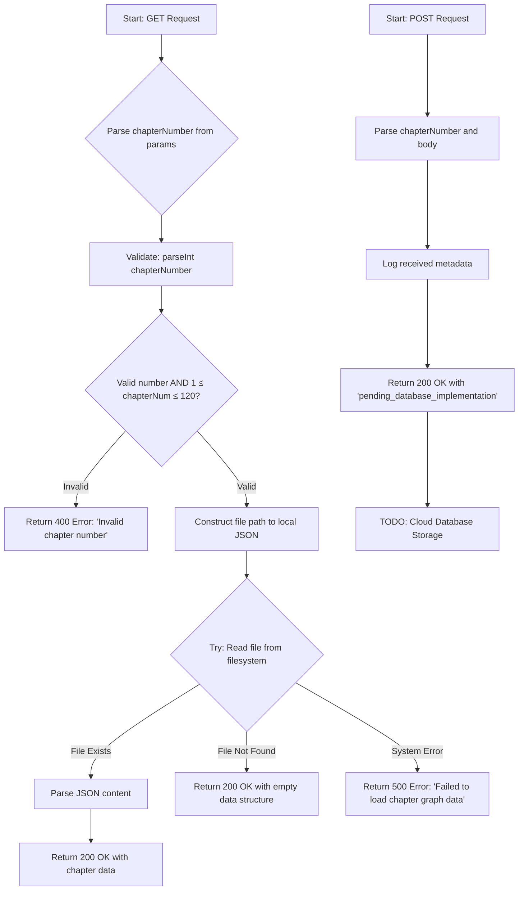
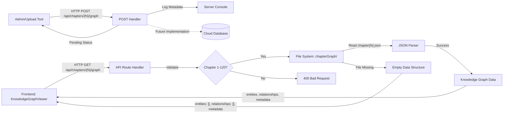

# Module: `chapters/[chapterNumber]/graph`

## 1. Module Summary

This API route module serves chapter-specific knowledge graph data for the interactive reading interface. It handles retrieval of character relationships, entities, and narrative connections for each of the 120 chapters in "Dream of the Red Chamber". Currently loads data from local JSON files with planned migration to cloud database storage for scalability and real-time updates.

## 2. Module Dependencies

* **Internal Dependencies:** None (standalone API route)
* **External Dependencies:**
  * `next/server` - NextRequest, NextResponse for API routing
  * `path` - File path resolution for local data access
  * `fs/promises` - Asynchronous file system operations

## 3. Public API / Exports

* `GET(request, params)`: Retrieves knowledge graph data for a specific chapter number
* `POST(request, params)`: Accepts new knowledge graph data for upload (pending database implementation)

## 4. Code File Breakdown

### 4.1. `route.ts`

* **Purpose:** Implements REST endpoints for chapter knowledge graph data retrieval and storage. This file serves as the bridge between the frontend knowledge graph visualization components and the backend data storage layer. The module validates chapter numbers, handles file system operations for local data access, and provides graceful fallback responses when data is unavailable.

* **Functions:**
    * `GET(request: NextRequest, { params }: { params: Promise<{ chapterNumber: string }> }): Promise<NextResponse>` - Validates the chapter number (1-120 range), attempts to read corresponding JSON file from local storage at `src/app/(main)/read/chapterGraph/chapter{N}.json`, returns structured knowledge graph data with entities, relationships, and metadata, or returns empty data structure with Chinese error message if file doesn't exist. Throws 400 Bad Request for invalid chapter numbers, 500 Internal Server Error for system failures.

    * `POST(request: NextRequest, { params }: { params: Promise<{ chapterNumber: string }> }): Promise<NextResponse>` - Accepts JSON payload containing knowledge graph data for a specific chapter, logs the received metadata for debugging purposes, returns success acknowledgment with "pending_database_implementation" status. Currently non-functional (stub implementation) awaiting cloud database integration. Returns 200 OK with pending status, 500 Internal Server Error if processing fails.

* **Key Classes / Constants / Variables:**
    * `filePath` (local variable): Constructed absolute path to chapter JSON file using `process.cwd()` and path.join, points to local filesystem location of knowledge graph data before cloud migration

    * Empty data structure (returned on file read failure): Comprehensive fallback object containing empty arrays for `entities` and `relationships`, plus detailed metadata object with 19 fields including version, description (Chinese), processing times, entity counts, creation date, and explanatory notes about missing data

## 5. System and Data Flow

### 5.1. System Flowchart (Control Flow)



### 5.2. Data Flow Diagram (Data Transformation)



## 6. Usage Example & Testing

* **Usage:**
```typescript
// Frontend client call
const response = await fetch(`/api/chapters/1/graph`);
const graphData = await response.json(); // { entities: [...], relationships: [...], metadata: {...} }
```

* **Testing:** This API route does not have dedicated test files. Testing is recommended through:
  1. Integration tests verifying valid chapter numbers return 200 OK
  2. Edge case tests for invalid inputs (chapter 0, 121, non-numeric values)
  3. File system mocking tests for missing JSON files
  4. End-to-end tests with actual knowledge graph visualization components in `src/components/KnowledgeGraphViewer.tsx`
