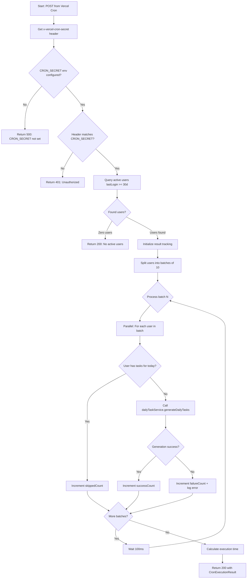
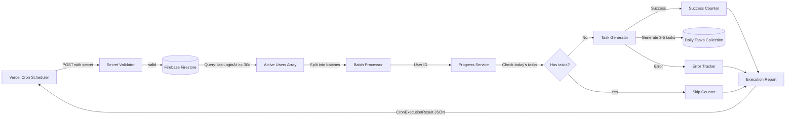

# Module: `cron/reset-daily-tasks`

## 1. Module Summary

This API route module implements a scheduled cron job that automatically generates daily learning tasks for all active users at midnight UTC+8 (00:00). It processes users in parallel batches to avoid timeouts, tracks individual success/failure rates, and provides comprehensive execution reporting for monitoring and debugging. The module is designed to be triggered by Vercel Cron scheduler and protected by secret-based authentication to prevent unauthorized access.

## 2. Module Dependencies

* **Internal Dependencies:**
  * `@/lib/firebase` - Firebase client SDK for Firestore database access
  * `@/lib/daily-task-service` - Core service for task generation and progress management

* **External Dependencies:**
  * `next/server` - NextRequest, NextResponse for API routing
  * `firebase/firestore` - Firestore queries, collections, Timestamps for user data retrieval

## 3. Public API / Exports

* `GET(request)`: Returns cron job documentation and configuration info for health checks
* `POST(request)`: Executes daily task generation for all active users with batch processing and error tracking

## 4. Code File Breakdown

### 4.1. `route.ts`

* **Purpose:** Orchestrates automated daily task distribution across the entire user base through a secure, scheduled endpoint. This file implements robust batch processing to handle large user populations without timeout failures, comprehensive error tracking to identify problematic accounts, and detailed execution reporting to enable monitoring and alerting. The cron job ensures users receive fresh learning challenges daily without manual intervention, maintaining engagement through consistent content delivery.

* **Functions:**
    * `GET(request: NextRequest): Promise<NextResponse>` - Returns comprehensive API documentation including endpoint name, version (1.0.0), cron schedule specification (0 16 * * * = UTC 16:00 = UTC+8 00:00), security requirements (CRON_SECRET environment variable), usage instructions with required headers (x-vercel-cron-secret), and configuration parameters (MAX_USERS_PER_EXECUTION=1000, BATCH_SIZE=10). Useful for automated health checks, monitoring dashboards, and developer onboarding. Returns 200 OK with documentation JSON.

    * `POST(request: NextRequest): Promise<NextResponse>` - Validates x-vercel-cron-secret header against CRON_SECRET environment variable, queries Firestore for users with lastLoginAt within past 30 days (active user criteria), limits results to MAX_USERS_PER_EXECUTION=1000 to prevent timeout, processes users in parallel batches of BATCH_SIZE=10 to balance performance vs Firebase rate limits, checks each user's existing progress via `dailyTaskService.getUserDailyProgress()` to skip users who already have tasks, generates tasks via `dailyTaskService.generateDailyTasks()` for users without today's tasks, tracks success/failure/skipped counts with individual error messages, implements 100ms delay between batches to avoid rate limiting, returns CronExecutionResult with timestamp, executionTime, stats (totalUsers, successCount, failureCount, skippedCount), and errors array containing userId and error message for each failure. Returns 200 OK even with partial failures to enable monitoring, 401 Unauthorized for invalid/missing cron secret, 500 Internal Server Error for CRON_SECRET not configured or fatal execution errors.

    * `getTodayDateString(): string` - Helper function that calculates current date in YYYY-MM-DD format adjusted for UTC+8 timezone (Hong Kong/Taipei time), used to determine which date's tasks should be generated. Applies 8-hour offset (8 * 60 * 60 * 1000ms) to current time, extracts date portion via `toISOString().split('T')[0]`. Returns date string like "2025-01-27".

* **Key Classes / Constants / Variables:**
    * `MAX_USERS_PER_EXECUTION` (constant): Integer value 1000, limits maximum users processed in single cron execution to prevent Vercel serverless function timeout (typically 10-60 seconds), ensures completion within platform constraints

    * `BATCH_SIZE` (constant): Integer value 10, defines parallel processing batch size balancing performance optimization vs Firebase rate limit avoidance, smaller batches reduce rate limit risk but increase total execution time

    * `CronExecutionResult` (interface): TypeScript interface defining execution report structure with fields: success (boolean), timestamp (ISO string), executionTime (milliseconds), stats object (totalUsers, successCount, failureCount, skippedCount all integers), errors array of {userId, error} objects for debugging failures

    * `CRON_SECRET` (environment variable): Server-side secret string stored in `.env.local`, must match x-vercel-cron-secret header for authentication, prevents unauthorized execution of resource-intensive cron job

    * `usersQuery` (local variable): Firestore query filtering users collection by lastLoginAt >= 30 days ago, limited to MAX_USERS_PER_EXECUTION, optimized to process only recently active users rather than entire user base

## 5. System and Data Flow

### 5.1. System Flowchart (Control Flow)



### 5.2. Data Flow Diagram (Data Transformation)



## 6. Usage Example & Testing

* **Usage:**
```bash
# Manual trigger for testing (requires valid CRON_SECRET)
curl -X POST https://your-domain.com/api/cron/reset-daily-tasks \
  -H "x-vercel-cron-secret: your-cron-secret-here"

# Response example:
{
  "success": true,
  "timestamp": "2025-01-27T16:00:00.000Z",
  "executionTime": 4523,
  "stats": {
    "totalUsers": 150,
    "successCount": 145,
    "failureCount": 2,
    "skippedCount": 3
  },
  "errors": [
    {"userId": "user123", "error": "Firebase permission denied"},
    {"userId": "user456", "error": "User profile not found"}
  ]
}
```

* **Testing:** No dedicated test file exists for this cron endpoint. Recommended testing approach:
  1. Unit tests mocking Firebase queries to verify user filtering logic (lastLoginAt >= 30 days)
  2. Batch processing tests ensuring correct parallel execution with BATCH_SIZE=10
  3. Rate limiting tests validating 100ms delays between batches
  4. Error handling tests simulating individual user generation failures
  5. Authentication tests verifying secret validation logic
  6. Integration tests with actual Firebase to validate end-to-end execution
  7. Performance tests measuring execution time with varying user counts (100, 500, 1000 users)
  8. Monitoring setup to track CronExecutionResult metrics in production
