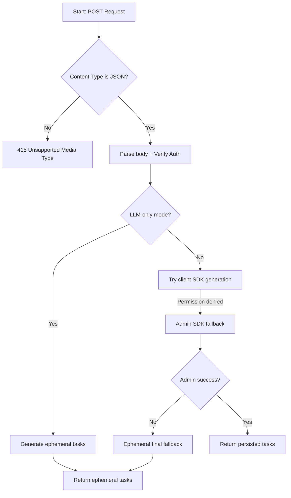
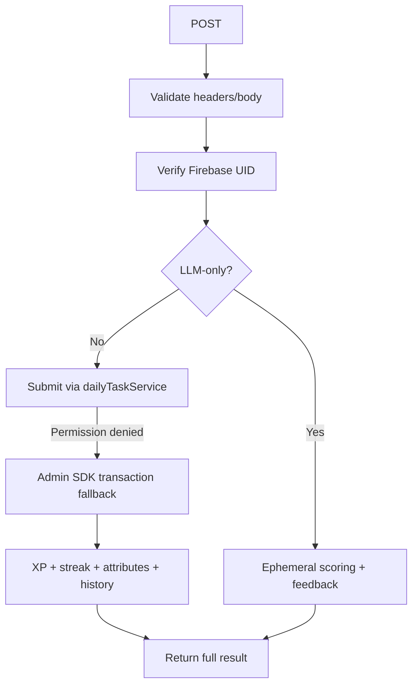
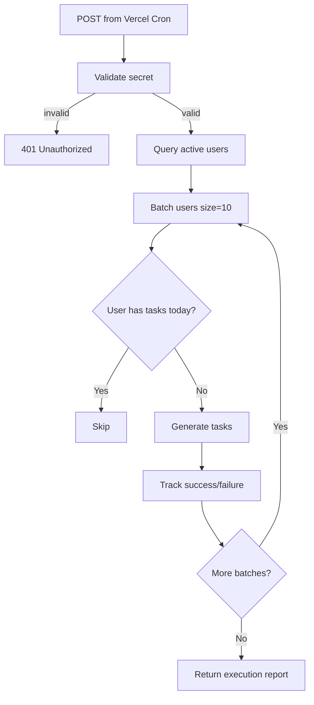

# Module: `daily-tasks/generate`

## 1. Module Summary

This API route module provides server-side task generation endpoints that create personalized daily learning challenges for users through OpenAI API calls. It implements multiple execution paths including Firebase authentication with fallback, Admin SDK persistence when client SDK lacks permissions, and ephemeral generation mode for LLM-only environments without database dependencies. The module ensures GPT model logs appear in terminal output for debugging while maintaining robust error handling and graceful degradation.

## 2. Module Dependencies

* **Internal Dependencies:**
  * `@/lib/daily-task-service` - Primary task generation orchestration service
  * `@/lib/task-generator` - Core task generation logic with AI integration
  * `@/lib/firebase-admin` - Admin SDK for privileged server operations, auth token verification
  * `@/lib/env` - Environment configuration including LLM-only mode detection

* **External Dependencies:**
  * `next/server` - NextRequest, NextResponse for API routing

## 3. Public API / Exports

* `POST(request)`: Generates daily tasks server-side with multi-path fallback logic (Firebase client → Admin SDK → ephemeral)
* `GET()`: Returns API endpoint documentation and expected request format

## 4. Code File Breakdown

### 4.1. `route.ts`

* **Purpose:** Orchestrates server-side task generation through a layered fallback architecture that prioritizes persistence while ensuring users always receive tasks even during infrastructure failures. This file solves the requirement for GPT-5-Mini logs to appear in Node terminal by forcing AI operations server-side rather than client-side. The module implements three execution strategies: (1) Firebase client SDK via dailyTaskService for standard authenticated requests, (2) Admin SDK persistence for permission-denied scenarios, (3) ephemeral generation without persistence for LLM-only mode or total Firebase failures. This design ensures maximum reliability and development visibility.

* **Functions:**
    * `POST(request: NextRequest): Promise<NextResponse>` - Validates Content-Type is application/json, verifies Authorization, chooses effective execution path (client SDK, Admin SDK fallback, or ephemeral), and returns `{ success, tasks, ephemeral }` with robust error handling.
    * `GET(): Promise<NextResponse>` - Returns basic API documentation JSON.

## 5. System and Data Flow

### 5.1. System Flowchart (Control Flow)

# Module: `daily-tasks/submit`

## 1. Module Summary

This API route module handles server-side task submission, evaluation, and reward distribution for daily learning challenges. It implements comprehensive fallback logic across Firebase client SDK, Admin SDK, and ephemeral evaluation modes to ensure users always receive scores and feedback even during infrastructure failures. The module orchestrates task evaluation through AI flows, calculates XP rewards with streak bonuses, updates user profiles with level progression, records task history, and manages attribute point distribution—all with transaction-safe duplicate prevention.

## 2. Module Dependencies

* **Internal Dependencies:**
  * `@/lib/daily-task-service` - Core service for task submission orchestration
  * `@/lib/ai-feedback-generator` - AI-powered personalized feedback generation
  * `@/lib/types/daily-task` - TypeScript interfaces for task types and completion results
  * `@/lib/types/user-level` - Attribute points and level system types
  * `@/lib/firebase-admin` - Admin SDK for privileged operations and auth verification
  * `@/lib/env` - Environment configuration including LLM-only mode
  * `@/lib/task-evaluator` - Simple scoring fallback (simpleTierScore)
  * `@/lib/config/levels-config` - Level XP calculations and content unlocking

* **External Dependencies:**
  * `next/server` - NextRequest, NextResponse for API routing

## 3. Public API / Exports

* `POST(request)`: Submits task completion with user response, returns AI evaluation, score, feedback, and reward details
* `GET()`: Returns API endpoint documentation and expected request format

## 4. Code File Breakdown

### 4.1. `route.ts`

* **Purpose:** Orchestrates the complete task submission workflow from user response validation through AI evaluation to reward distribution and progress tracking with a multi-path fallback architecture.

* **Functions:**
    * `POST(request: NextRequest): Promise<NextResponse>` - Validates inputs and auth, executes primary client SDK path, falls back to Admin SDK transactional path on permission-denied, and finally to ephemeral evaluation. Returns comprehensive TaskCompletionResult.
    * `GET(): Promise<NextResponse>` - Returns API documentation JSON.

## 5. System and Data Flow

### 5.1. System Flowchart (Control Flow)

# Module: `cron/reset-daily-tasks`

## 1. Module Summary

This API route module implements a scheduled cron job that automatically generates daily learning tasks for all active users at midnight UTC+8 (00:00). It processes users in parallel batches to avoid timeouts, tracks individual success/failure rates, and provides comprehensive execution reporting for monitoring and debugging. The module is designed to be triggered by Vercel Cron scheduler and protected by secret-based authentication to prevent unauthorized access.

## 2. Module Dependencies

* **Internal Dependencies:**
  * `@/lib/firebase` - Firebase client SDK for Firestore database access
  * `@/lib/daily-task-service` - Core service for task generation and progress management

* **External Dependencies:**
  * `next/server` - NextRequest, NextResponse for API routing
  * `firebase/firestore` - Firestore queries, collections, Timestamps for user data retrieval

## 3. Public API / Exports

* `GET(request)`: Returns cron job documentation and configuration info for health checks
* `POST(request)`: Executes daily task generation for all active users with batch processing and error tracking

## 4. Code File Breakdown

### 4.1. `route.ts`

* **Purpose:** Secure scheduled endpoint that distributes fresh tasks daily across users with batching, throttling, and detailed reporting.

* **Functions:**
    * `GET(request: NextRequest): Promise<NextResponse>` - Returns API documentation with schedule, security, and config.
    * `POST(request: NextRequest): Promise<NextResponse>` - Validates cron secret, queries recent active users, processes in batches, skips users with existing tasks, generates tasks for others, and returns CronExecutionResult.

## 5. System and Data Flow

### 5.1. System Flowchart (Control Flow)

