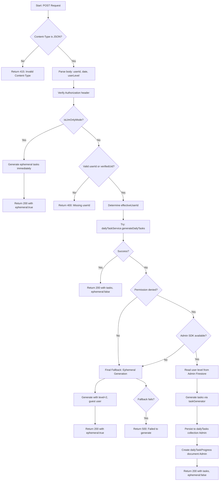
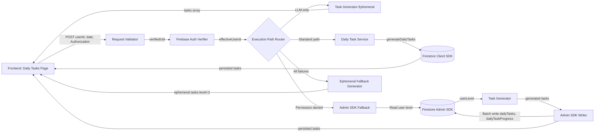

# Module: `daily-tasks/generate`

## 1. Module Summary

This API route module provides server-side task generation endpoints that create personalized daily learning challenges for users through OpenAI API calls. It implements multiple execution paths including Firebase authentication with fallback, Admin SDK persistence when client SDK lacks permissions, and ephemeral generation mode for LLM-only environments without database dependencies. The module ensures GPT model logs appear in terminal output for debugging while maintaining robust error handling and graceful degradation.

## 2. Module Dependencies

* **Internal Dependencies:**
  * `@/lib/daily-task-service` - Primary task generation orchestration service
  * `@/lib/task-generator` - Core task generation logic with AI integration
  * `@/lib/firebase-admin` - Admin SDK for privileged server operations, auth token verification
  * `@/lib/env` - Environment configuration including LLM-only mode detection

* **External Dependencies:**
  * `next/server` - NextRequest, NextResponse for API routing

## 3. Public API / Exports

* `POST(request)`: Generates daily tasks server-side with multi-path fallback logic (Firebase client → Admin SDK → ephemeral)
* `GET()`: Returns API endpoint documentation and expected request format

## 4. Code File Breakdown

### 4.1. `route.ts`

* **Purpose:** Orchestrates server-side task generation through a layered fallback architecture that prioritizes persistence while ensuring users always receive tasks even during infrastructure failures. This file solves the requirement for GPT-5-Mini logs to appear in Node terminal by forcing AI operations server-side rather than client-side. The module implements three execution strategies: (1) Firebase client SDK via dailyTaskService for standard authenticated requests, (2) Admin SDK persistence for permission-denied scenarios, (3) ephemeral generation without persistence for LLM-only mode or total Firebase failures. This design ensures maximum reliability and development visibility.

* **Functions:**
    * `POST(request: NextRequest): Promise<NextResponse>` - Validates Content-Type is application/json (returns 415 Unsupported Media Type if not), parses request body extracting userId, date (optional), and userLevel, verifies Firebase ID token from Authorization header via `verifyAuthHeader()`, checks LLM-only mode via `isLlmOnlyMode()` and if true immediately generates ephemeral tasks using `taskGenerator.generateTasksForUser()` without Firebase interaction, attempts primary path: calls `dailyTaskService.generateDailyTasks()` to persist tasks via Firebase client SDK, on permission-denied error attempts Admin SDK fallback: reads user level from Firestore Admin API, generates tasks via taskGenerator, manually persists to dailyTasks collection and dailyTaskProgress document using Admin SDK batch writes with server timestamps, on all failures attempts final ephemeral fallback: generates tasks with default level=2 for guest user without any persistence. Returns 200 OK with `{success: true, tasks: [...], ephemeral: boolean}`, 400 Bad Request for missing/invalid userId (unless LLM-only mode), 415 Unsupported Media Type for non-JSON Content-Type, 500 Internal Server Error if all paths fail.

    * `GET(): Promise<NextResponse>` - Returns simple API documentation JSON specifying endpoint name "Generate Daily Tasks API", method POST, endpoint path "/api/daily-tasks/generate", and expected body structure `{userId: string, date: string (optional)}`. Useful for API discovery and developer reference. Returns 200 OK with documentation JSON.

* **Key Classes / Constants / Variables:**
    * `userId` (parsed variable): String extracted from request body, trimmed for whitespace, represents target user for task generation, required unless in LLM-only mode

    * `date` (parsed variable): Optional string in YYYY-MM-DD format specifying target date for task generation, defaults to today's date if not provided, enables historical task generation for testing

    * `verifiedUid` (local variable): String or null result from `verifyAuthHeader()`, contains Firebase UID extracted from verified JWT token in Authorization header, used to ensure authenticated requests and prevent userId spoofing

    * `effectiveUserId` (calculated variable): String chosen from verifiedUid (preferred) or userId (fallback), represents the authoritative user ID used for all database operations, ensures authenticated users cannot generate tasks for other users

    * `ephemeral` (response flag): Boolean indicating whether generated tasks were persisted to database (false) or only returned transiently without storage (true), helps clients understand whether to expect tasks in subsequent API calls

## 5. System and Data Flow

### 5.1. System Flowchart (Control Flow)



### 5.2. Data Flow Diagram (Data Transformation)



## 6. Usage Example & Testing

* **Usage:**
```typescript
// Frontend authenticated call with Firebase ID token
const idToken = await getCurrentUser().getIdToken();
const response = await fetch('/api/daily-tasks/generate', {
  method: 'POST',
  headers: {
    'Content-Type': 'application/json',
    'Authorization': `Bearer ${idToken}`
  },
  body: JSON.stringify({
    userId: currentUser.uid,
    date: '2025-01-27' // optional, defaults to today
  })
});

const result = await response.json();
// { success: true, tasks: [...], ephemeral: false }
```

* **Testing:** No dedicated test file exists for this API route. Recommended testing strategy:
  1. Unit tests mocking dailyTaskService to verify primary path execution
  2. Permission-denied tests triggering Admin SDK fallback path
  3. LLM-only mode tests verifying ephemeral generation without Firebase calls
  4. Authentication tests validating verifyAuthHeader integration
  5. Error handling tests ensuring final fallback always succeeds
  6. Content-Type validation tests for 415 responses
  7. Integration tests with actual Firebase to verify end-to-end task persistence
  8. Terminal logging tests confirming GPT-5-Mini logs appear in server output
