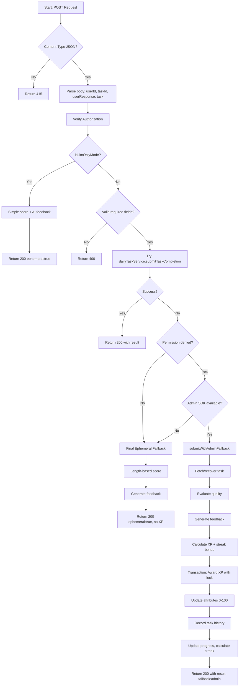

# Module: `daily-tasks/submit`

## 1. Module Summary

This API route module handles server-side task submission, evaluation, and reward distribution for daily learning challenges. It implements comprehensive fallback logic across Firebase client SDK, Admin SDK, and ephemeral evaluation modes to ensure users always receive scores and feedback even during infrastructure failures. The module orchestrates task evaluation through AI flows, calculates XP rewards with streak bonuses, updates user profiles with level progression, records task history, and manages attribute point distribution—all with transaction-safe duplicate prevention.

## 2. Module Dependencies

* **Internal Dependencies:**
  * `@/lib/daily-task-service` - Core service for task submission orchestration
  * `@/lib/ai-feedback-generator` - AI-powered personalized feedback generation
  * `@/lib/types/daily-task` - TypeScript interfaces for task types and completion results
  * `@/lib/types/user-level` - Attribute points and level system types
  * `@/lib/firebase-admin` - Admin SDK for privileged operations and auth verification
  * `@/lib/env` - Environment configuration including LLM-only mode
  * `@/lib/task-evaluator` - Simple scoring fallback (simpleTierScore)
  * `@/lib/config/levels-config` - Level XP calculations and content unlocking

* **External Dependencies:**
  * `next/server` - NextRequest, NextResponse for API routing

## 3. Public API / Exports

* `POST(request)`: Submits task completion with user response, returns AI evaluation, score, feedback, and reward details
* `GET()`: Returns API endpoint documentation and expected request format

## 4. Code File Breakdown

### 4.1. `route.ts`

* **Purpose:** Orchestrates the complete task submission workflow from user response validation through AI evaluation to reward distribution and progress tracking. This file implements a sophisticated multi-path execution strategy that prioritizes database persistence while guaranteeing users receive evaluation feedback even during total infrastructure failures. The module handles complex scenarios including duplicate submission prevention via transaction locks, streak calculation across daily progress records, level-up detection with exclusive content unlocking, attribute point updates with range capping (0-100), and comprehensive task history recording for analytics. The fallback architecture ensures maximum reliability: Firebase client SDK → Admin SDK transaction → ephemeral evaluation with score-only feedback.

* **Functions:**
    * `POST(request: NextRequest): Promise<NextResponse>` - Validates Content-Type (returns 415 if not JSON), parses body extracting userId, taskId, userResponse, task object, verifies Authorization header for Firebase UID, validates required fields (userId unless LLM-only, taskId, userResponse), implements LLM-only mode path: uses simpleTierScore for basic evaluation (0-100 based on text length), generates AI feedback via generatePersonalizedFeedback, returns evaluation without persistence with ephemeral:true flag, attempts primary path: calls `dailyTaskService.submitTaskCompletion()` for full workflow, on permission-denied error attempts Admin SDK fallback via `submitWithAdminFallback()`: fetches or recovers task from Firestore/memory, evaluates quality via `dailyTaskService.evaluateTaskQuality()`, generates personalized feedback, calculates base XP from BASE_XP_REWARDS mapping, applies score-based XP multiplier (score=20→0 XP, score=100→1.5x XP), calculates streak bonus via STREAK_MILESTONES, awards XP with transaction-safe duplicate prevention using xpTransactionLocks collection, updates user attributes via Admin SDK with 0-100 capping, records task history to dailyTaskHistory collection, updates dailyTaskProgress with completion status/timestamp, calculates new streak if all tasks completed, checks for streak milestones and badge rewards, constructs TaskCompletionResult with success, score, feedback, xpAwarded, attributeGains, rewards (immediate+delayed), leveledUp, newLevel, fromLevel, newStreak, isStreakMilestone, streakBonus, on all failures attempts final ephemeral fallback: uses length-based scoring (0/20/70/85/95 tiers), generates feedback without XP rewards, returns evaluation-only result. Returns 200 OK with `{success: true, result: TaskCompletionResult, ephemeral?: boolean, fallback?: string}`, 400 Bad Request for missing/invalid fields, 415 Unsupported Media Type for non-JSON, 500 Internal Server Error if all paths fail.

    * `GET(): Promise<NextResponse>` - Returns API documentation JSON with endpoint name "Submit Daily Task Completion API", method POST, path "/api/daily-tasks/submit", expected body structure `{userId: string, taskId: string, userResponse: string}`. Returns 200 OK.

    * `isPermissionDeniedError(error: any): boolean` - Helper detecting Firebase permission errors by checking error.code for 'permission-denied' string or testing error.message against regex `/permission[-_ ]denied|insufficient permissions/i`. Returns true if permission error, false otherwise. Used to trigger Admin SDK fallback path.

    * `getTodayDateString(): string` - Helper calculating current date in YYYY-MM-DD format with UTC+8 offset (8*60*60*1000ms), ensuring task submissions use correct timezone for Asian users. Returns date string like "2025-01-27".

    * `convertTimestampToMillis(value: any): number` - Helper converting various Timestamp formats (Firebase client, Admin SDK, plain objects) to milliseconds since epoch, handles toMillis() method, seconds field, _seconds field, returns Date.now() as fallback. Used for submission time calculations.

    * `mergeAttributePoints(base, add): Partial<AttributePoints>` - Helper merging two AttributePoints objects by summing each attribute (poetrySkill, culturalKnowledge, analyticalThinking, socialInfluence, learningPersistence), returns new merged object. Used when accumulating attribute gains across tasks.

    * `calculateStreakBonusFromMilestones(streak, baseXP): number` - Helper finding applicable streak milestone (3, 7, 14, 30, 60, 100 days) for current streak count, applies bonusMultiplier (1.1x-2.0x range), calculates bonus as `baseXP * (multiplier - 1)`, returns bonus integer. Used for streak-based XP rewards.

    * `calculateStreakWithAdmin(userId, currentDate): Promise<number>` - Async helper querying yesterday's dailyTaskProgress via Admin SDK, checks if all tasks were completed/skipped, returns `yesterdayStreak + 1` if yes, returns 0 if no or no record exists. Used for accurate streak calculation during Admin fallback.

    * `recordDailyTaskHistoryWithAdmin(params): Promise<void>` - Async helper adding document to dailyTaskHistory collection with userId, taskId, taskType, score, xpAwarded, completionTime, date, sourceId, completedAt timestamp. Used for analytics and historical tracking.

    * `updateAttributesWithAdmin(userId, updates): Promise<void>` - Async helper reading user profile, merging new attribute points, capping all values to 0-100 range, updating profile with merged attributes and updatedAt timestamp. Used for attribute point distribution.

    * `awardXPWithAdmin(params): Promise<AdminAwardResult>` - Complex async helper implementing transaction-safe XP awarding via Admin SDK, checks xpTransactionLocks for duplicate sourceId, reads user profile, calculates new totalXP and level via calculateXPProgress, updates user profile with new XP/level/timestamps, creates lock document, logs to xpTransactions collection, on level-up: records to levelUps collection and unlocks exclusive content per level configs, returns `{success, newTotalXP, newLevel, leveledUp, fromLevel, isDuplicate?}`. Prevents duplicate XP awards from retry scenarios.

    * `getTaskForAdmin(taskId, providedTask?): Promise<DailyTask>` - Async helper fetching task from dailyTasks collection via Admin SDK, falls back to providedTask parameter if available, attempts task recovery via `dailyTaskService.recoverTaskFromId()`, returns synthetic fallback task with MORNING_READING type and default values if all sources fail. Ensures submission always proceeds even with missing task data.

    * `submitWithAdminFallback(params): Promise<TaskCompletionResult>` - Comprehensive async helper implementing complete submission workflow using Admin SDK, fetches/creates dailyTaskProgress document, locates or creates task assignment record, evaluates response quality, generates feedback, calculates XP with streak bonuses, awards XP via transaction, updates attributes, records history, updates progress with completion status, calculates new streak if all tasks done, constructs TaskCompletionResult with all rewards and level-up details, returns complete result. Used when Firebase client SDK lacks permissions.

* **Key Classes / Constants / Variables:**
    * `STREAK_MILESTONES` (imported constant): Array of milestone objects with days [3,7,14,30,60,100] and bonusMultiplier [1.1,1.2,1.3,1.5,1.75,2.0], used for progressive streak reward calculation

    * `BASE_XP_REWARDS` (imported constant): Map from DailyTaskType enum to base XP integers (MORNING_READING=50, POETRY=100, CHARACTER_INSIGHT=80, etc.), defines baseline rewards before multipliers

    * `AdminAwardResult` (interface): TypeScript interface for XP award transaction results containing success (boolean), newTotalXP (number), newLevel (number), leveledUp (boolean), fromLevel? (number), isDuplicate? (boolean)

    * `AdminFallbackParams` (interface): Interface for submitWithAdminFallback parameters with userId, taskId, userResponse, providedTask? fields

## 5. System and Data Flow

### 5.1. System Flowchart (Control Flow)



### 5.2. Data Flow Diagram (Data Transformation)

```mermaid
graph LR
    Client[Frontend: Task Modal] -- POST userId, taskId, userResponse --> Validate[Request Validator];
    Validate -- verifiedUid --> Router{Execution Router};

    Router -- LLM-only --> Simple[Simple Scorer];
    Simple -- score 0-100 --> FeedbackGen1[AI Feedback Generator];
    FeedbackGen1 -- ephemeral result --> Client;

    Router -- Standard --> Service[Daily Task Service];
    Service -- submitTaskCompletion --> Eval[Task Evaluator AI];
    Eval -- score --> XPCalc[XP Calculator];
    XPCalc -- xpAwarded --> UserDB[(Firestore Users)];
    UserDB -- level up? --> Client;

    Router -- Permission denied --> AdminFallback[Admin Fallback Path];
    AdminFallback -- Fetch task --> TaskDB[(dailyTasks Collection)];
    TaskDB -- task object --> Quality[Quality Evaluator];
    Quality -- score --> FeedbackGen2[Feedback Generator];
    FeedbackGen2 -- feedback --> StreakCalc[Streak Calculator];
    StreakCalc -- streak bonus --> XPTx[XP Transaction];
    XPTx -- Check lock --> Locks[(xpTransactionLocks)];
    Locks -- Not duplicate --> Award[Award XP];
    Award -- Update profile --> AdminDB[(Admin Firestore)];
    AdminDB -- Level up? --> Unlock[Unlock Content];
    Unlock -- Update progress --> Progress[(dailyTaskProgress)];
    Progress -- Record history --> History[(dailyTaskHistory)];
    History -- Complete result --> Client;

    Router -- All fail --> Final[Ephemeral Fallback];
    Final -- score only --> Client;
```



## 6. Usage Example & Testing

* **Usage:**
```typescript
// Frontend authenticated submission
const idToken = await getCurrentUser().getIdToken();
const response = await fetch('/api/daily-tasks/submit', {
  method: 'POST',
  headers: {
    'Content-Type': 'application/json',
    'Authorization': `Bearer ${idToken}`
  },
  body: JSON.stringify({
    userId: currentUser.uid,
    taskId: 'task-123',
    userResponse: '林黛玉是賈寶玉的表妹，兩人青梅竹馬，感情深厚...',
    task: currentTaskObject // optional, helps with fallback
  })
});

const { result } = await response.json();
// result: { success: true, score: 85, feedback: "...", xpAwarded: 120,
//           leveledUp: true, newLevel: 5, newStreak: 7, ... }
```

* **Testing:** No dedicated test file exists. Recommended testing:
  1. Unit tests mocking dailyTaskService for primary path
  2. Permission-denied tests triggering Admin SDK fallback
  3. Duplicate submission tests verifying transaction lock behavior
  4. Streak calculation tests across various completion patterns
  5. Level-up tests including content unlocking logic
  6. Attribute capping tests (values stay 0-100)
  7. XP multiplier tests for different score tiers (20, 70, 85, 95, 100)
  8. Streak milestone tests for bonus calculations (3/7/14/30/60/100 days)
  9. Task recovery tests when task data missing
  10. Ephemeral fallback tests ensuring always-available evaluation
  11. Integration tests with actual Firebase for end-to-end validation
