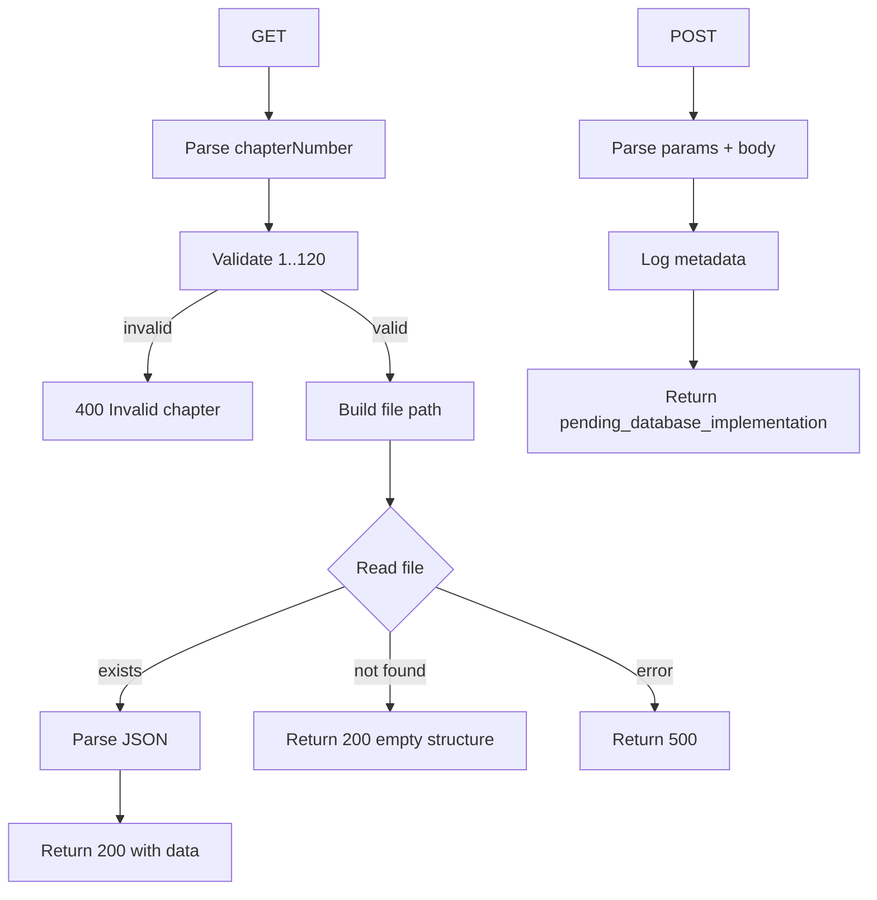

# Module: `chapters/[chapterNumber]/graph`

## 1. Module Summary

This API route module serves chapter-specific knowledge graph data for the interactive reading interface. It handles retrieval of character relationships, entities, and narrative connections for each of the 120 chapters in "Dream of the Red Chamber". Currently loads data from local JSON files with planned migration to cloud database storage for scalability and real-time updates.

## 2. Module Dependencies

* **Internal Dependencies:** None (standalone API route)
* **External Dependencies:**
  * `next/server` - NextRequest, NextResponse for API routing
  * `path` - File path resolution for local data access
  * `fs/promises` - Asynchronous file system operations

## 3. Public API / Exports

* `GET(request, params)`: Retrieves knowledge graph data for a specific chapter number
* `POST(request, params)`: Accepts new knowledge graph data for upload (pending database implementation)

## 4. Code File Breakdown

### 4.1. `route.ts`

* **Purpose:** Implements REST endpoints for chapter knowledge graph data retrieval and storage. Validates inputs, reads local files, and returns structured fallbacks.

* **Functions:**
    * `GET(request: NextRequest, { params }: { params: Promise<{ chapterNumber: string }> }): Promise<NextResponse>` - Validates chapter number, reads `chapter{N}.json`, returns data or empty structure with message.
    * `POST(request: NextRequest, { params }: { params: Promise<{ chapterNumber: string }> }): Promise<NextResponse>` - Accepts JSON payload, logs metadata, returns pending status.

## 5. System and Data Flow

### 5.1. System Flowchart (Control Flow)

