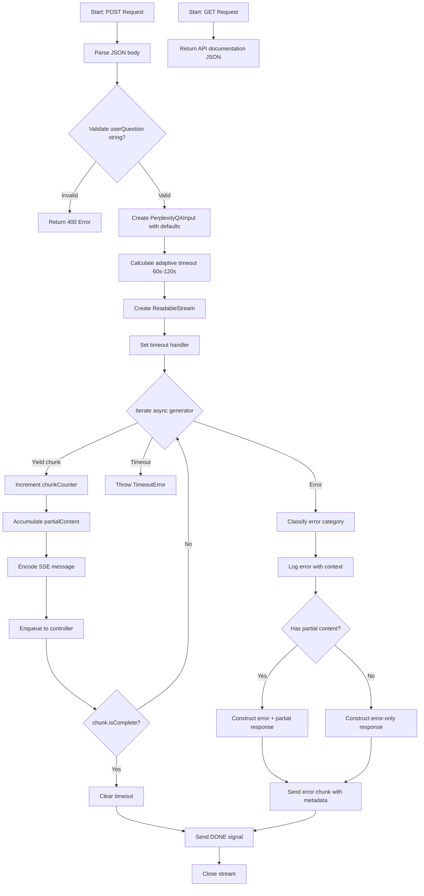
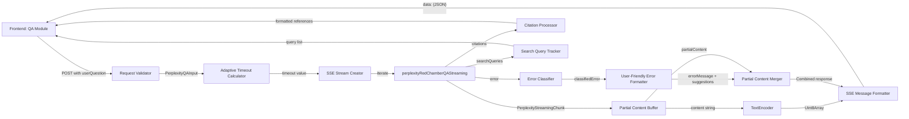

# Module: `perplexity-qa-stream`

## 1. Module Summary

This API route module provides Server-Sent Events (SSE) streaming endpoints for real-time AI-powered question answering using Perplexity API. It enables progressive display of AI thinking processes and answers with scholarly citations, bridging the gap between classical literature analysis and contemporary academic research. The module implements comprehensive error handling, adaptive timeouts, and graceful degradation to ensure robust user experience even during API failures or network issues.

## 2. Module Dependencies

* **Internal Dependencies:**
  * `@/ai/flows/perplexity-red-chamber-qa` - Async generator for streaming Perplexity responses
  * `@/types/perplexity-qa` - TypeScript interfaces for QA input/output structures
  * `@/ai/perplexity-config` - Adaptive timeout configuration system
  * `@/lib/perplexity-error-handler` - Comprehensive error classification and recovery

* **External Dependencies:**
  * `next/server` - NextRequest, NextResponse for API routing

## 3. Public API / Exports

* `POST(request)`: Streams AI-generated answers to user questions about "Dream of the Red Chamber" with real-time token-by-token delivery via SSE
* `GET()`: Returns API documentation, supported models, and usage instructions for health checks and developer reference

## 4. Code File Breakdown

### 4.1. `route.ts`

* **Purpose:** Implements Server-Sent Events streaming for Perplexity AI question answering, converting async generator outputs into browser-compatible event streams. This file solves Next.js 15 App Router limitations with client-side async generators by providing a server-side bridge. The module manages streaming lifecycle, timeout enforcement, error recovery with partial content preservation, and adaptive performance tuning based on question complexity and model selection.

* **Functions:**
    * `POST(request: NextRequest): Promise<Response>` - Validates JSON request body requiring `userQuestion` string, constructs PerplexityQAInput with optional parameters (selectedTextInfo, chapterContext, modelKey='sonar-reasoning-pro', reasoningEffort='medium', temperature, maxTokens), calculates adaptive timeout based on question complexity and model requirements (60s-120s range), creates ReadableStream that iterates through `perplexityRedChamberQAStreaming()` async generator, encodes each chunk as SSE message format `data: {JSON}\n\n`, implements timeout handler that throws TimeoutError after calculated duration, accumulates partial content during streaming for error recovery, handles stream completion with `[DONE]` signal, on error classifies issue using `classifyError()`, formats user-friendly error message with suggestions via `formatErrorForUser()`, returns partial content if available to show incomplete but useful responses, sets SSE headers (Content-Type: text/event-stream, Cache-Control: no-cache, X-Accel-Buffering: no). Returns 200 OK with streaming Response, 400 Bad Request for invalid userQuestion, 500 Internal Server Error for processing failures. Typical streaming chunk structure includes `{ content, fullContent, timestamp, citations, searchQueries, metadata, responseTime, isComplete, chunkIndex, error? }`.

    * `GET(): Promise<NextResponse>` - Returns comprehensive API documentation JSON containing endpoint name, version (1.0.0), usage instructions with all required/optional fields, supported model list (sonar-reasoning-pro, sonar-reasoning, sonar-pro), response type specification (text/event-stream), and endpoint path. Useful for automated health checks, developer onboarding, and API discovery. Returns 200 OK with documentation JSON.

* **Key Classes / Constants / Variables:**
    * `encoder` (local variable): TextEncoder instance used to convert string SSE messages into Uint8Array bytes for ReadableStream transmission to client

    * `partialContent` (local variable): String accumulator that stores all successfully received content chunks during streaming, enabling partial response delivery to users even when stream fails mid-transmission

    * `hasReceivedAnyChunks` (local variable): Boolean flag tracking whether any chunks were received from the generator, used to distinguish between immediate failures vs mid-stream failures for better error messaging

    * `chunkCounter` (local variable): Integer counter tracking total number of chunks processed during stream lifetime, used for debugging and logging stream health

    * `timeoutId` (local variable): Timeout handle from setTimeout() that triggers TimeoutError after adaptive duration, cleared on successful completion or manual cancellation

    * `adaptiveTimeout` (calculated value): Dynamically calculated timeout duration (60000ms-120000ms) based on modelKey complexity, reasoningEffort level, question length, and questionContext type, ensuring sufficient processing time without excessive waiting

## 5. System and Data Flow

### 5.1. System Flowchart (Control Flow)



### 5.2. Data Flow Diagram (Data Transformation)



## 6. Usage Example & Testing

* **Usage:**
```typescript
// Frontend EventSource client
const eventSource = new EventSource('/api/perplexity-qa-stream', {
  method: 'POST',
  headers: { 'Content-Type': 'application/json' },
  body: JSON.stringify({
    userQuestion: "林黛玉與賈寶玉的關係如何演變？",
    currentChapter: 27,
    modelKey: "sonar-reasoning-pro",
    reasoningEffort: "high"
  })
});

eventSource.onmessage = (event) => {
  if (event.data === '[DONE]') {
    eventSource.close();
    return;
  }
  const chunk = JSON.parse(event.data);
  displayStreamingContent(chunk.content, chunk.citations);
};
```

* **Testing:** No dedicated test file exists for this API route. Recommended testing strategy:
  1. Integration tests simulating SSE connections with various question types
  2. Timeout tests verifying adaptive timeout calculations and enforcement
  3. Error recovery tests checking partial content preservation during failures
  4. Stream cancellation tests ensuring proper resource cleanup
  5. Model parameter tests validating all supported Perplexity model configurations
  6. End-to-end tests with actual frontend Q&A components in `src/components/ui/StructuredQAResponse.tsx`
