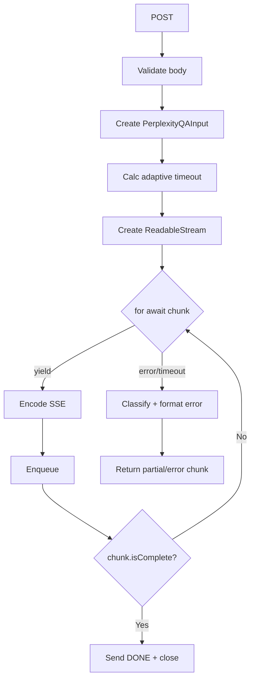

# Module: `perplexity-qa-stream`

## 1. Module Summary

This API route module provides Server-Sent Events (SSE) streaming endpoints for real-time AI-powered question answering using Perplexity API. It enables progressive display of AI thinking processes and answers with scholarly citations, bridging the gap between classical literature analysis and contemporary academic research. The module implements comprehensive error handling, adaptive timeouts, and graceful degradation to ensure robust user experience even during API failures or network issues.

## 2. Module Dependencies

* **Internal Dependencies:**
  * `@/ai/flows/perplexity-red-chamber-qa` - Async generator for streaming Perplexity responses
  * `@/types/perplexity-qa` - TypeScript interfaces for QA input/output structures
  * `@/ai/perplexity-config` - Adaptive timeout configuration system
  * `@/lib/perplexity-error-handler` - Comprehensive error classification and recovery

* **External Dependencies:**
  * `next/server` - NextRequest, NextResponse for API routing

## 3. Public API / Exports

* `POST(request)`: Streams AI-generated answers to user questions about "Dream of the Red Chamber" with real-time token-by-token delivery via SSE
* `GET()`: Returns API documentation, supported models, and usage instructions for health checks and developer reference

## 4. Code File Breakdown

### 4.1. `route.ts`

* **Purpose:** Implements SSE streaming for Perplexity AI, converting async generator outputs into browser-compatible event streams while handling lifecycle, timeouts, and recovery.

* **Functions:**
    * `POST(request: NextRequest): Promise<Response>` - Validates input, constructs PerplexityQAInput, calculates adaptive timeout, streams generator chunks as SSE, and handles error/timeout recovery.
    * `GET(): Promise<NextResponse>` - Returns API documentation JSON.

## 5. System and Data Flow

### 5.1. System Flowchart (Control Flow)

