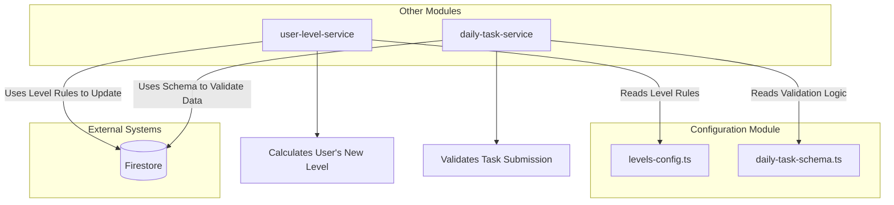
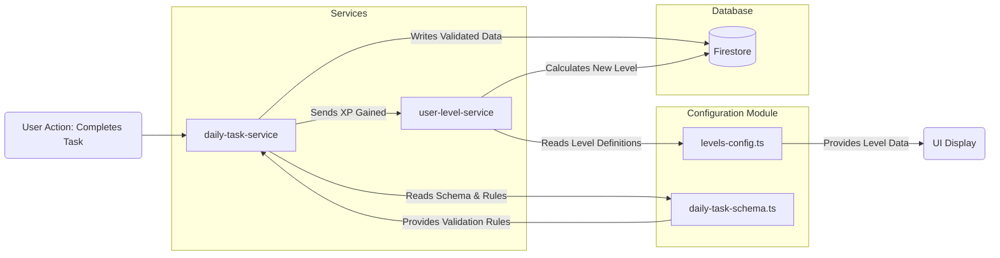

# Module: `Configuration`

## 1. Module Summary

The `Configuration` module centralizes static configuration and schema definitions for core application features, primarily the Daily Task system and the user progression/leveling system. It acts as a single source of truth for data structures, validation rules, and gamification mechanics, ensuring consistency and maintainability across the application.

## 2. Module Dependencies

* **Internal Dependencies:**
    * `../types/daily-task`: Imports TypeScript types for the daily task system.
    * `../types/user-level`: Imports TypeScript types for the user leveling system.
* **External Dependencies:**
    * None.

## 3. Public API / Exports

### daily-task-schema.ts Exports

* `DAILY_TASK_SCHEMA_CONFIG`: Master object aggregating all task system configurations
* `DAILY_TASK_COLLECTIONS`: Collection name constants (`TASKS`, `PROGRESS`, `HISTORY`)
* `REQUIRED_INDEXES`: Firestore composite index definitions
* `SUGGESTED_SECURITY_RULES`: Recommended Firestore security rules
* `TaskSchemaValidators`: Validation functions for task data integrity
* `DOCUMENT_ID_PATTERNS`: Functions for generating document IDs
* `COLLECTION_ESTIMATES`: Size and performance estimates for planning

#### Performance and Operational Constants (NEW)

* `QUERY_LIMITS`: Pagination and query result limits
  - `MAX_TASKS_PER_QUERY`: 50
  - `MAX_HISTORY_PER_QUERY`: 100
  - `DEFAULT_HISTORY_LIMIT`: 30
  - `MAX_PROGRESS_RECORDS`: 365 (1 year)
* `CACHE_TTL`: Time-to-live recommendations (in seconds)
  - `TASK_DEFINITIONS`: 3600 (1 hour)
  - `USER_PROGRESS`: 300 (5 minutes)
  - `TASK_HISTORY`: 1800 (30 minutes)
  - `STATISTICS`: 3600 (1 hour)
* `BATCH_LIMITS`: Batch operation constraints
  - `MAX_BATCH_SIZE`: 500 (Firestore limit)
  - `TASK_GENERATION_BATCH`: 50 (recommended)
* `RETENTION_POLICIES`: Data lifecycle configuration
  - `PROGRESS_RETENTION_DAYS`: 365 (1 year)
  - `HISTORY_RETENTION_DAYS`: -1 (infinite)
  - `INACTIVE_USER_THRESHOLD_DAYS`: 180 (6 months)

### levels-config.ts Exports

* `LEVELS_CONFIG`: Array of `UserLevel` objects defining the 8-level user progression system
* `MAX_LEVEL`: Highest achievable level ID (currently 7 - "Grand Master")
* `MAX_XP`: Maximum XP requirement for highest level (currently 630)
* `calculateLevelFromXP(totalXP: number)`: Determine user's level from XP
* `calculateXPProgress(totalXP: number)`: Calculate progress towards next level
* `getLevelConfig(level: number)`: Retrieve full configuration for a specific level
* `getAllPermissionsForLevel(level: number)`: Get cumulative permissions for a level

## 4. Code File Breakdown

### 4.1. `daily-task-schema.ts`

* **Purpose:** This file defines the complete Firestore schema, validation rules, and operational constants for the "Daily Task System". It serves as the canonical source for all data-related aspects of daily tasks, from database structure to security rules and performance estimates. This centralization is critical for maintaining data integrity and simplifying interactions with the task-related Firestore collections.
* **Functions:**
    * `isDailyTask(obj: unknown): obj is DailyTask` - Type guard to validate if an object is a `DailyTask`.
    * `isDailyTaskProgress(obj: unknown): obj is DailyTaskProgress` - Type guard to validate if an object is a `DailyTaskProgress`.
    * `isTaskHistoryRecord(obj: unknown): obj is TaskHistoryRecord` - Type guard to validate if an object is a `TaskHistoryRecord`.
* **Key Classes / Constants / Variables:**
    * `DAILY_TASK_COLLECTIONS`: Object mapping task-related collection names (`TASKS`, `PROGRESS`, `HISTORY`)
    * `REQUIRED_INDEXES`: Array of composite index definitions for Firestore
    * `SUGGESTED_SECURITY_RULES`: Recommended Firestore security rules for task collections
    * `TaskSchemaValidators`: Validation function suite (e.g., `isValidTaskType`, `isValidXPReward`, `isValidScore`)
    * `DOCUMENT_ID_PATTERNS`: Document ID generation patterns for progress and history records
    * `COLLECTION_ESTIMATES`: Size, growth rate, and access pattern estimates for capacity planning
    * `QUERY_LIMITS`: Query pagination limits for database operations
    * `CACHE_TTL`: Time-to-live recommendations for different data types
    * `BATCH_LIMITS`: Firestore batch operation constraints
    * `RETENTION_POLICIES`: Data lifecycle and archival configuration
    * `DAILY_TASK_SCHEMA_CONFIG`: Master configuration aggregating all above constants

### 4.2. `levels-config.ts`

* **Purpose:** This file defines the application's entire 8-level user progression system, themed around the "Dream of the Red Chamber". It specifies the XP requirements, titles, permissions, and visual/functional rewards for each level. This file is the single source of truth for all gamification and user advancement logic.
* **Functions:**
    * `getLevelConfig(level: number): UserLevel | null` - Retrieves the complete configuration object for a given level ID.
    * `getAllPermissionsForLevel(level: number): LevelPermission[]` - Returns a cumulative array of all permissions a user has at a specific level.
    * `calculateLevelFromXP(totalXP: number): number` - Calculates a user's current level ID based on their total experience points.
    * `calculateXPProgress(totalXP: number): object` - Calculates a user's progress towards the next level, returning current XP, XP needed, and a percentage.
* **Key Classes / Constants / Variables:**
    * `LEVELS_CONFIG`: Constant array of `UserLevel` objects defining all 8 levels with XP, titles, permissions, etc.
    * `MAX_LEVEL`: Constant for highest achievable level ID (currently 7 - "Grand Master")
    * `MAX_XP`: Constant for maximum XP requirement for Level 7 (currently 630)

## 5. System and Data Flow

### 5.1. System Flowchart (Control Flow)



### 5.2. Data Flow Diagram (Data Transformation)



## 6. Usage Example & Testing

* **Usage:**
  ```typescript
  import { calculateLevelFromXP, LEVELS_CONFIG } from '@/lib/config/levels-config';
  import { TaskSchemaValidators } from '@/lib/config/daily-task-schema';

  const userXP = 250;
  const userLevel = calculateLevelFromXP(userXP);
  console.log(`User is level ${userLevel} (${LEVELS_CONFIG[userLevel].title})`);

  const score = 95;
  if (TaskSchemaValidators.isValidScore(score)) {
    // Proceed with valid score
  }
  ```
* **Testing:** This module contains only static configuration and pure functions. It is tested indirectly through the unit and integration tests of the services that consume it, such as `user-level-service.test.ts` and `daily-task-service.test.ts`, which verify that the rules and schemas defined here are correctly applied.

---

**Document Version:** 2.0
**Last Updated:** 2025-11-30 (Added QUERY_LIMITS, CACHE_TTL, BATCH_LIMITS, RETENTION_POLICIES, MAX_LEVEL, MAX_XP documentation)
**Previous Version:** 1.0 (Initial documentation)
