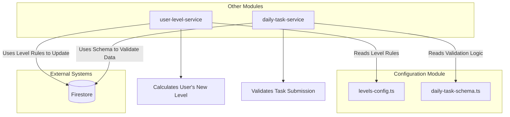
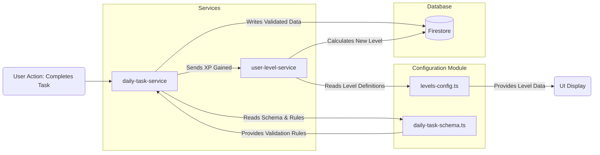

# Module: `Configuration`

## 1. Module Summary

The `Configuration` module centralizes static configuration and schema definitions for core application features, primarily the Daily Task system and the user progression/leveling system. It acts as a single source of truth for data structures, validation rules, and gamification mechanics, ensuring consistency and maintainability across the application.

## 2. Module Dependencies

* **Internal Dependencies:**
    * `../types/daily-task`: Imports TypeScript types for the daily task system.
    * `../types/user-level`: Imports TypeScript types for the user leveling system.
* **External Dependencies:**
    * None.

## 3. Public API / Exports

* `DAILY_TASK_SCHEMA_CONFIG`: An object containing the entire configuration for the daily task system, including collection names, indexes, validation rules, and more.
* `LEVELS_CONFIG`: An array of `UserLevel` objects defining the entire 8-level user progression system.
* `TaskSchemaValidators`: A collection of functions to validate the integrity of daily task data.
* `calculateLevelFromXP(totalXP: number)`: A utility function to determine a user's level based on their accumulated XP.
* `getLevelConfig(level: number)`: A utility function to retrieve the full configuration for a specific level.

## 4. Code File Breakdown

### 4.1. `daily-task-schema.ts`

* **Purpose:** This file defines the complete Firestore schema, validation rules, and operational constants for the "Daily Task System". It serves as the canonical source for all data-related aspects of daily tasks, from database structure to security rules and performance estimates. This centralization is critical for maintaining data integrity and simplifying interactions with the task-related Firestore collections.
* **Functions:**
    * `isDailyTask(obj: unknown): obj is DailyTask` - Type guard to validate if an object is a `DailyTask`.
    * `isDailyTaskProgress(obj: unknown): obj is DailyTaskProgress` - Type guard to validate if an object is a `DailyTaskProgress`.
    * `isTaskHistoryRecord(obj: unknown): obj is TaskHistoryRecord` - Type guard to validate if an object is a `TaskHistoryRecord`.
* **Key Classes / Constants / Variables:**
    * `DAILY_TASK_COLLECTIONS`: An object mapping task-related collection names to constants (`TASKS`, `PROGRESS`, `HISTORY`).
    * `REQUIRED_INDEXES`: An array defining the composite indexes required in Firestore for efficient querying of task data.
    * `SUGGESTED_SECURITY_RULES`: A string literal containing the recommended Firestore security rules for the task collections.
    * `TaskSchemaValidators`: An object containing a suite of validation functions for all aspects of task data (e.g., `isValidTaskType`, `isValidXPReward`).
    * `DAILY_TASK_SCHEMA_CONFIG`: A master constant that aggregates all other exported configurations from this file into a single object for easy importing.

### 4.2. `levels-config.ts`

* **Purpose:** This file defines the application's entire 8-level user progression system, themed around the "Dream of the Red Chamber". It specifies the XP requirements, titles, permissions, and visual/functional rewards for each level. This file is the single source of truth for all gamification and user advancement logic.
* **Functions:**
    * `getLevelConfig(level: number): UserLevel | null` - Retrieves the complete configuration object for a given level ID.
    * `getAllPermissionsForLevel(level: number): LevelPermission[]` - Returns a cumulative array of all permissions a user has at a specific level.
    * `calculateLevelFromXP(totalXP: number): number` - Calculates a user's current level ID based on their total experience points.
    * `calculateXPProgress(totalXP: number): object` - Calculates a user's progress towards the next level, returning current XP, XP needed, and a percentage.
* **Key Classes / Constants / Variables:**
    * `LEVELS_CONFIG`: A constant array of `UserLevel` objects, where each object represents a level and its associated properties (XP, title, permissions, etc.).
    * `MAX_LEVEL`: A constant representing the highest achievable level in the system.

## 5. System and Data Flow

### 5.1. System Flowchart (Control Flow)



### 5.2. Data Flow Diagram (Data Transformation)



## 6. Usage Example & Testing

* **Usage:**
  ```typescript
  import { calculateLevelFromXP, LEVELS_CONFIG } from '@/lib/config/levels-config';
  import { TaskSchemaValidators } from '@/lib/config/daily-task-schema';

  const userXP = 250;
  const userLevel = calculateLevelFromXP(userXP);
  console.log(`User is level ${userLevel} (${LEVELS_CONFIG[userLevel].title})`);

  const score = 95;
  if (TaskSchemaValidators.isValidScore(score)) {
    // Proceed with valid score
  }
  ```
* **Testing:** This module contains only static configuration and pure functions. It is tested indirectly through the unit and integration tests of the services that consume it, such as `user-level-service.test.ts` and `daily-task-service.test.ts`, which verify that the rules and schemas defined here are correctly applied.

