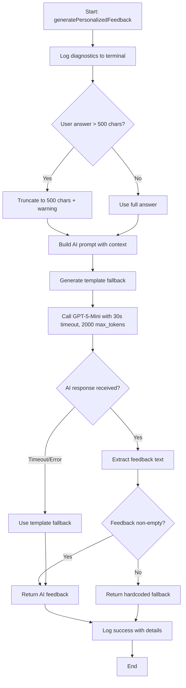
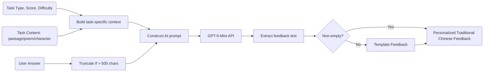

# Module: `ai-feedback-generator.ts`

## 1. Module Summary

The `ai-feedback-generator` module provides GPT-5-Mini powered personalized feedback generation for daily task submissions, replacing template-based feedback with dynamic AI analysis. This module analyzes user answers in context of task requirements, generates detailed Traditional Chinese feedback with specific strengths/weaknesses/suggestions, implements answer truncation (500 chars) to avoid token limits, provides comprehensive console logging for debugging, and falls back to template feedback when AI is unavailable. The feedback follows a "優點-不足-建議" (Strengths-Weaknesses-Suggestions) structure with encouraging tone.

**Phase 2.10 Update:** Module has been updated to properly handle GPT-5-mini's reasoning token behavior. The max_tokens parameter has been increased from 600 to 2000, timeout increased from 20s to 30s, and added verbosity/reasoning_effort parameters to ensure reliable feedback generation and prevent empty responses.

## 2. Module Dependencies

* **Internal Dependencies:**
  * `@/lib/openai-client` - GPT-5-Mini client for completion generation with fallback.
  * `@/lib/types/daily-task` - Type definitions for task types, difficulty, and task content.
* **External Dependencies:** None. Dependencies handled through openai-client.

## 3. Public API / Exports

* `generatePersonalizedFeedback(params: FeedbackGenerationParams): Promise<string>` - Generates AI-powered personalized feedback.
* **Type Exports:**
  * `FeedbackGenerationParams` - Parameters for feedback generation (taskType, userAnswer, score, difficulty, taskContent, taskTitle).

## 4. Code File Breakdown

### 4.1. `ai-feedback-generator.ts`

* **Purpose:** Transforms task evaluation from generic templates to personalized, context-aware analysis using GPT-5-Mini. The module's key innovations include: (1) **Context-rich prompts** - Includes task content (original text, questions, poems, characters) so AI understands what user was asked to do; (2) **Score-aware feedback** - AI knows the user's score (0-100) and can calibrate feedback intensity accordingly; (3) **Answer truncation strategy** - Limits user answers to 500 characters before sending to AI to avoid finish_reason="length" errors while preserving analysis quality; (4) **Comprehensive logging** - Outputs detailed terminal logs with emojis (🎓 for start, ✅ for success, ❌ for errors) showing answer preview, score, difficulty, and API response details; (5) **Multi-tier fallback** - Falls back to template feedback if AI times out, then to hardcoded fallback if template fails; (6) **Simplified prompts** - Uses concise prompts optimized for GPT-5-mini's capabilities, requesting 150-300 character feedback in specific structure.
* **Functions:**
    * `generatePersonalizedFeedback(params: FeedbackGenerationParams): Promise<string>` - **Main feedback generation function**. Logs detailed diagnostics with emojis to terminal. Truncates answers > 500 chars to avoid token limits. Builds task-specific prompt via `buildFeedbackPrompt`. Calls `generateCompletionWithFallback` from openai-client with 30s timeout (increased from 20s), 2000 max tokens (increased from 600 for GPT-5-mini reasoning), verbosity='medium', and reasoning_effort='minimal'. Generates template fallback via `generateTemplateFeedback`. Extracts feedback from result (handles both string and object responses). Falls back to hardcoded default if feedback empty. Logs success with model and token usage. Returns Traditional Chinese feedback string. Catches errors and returns fallback feedback.
    * `buildFeedbackPrompt(params: FeedbackGenerationParams): string` - Constructs AI prompt. Starts with role definition: "你是《紅樓夢》教師，評估學生作答。" Adds task title and score. Calls `buildTaskSpecificContext` to add task content. Adds truncated user answer. Specifies output requirements: "請用繁體中文寫150-300字評語，包含：1. 優點（具體說明好的地方）2. 不足（需要改進的地方）3. 建議（如何進步）". Returns complete prompt string.
    * `buildTaskSpecificContext(taskType, taskContent): string` - Adds task-specific context based on type. MORNING_READING: includes original text passage and question. POETRY: includes poem title and content. CHARACTER_INSIGHT: includes character name and context. CULTURAL_EXPLORATION: includes cultural element title, description, and first question. COMMENTARY_DECODE: includes commentary text and original text. Returns context string for AI understanding.
    * `getTaskTypeDisplayName(taskType): string` - Maps task type enum to Traditional Chinese display names. Returns strings like "晨讀時光 - 文本理解", "詩詞韻律 - 詩詞默寫", "人物洞察 - 角色分析", etc.
    * `getDifficultyDisplayName(difficulty): string` - Maps difficulty enum to Traditional Chinese. EASY → "簡單", MEDIUM → "中等", HARD → "困難".
    * `generateTemplateFeedback(taskType, score): string` - **Fallback template generator**. Categorizes score: >= 85 = excellent, >= 70 = good, >= 60 = average, < 60 = needsWork. Each category has 3 randomized feedback templates in Traditional Chinese following "優點-不足-建議" structure with encouraging "繼續加油！" endings. Examples: "優點：分析深入且條理清楚。不足：仍可補充關鍵語句引用。建議：維持這份細緻度並繼續擴展觀點，繼續加油！" Returns random template from appropriate category.
* **Key Classes / Constants / Variables:**
    * `FeedbackGenerationParams: interface` - 6 fields: taskType (DailyTaskType enum), userAnswer (string), score (number 0-100), difficulty (TaskDifficulty enum), taskContent (task-specific content object), taskTitle (optional string).
    * Feedback templates - 4 categories (excellent/good/average/needsWork), each with 3 variations, all in Traditional Chinese with encouraging tone and specific improvement suggestions.

## 5. System and Data Flow

### 5.1. System Flowchart (Control Flow)



### 5.2. Data Flow Diagram (Data Transformation)



## 6. Usage Example & Testing

* **Usage:**
```typescript
import { generatePersonalizedFeedback } from '@/lib/ai-feedback-generator';
import { DailyTaskType, TaskDifficulty } from './types/daily-task';

// Generate feedback for morning reading task
const feedback = await generatePersonalizedFeedback({
  taskType: DailyTaskType.MORNING_READING,
  userAnswer: '林黛玉初入賈府時展現出極度謹慎的心理狀態，原文中「步步留心，時時在意」充分體現了她作為寄人籬下者的敏感與自我保護意識。',
  score: 85,
  difficulty: TaskDifficulty.MEDIUM,
  taskContent: {
    textPassage: {
      text: '卻說黛玉自那日棄舟登岸時...',
      question: '從這段文字中，你認為林黛玉初到賈府時的心理狀態是什麼？',
      hint: '思考提示：注意黛玉的行為描述...',
      expectedKeywords: ['謹慎', '小心', '拘謹', '寄人籬下']
    }
  },
  taskTitle: '晨讀時光 - 深入紅樓'
});

console.log(feedback);
// Output example: "優點：您準確抓住了林黛玉「步步留心，時時在意」的核心心理，並正確聯繫到「寄人籬下」的處境，
// 展現出良好的文本理解能力。不足：分析略顯簡略，可以進一步探討她這種心理對後續性格塑造的影響。
// 建議：嘗試從更多原文細節出發，補充具體行為描寫，讓分析更加豐滿。繼續保持這份敏銳的觀察力！"

// Long answer truncation example
const longAnswer = '林黛玉初入賈府的心理狀態...' + '...'.repeat(200); // Very long answer
const feedbackTruncated = await generatePersonalizedFeedback({
  taskType: DailyTaskType.CHARACTER_INSIGHT,
  userAnswer: longAnswer, // Will be truncated to 500 chars
  score: 75,
  difficulty: TaskDifficulty.HARD,
  taskContent: {
    character: {
      characterName: '林黛玉',
      description: '林黛玉是賈母的外孫女...',
      analysisPrompts: ['林黛玉的性格特點是什麼？']
    }
  }
});
// Console will show: "⚠️ [Feedback] 學生答案過長 (XXX 字元)，已截斷至 500 字元以節省 tokens"

// Fallback scenario (AI unavailable)
process.env.OPENAI_API_KEY = ''; // Simulate AI unavailable
const feedbackFallback = await generatePersonalizedFeedback({
  taskType: DailyTaskType.POETRY,
  userAnswer: '這首詩描寫了秋天的景色',
  score: 65,
  difficulty: TaskDifficulty.EASY,
  taskContent: { poem: { title: '秋窗風雨夕', content: '秋花慘淡秋草黃...' } }
});
// Returns template feedback from excellent/good/average/needsWork categories
```
* **Testing:** Testing strategy focuses on prompt generation and fallback behavior:
  - Test feedback generation with valid AI response returns personalized feedback
  - Test answer truncation when > 500 characters
  - Test truncation preserves answer meaning for short content
  - Test prompt includes task-specific context (text/poem/character)
  - Test prompt includes score for AI calibration
  - Test feedback format follows "優點-不足-建議" structure
  - Test Traditional Chinese output
  - Test template fallback when AI timeout occurs
  - Test hardcoded fallback when both AI and template fail
  - Test different score ranges map to appropriate template categories
  - Test console logging outputs expected format with emojis
  - Test empty answer handling
  - Test all task types have appropriate context building
  - Test model and token usage are logged when AI succeeds
