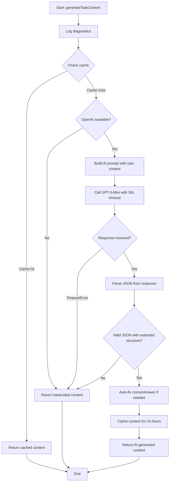
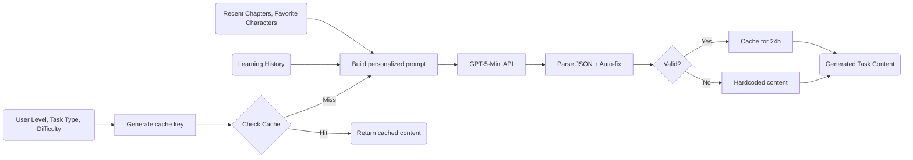

# Module: `ai-task-content-generator.ts`

## 1. Module Summary

The `ai-task-content-generator` module provides GPT-5-Mini powered dynamic task content generation for the daily task system, replacing hardcoded content libraries with user-adaptive AI generation. This module generates personalized task content (text passages, poems, character prompts, cultural quizzes, commentary) based on user level, learning history, recent chapters, and preferences, implements 24-hour content caching to reduce API costs, includes comprehensive diagnostics logging with availability checks, auto-fixes common JSON issues (correctAnswer number→string conversion), and falls back to hardcoded content when AI is unavailable or fails validation.

## 2. Module Dependencies

* **Internal Dependencies:**
  * `@/lib/openai-client` - GPT-5-Mini client with fallback support.
  * `@/lib/types/daily-task` - Type definitions for task types, difficulty, and content structures.
* **External Dependencies:** None. Dependencies handled through openai-client.

## 3. Public API / Exports

* `generateTaskContent(params: TaskContentGenerationParams): Promise<GeneratedTaskContent>` - Main content generation function with AI and fallback.
* `clearContentCache(): void` - Utility to clear 24-hour content cache.
* **Type Exports:**
  * `TaskContentGenerationParams` - Parameters including userLevel, taskType, difficulty, recentChapters, learningHistory, learningPreferences.
  * `GeneratedTaskContent` - Union type of all possible task content structures.

## 4. Code File Breakdown

### 4.1. `ai-task-content-generator.ts`

* **Purpose:** Enables personalized, adaptive learning by generating task content dynamically based on individual user profiles. The module's key architectural decisions include: (1) **User-adaptive prompts** - Incorporates user level, recent chapters read, favorite characters, and learning history into AI prompts for contextually relevant content; (2) **24-hour caching** - Caches generated content per `userLevel_taskType_difficulty` key to reduce API costs while still providing fresh content daily; (3) **Comprehensive diagnostics** - Logs detailed availability checks (OpenAI configured?, OPENAI_API_KEY set?, server-side execution?) and AI generation process with decorative separators for easy debugging; (4) **JSON auto-fix** - Automatically converts `correctAnswer: 0` (number index) to `correctAnswer: "option text"` (string value) for cultural exploration quizzes, fixing common GPT-5-mini JSON formatting mistakes; (5) **Graceful degradation** - Falls back to curated hardcoded content if AI unavailable, ensuring system never fails to generate tasks; (6) **Task-specific JSON schemas** - Provides detailed JSON format examples in prompts for each task type with Traditional Chinese instructions.
* **Functions:**
    * `generateTaskContent(params: TaskContentGenerationParams): Promise<GeneratedTaskContent>` - **Main content generation orchestrator**. Logs diagnostic header with decorative separators (━ lines). Logs parameters: userLevel, taskType, difficulty. Checks cache with key `${userLevel}_${taskType}_${difficulty}`. Returns cached content if found (cache hit). Logs cache miss. Checks OpenAI availability via `isOpenAIAvailable()`. Logs availability status and environment checks (API key configured?, server-side?). Returns hardcoded content if OpenAI unavailable. Builds prompt via `buildContentGenerationPrompt`. Gets fallback content via `getHardcodedContent`. Calls `generateCompletionWithFallback` with 30s timeout (increased from 15s to reduce timeouts), 500 max tokens, medium verbosity, minimal reasoning effort (optimized for structured JSON output). Parses and validates AI response via `parseAndValidateContent`. Caches valid generated content with 24-hour TTL. Returns generated content or fallback on validation failure. Catches errors and returns fallback.
    * `buildContentGenerationPrompt(params: TaskContentGenerationParams): string` - Constructs AI prompt with context. Starts with role: "生成《紅樓夢》學習任務內容。" Adds level and difficulty in Traditional Chinese. Adds recent chapters if provided: "最近章節：第X、Y回". Adds favorite characters if provided: "喜愛角色：林黛玉、賈寶玉". Calls `buildTaskSpecificPrompt` for task-type requirements. Adds output format instruction: "使用繁體中文，直接輸出JSON（不含其他文字）：". Returns complete prompt string.
    * `buildTaskSpecificPrompt(taskType, difficulty, userLevel): string` - Generates task-type-specific requirements and JSON schemas. MORNING_READING: requests 50-100 char passage, understanding question, detailed hint, expectedKeywords array, includes JSON example with textPassage structure, notes for new users (level <=1) to use simple passages with detailed hints. POETRY: requests Dream of the Red Chamber poem with difficulty level, includes JSON example with poem structure (title, author, content with newlines, background). CHARACTER_INSIGHT: requests character analysis with description (50-80 chars), 2-3 analysisPrompts, relatedChapters array, includes JSON example. CULTURAL_EXPLORATION: requests cultural knowledge quiz (clothing/food/architecture/etiquette) with multiple choice questions, includes detailed JSON example with nested questions array, **critical note**: "correctAnswer是字串（非數字），questions是陣列" to guide AI. COMMENTARY_DECODE: requests Zhiyanzhai commentary with original text, chapter number, interpretation hints, includes JSON example. Returns task-specific prompt section.
    * `parseAndValidateContent(aiOutput: string, taskType: DailyTaskType): GeneratedTaskContent | null` - **AI response parser with auto-fix**. Extracts JSON using regex `/\{[\s\S]*\}/`. Returns null if no JSON found. Parses JSON. **Auto-fix for CULTURAL_EXPLORATION**: Supports both `culturalElement` and `culturalKnowledge` keys (flexibility). Iterates questions array and converts `correctAnswer` from number (array index) to string (option value): `q.options?.[q.correctAnswer]` or stringifies number. Returns content object for matched task type. Logs received JSON keys for debugging. Returns parsed content even if exact validation didn't pass (lenient parsing). Catches JSON parse errors and returns null.
    * `getHardcodedContent(taskType: TaskDifficulty): GeneratedTaskContent` - **Fallback content library**. MORNING_READING: Chapter 3, Daiyu meets grandmother scene. POETRY: "葬花吟" excerpt by Lin Daiyu from Chapter 27. CHARACTER_INSIGHT: Lin Daiyu character analysis prompt. CULTURAL_EXPLORATION: Qing Dynasty clothing quiz. COMMENTARY_DECODE: Zhiyanzhai commentary from Chapter 5. Returns task-specific hardcoded content object. Provides quality fallback ensuring tasks always available.
    * `getDifficultyName(difficulty): string` - Maps difficulty enum to Traditional Chinese: EASY→"簡單", MEDIUM→"中等", HARD→"困難".
    * `clearContentCache(): void` - Clears content cache Map. Logs success message. Utility for testing or forced refresh.
* **Key Classes / Constants / Variables:**
    * `TaskContentGenerationParams: interface` - 6 fields: userLevel (0-7), taskType (enum), difficulty (enum), recentChapters (optional number array), learningHistory (optional with completedTaskTypes and averageScores), learningPreferences (optional with favoriteCharacters and interestedTopics).
    * `GeneratedTaskContent: type` - Union type of 5 possible structures: `{ textPassage: TextPassage }`, `{ poem: PoemContent }`, `{ character: CharacterPrompt }`, `{ culturalElement: CulturalElement }`, `{ commentary: CommentaryContent }`. Matches DailyTask['content'] type.
    * `contentCache: Map<string, GeneratedTaskContent>` - Cache storage with keys format `${userLevel}_${taskType}_${difficulty}`.
    * `CACHE_TTL_MS: const` - 24 hour cache TTL (24 * 60 * 60 * 1000 = 86,400,000 ms). Balances freshness with API cost reduction.

## 5. System and Data Flow

### 5.1. System Flowchart (Control Flow)



### 5.2. Data Flow Diagram (Data Transformation)



## 6. Usage Example & Testing

* **Usage:**
```typescript
import { generateTaskContent, clearContentCache } from '@/lib/ai-task-content-generator';
import { DailyTaskType, TaskDifficulty } from './types/daily-task';

// Generate personalized morning reading content
const readingContent = await generateTaskContent({
  userLevel: 3,
  taskType: DailyTaskType.MORNING_READING,
  difficulty: TaskDifficulty.MEDIUM,
  recentChapters: [1, 2, 3],
  learningHistory: {
    completedTaskTypes: [DailyTaskType.MORNING_READING, DailyTaskType.POETRY],
    averageScores: {
      [DailyTaskType.MORNING_READING]: 75,
      [DailyTaskType.POETRY]: 82
    }
  },
  learningPreferences: {
    favoriteCharacters: ['林黛玉', '賈寶玉'],
    interestedTopics: ['詩詞', '人物關係']
  }
});

console.log(readingContent.textPassage.text); // AI-generated passage
console.log(readingContent.textPassage.question); // AI-generated question
console.log(readingContent.textPassage.hint); // AI-generated hint

// Generate cultural exploration content (with auto-fix)
const culturalContent = await generateTaskContent({
  userLevel: 5,
  taskType: DailyTaskType.CULTURAL_EXPLORATION,
  difficulty: TaskDifficulty.HARD
});

// AI might return correctAnswer: 2, auto-fixed to correctAnswer: "鬥碗"
console.log(culturalContent.culturalElement.questions[0].correctAnswer); // String, not number

// Cache behavior demonstration
const content1 = await generateTaskContent({ userLevel: 2, taskType: DailyTaskType.POETRY, difficulty: TaskDifficulty.EASY });
// First call: AI generation (logs "Cache miss, need to generate new content")

const content2 = await generateTaskContent({ userLevel: 2, taskType: DailyTaskType.POETRY, difficulty: TaskDifficulty.EASY });
// Second call with same params: Cache hit (logs "Using cached content")

// Clear cache for testing
clearContentCache();
const content3 = await generateTaskContent({ userLevel: 2, taskType: DailyTaskType.POETRY, difficulty: TaskDifficulty.EASY });
// After clear: AI generation again

// Fallback behavior (AI unavailable)
process.env.OPENAI_API_KEY = ''; // Simulate unavailable
const fallbackContent = await generateTaskContent({
  userLevel: 1,
  taskType: DailyTaskType.CHARACTER_INSIGHT,
  difficulty: TaskDifficulty.EASY
});
// Returns hardcoded Lin Daiyu character prompt
console.log(fallbackContent.character.characterName); // '林黛玉'
```
* **Testing:** Testing strategy includes AI and fallback validation:
  - Test cache hit returns cached content without API call
  - Test cache miss triggers AI generation
  - Test cache TTL expires after 24 hours
  - Test OpenAI availability check when API key missing
  - Test fallback to hardcoded content when AI unavailable
  - Test prompt includes user context (level, recent chapters, preferences)
  - Test JSON parsing extracts content from AI response
  - Test auto-fix converts correctAnswer from number to string
  - Test auto-fix handles both correctAnswer formats gracefully
  - Test validation returns null for invalid JSON
  - Test all task types have appropriate hardcoded fallback
  - Test diagnostic logging outputs expected format
  - Test clearContentCache empties cache Map
  - Test timeout (30s) prevents hanging on slow AI responses
  - Test Traditional Chinese output in all content types
