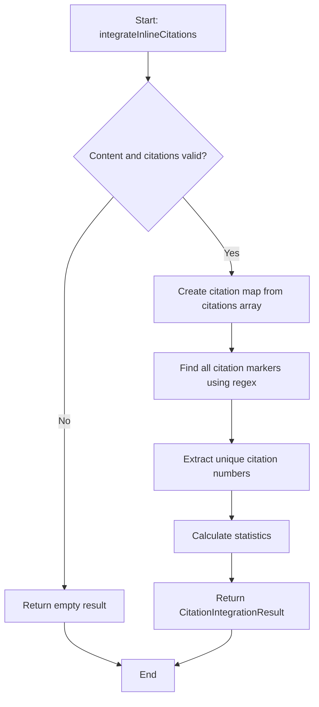

# Module: `citation-processor.ts`

## 1. Module Summary

The `citation-processor` module provides comprehensive citation processing utilities for integrating Perplexity API citations into markdown content. This module handles citation marker extraction (`[1]`, `[2]`), inline citation integration, reference section generation, citation validation, deduplication, sorting, grouping by type (academic, news, web), and summary text creation. The module supports the UX design pattern specified in improvement reports by transforming raw API citations into user-friendly reference materials with Traditional Chinese labels.

## 2. Module Dependencies

* **Internal Dependencies:**
  * `@/types/perplexity-qa` - Type definition for `PerplexityCitation`.
* **External Dependencies:** None. Pure TypeScript utility module.

## 3. Public API / Exports

* `integrateInlineCitations(content: string, citations: PerplexityCitation[]): CitationIntegrationResult` - Integrates citations into content and returns processed content with citation map and statistics.
* `extractCitationPositions(content: string, contextLength?: number): CitationPosition[]` - Extracts citation positions from content with surrounding context.
* `generateReferencesSection(citations: PerplexityCitation[], options?: {...}): string` - Generates formatted markdown reference section.
* `validateCitationReferences(content: string, citations: PerplexityCitation[]): { valid, missingCitations, unusedCitations }` - Validates that all citation markers have corresponding citations.
* `formatInlineCitation(citationNumber: number, citation?: PerplexityCitation): string` - Formats citation for inline display.
* `groupCitationsByType(citations: PerplexityCitation[]): Record<string, PerplexityCitation[]>` - Groups citations by type (academic, news, web, default).
* `createCitationSummary(citations: PerplexityCitation[]): string` - Creates human-readable Traditional Chinese summary of citation sources.
* `deduplicateCitations(citations: PerplexityCitation[]): PerplexityCitation[]` - Removes duplicate citations by URL.
* `sortCitations(citations: PerplexityCitation[], sortBy: 'number' | 'type' | 'date'): PerplexityCitation[]` - Sorts citations by specified criteria.
* **Type Exports:**
  * `CitationIntegrationResult` - Result of citation integration with processed content, citation map, numbers, and stats.
  * `CitationPosition` - Citation position in text with number, start/end index, and text segment.

## 4. Code File Breakdown

### 4.1. `citation-processor.ts`

* **Purpose:** Provides a complete toolkit for processing citations from Perplexity API responses and integrating them into markdown content for user display. The module's design emphasizes flexibility and robustness: citation integration works even when citations array is empty or mismatched with text markers, validation detects missing and unused citations for debugging, and grouping/sorting enables organized reference sections. All user-facing text (summaries, markdown sections) uses Traditional Chinese to match the platform's language.
* **Functions:**
    * `integrateInlineCitations(content: string, citations: PerplexityCitation[]): CitationIntegrationResult` - **Primary integration function**. Handles edge case of empty content or no citations by returning empty result. Creates citation map (number → citation object). Uses regex `/\[(\d+)\]/g` to find all citation markers in content. Extracts unique citation numbers used (sorted). Calculates statistics: total citations (count of markers), unique citations (count of distinct numbers), citations per paragraph (average). Returns result with processed content (unchanged), citation map, citation numbers array, and stats object.
    * `extractCitationPositions(content: string, contextLength: number = 50): CitationPosition[]` - Finds all citation markers with positions in text. For each marker, records: citation number, start index, end index, text segment (50 chars before and after by default). Returns array of `CitationPosition` objects. Useful for highlighting citations in UI or debugging citation placement.
    * `generateReferencesSection(citations: PerplexityCitation[], options?: { title, numbered, includeSnippets, includeMetadata }): string` - **Markdown reference generator**. Accepts options: `title` (default "## 參考來源"), `numbered` (default true), `includeSnippets` (default true), `includeMetadata` (default true). For each citation, generates: citation number in brackets, clickable link with title and URL, optional snippet as blockquote, optional metadata (domain, publish date). Returns markdown string with empty line between citations. Returns empty string if no citations.
    * `validateCitationReferences(content: string, citations: PerplexityCitation[]): { valid, missingCitations, unusedCitations }` - **Citation validation**. Extracts all referenced numbers from content using regex. Compares with available citation numbers from citations array. Returns: `valid` (boolean - true if all referenced numbers have citations), `missingCitations` (array of numbers referenced but not available), `unusedCitations` (array of numbers available but not referenced). Helps detect citation mismatch issues.
    * `formatInlineCitation(citationNumber: number, citation?: PerplexityCitation): string` - Formats single citation for inline use. If citation object provided, returns markdown link: `[N](url "title")`. If no citation, returns simple bracket notation: `[N]`.
    * `groupCitationsByType(citations: PerplexityCitation[]): Record<string, PerplexityCitation[]>` - Organizes citations into groups. Creates groups: `academic`, `news`, `web`, `default`. Iterates citations and adds each to appropriate group based on `type` field. Returns object with group names as keys and citation arrays as values. Missing types default to `'default'` group.
    * `createCitationSummary(citations: PerplexityCitation[]): string` - **Traditional Chinese summary generator**. Returns '無引用來源' if empty. Groups citations by type. Constructs summary parts: "N 個學術來源", "N 個新聞來源", "N 個網頁來源" (combines web and default). Joins parts with Traditional Chinese punctuation '、'. Example output: "2 個學術來源、3 個網頁來源". Falls back to "共 N 個引用來源" if no grouping.
    * `deduplicateCitations(citations: PerplexityCitation[]): PerplexityCitation[]` - Removes duplicates by URL (case-insensitive). Uses Set to track seen URLs. Returns array with only first occurrence of each unique URL. Preserves original order.
    * `sortCitations(citations: PerplexityCitation[], sortBy: 'number' | 'type' | 'date'): PerplexityCitation[]` - **Multi-criteria sorting**. Creates shallow copy to avoid mutation. Sorts by: (1) `'number'` - parses citation number as integer, sorts ascending; (2) `'type'` - uses type order (academic=1, news=2, web=3, default=4); (3) `'date'` - parses publishDate as Date, sorts descending (newest first). Returns sorted array.
* **Key Classes / Constants / Variables:**
    * `CitationIntegrationResult: interface` - Result object with 4 fields: `processedContent` (string with markers), `citationMap` (Map of number to citation), `citationNumbers` (array of used numbers), `stats` (object with totalCitations, uniqueCitations, citationsPerParagraph).
    * `CitationPosition: interface` - Position object with 4 fields: `number` (citation number), `startIndex` (start position in text), `endIndex` (end position), `textSegment` (surrounding text).

## 5. System and Data Flow

### 5.1. System Flowchart (Control Flow)



### 5.2. Data Flow Diagram (Data Transformation)

```mermaid
graph LR
    Input1(Markdown content with [1], [2] markers) --> Regex[Regex pattern /\[(\d+)\]/g];
    Input2(PerplexityCitation[] from API) --> Map[Create citation map];
    Regex --> Numbers[Extract citation numbers];
    Numbers --> Stats[Calculate statistics];
    Map --> Integration[Combine map + numbers + stats];
    Stats --> Integration;
    Integration --> Output(CitationIntegrationResult);
```

## 6. Usage Example & Testing

* **Usage:**
```typescript
import {
  integrateInlineCitations,
  generateReferencesSection,
  validateCitationReferences,
  createCitationSummary,
  deduplicateCitations,
  sortCitations,
} from '@/lib/citation-processor';

// Integrate citations into content
const result = integrateInlineCitations(answerText, citations);
console.log(result.citationNumbers); // [1, 2, 3]
console.log(result.stats.uniqueCitations); // 3
console.log(result.citationMap.get(1)); // { number: "1", title: "...", url: "..." }

// Generate references section
const referencesMarkdown = generateReferencesSection(citations, {
  title: '## 參考資料',
  numbered: true,
  includeSnippets: true,
  includeMetadata: true,
});

// Validate citations
const validation = validateCitationReferences(answerText, citations);
if (!validation.valid) {
  console.warn('Missing citations:', validation.missingCitations);
  console.warn('Unused citations:', validation.unusedCitations);
}

// Create summary for UI
const summary = createCitationSummary(citations); // "3 個學術來源、2 個網頁來源"

// Deduplicate and sort
const uniqueCitations = deduplicateCitations(citations);
const sortedByType = sortCitations(uniqueCitations, 'type');
```
* **Testing:** Unit tests verify citation processing:
  - Test `integrateInlineCitations` with various citation patterns
  - Test empty content/citations returns empty result
  - Test extraction of citation numbers from text
  - Test statistics calculation (total, unique, per paragraph)
  - Test `generateReferencesSection` produces valid markdown
  - Test validation detects missing and unused citations
  - Test `createCitationSummary` generates correct Traditional Chinese text
  - Test deduplication removes duplicate URLs
  - Test sorting by number, type, and date
  - Test grouping organizes citations correctly by type
