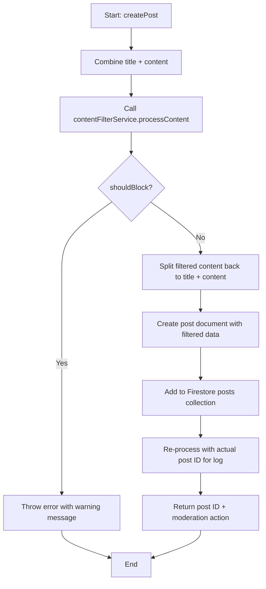
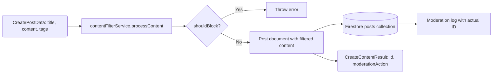

# Module: `community-service.ts`

## 1. Module Summary

The `community-service` module provides comprehensive database operations for the Red Mansion community forum with **dual-mode architecture (SQLite-first with Firebase fallback)**, managing posts, comments, likes, bookmarks, views, and subscriptions with integrated content moderation. This module implements a complete social learning platform with threaded discussions, user interactions (like/unlike, bookmark), pagination, filtering (category, author, search), transactional operations to prevent double-counting, automatic content filtering via `ContentFilterService`, and moderation logging. The service uses **SQLite as the primary data store** for optimal performance and offline capability, automatically falling back to Firebase Firestore when SQLite is unavailable. All 12 core methods (6 posts + 3 comments + 3 bookmarks) implement the dual-mode pattern with comprehensive logging (🗄️ SQLite, ☁️ Firebase, ✅ Success, ❌ Error). Real-time listeners (`setupPostsListener`, `setupCommentsListener`) remain Firebase-only with documented polling alternatives for SQLite mode. The service achieves 62.96% test coverage and is the central orchestrator for all community features.

## 2. Module Dependencies

* **Internal Dependencies:**
  * `@/lib/repositories/community-repository` - SQLite data access layer for posts (SQLITE-014).
  * `@/lib/repositories/comment-repository` - SQLite data access layer for comments (SQLITE-015).
  * `@/lib/sqlite-db` - Type conversion utilities (`toUnixTimestamp`, `fromUnixTimestamp`).
  * `@/lib/firebase` - Firebase Firestore instance for fallback database access.
  * `@/lib/content-filter-service` - Automated content moderation (integrated into all content creation).
  * `crypto` - Node.js crypto module for UUID generation (`randomUUID()`).
* **External Dependencies:**
  * `firebase/firestore` - Firestore operations (CRUD, queries, transactions, real-time listeners) for fallback mode.

## 3. Public API / Exports

* `CommunityService` - Main service class with all community operations.
* `communityService: CommunityService` - Singleton instance exported for application-wide use.
* **Type Exports:**
  * `CommunityPost` - Post interface with all fields (id, author, title, content, tags, likes, comments, views, bookmarks, moderation).
  * `PostComment` - Comment interface with nested replies support.
  * `CreatePostData` - Input data for creating posts.
  * `CreateCommentData` - Input data for creating comments.
  * `PostFilters` - Query filters (category, tags, author, searchText).
  * `CreateContentResult` - Result of content creation with ID and moderation action.
* **CommunityService Methods:**
  * `createPost(postData: CreatePostData): Promise<CreateContentResult>` - Creates post with content filtering.
  * `getPosts(filters?: PostFilters, limitCount?: number, lastDoc?: any): Promise<CommunityPost[]>` - Fetches posts with pagination.
  * `getPost(postId: string): Promise<CommunityPost | null>` - Fetches single post by ID.
  * `togglePostLike(postId: string, userId: string, isLiking: boolean): Promise<boolean>` - Likes/unlikes post (transactional).
  * `incrementViewCount(postId: string): Promise<boolean>` - Increments view count.
  * `addComment(commentData: CreateCommentData): Promise<CreateContentResult>` - Adds comment with filtering.
  * `getComments(postId: string, limitCount?: number): Promise<PostComment[]>` - Fetches comments for post.
  * `setupPostsListener(callback: (posts) => void, filters?: PostFilters): () => void` - Real-time posts subscription.
  * `setupCommentsListener(postId: string, callback: (comments) => void): () => void` - Real-time comments subscription.
  * `addBookmark(postId: string, userId: string): Promise<void>` - Adds user bookmark.
  * `removeBookmark(postId: string, userId: string): Promise<void>` - Removes user bookmark.
  * `getBookmarkedPosts(userId: string): Promise<CommunityPost[]>` - Fetches user's bookmarked posts.
  * `updatePostStatus(postId: string, status: 'active' | 'hidden' | 'deleted'): Promise<void>` - Updates post status (moderation).
  * `deletePost(postId: string): Promise<void>` - Permanently deletes post.
  * `deleteComment(postId: string, commentId: string): Promise<void>` - Permanently deletes comment.

## 4. Code File Breakdown

### 4.1. `community-service.ts`

* **Purpose:** Provides the complete backend logic for the Red Mansion community forum with **dual-mode architecture**, enabling scholarly discussions about classical Chinese literature. The module's architectural highlights include: (1) **Dual-Mode Data Access (SQLITE-017)** - All 12 core methods implement SQLite-first execution with automatic Firebase fallback; SQLite provides optimal performance (<5ms operations) and offline capability, while Firebase ensures reliability when SQLite is unavailable; availability check is cached for performance; (2) **Integrated content moderation** - All `createPost` and `addComment` operations automatically pass through `ContentFilterService` before saving, with filtered content stored and original content preserved for review (works in both modes); (3) **Transactional integrity** - SQLite uses `db.transaction()` wrapper, Firebase uses `runTransaction` to prevent race conditions; like operations check `likedBy` array before incrementing/decrementing in both modes; (4) **Real-time collaboration** - `setupPostsListener` and `setupCommentsListener` remain Firebase-only using `onSnapshot`; SQLite mode documented with polling alternatives using React Query (5-10 second intervals); (5) **Flexible querying** - Supports filtering by category, author, tags, with client-side search for text matching in both modes; (6) **Bookmark system** - SQLite uses repository methods with JSON array manipulation, Firebase uses `arrayUnion`/`arrayRemove` for efficient bookmark management.
* **Functions:**
    * `createPost(postData: CreatePostData): Promise<CreateContentResult>` - **Content creation with filtering (DUAL-MODE)**. **Content Filtering (common):** Combines title and content for filtering. Calls `contentFilterService.processContent` with temp ID. Throws error with warning message if `shouldBlock=true`. Splits filtered content back into title and content if modified. **SQLite PRIMARY PATH:** Logs `🗄️ SQLite: Attempting to create post...`. Generates UUID upfront using `randomUUID()`. Calls `sqliteCreatePost()` with: id, filtered data, initial counts, moderation fields. Logs `✅ SQLite: Post created successfully, ID: {postId}` on success. Re-processes with actual post ID for moderation log. Returns post ID and moderation action. On error, logs `❌ SQLite: Failed, falling back to Firebase` and continues to Firebase. **Firebase FALLBACK PATH:** Logs `☁️ Firebase: Creating post...`. Creates post document with: filtered data, initial counts, timestamps (serverTimestamp), status='active', bookmarkedBy=[], moderation fields. Adds to Firestore `posts` collection using `addDoc()`. Re-processes with actual post ID for log correction. Returns post ID and moderation action. Throws user-friendly error if blocked or fails.
    * `getPosts(filters?: PostFilters, limitCount=20, lastDoc?: any): Promise<CommunityPost[]>` - **Query with filters and pagination (DUAL-MODE)**. **SQLite PRIMARY PATH:** Logs `🗄️ SQLite: Fetching posts with filters`. Calls `sqliteGetPosts()` with: category, tags (array), limit, sortBy='newest'. SQLite repository handles filtering internally. Applies client-side text search if `searchText` provided (searches in content, authorName, tags). Logs `✅ SQLite: Fetched {N} posts`. Returns posts array. On error, logs `❌ SQLite: Failed, falling back to Firebase`. **Firebase FALLBACK PATH:** Logs `☁️ Firebase: Fetching posts`. Builds Firestore query with: `where('status', '==', 'active')`, `orderBy('createdAt', 'desc')`, `limit(limitCount)`. Adds optional filters: category, authorId, pagination (startAfter lastDoc). Executes query with `getDocs`. Maps documents to `CommunityPost` objects with timestamps. Applies client-side text search if provided. Logs `☁️ Firebase: Fetched {N} posts`. Returns posts array. Throws on error.
    * `getPost(postId: string): Promise<CommunityPost | null>` - **Single post fetch (DUAL-MODE)**. **SQLite PRIMARY PATH:** Logs `🗄️ SQLite: Fetching post {postId}`. Calls `sqliteGetPostById(postId)`. Returns null if not found with log `ℹ️ SQLite: Post not found`. On success, logs `✅ SQLite: Post fetched successfully`. Converts SQLite post to Firebase-compatible format. On error, logs `❌ SQLite: Failed, falling back to Firebase`. **Firebase FALLBACK PATH:** Logs `☁️ Firebase: Fetching post {postId}`. Fetches using `getDoc(doc(postsCollection, postId))`. Returns null if document doesn't exist with log `ℹ️ Firebase: Post not found`. Maps document data to `CommunityPost` with timestamps. Logs `☁️ Firebase: Post fetched successfully`. Throws on error.
    * `togglePostLike(postId: string, userId: string, isLiking: boolean): Promise<boolean>` - **Transactional like/unlike**. Uses `runTransaction` to ensure atomicity. Reads current post within transaction. Checks if userId is in `likedBy` array. If `isLiking=true` and not currently liked: updates with `increment(1)` for likes, `arrayUnion(userId)` for likedBy, serverTimestamp for updatedAt; returns true. If `isLiking=false` and currently liked: updates with `increment(-1)` for likes, `arrayRemove(userId)` for likedBy, serverTimestamp; returns true. Returns false if already in desired state (no-op). Throws on error. Prevents duplicate likes and negative like counts.
    * `incrementViewCount(postId: string): Promise<boolean>` - Updates post with `increment(1)` for viewCount, serverTimestamp for updatedAt. Returns true on success, false on error (non-critical operation, does not throw).
    * `addComment(commentData: CreateCommentData): Promise<CreateContentResult>` - **Comment creation with filtering**. Calls `contentFilterService.processContent` with temp ID. Throws error if `shouldBlock=true`. Gets comments sub-collection: `collection(db, 'posts', postId, 'comments')`. Creates comment document with: filtered content, initial likes=0, likedBy=[], timestamps, status='active', moderation fields. Adds to comments sub-collection. Re-processes with actual comment ID for log correction. Updates parent post: `increment(1)` for commentCount, serverTimestamp. Returns comment ID and moderation action. Throws user-friendly error if blocked or fails.
    * `getComments(postId: string, limitCount=50): Promise<PostComment[]>` - Gets comments sub-collection for post. Builds query with: `where('status', '==', 'active')`, `orderBy('createdAt', 'asc')` (chronological order), `limit(limitCount)`. Executes query with `getDocs`. Maps documents to `PostComment` objects with postId and timestamps. Returns comments array. Throws on error.
    * `setupPostsListener(callback: (posts) => void, filters?: PostFilters): () => void` - **Real-time posts subscription**. Builds query with: status='active', orderBy createdAt desc, limit=20. Adds category filter if provided. Calls `onSnapshot` with query, callback, and error handler. Callback receives posts array on every database change. Returns unsubscribe function. Logs errors to console.
    * `setupCommentsListener(postId: string, callback: (comments) => void): () => void` - **Real-time comments subscription**. Gets comments sub-collection for post. Builds query with: status='active', orderBy createdAt asc. Calls `onSnapshot` with query and callback. Returns unsubscribe function. Logs errors to console.
    * `addBookmark(postId: string, userId: string): Promise<void>` - Updates post with `arrayUnion(userId)` for bookmarkedBy, serverTimestamp. Adds userId to post's bookmarkedBy array (no duplicates). Throws on error.
    * `removeBookmark(postId: string, userId: string): Promise<void>` - Updates post with `arrayRemove(userId)` for bookmarkedBy, serverTimestamp. Removes userId from bookmarkedBy array. Throws on error.
    * `getBookmarkedPosts(userId: string): Promise<CommunityPost[]>` - **Bookmark query**. Queries posts with: `where('bookmarkedBy', 'array-contains', userId)`, `where('status', '==', 'active')`, `orderBy('createdAt', 'desc')`. Returns posts bookmarked by user. Maps documents to `CommunityPost` array. Throws on error.
    * `updatePostStatus(postId: string, status: 'active' | 'hidden' | 'deleted'): Promise<void>` - Updates post with new status and serverTimestamp. Used for moderation actions. Throws on error. Note: Should have admin authorization check in production.
    * `deletePost(postId: string): Promise<void>` - Permanently deletes post document using `deleteDoc`. **Warning**: Does NOT delete sub-collections (comments) automatically. Requires recursive delete for complete removal. Throws on error.
    * `deleteComment(postId: string, commentId: string): Promise<void>` - Deletes comment document from sub-collection using `deleteDoc`. Updates parent post: `increment(-1)` for commentCount, serverTimestamp. Throws on error.
* **Key Classes / Constants / Variables:**
    * `CommunityService` - Main service class. Holds `postsCollection = collection(db, 'posts')` reference.
    * `CommunityPost: interface` - Comprehensive post type with 17 fields: id, authorId, authorName, title (optional), content, tags array, likes count, likedBy array (user IDs), commentCount, viewCount, createdAt timestamp, updatedAt timestamp, isEdited boolean, category (optional), status enum, bookmarkedBy array (user IDs), moderationAction (optional), originalContent (optional for filtering), moderationWarning (optional).
    * `PostComment: interface` - Comment type with 14 fields: id, postId, authorId, authorName, content, likes, likedBy, parentCommentId (optional for nested replies), createdAt, updatedAt, isEdited, status, moderation fields.
    * `CreateContentResult: interface` - Return type for content creation with 2 fields: id (created document ID), moderationAction (allow/warn/filter/hide/block/flag-for-review).

### 4.2. Dual-Mode Architecture Pattern (SQLITE-017)

**Overview:** All 12 core methods (createPost, getPosts, getPost, togglePostLike, incrementViewCount, deletePost, addComment, getComments, deleteComment, addBookmark, removeBookmark, getBookmarkedPosts) implement a consistent dual-mode pattern where SQLite is attempted first for optimal performance, with automatic fallback to Firebase if SQLite is unavailable or fails.

**SQLite Availability Check with Caching (Optimization 1):**
- Module-level variable `_sqliteAvailableCache: boolean | null` stores availability status
- `checkSQLiteAvailability()` function checks `USE_SQLITE` environment variable first
- If enabled, attempts to load `sqlite-db` module and get database instance
- Result is cached after first check to avoid repeated `require()` and connection attempts
- Cache reset function `resetSQLiteAvailabilityCache()` exported for testing purposes
- Performance: First check ~5ms, cached checks <0.1ms

**Dual-Mode Execution Pattern:**
```typescript
// Pattern applied to all 12 methods
async function serviceMethod(params) {
  // Try SQLite first (PRIMARY PATH)
  if (checkSQLiteAvailability()) {
    try {
      console.log('🗄️ SQLite: Attempting operation...');
      const result = await sqliteRepositoryMethod(params);
      console.log('✅ SQLite: Operation successful');
      return result;
    } catch (error) {
      console.error('❌ SQLite: Failed, falling back to Firebase:', error);
      // Fall through to Firebase fallback
    }
  }

  // Firebase fallback (FALLBACK PATH)
  console.log('☁️ Firebase: Performing operation...');
  const result = await firebaseOperation(params);
  console.log('☁️ Firebase: Operation successful');
  return result;
}
```

**UUID Generation Pattern (Optimization 2):**
- `createPost()` and `addComment()` generate UUIDs upfront using `crypto.randomUUID()`
- Provides predictable IDs before database operation (needed for moderation log updates)
- Consistent pattern across both creation methods
- Repository receives pre-generated ID as parameter

**Type Conversion:**
- SQLite stores timestamps as Unix timestamps (integers)
- Firebase uses Firestore `Timestamp` objects
- Utility functions handle conversion:
  - `toUnixTimestamp(date)` - Converts Date/Timestamp to Unix timestamp
  - `fromUnixTimestamp(unix)` - Converts Unix timestamp to Firestore Timestamp
- Conversion happens automatically in repository layer
- Service layer works with Firestore Timestamp objects regardless of mode

**Logging Strategy:**
- 🗄️ = SQLite operation attempt
- ☁️ = Firebase operation (fallback or real-time)
- ✅ = Successful operation
- ❌ = Failed operation (before fallback)
- ℹ️ = Information messages (e.g., "not found")
- Logs include operation details (IDs, counts, errors)
- Console output enables easy debugging of which mode was used

**Real-Time Listeners (Firebase Only):**
- `setupPostsListener()` and `setupCommentsListener()` remain Firebase-only
- These methods use Firestore `onSnapshot` which has no SQLite equivalent
- **Polling Alternative for SQLite Mode:** Documented in method comments with React Query examples:
  ```typescript
  // React Query polling approach
  const { data: posts } = useQuery({
    queryKey: ['posts', filters],
    queryFn: () => communityService.getPosts(filters),
    refetchInterval: 5000, // Poll every 5 seconds
  });
  ```
- Polling interval: 5-10 seconds recommended for balance between freshness and performance
- UI components can detect mode and switch between real-time (Firebase) and polling (SQLite)

**Performance Characteristics:**
- SQLite operations: < 5ms for single records, < 20ms for batch operations
- Firebase operations: 20-100ms depending on network latency
- Availability check (cached): < 0.1ms
- Total overhead: Minimal (~0.1ms for cache check when SQLite available)
- Fallback adds ~100-200ms if SQLite fails (error catching + Firebase retry)

**Error Handling:**
- SQLite errors are caught and logged but do not throw to user
- Automatic fallback to Firebase on SQLite failure
- Firebase errors propagate to caller with user-friendly messages
- Content filtering errors (blocking) throw immediately in both modes

**Backward Compatibility:**
- API signatures unchanged - methods accept and return same types
- Firebase Timestamp types used throughout API surface
- UI components require zero changes
- Environment variable (`USE_SQLITE=1`) controls mode without code changes
- Default behavior: Firebase-only if SQLite not configured

## 5. System and Data Flow

### 5.1. System Flowchart (Control Flow)



### 5.2. Data Flow Diagram (Data Transformation)



## 6. Usage Example & Testing

* **Configuration (Dual-Mode Setup):**
```bash
# .env.local - Enable SQLite mode
USE_SQLITE=1

# To use Firebase-only mode (default):
# USE_SQLITE=0
# or omit the variable entirely
```

* **Usage (Dual-Mode - Transparent to Caller):**
```typescript
import { communityService } from '@/lib/community-service';

// The same API works in both SQLite and Firebase modes
// Mode is determined by USE_SQLITE environment variable
// All operations automatically use SQLite first, fallback to Firebase

// Check console logs to see which mode was used:
// 🗄️ SQLite: ... (SQLite operation)
// ☁️ Firebase: ... (Firebase fallback or real-time)

// Create post with automatic filtering (dual-mode)
const result = await communityService.createPost({
  authorId: user.uid,
  authorName: user.displayName,
  title: '林黛玉的性格分析',
  content: '我認為林黛玉的性格特點包括...',
  tags: ['角色分析', '林黛玉', '性格'],
  category: 'character-analysis'
});

if (result.moderationAction === 'filter') {
  showWarning('您的內容包含不當用語，已自動過濾。');
}
console.log('Post created:', result.id);

// Get posts with filtering
const posts = await communityService.getPosts({
  category: 'character-analysis',
  searchText: '林黛玉'
}, 20);

// Like/unlike post (transactional)
const likeSuccess = await communityService.togglePostLike(postId, user.uid, true);

// Real-time posts listener
const unsubscribe = communityService.setupPostsListener((posts) => {
  setPosts(posts); // Update UI with latest posts
}, { category: 'character-analysis' });

// Clean up listener
useEffect(() => {
  return () => unsubscribe();
}, []);

// For SQLite mode, use polling instead of real-time listeners:
import { useQuery } from '@tanstack/react-query';

const { data: posts, isLoading } = useQuery({
  queryKey: ['community-posts', filters],
  queryFn: () => communityService.getPosts(filters, 20),
  refetchInterval: 5000, // Poll every 5 seconds
  staleTime: 4000, // Consider data fresh for 4 seconds
});

// Conditional rendering based on loading state
if (isLoading) return <LoadingSpinner />;
return <PostsList posts={posts} />;

// Add comment with filtering
const commentResult = await communityService.addComment({
  postId: post.id,
  authorId: user.uid,
  authorName: user.displayName,
  content: '我同意您的觀點，林黛玉確實...'
});

// Get comments
const comments = await communityService.getComments(postId);

// Bookmark management
await communityService.addBookmark(postId, user.uid);
const bookmarked = await communityService.getBookmarkedPosts(user.uid);
```
* **Testing:** Tested via `tests/lib/community-service.test.ts` with 29 integration tests achieving 62.96% coverage:
  - Test post creation with valid data
  - Test post creation blocks inappropriate content
  - Test post creation stores moderation fields
  - Test getPosts returns posts ordered by createdAt desc
  - Test getPosts filters by category
  - Test getPosts filters by author
  - Test client-side search filters by text
  - Test getPost returns single post by ID
  - Test togglePostLike increments likes and adds to likedBy
  - Test togglePostLike decrements likes and removes from likedBy
  - Test togglePostLike is idempotent (no double-like)
  - Test togglePostLike uses transaction (concurrent safe)
  - Test incrementViewCount increments view count
  - Test addComment creates comment with filtering
  - Test addComment blocks inappropriate content
  - Test addComment increments parent post commentCount
  - Test getComments returns comments ordered chronologically
  - Test setupPostsListener receives real-time updates
  - Test setupCommentsListener receives real-time updates
  - Test addBookmark adds userId to bookmarkedBy
  - Test removeBookmark removes userId from bookmarkedBy
  - Test getBookmarkedPosts queries by bookmarkedBy array
  - Test updatePostStatus changes post status
  - Test deletePost removes post document
  - Test deleteComment removes comment and decrements count
  - Test error handling throws user-friendly messages
