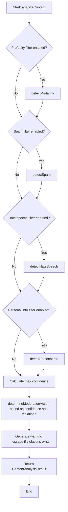
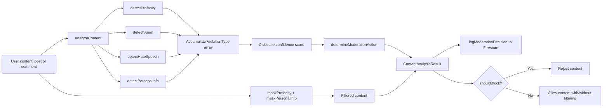

# Module: `content-filter-service.ts`

## 1. Module Summary

The `content-filter-service` module provides enterprise-grade automated content moderation for the Red Mansion community platform, detecting and filtering profanity, hate speech, spam, harassment, and personal information in Traditional Chinese and English. This module implements a comprehensive rule-based filtering system with severity classification, confidence scoring, automated actions (allow/warn/filter/hide/block/flag-for-review), content masking, moderation logging to Firestore, and user-friendly Traditional Chinese warning messages. The service achieves 91.51% test coverage and is integrated into all user-generated content workflows.

## 2. Module Dependencies

* **Internal Dependencies:**
  * `@/lib/firebase` - Firebase Firestore instance for moderation log storage.
* **External Dependencies:**
  * `firebase/firestore` - Firestore operations for logging moderation decisions.

## 3. Public API / Exports

* `ContentFilterService` - Main service class with all moderation methods.
* `contentFilterService: ContentFilterService` - Singleton instance exported for application-wide use.
* **Type Exports:**
  * `ContentAnalysisResult` - Result of content analysis with violations, confidence, action, filtered content.
  * `ViolationType` - Violation object with type, severity, details, matched terms.
  * `ModerationAction` - Union type: 'allow' | 'warn' | 'filter' | 'hide' | 'block' | 'flag-for-review'.
  * `ModerationLog` - Moderation log entry structure for Firestore.
  * `FilterConfiguration` - Configuration options for filter sensitivity and thresholds.
* **ContentFilterService Methods:**
  * `analyzeContent(content: string, contentType: 'post' | 'comment', config?: Partial<FilterConfiguration>): Promise<ContentAnalysisResult>` - Analyzes content and returns comprehensive result.
  * `processContent(content: string, contentId: string, contentType: 'post' | 'comment', authorId: string): Promise<{ processedContent, action, shouldBlock, warningMessage }>` - Processes content through filter and applies moderation actions.
  * `getModerationStats(days?: number): Promise<{ totalAnalyzed, violationsDetected, actionsTaken, violationTypes }>` - Returns moderation statistics for admin dashboard.

## 4. Code File Breakdown

### 4.1. `content-filter-service.ts`

* **Purpose:** Provides real-time automated content moderation to maintain a safe, scholarly discussion environment for the Red Mansion learning community. The module's design prioritizes accuracy and cultural awareness: (1) **Bilingual pattern matching** - Separate pattern dictionaries for Traditional Chinese (幹你娘, 白痴, 智障, etc.) and English (fuck, shit, bastard, etc.) with context-aware detection; (2) **Multi-layer violation detection** - Profanity, hate speech, spam, personal information (phone, email, address, LINE ID), each with different severity levels; (3) **Confidence-based actions** - Automated decisions based on confidence thresholds (0.7 for hide, 0.9 for block) and violation types; (4) **Content masking** - Profanity is masked with asterisks (preserving first character), personal info is replaced with '[個人資訊已隱藏]'; (5) **Audit trail** - All moderation decisions logged to Firestore for manual review and analytics.
* **Functions:**
    * `analyzeContent(content: string, contentType: 'post' | 'comment', config?: Partial<FilterConfiguration>): Promise<ContentAnalysisResult>` - **Core analysis function**. Merges provided config with defaults. Runs enabled detection methods (profanity, spam, hate speech, personal info). Accumulates violations array. Calculates confidence score (max of individual confidence scores). Determines suggested action via `determineModerationAction`. Generates warning message in Traditional Chinese. Returns result with `isAppropriate`, `confidence`, `violations`, `suggestedAction`, `filteredContent`, `warningMessage`. Catches errors and returns safe default (allow with flag-for-review).
    * `processContent(content, contentId, contentType, authorId): Promise<{ processedContent, action, shouldBlock, warningMessage }>` - **Processing pipeline**. Calls `analyzeContent` to get analysis. Logs decision to Firestore via `logModerationDecision`. Determines final content and shouldBlock based on action: block/hide → shouldBlock=true, filter → use filteredContent, others → original content. Returns processing result. Catches errors and returns safe default.
    * `logModerationDecision(contentId, contentType, authorId, originalContent, analysisResult): Promise<void>` - Writes moderation log to Firestore `moderation_logs` collection. Creates log entry with content ID, type, author, original content, filtered content, analysis result, action, timestamp, review status (pending if flagged, approved otherwise). Uses `serverTimestamp()` for accurate timestamps. Does not throw on logging errors (logs failure to console only).
    * `detectProfanity(content: string): ViolationType | null` - Converts content to lowercase. Iterates Chinese profanity patterns array (100+ terms). Iterates English profanity patterns array (50+ terms). Checks if content includes each term (case-insensitive). Accumulates matched terms. Returns violation object with type='profanity', severity='high' if >2 matches else 'medium', details with violation count, matched terms array. Returns null if no matches.
    * `detectSpam(content: string): ViolationType | null` - Tests content against spam regex patterns (repeated characters `/(.)\1{4,}/g`, special characters `/[!@#$%^&*()]{3,}/g`, spam phrases like '買.*送.*免費', 'click.*here', etc.). Analyzes word frequency: splits by whitespace, counts occurrences, flags if any word appears >30% and total words >10. Returns violation with type='spam', severity based on matched pattern count. Returns null if no spam detected.
    * `detectHateSpeech(content: string): ViolationType | null` - Tests content against hate speech regex patterns (Chinese: `/你.*廢物/i`, `/滾.*出去/i`, `/去.*死/i`, `/幹.*你/i`, etc.; English: `/you.*are.*trash/i`, `/kill.*yourself/i`, `/hate.*you/i`, etc.). Returns violation with type='hate-speech', severity='high' (always high for hate speech), matched pattern sources. Returns null if no matches.
    * `detectPersonalInfo(content: string): ViolationType | null` - Matches against personal info regex patterns (Taiwan mobile numbers `/09[0-9]{8}/g`, phone formats, email addresses `/@/g`, Taiwan addresses `/[0-9]{3,5}.*[路街巷號]/g`, LINE ID `/line.*id.*[a-zA-Z0-9]/i`, WeChat ID). Returns violation with type='personal-info', severity='medium', matched instances array. Returns null if no matches.
    * `maskProfanity(content: string): string` - **Content masking implementation**. Sorts profanity arrays by length (longest first) to prevent partial replacements. For each Chinese term: creates case-insensitive regex with escaped special chars, replaces with first character + asterisks (length-1). For each English term: same process. Returns masked content. Example: "幹你娘" → "幹**", "fuck" → "f***".
    * `maskPersonalInfo(content: string): string` - Replaces all personal info patterns with '[個人資訊已隱藏]'. Returns masked content.
    * `determineModerationAction(confidence: number, violations: ViolationType[], config: FilterConfiguration): ModerationAction` - **Action decision logic tree**. Checks confidence >= autoBlockThreshold (0.9) → 'block'. Checks confidence >= autoHideThreshold (0.7) → 'hide'. Checks for high severity violations → 'hide'. Checks for hate speech → 'block' (hate speech always blocked). Checks for spam: confidence > 0.5 → 'hide', else 'flag-for-review'. Checks for profanity → 'filter'. Checks for personal info → 'filter'. Any violations remaining → 'flag-for-review'. No violations → 'allow'.
    * `generateWarningMessage(violations: ViolationType[]): string` - Generates Traditional Chinese user-facing warning messages. Maps violation types to messages: profanity → '您的內容包含不當用語，已自動過濾部分內容。', hate-speech → '檢測到仇恨言論或騷擾內容...', spam → '您的內容可能包含垃圾信息...', personal-info → '為保護隱私，已隱藏個人資訊內容。', etc. Joins messages with space. Returns concatenated warning string.
    * `getModerationStats(days: number = 7): Promise<{ ... }>` - Returns placeholder moderation statistics structure. In full implementation, would query `moderation_logs` collection with date range filter. Returns object with totalAnalyzed, violationsDetected, actionsTaken (count per action type), violationTypes (count per violation type).
* **Key Classes / Constants / Variables:**
    * `ContentFilterService` - Main service class. Holds `moderationLogsCollection` Firestore reference and `defaultConfig` with sensitivity='medium', all filters enabled, autoHideThreshold=0.7, autoBlockThreshold=0.9.
    * `profanityPatterns: { chinese: string[], english: string[] }` - Comprehensive profanity dictionaries. Chinese: 30+ severe terms (幹你娘, 塞你娘, etc.), 20+ common insults (白痴, 智障, 笨蛋, 神經病, etc.), single-character context-dependent term (幹), variations. English: 20+ severe terms (fuck, shit, bitch, motherfucker, etc.), 20+ common insults (stupid, idiot, moron, etc.), 10+ milder terms (dumb, jackass, etc.).
    * `spamPatterns: RegExp[]` - Array of 10+ regex patterns for spam detection: repeated characters, special characters, Chinese promotional phrases, English spam phrases.
    * `hateSpeechPatterns: RegExp[]` - Array of 20+ regex patterns for hate speech: 10+ Traditional Chinese patterns (你.*廢物, 滾.*出去, 去.*死, 幹.*你, etc.), 10+ English patterns (you.*are.*trash, kill.*yourself, hate.*you, etc.).
    * `personalInfoPatterns: RegExp[]` - Array of 6 regex patterns: Taiwan mobile (09xxxxxxxx), phone formats, email addresses, Taiwan addresses, LINE ID, WeChat ID.
    * `defaultConfig: FilterConfiguration` - Default configuration with sensitivity='medium', all 4 filters enabled, autoHideThreshold=0.7, autoBlockThreshold=0.9.

## 5. System and Data Flow

### 5.1. System Flowchart (Control Flow)



### 5.2. Data Flow Diagram (Data Transformation)



## 6. Usage Example & Testing

* **Usage:**
```typescript
import { contentFilterService } from '@/lib/content-filter-service';

// Analyze content before posting
const analysis = await contentFilterService.analyzeContent(
  '這篇文章討論林黛玉的性格特點',
  'post',
  { sensitivity: 'high' } // Optional config
);

if (analysis.suggestedAction === 'block') {
  throw new Error(analysis.warningMessage);
}

// Process content with automatic action
const result = await contentFilterService.processContent(
  userSubmittedContent,
  postId,
  'post',
  userId
);

if (result.shouldBlock) {
  // Reject content
  showError(result.warningMessage);
} else {
  // Save processed content (may be masked)
  await savePost(result.processedContent);
  if (result.warningMessage) {
    showWarning(result.warningMessage);
  }
}

// Get moderation stats
const stats = await contentFilterService.getModerationStats(30); // Last 30 days
console.log(`Total analyzed: ${stats.totalAnalyzed}`);
console.log(`Blocks: ${stats.actionsTaken.block}`);
```
* **Testing:** Tested via `tests/lib/content-filter-service.test.ts` with 42 comprehensive tests achieving 91.51% coverage:
  - Test profanity detection for Chinese terms (幹你娘, 白痴, etc.)
  - Test profanity detection for English terms (fuck, shit, etc.)
  - Test profanity masking preserves first character
  - Test spam detection for repeated characters
  - Test spam detection for promotional phrases
  - Test hate speech detection for Chinese patterns
  - Test hate speech detection for English patterns
  - Test personal info detection (phone, email, LINE ID)
  - Test personal info masking replaces with Traditional Chinese text
  - Test action determination based on confidence thresholds
  - Test action determination for specific violation types
  - Test processContent blocks high-confidence violations
  - Test processContent filters profanity
  - Test warning message generation in Traditional Chinese
  - Test moderation logging to Firestore
  - Test graceful error handling returns safe defaults
