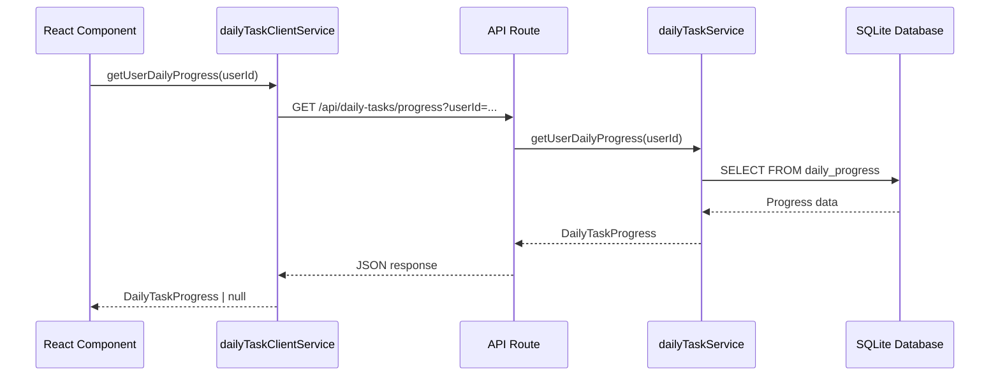
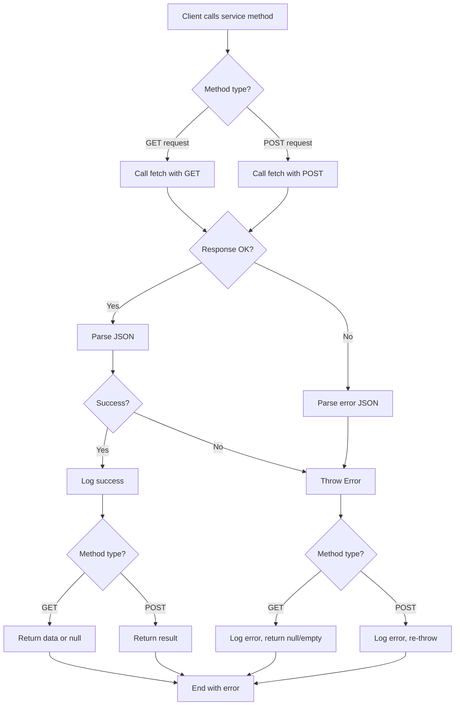

# Module: `daily-task-client-service.ts`

## 1. Module Summary

The `daily-task-client-service` module provides browser-safe access to daily task functionality via HTTP API calls instead of direct database access. This client-side service layer prevents loading of Node.js native modules (better-sqlite3) in browser environments while maintaining the same interface as the server-side daily-task-service. The module implements comprehensive error handling, URL encoding for special characters, and graceful fallbacks for network failures, ensuring robust daily task operations in client components.

## 2. Module Dependencies

* **Internal Dependencies:**
  * `@/lib/types/daily-task` - Type definitions for DailyTaskProgress
* **External Dependencies:**
  * `fetch` - Browser native fetch API for HTTP requests
  * None (minimal dependencies for browser compatibility)

## 3. Public API / Exports

* **Object Exports:**
  * `dailyTaskClientService: object` - Singleton service object with 4 methods
* **Type Exports:**
  * `DailyTaskProgress` - Re-exported from types/daily-task for convenience

## 4. Code File Breakdown

### 4.1. `daily-task-client-service.ts`

* **Purpose:** Provides client-safe daily task operations through HTTP API layer, implementing the same interface as server-side service but using fetch instead of direct database access. Critical for browser compatibility after SQLite integration (Phase 2.9) to prevent "The 'original' argument must be of type Function" error from better-sqlite3 loading in browser.

* **Service Methods:**
    * `getUserDailyProgress: async (userId: string): Promise<DailyTaskProgress | null>` - **Fetch user's daily progress**. Logs fetch request with user ID. Constructs GET request URL: `/api/daily-tasks/progress?userId=${encodeURIComponent(userId)}`. Calls `fetch()` with URL. Checks `response.ok` status. Parses error JSON if not ok, throws Error with error message. Parses success JSON to `DailyTaskProgress`. Logs success message. Returns progress object or null. Catches errors, logs error message with red X emoji, returns null (graceful degradation). Used by DailyTasksSummary, TaskCalendar, AppShell components.

    * `getTaskHistory: async (userId: string, limit: number = 100): Promise<DailyTaskProgress[]>` - **Fetch task completion history**. Logs fetch request with user ID and limit. Constructs GET request URL: `/api/daily-tasks/history?userId=${encodeURIComponent(userId)}&limit=${limit}`. Calls `fetch()` with URL. Checks `response.ok` status. Parses error JSON if not ok, throws Error with error message. Parses success JSON to `DailyTaskProgress[]` array. Logs success message with entry count. Returns history array. Catches errors, logs error message, returns empty array `[]` (graceful degradation). Used by TaskCalendar component for calendar view population.

    * `submitTaskAnswer: async (userId: string, taskId: string, userAnswer: string)` - **Submit task completion**. Logs submission request with task ID. Constructs POST request to `/api/daily-tasks/submit`. Sets headers: `'Content-Type': 'application/json'`. Sets body: `JSON.stringify({ userId, taskId, userAnswer })`. Calls `fetch()` with method POST, headers, and body. Checks `response.ok` status. Parses error JSON if not ok, throws Error with error message. Parses success JSON to result object. Logs success message with score. Returns result object with `{ success, score, feedback, xpAwarded, ... }`. Catches errors, logs error message, **re-throws error** (submission failures must be handled by caller). Used by task submission forms.

    * `generateDailyTasks: async (userId: string)` - **Generate daily tasks**. Logs generation request for user ID. Constructs POST request to `/api/daily-tasks/generate`. Sets headers: `'Content-Type': 'application/json'`. Sets body: `JSON.stringify({ userId })`. Calls `fetch()` with method POST, headers, and body. Checks `response.ok` status. Parses error JSON if not ok, throws Error with error message. Parses success JSON to result object. Logs success message. Returns result object with `{ success, tasks }`. Catches errors, logs error message, **re-throws error** (generation failures must be handled by caller). Used by daily tasks page initialization.

* **Key Implementation Details:**
    * **URL Encoding**: Uses `encodeURIComponent()` for userId parameter to handle special characters (e.g., email addresses with @)
    * **Error Handling Pattern**: GET methods return null/empty array on error (graceful), POST methods throw errors (must handle)
    * **Logging Strategy**: Uses emoji prefixes (📊, 📚, ✍️, 🎲) for different operations, green checkmark for success, red X for errors
    * **Browser Compatibility**: Never imports server-only modules (sqlite-db, repositories), only uses browser-native fetch API

## 5. System and Data Flow

### 5.1. Client-Server Communication Flow



### 5.2. Error Handling Flow



## 6. Usage Example & Testing

* **Usage:**
```typescript
import { dailyTaskClientService } from '@/lib/daily-task-client-service';

// In React component (client-side)
export function DailyTasksPage() {
  const { user } = useAuth();
  const [progress, setProgress] = useState<DailyTaskProgress | null>(null);
  const [loading, setLoading] = useState(true);

  useEffect(() => {
    if (!user) return;

    // Fetch user's daily progress
    const loadProgress = async () => {
      setLoading(true);
      const data = await dailyTaskClientService.getUserDailyProgress(user.uid);
      setProgress(data);
      setLoading(false);
    };

    loadProgress();
  }, [user]);

  // Handle task submission
  const handleSubmit = async (taskId: string, answer: string) => {
    try {
      const result = await dailyTaskClientService.submitTaskAnswer(
        user.uid,
        taskId,
        answer
      );

      console.log('Score:', result.score);
      console.log('Feedback:', result.feedback);
      console.log('XP Awarded:', result.xpAwarded);

      // Refresh progress after submission
      const updatedProgress = await dailyTaskClientService.getUserDailyProgress(user.uid);
      setProgress(updatedProgress);
    } catch (error) {
      console.error('Submission failed:', error.message);
      alert('提交失敗，請稍後再試');
    }
  };

  // Generate new tasks
  const handleGenerate = async () => {
    try {
      const result = await dailyTaskClientService.generateDailyTasks(user.uid);
      console.log('Generated tasks:', result.tasks);

      // Refresh progress
      const updatedProgress = await dailyTaskClientService.getUserDailyProgress(user.uid);
      setProgress(updatedProgress);
    } catch (error) {
      console.error('Generation failed:', error.message);
      alert('任務生成失敗');
    }
  };

  // Fetch task history for calendar
  const loadHistory = async () => {
    const history = await dailyTaskClientService.getTaskHistory(user.uid, 30);
    console.log('Last 30 days:', history);
    return history;
  };

  if (loading) return <div>Loading...</div>;

  return (
    <div>
      <h1>Daily Tasks</h1>
      {progress ? (
        <div>
          <p>Completed: {progress.completedTaskIds.length}/{progress.tasks.length}</p>
          <p>XP Earned Today: {progress.totalXPEarned}</p>
          <p>Streak: {progress.streak} days</p>
          {/* Task list and submission forms */}
        </div>
      ) : (
        <button onClick={handleGenerate}>Generate Today's Tasks</button>
      )}
    </div>
  );
}

// URL encoding handles special characters
const userId = 'user@example.com'; // Email with @ character
const progress = await dailyTaskClientService.getUserDailyProgress(userId);
// Actual request: /api/daily-tasks/progress?userId=user%40example.com

// Error handling examples
try {
  await dailyTaskClientService.submitTaskAnswer(userId, taskId, '');
} catch (error) {
  // POST methods throw errors that must be caught
  console.error('Submission error:', error);
}

// GET methods return null on error (no throw)
const progress = await dailyTaskClientService.getUserDailyProgress('nonexistent-user');
console.log(progress); // null (graceful degradation)

const history = await dailyTaskClientService.getTaskHistory('invalid-user');
console.log(history); // [] (empty array, no error thrown)
```

* **Testing:** Testing focuses on fetch mocking, error handling, and browser compatibility:
  - Test `getUserDailyProgress` calls fetch with correct URL
  - Test `getUserDailyProgress` encodes userId with special characters (@, /, etc)
  - Test `getUserDailyProgress` returns progress on successful response
  - Test `getUserDailyProgress` returns null on 404 (no progress exists)
  - Test `getUserDailyProgress` returns null on network error (graceful)
  - Test `getUserDailyProgress` returns null on JSON parsing error
  - Test `getTaskHistory` calls fetch with userId and limit parameters
  - Test `getTaskHistory` returns history array on success
  - Test `getTaskHistory` returns empty array on error (graceful)
  - Test `getTaskHistory` handles limit parameter correctly
  - Test `submitTaskAnswer` calls fetch with POST method
  - Test `submitTaskAnswer` sends correct JSON body with userId, taskId, userAnswer
  - Test `submitTaskAnswer` returns result object on success
  - Test `submitTaskAnswer` throws error on API failure (not graceful)
  - Test `submitTaskAnswer` throws error on network failure
  - Test `submitTaskAnswer` handles special characters in answer (Traditional Chinese, emoji)
  - Test `generateDailyTasks` calls fetch with POST method
  - Test `generateDailyTasks` sends userId in JSON body
  - Test `generateDailyTasks` returns tasks on success
  - Test `generateDailyTasks` throws error on failure
  - Test service can be imported in browser environment without errors
  - Test service does not import sqlite-db or repositories (browser safety)
  - Test concurrent requests to same method
  - Test fetch is called exactly once per request (no duplicate calls)
