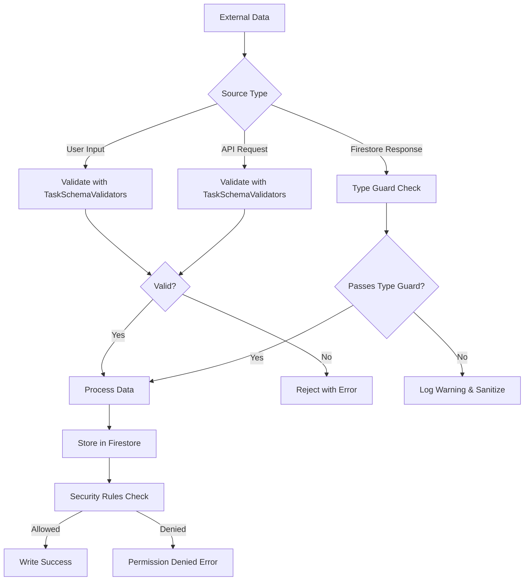
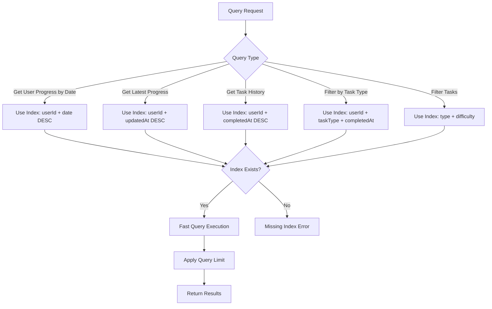

# Module Documentation: `daily-task-schema.ts`

## 1. Module Summary

**Purpose:** Firebase schema configuration and validation for the Daily Task System (每日修身).

**Size:** 419 lines

**Core Responsibility:** Defines Firestore collections structure, composite indexes, security rules, document ID patterns, validation helpers, type guards, query limits, caching strategies, batch operation limits, and data retention policies for the daily task system. Serves as the single source of truth for all Firebase schema requirements.

---

## 2. Module Dependencies

### Internal Dependencies
```typescript
import {
  DailyTask,
  DailyTaskProgress,
  TaskHistoryRecord,
  DailyTaskType,
  TaskDifficulty,
  TaskStatus
} from '../types/daily-task';
```
- **`../types/daily-task`** - Type definitions for task entities

### External Dependencies
None (pure configuration and validation module)

### Reverse Dependencies (Used by)
- `daily-task-service.ts` - Uses collection names, validators, query limits
- `task-generator.ts` - Uses validators and document ID patterns
- `user-level-service.ts` - Uses validators for task-related operations
- Firebase Console - Manual index and security rules deployment

---

## 3. Public API / Exports

### Collection Name Constants
```typescript
export const DAILY_TASK_COLLECTIONS: {
  TASKS: 'dailyTasks',
  PROGRESS: 'dailyTaskProgress',
  HISTORY: 'dailyTaskHistory',
};
```

### Index Configuration
```typescript
export const REQUIRED_INDEXES: readonly [{
  collection: string;
  fields: { field: string; order: 'ASCENDING' | 'DESCENDING' }[];
  description: string;
}];
// 5 composite indexes for dailyTaskProgress, dailyTaskHistory, dailyTasks
```

### Security Rules
```typescript
export const SUGGESTED_SECURITY_RULES: string;
// Complete Firestore security rules template (134 lines)
// - Helper functions: isAuthenticated(), isOwner(), isValidDate()
// - dailyTasks: read-only for authenticated users
// - dailyTaskProgress: user-scoped read/write with ID validation
// - dailyTaskHistory: append-only, user-scoped read
```

### Document ID Pattern Functions
```typescript
export const DOCUMENT_ID_PATTERNS: {
  PROGRESS: (userId: string, date: string) => string;  // "${userId}_${date}"
  HISTORY: 'auto';
  TASK: 'auto';
};
```

### Performance Estimates
```typescript
export const COLLECTION_ESTIMATES: {
  dailyTasks: { estimatedDocuments: 500, averageDocSize: 2, growthRate: 'slow', ... };
  dailyTaskProgress: { estimatedDocuments: 36500, averageDocSize: 4, growthRate: 'linear', ... };
  dailyTaskHistory: { estimatedDocuments: 730000, averageDocSize: 0.5, growthRate: 'linear', ... };
};
```

### Validation Helper Object
```typescript
export const TaskSchemaValidators: {
  isValidTaskType(type: string): type is DailyTaskType;
  isValidDifficulty(difficulty: string): type is TaskDifficulty;
  isValidStatus(status: string): type is TaskStatus;
  isValidDateFormat(date: string): boolean;  // YYYY-MM-DD format
  isValidProgressId(progressId: string): boolean;  // userId_YYYY-MM-DD pattern
  isValidXPReward(xp: number): boolean;  // 0-1000 range
  isValidScore(score: number): boolean;  // 0-100 range
  isValidStreak(streak: number): boolean;  // Non-negative integer
  isValidTimeEstimate(minutes: number): boolean;  // 1-60 minutes
};
```

### Schema Migration Tracking
```typescript
export const SchemaMigrations: {
  v1_0_0: {
    description: string;
    appliedAt: string;
    changes: string[];
  };
};
```

### Query Limit Constants
```typescript
export const QUERY_LIMITS: {
  MAX_TASKS_PER_QUERY: 50;
  MAX_HISTORY_PER_QUERY: 100;
  DEFAULT_HISTORY_LIMIT: 30;
  MAX_PROGRESS_RECORDS: 365;  // 1 year of data
};
```

### Cache TTL Recommendations (seconds)
```typescript
export const CACHE_TTL: {
  TASK_DEFINITIONS: 3600;  // 1 hour
  USER_PROGRESS: 300;      // 5 minutes
  TASK_HISTORY: 1800;      // 30 minutes
  STATISTICS: 3600;        // 1 hour
};
```

### Batch Operation Limits
```typescript
export const BATCH_LIMITS: {
  MAX_BATCH_SIZE: 500;  // Firestore limit
  TASK_GENERATION_BATCH: 50;  // Recommended size
};
```

### Data Retention Policies
```typescript
export const RETENTION_POLICIES: {
  PROGRESS_RETENTION_DAYS: 365;  // 1 year
  HISTORY_RETENTION_DAYS: -1;    // Infinite (for analytics)
  INACTIVE_USER_THRESHOLD_DAYS: 180;  // 6 months
};
```

### Unified Configuration Export
```typescript
export const DAILY_TASK_SCHEMA_CONFIG: {
  collections: typeof DAILY_TASK_COLLECTIONS;
  indexes: typeof REQUIRED_INDEXES;
  securityRules: typeof SUGGESTED_SECURITY_RULES;
  documentIdPatterns: typeof DOCUMENT_ID_PATTERNS;
  estimates: typeof COLLECTION_ESTIMATES;
  validators: typeof TaskSchemaValidators;
  migrations: typeof SchemaMigrations;
  queryLimits: typeof QUERY_LIMITS;
  cacheTTL: typeof CACHE_TTL;
  batchLimits: typeof BATCH_LIMITS;
  retentionPolicies: typeof RETENTION_POLICIES;
};
```

### Type Guard Functions
```typescript
export function isDailyTask(obj: unknown): obj is DailyTask;
export function isDailyTaskProgress(obj: unknown): obj is DailyTaskProgress;
export function isTaskHistoryRecord(obj: unknown): obj is TaskHistoryRecord;
```

---

## 4. Code File Breakdown

### A. Collection Name Configuration (Lines 27-31)
```typescript
export const DAILY_TASK_COLLECTIONS = {
  TASKS: 'dailyTasks',
  PROGRESS: 'dailyTaskProgress',
  HISTORY: 'dailyTaskHistory',
} as const;
```
**Purpose:** Type-safe references to Firestore collection names
**Why:** Prevents typos in collection name strings, enables IDE autocomplete

### B. Composite Index Definitions (Lines 37-79)
```typescript
export const REQUIRED_INDEXES = [
  {
    collection: 'dailyTaskProgress',
    fields: [
      { field: 'userId', order: 'ASCENDING' },
      { field: 'date', order: 'DESCENDING' },
    ],
    description: 'Query user progress by date range',
  },
  // ... 4 more indexes
] as const;
```
**Key Indexes:**
1. **dailyTaskProgress:** `userId + date DESC` - Date range queries
2. **dailyTaskProgress:** `userId + updatedAt DESC` - Latest progress
3. **dailyTaskHistory:** `userId + completedAt DESC` - Chronological history
4. **dailyTaskHistory:** `userId + taskType + completedAt DESC` - Type-filtered history
5. **dailyTasks:** `type + difficulty` - Task filtering

**Why:** These indexes must be manually created in Firebase Console to avoid "missing index" errors

### C. Security Rules Template (Lines 86-134)
**Helper Functions:**
- `isAuthenticated()` - Checks `request.auth != null`
- `isOwner(userId)` - Verifies `request.auth.uid == userId`
- `isValidDate(dateString)` - Validates YYYY-MM-DD format

**Collection Rules:**
- **dailyTasks:** Read-only for authenticated users, server-managed writes
- **dailyTaskProgress:** User-scoped CRUD with ID pattern validation `{userId}_{date}`
- **dailyTaskHistory:** Append-only, immutable after creation

### D. Document ID Pattern Functions (Lines 139-155)
```typescript
export const DOCUMENT_ID_PATTERNS = {
  PROGRESS: (userId: string, date: string) => `${userId}_${date}`,
  HISTORY: 'auto',
  TASK: 'auto',
} as const;
```
**Why:** Progress uses deterministic IDs for idempotency (one document per user per day)

### E. Collection Performance Estimates (Lines 160-182)
**Scale Projections (1000 users):**
- **dailyTasks:** 500 docs (~1 MB total) - Slow growth
- **dailyTaskProgress:** 36,500 docs (~146 MB/year) - Linear growth
- **dailyTaskHistory:** 730,000 docs (~365 MB/year) - Fastest growth

**Why:** Helps plan Firestore quotas and costs

### F. Validation Helpers (Lines 187-255)
**Critical Validators:**
```typescript
isValidTaskType(type: string): type is DailyTaskType
// Validates against enum: 'READING', 'KNOWLEDGE', 'PRACTICE', 'COMMUNITY', 'CHALLENGE'

isValidDifficulty(difficulty: string): type is TaskDifficulty
// Validates against enum: 'EASY', 'MEDIUM', 'HARD'

isValidDateFormat(date: string): boolean
// Regex: /^\d{4}-\d{2}-\d{2}$/ + Date object validation

isValidProgressId(progressId: string): boolean
// Pattern: /^[a-zA-Z0-9_-]+_\d{4}-\d{2}-\d{2}$/

isValidXPReward(xp: number): boolean
// Range: 0-1000

isValidScore(score: number): boolean
// Range: 0-100

isValidTimeEstimate(minutes: number): boolean
// Range: 1-60 minutes
```

### G. Schema Migration Tracking (Lines 260-274)
```typescript
export const SchemaMigrations = {
  v1_0_0: {
    description: 'Initial daily task system schema',
    appliedAt: '2025-01-XX',
    changes: [
      'Created dailyTasks collection',
      'Created dailyTaskProgress collection',
      'Created dailyTaskHistory collection',
      'Added composite indexes for user queries',
    ],
  },
};
```
**Why:** Documents schema evolution for version control and rollback

### H. Query and Performance Constants (Lines 279-359)
```typescript
// Query limits prevent over-fetching
export const QUERY_LIMITS = {
  MAX_TASKS_PER_QUERY: 50,
  MAX_HISTORY_PER_QUERY: 100,
  DEFAULT_HISTORY_LIMIT: 30,
  MAX_PROGRESS_RECORDS: 365,
} as const;

// Cache TTLs optimize read performance
export const CACHE_TTL = {
  TASK_DEFINITIONS: 3600,    // Rarely change
  USER_PROGRESS: 300,        // Frequent updates
  TASK_HISTORY: 1800,        // Append-only
  STATISTICS: 3600,          // Expensive calculations
} as const;

// Batch limits for bulk operations
export const BATCH_LIMITS = {
  MAX_BATCH_SIZE: 500,        // Firestore hard limit
  TASK_GENERATION_BATCH: 50,  // Recommended size
} as const;

// Data retention for GDPR/storage management
export const RETENTION_POLICIES = {
  PROGRESS_RETENTION_DAYS: 365,  // Keep 1 year
  HISTORY_RETENTION_DAYS: -1,    // Keep forever
  INACTIVE_USER_THRESHOLD_DAYS: 180,  // Archive after 6 months
} as const;
```

### I. Unified Configuration Object (Lines 364-376)
```typescript
export const DAILY_TASK_SCHEMA_CONFIG = {
  collections: DAILY_TASK_COLLECTIONS,
  indexes: REQUIRED_INDEXES,
  securityRules: SUGGESTED_SECURITY_RULES,
  documentIdPatterns: DOCUMENT_ID_PATTERNS,
  estimates: COLLECTION_ESTIMATES,
  validators: TaskSchemaValidators,
  migrations: SchemaMigrations,
  queryLimits: QUERY_LIMITS,
  cacheTTL: CACHE_TTL,
  batchLimits: BATCH_LIMITS,
  retentionPolicies: RETENTION_POLICIES,
} as const;
```
**Why:** Single import for all schema configuration in tests and documentation

### J. Runtime Type Guards (Lines 381-418)
```typescript
export function isDailyTask(obj: unknown): obj is DailyTask {
  const task = obj as DailyTask;
  return (
    typeof task.id === 'string' &&
    TaskSchemaValidators.isValidTaskType(task.type) &&
    TaskSchemaValidators.isValidDifficulty(task.difficulty) &&
    TaskSchemaValidators.isValidXPReward(task.xpReward) &&
    TaskSchemaValidators.isValidTimeEstimate(task.timeEstimate)
  );
}
```
**Why:** Runtime validation for API responses and Firestore data (since Firestore is untyped)

---

## 5. System and Data Flow

### A. Schema Validation Flow


### B. Document ID Generation and Storage
```mermaid
flowchart LR
    A[User Submits Task] --> B{Collection Type}

    B -->|dailyTaskProgress| C[Generate Deterministic ID]
    C --> D["userId + '_' + date"]
    D --> E[Upsert Document]
    E --> F[Idempotent Storage]

    B -->|dailyTaskHistory| G[Auto-generate ID]
    G --> H[Firestore.add()]
    H --> I[Append New Record]

    B -->|dailyTasks| J[Auto-generate ID or UUID]
    J --> K[Firestore.add()]
    K --> L[Store Task Definition]

    F --> M[Apply Security Rules]
    I --> M
    L --> M
    M --> N{Rules Pass?}
    N -->|Yes| O[Persist to Firestore]
    N -->|No| P[Reject Write]
```

### C. Query Optimization with Indexes


---

## 6. Usage Example & Testing

### A. Basic Usage - Collection References
```typescript
import { DAILY_TASK_COLLECTIONS } from '@/lib/config/daily-task-schema';
import { db } from '@/lib/firebase';
import { collection, query, where, getDocs } from 'firebase/firestore';

// Type-safe collection references
const tasksRef = collection(db, DAILY_TASK_COLLECTIONS.TASKS);
const progressRef = collection(db, DAILY_TASK_COLLECTIONS.PROGRESS);
const historyRef = collection(db, DAILY_TASK_COLLECTIONS.HISTORY);

// Example: Query user progress for specific date
const userId = 'user123';
const date = '2025-01-15';
const progressQuery = query(
  progressRef,
  where('userId', '==', userId),
  where('date', '==', date)
);
const snapshot = await getDocs(progressQuery);
```

### B. Document ID Generation
```typescript
import { DOCUMENT_ID_PATTERNS } from '@/lib/config/daily-task-schema';
import { doc, setDoc } from 'firebase/firestore';

// Generate deterministic progress document ID
const userId = 'user456';
const date = '2025-01-15';
const progressId = DOCUMENT_ID_PATTERNS.PROGRESS(userId, date);
// Result: "user456_2025-01-15"

// Upsert progress document (idempotent)
const progressDoc = doc(db, DAILY_TASK_COLLECTIONS.PROGRESS, progressId);
await setDoc(progressDoc, {
  userId,
  date,
  tasks: [],
  completedCount: 0,
  streak: 5,
  updatedAt: new Date(),
}, { merge: true });
```

### C. Data Validation
```typescript
import { TaskSchemaValidators } from '@/lib/config/daily-task-schema';

// Validate user input before Firestore write
function validateTaskSubmission(data: any): boolean {
  if (!TaskSchemaValidators.isValidTaskType(data.type)) {
    throw new Error(`Invalid task type: ${data.type}`);
  }

  if (!TaskSchemaValidators.isValidDifficulty(data.difficulty)) {
    throw new Error(`Invalid difficulty: ${data.difficulty}`);
  }

  if (!TaskSchemaValidators.isValidXPReward(data.xpReward)) {
    throw new Error(`Invalid XP reward: ${data.xpReward} (must be 0-1000)`);
  }

  if (!TaskSchemaValidators.isValidScore(data.score)) {
    throw new Error(`Invalid score: ${data.score} (must be 0-100)`);
  }

  return true;
}

// Example usage
const taskData = {
  type: 'READING',
  difficulty: 'MEDIUM',
  xpReward: 50,
  score: 85,
};
validateTaskSubmission(taskData);  // Returns true or throws error
```

### D. Type Guards for Runtime Safety
```typescript
import { isDailyTask, isDailyTaskProgress } from '@/lib/config/daily-task-schema';

// Validate Firestore response data
async function fetchDailyTask(taskId: string): Promise<DailyTask> {
  const taskDoc = await getDoc(doc(db, DAILY_TASK_COLLECTIONS.TASKS, taskId));
  const data = taskDoc.data();

  if (!isDailyTask(data)) {
    console.error('Invalid task data structure:', data);
    throw new Error('Corrupted task data in Firestore');
  }

  return data;  // TypeScript knows this is DailyTask
}

// Validate user progress data
async function fetchUserProgress(userId: string, date: string) {
  const progressId = DOCUMENT_ID_PATTERNS.PROGRESS(userId, date);
  const progressDoc = await getDoc(doc(db, DAILY_TASK_COLLECTIONS.PROGRESS, progressId));
  const data = progressDoc.data();

  if (!isDailyTaskProgress(data)) {
    console.warn('Invalid progress structure, initializing default');
    return null;
  }

  return data;
}
```

### E. Query with Limits and Caching
```typescript
import { QUERY_LIMITS, CACHE_TTL } from '@/lib/config/daily-task-schema';

// Fetch task history with pagination
async function getTaskHistory(userId: string, limit: number = QUERY_LIMITS.DEFAULT_HISTORY_LIMIT) {
  const historyQuery = query(
    collection(db, DAILY_TASK_COLLECTIONS.HISTORY),
    where('userId', '==', userId),
    orderBy('completedAt', 'desc'),
    limit(Math.min(limit, QUERY_LIMITS.MAX_HISTORY_PER_QUERY))  // Enforce max limit
  );

  const snapshot = await getDocs(historyQuery);
  return snapshot.docs.map(doc => doc.data());
}

// Implement caching strategy
const taskCache = new Map<string, { data: any; expiry: number }>();

async function getCachedTaskDefinitions() {
  const cacheKey = 'all_tasks';
  const cached = taskCache.get(cacheKey);
  const now = Date.now();

  if (cached && cached.expiry > now) {
    return cached.data;  // Return cached data
  }

  // Fetch from Firestore
  const snapshot = await getDocs(collection(db, DAILY_TASK_COLLECTIONS.TASKS));
  const tasks = snapshot.docs.map(doc => doc.data());

  // Cache with TTL
  taskCache.set(cacheKey, {
    data: tasks,
    expiry: now + (CACHE_TTL.TASK_DEFINITIONS * 1000),  // Convert seconds to ms
  });

  return tasks;
}
```

### F. Testing Strategy
```typescript
// tests/lib/config/daily-task-schema.test.ts
import {
  TaskSchemaValidators,
  isDailyTask,
  DOCUMENT_ID_PATTERNS,
  QUERY_LIMITS,
} from '@/lib/config/daily-task-schema';

describe('TaskSchemaValidators', () => {
  describe('isValidTaskType', () => {
    it('should accept valid task types', () => {
      expect(TaskSchemaValidators.isValidTaskType('READING')).toBe(true);
      expect(TaskSchemaValidators.isValidTaskType('KNOWLEDGE')).toBe(true);
    });

    it('should reject invalid task types', () => {
      expect(TaskSchemaValidators.isValidTaskType('INVALID')).toBe(false);
      expect(TaskSchemaValidators.isValidTaskType('')).toBe(false);
    });
  });

  describe('isValidDateFormat', () => {
    it('should accept YYYY-MM-DD format', () => {
      expect(TaskSchemaValidators.isValidDateFormat('2025-01-15')).toBe(true);
      expect(TaskSchemaValidators.isValidDateFormat('2025-12-31')).toBe(true);
    });

    it('should reject invalid formats', () => {
      expect(TaskSchemaValidators.isValidDateFormat('2025-1-15')).toBe(false);
      expect(TaskSchemaValidators.isValidDateFormat('15-01-2025')).toBe(false);
      expect(TaskSchemaValidators.isValidDateFormat('2025/01/15')).toBe(false);
    });
  });

  describe('isValidXPReward', () => {
    it('should accept valid XP ranges', () => {
      expect(TaskSchemaValidators.isValidXPReward(0)).toBe(true);
      expect(TaskSchemaValidators.isValidXPReward(500)).toBe(true);
      expect(TaskSchemaValidators.isValidXPReward(1000)).toBe(true);
    });

    it('should reject out-of-range XP', () => {
      expect(TaskSchemaValidators.isValidXPReward(-10)).toBe(false);
      expect(TaskSchemaValidators.isValidXPReward(1001)).toBe(false);
    });
  });
});

describe('isDailyTask type guard', () => {
  it('should accept valid DailyTask objects', () => {
    const validTask = {
      id: 'task123',
      type: 'READING',
      difficulty: 'MEDIUM',
      xpReward: 50,
      timeEstimate: 15,
      title: 'Test Task',
      description: 'Test Description',
    };
    expect(isDailyTask(validTask)).toBe(true);
  });

  it('should reject invalid objects', () => {
    expect(isDailyTask({})).toBe(false);
    expect(isDailyTask({ id: 'test' })).toBe(false);
    expect(isDailyTask(null)).toBe(false);
  });
});

describe('DOCUMENT_ID_PATTERNS', () => {
  it('should generate correct progress IDs', () => {
    const result = DOCUMENT_ID_PATTERNS.PROGRESS('user123', '2025-01-15');
    expect(result).toBe('user123_2025-01-15');
  });

  it('should validate generated IDs', () => {
    const progressId = DOCUMENT_ID_PATTERNS.PROGRESS('user456', '2025-12-31');
    expect(TaskSchemaValidators.isValidProgressId(progressId)).toBe(true);
  });
});

describe('Constants', () => {
  it('should define reasonable query limits', () => {
    expect(QUERY_LIMITS.MAX_TASKS_PER_QUERY).toBeGreaterThan(0);
    expect(QUERY_LIMITS.DEFAULT_HISTORY_LIMIT).toBeLessThanOrEqual(
      QUERY_LIMITS.MAX_HISTORY_PER_QUERY
    );
  });
});
```

### G. Deploying Security Rules
```bash
# 1. Copy SUGGESTED_SECURITY_RULES content from the module
# 2. Save to firestore.rules file
# 3. Deploy to Firebase
firebase deploy --only firestore:rules

# Alternatively, paste directly in Firebase Console:
# Firebase Console > Firestore Database > Rules tab
```

### H. Creating Required Indexes
```bash
# Option 1: Firebase Console (Manual)
# 1. Navigate to Firebase Console > Firestore > Indexes
# 2. Create each index from REQUIRED_INDEXES array
# 3. Wait for index build completion (~1-5 minutes)

# Option 2: Firestore indexes configuration file
# Create firestore.indexes.json with index definitions
firebase deploy --only firestore:indexes
```

---

**Module Metadata:**
- **Type:** Configuration
- **Test Coverage:** Not directly tested (used by other modules)
- **LOC:** 419 lines
- **Complexity:** Low (declarative configuration)
- **Maintenance Notes:** Update indexes when adding new query patterns; increment schema version in SchemaMigrations when modifying structure
