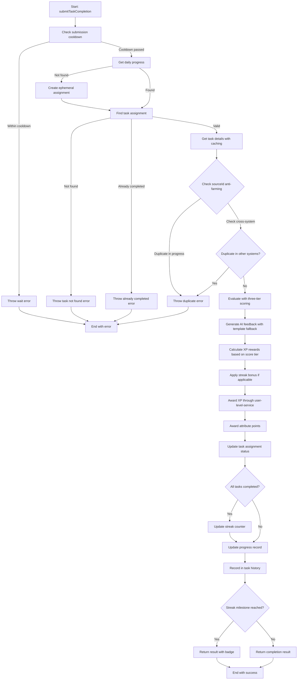

# Module: `daily-task-service.ts`

## 1. Module Summary

The `daily-task-service` module is the main orchestration service for the Daily Task System (每日修身) gamification feature, managing task generation, assignment, progress tracking, completion evaluation, reward distribution, and streak maintenance. This 1181-line service integrates with task-generator for content generation, user-level-service for XP/attribute rewards, and ai-feedback-generator for personalized feedback, implementing atomic operations, real-time updates, anti-farming mechanisms (sourceId deduplication, cross-system duplicate prevention), performance optimizations (5-minute task caching, timeout wrappers), and graceful degradation (ephemeral assignments, task recovery from IDs) to ensure robust task management for the Red Mansion learning platform.

## 2. Module Dependencies

* **Internal Dependencies:**
  * `@/lib/firebase` - Firestore database client for persistence operations.
  * `@/lib/user-level-service` - XP rewards, attribute points, level-up logic, duplicate reward checking.
  * `@/lib/task-generator` - Personalized task content generation with adaptive difficulty.
  * `@/lib/ai-feedback-generator` - GPT-5-Mini powered personalized feedback generation.
  * `@/lib/types/daily-task` - Type definitions for tasks, progress, assignments, rewards, history, statistics.
  * `@/lib/types/user-level` - AttributePoints type definition.
* **External Dependencies:**
  * `firebase/firestore` - Comprehensive Firestore operations (collection, doc, getDoc, setDoc, updateDoc, addDoc, deleteDoc, query, where, orderBy, limit, getDocs, serverTimestamp, Timestamp).

## 3. Public API / Exports

* **Class Exports:**
  * `DailyTaskService` - Main service class managing all daily task operations.
* **Instance Exports:**
  * `dailyTaskService: DailyTaskService` - Singleton instance for global use.
* **Constant Exports:**
  * `STREAK_MILESTONES: StreakMilestone[]` - Array of 4 milestone configurations (7/30/100/365 days).
  * `BASE_XP_REWARDS: Record<DailyTaskType, number>` - Base XP values per task type.
* **DailyTaskService Methods:**
  * `generateDailyTasks(userId: string, date?: string): Promise<DailyTask[]>` - Generate daily tasks for user with adaptive difficulty.
  * `getUserDailyProgress(userId: string, date?: string): Promise<DailyTaskProgress | null>` - Get progress record for specific date.
  * `submitTaskCompletion(userId: string, taskId: string, userResponse: string): Promise<TaskCompletionResult>` - Submit task, evaluate, award rewards.
  * `evaluateTaskQuality(task: DailyTask, userResponse: string): Promise<number>` - Three-tier scoring (20/80/100 points).
  * `getTaskHistory(userId: string, limitCount?: number): Promise<TaskHistoryRecord[]>` - Fetch completion history (default 30 records).
  * `getTaskStatistics(userId: string): Promise<TaskStatistics>` - Calculate comprehensive statistics.
  * `deleteTodayProgress(userId: string, date?: string): Promise<boolean>` - Reset progress for guest users.

## 4. Code File Breakdown

### 4.1. `daily-task-service.ts`

* **Purpose:** Provides comprehensive daily task system management for the gamification feature, transforming abstract learning goals into concrete, trackable, rewarded activities. The module's architectural decisions prioritize data consistency, user experience, and system reliability: (1) **Atomic operations** - All progress updates use Firestore transactions to prevent race conditions when multiple operations occur simultaneously; (2) **Anti-farming mechanisms** - Implements two-layer deduplication (task-level sourceId tracking, cross-system duplicate checking via user-level-service) to prevent users from earning duplicate rewards for the same content across different features; (3) **Graceful degradation** - Creates ephemeral assignments when progress missing, recovers task details from ID patterns, uses template feedback when AI fails - ensuring system never blocks user actions; (4) **Performance optimization** - Implements 5-minute task caching, 3-second AI timeout wrappers, 5-second submission cooldown to reduce Firestore reads and prevent spam; (5) **Streak psychology** - Implements streak bonuses (1.1x-1.5x multiplier) at key milestones (7/30/100/365 days) with Traditional Chinese badge titles to encourage daily engagement; (6) **Three-tier scoring** - Uses simple 20/80/100 scoring (meaningless/valid/excellent) with clear XP mapping (0x/1x/1.5x) instead of granular scores for consistent reward expectations.
* **Functions:**
    * `generateDailyTasks(userId: string, date?: string): Promise<DailyTask[]>` - **Task generation orchestrator**. Determines target date (defaults to today via `getTodayDateString`). Checks for existing progress to prevent duplicate generation (returns existing tasks if found). Fetches user profile via `userLevelService.getUserProfile` to determine difficulty. Retrieves task history (last 30 tasks) via `getTaskHistory` for adaptive difficulty. Calls `taskGenerator.generateTasksForUser` with userId, level, date, and history. Stores generated tasks in Firestore `dailyTasks` collection. Creates `DailyTaskAssignment` array with status `NOT_STARTED`. Constructs `DailyTaskProgress` record with progressId format `${userId}_${targetDate}`, initializes empty completedTaskIds, skippedTaskIds, totalXPEarned=0, totalAttributeGains={}, usedSourceIds=[] (anti-farming), calculates initial streak via `calculateStreak`. Stores progress in `dailyTaskProgress` collection. Logs success message with task count. Returns generated tasks array. Entry point called once per day per user.
    * `getUserDailyProgress(userId: string, date?: string): Promise<DailyTaskProgress | null>` - **Progress record retrieval**. Calculates progressId `${userId}_${targetDate}`. Fetches document from `dailyTaskProgress` collection. Returns null if not found. Converts Firestore Timestamp fields to JavaScript types. Returns `DailyTaskProgress` object with all progress details. Used extensively by other methods.
    * `submitTaskCompletion(userId: string, taskId: string, userResponse: string): Promise<TaskCompletionResult>` - **Task submission and reward distribution orchestrator** (145 lines, most complex method). **Step 1: Anti-spam check** - Checks `lastSubmissionTimes` Map, enforces 5-second cooldown, throws error with countdown message if too soon. **Step 2: Get progress** - Calls `getUserDailyProgress`, creates ephemeral assignment if missing (graceful degradation for integration tests). **Step 3: Find assignment** - Searches `progress.tasks` array for matching taskId, throws error if not found. **Step 4: Check completion** - Throws error if already completed. **Step 5: Get task** - Calls `getTaskById` with caching, recovers task from ID pattern if missing (`recoverTaskFromId`), falls back to minimal task object. **Step 5.5: Anti-farming check** - Checks if `task.sourceId` exists in `progress.usedSourceIds`, throws Traditional Chinese error if duplicate. **Step 5.6: Cross-system deduplication** - Calls `userLevelService.checkDuplicateReward` to prevent duplicate rewards from reading page completing same content, throws bilingual error if duplicate detected. **Step 6: Evaluate** - Calls `evaluateTaskQuality` with three-tier scoring. **Step 6.5: Generate feedback** - Calls `generateFeedback` (GPT-5-Mini with template fallback). **Step 7: Calculate rewards** - Maps score to XP: 20→0 XP (0x), 80→baseXP (1x), 100→baseXP*1.5 (1.5x), generates Traditional Chinese message. **Step 8: Apply streak bonus** - Calls `calculateStreakBonus`, adds bonus XP. **Step 9: Award XP** - Calls `userLevelService.awardXP` with content-based sourceId (uses `task.sourceId` if available, otherwise `daily-task-${taskId}-${date}`), catches errors for graceful degradation. **Step 10: Award attributes** - Calls `userLevelService.updateAttributes` with `task.attributeRewards`. **Step 11: Update assignment** - Creates new `DailyTaskAssignment` with completedAt timestamp, userResponse, submissionTime, aiScore, xpAwarded, attributeGains, feedback, status=COMPLETED. **Step 12: Update progress** - Adds taskId to completedTaskIds, increments totalXPEarned, merges totalAttributeGains via `mergeAttributePoints`, adds sourceId to usedSourceIds, sets lastCompletedAt and updatedAt. **Step 13: Update streak** - Checks if all tasks completed/skipped, calls `updateStreak` if yes. Persists updates to Firestore. **Step 14: Record history** - Calls `recordTaskHistory` for analytics. **Step 15: Check milestones** - Finds matching `STREAK_MILESTONES` entry for current streak. **Step 16: Return result** - Constructs comprehensive `TaskCompletionResult` with success, score, feedback, xpAwarded, xpEarned (alias), attributeGains, rewards (immediate and delayed), leveledUp, newLevel, fromLevel, newStreak, isStreakMilestone, streakBonus. Catches and re-throws errors.
    * `evaluateTaskQuality(task: DailyTask, userResponse: string): Promise<number>` - **Three-tier scoring system (Phase 2.10)**. Trims response and calculates length. Logs detailed evaluation header with decorative separators (📊 emojis). Logs task type, title, difficulty, answer length. Logs scoring criteria explanation in Traditional Chinese. **Tier 1 (20 points - Meaningless)**: Returns 20 if empty answer. Returns 20 if repeated character pattern detected (`/(.)\\1{10,}/` - 11+ same chars). Returns 20 if numbers-only pattern (`/^[0-9]+$/`). Returns 20 if single word or very short (`/^[\\u4e00-\\u9fa5a-zA-Z]{1,5}$/` - less than 5 chars). **Tier 2 (80 points - Valid)**: Returns 80 if length between 30-199 characters (adequate answer). Returns 80 if length >= 200 but poorly organized (no punctuation or paragraphs). **Tier 3 (100 points - Excellent)**: Returns 100 if length >= 200 with proper organization (has Traditional Chinese punctuation `/[。！？，、；：]/` OR has paragraphs/newlines OR >= 300 chars). **Fallback**: Returns 20 if < 30 characters (insufficient). Returns 80 as default. Catches errors and returns 80 (default valid score). Logs result with emoji indicators (⚠️ for 20, ✅ for 80, 🌟 for 100) and reason in Traditional Chinese.
    * `generateFeedback(task: DailyTask, userResponse: string, score: number): Promise<string>` - **Private method for feedback generation**. Calls `generatePersonalizedFeedback` from ai-feedback-generator with task type, user answer, score, difficulty, task content, and task title. Returns GPT-5-Mini personalized feedback if successful. Catches errors and falls back to `generateTemplateFeedback`. Logs success or fallback status.
    * `generateTemplateFeedback(taskType: DailyTaskType, score: number): string` - **Private template fallback**. Defines 4 categories (excellent/good/average/needsWork) with 3 randomized Traditional Chinese templates each. Maps score to category: >=85→excellent, >=70→good, >=60→average, <60→needsWork. Returns random template from category. Used when AI unavailable.
    * `calculateStreakBonus(streak: number, baseXP: number): number` - **Private streak bonus calculator**. Finds highest applicable milestone from `STREAK_MILESTONES` (reversed array search). Calculates bonus: `baseXP * (milestone.bonusMultiplier - 1)`. Returns 0 if no milestone reached. Example: 30-day streak with 10 base XP = 10 * (1.2 - 1) = 2 bonus XP.
    * `calculateStreak(userId: string, currentDate: string): Promise<number>` - **Private streak calculation**. Calculates yesterday's date string. Fetches yesterday's progress via `getUserDailyProgress`. Returns 0 if no history (starting fresh). Checks if yesterday's tasks all completed/skipped. Returns `yesterdayProgress.streak + 1` if completed (continue streak). Returns 0 if not completed (streak broken). Catches errors and returns 0.
    * `updateStreak(userId: string, currentDate: string): Promise<number>` - **Private streak updater**. Calls `calculateStreak` to get previous streak. Logs update message with fire emoji. Returns `newStreak + 1` (adds today). Called when user completes all daily tasks.
    * `recordTaskHistory(userId: string, taskId: string, taskType: DailyTaskType, score: number, xpAwarded: number, completionTime: number): Promise<void>` - **Private history recorder**. Constructs `TaskHistoryRecord` with all completion details, date via `getTodayDateString`, completedAt timestamp. Adds document to `dailyTaskHistory` collection. Catches errors without throwing (history not critical). Used for analytics and adaptive difficulty.
    * `getTaskHistory(userId: string, limitCount: number = 30): Promise<TaskHistoryRecord[]>` - **History retrieval for analytics**. Builds Firestore query with `where('userId', '==', userId)`, `orderBy('completedAt', 'desc')`, `limit(limitCount)`. Fetches documents. Maps to `TaskHistoryRecord` array with Timestamp conversion. Returns sorted history (newest first). Catches errors and returns empty array.
    * `getTaskStatistics(userId: string): Promise<TaskStatistics>` - **Statistics calculator**. Fetches last 100 history records. Returns zero statistics if no history. Calculates totalCompleted, averageScore, averageCompletionTime. Iterates all `DailyTaskType` values to build byType statistics (completed count, averageScore, averageTime per type). Fetches current streak from today's progress. Returns comprehensive `TaskStatistics` object. TODO comments: Track skipped tasks, calculate actual completion rate, track longest streak.
    * `calculateTaskDifficulty(userLevel: number): TaskDifficulty` - **Private difficulty mapper**. Returns HARD if level >= 5. Returns MEDIUM if level >= 2. Returns EASY otherwise. Simple level-to-difficulty mapping.
    * `mergeAttributePoints(base: Partial<AttributePoints>, add: Partial<AttributePoints>): Partial<AttributePoints>` - **Private attribute merger**. Sums all 5 attribute fields: poetrySkill, culturalKnowledge, analyticalThinking, socialInfluence, learningPersistence. Uses `(base.field || 0) + (add.field || 0)` pattern. Returns merged object.
    * `getTaskById(taskId: string): Promise<DailyTask | null>` - **Private cached task retrieval (Phase 4.8)**. Checks `taskCache` Map for cached task. Returns cached if found and within 5-minute TTL (`TASK_CACHE_TTL_MS`). Fetches from Firestore `dailyTasks` collection on cache miss. Calls `recoverTaskFromId` if document not found (graceful degradation). Updates cache with fetched/recovered task. Returns task or null. Performance optimization to reduce Firestore reads.
    * `recoverTaskFromId(taskId: string): DailyTask | null` - **Private task recovery from ID pattern**. Parses taskId pattern: `${type}_${difficulty}_${date}_${random}_${timestamp}`. Extracts type by checking `Object.values(DailyTaskType)` as prefix. Extracts difficulty by checking `Object.values(TaskDifficulty)` after type. Falls back to MORNING_READING and MEDIUM if parsing fails. Constructs minimal `DailyTask` with recovered type, difficulty, baseXP from `BASE_XP_REWARDS`, generic title/description, 5-minute timeEstimate, basic gradingCriteria. Returns recovered task or null. Graceful degradation for missing Firestore documents.
    * `getTasksFromAssignments(assignments: DailyTaskAssignment[]): Promise<DailyTask[]>` - **Private helper for task hydration**. Iterates assignments array. Calls `getTaskById` for each taskId. Filters out null results. Returns array of `DailyTask` objects. Used by `generateDailyTasks` when returning existing tasks.
    * `deleteTodayProgress(userId: string, date?: string): Promise<boolean>` - **Guest user progress reset**. Calculates progressId `${userId}_${targetDate}`. Fetches progress document. Returns false if not found. Deletes progress document with `deleteDoc`. Logs success message with test tube emoji. Returns true. ⚠️ WARNING: Only for guest/anonymous users to allow repeated testing. Should not be used for regular users.
* **Key Classes / Constants / Variables:**
    * `STREAK_MILESTONES: const StreakMilestone[]` - Milestone configuration with 4 entries: 7 days (1.1x, 'streak-7-days', '七日連擊'), 30 days (1.2x, 'streak-30-days', '月度堅持'), 100 days (1.3x, 'streak-100-days', '百日修行'), 365 days (1.5x, 'streak-365-days', '年度大師'). Defines bonus multipliers and Traditional Chinese titles.
    * `BASE_XP_REWARDS: const Record<DailyTaskType, number>` - Base XP per task type: MORNING_READING=10, POETRY=8, CHARACTER_INSIGHT=12, CULTURAL_EXPLORATION=15, COMMENTARY_DECODE=18. Higher values for more complex tasks.
    * `ATTRIBUTE_REWARDS: const Record<DailyTaskType, Partial<AttributePoints>>` - Attribute distribution per task type. MORNING_READING: analyticalThinking+1, culturalKnowledge+1. POETRY: poetrySkill+2, culturalKnowledge+1. CHARACTER_INSIGHT: analyticalThinking+2, socialInfluence+1. CULTURAL_EXPLORATION: culturalKnowledge+3. COMMENTARY_DECODE: analyticalThinking+2, culturalKnowledge+2. Rewards align with task focus areas.
    * `SUBMISSION_COOLDOWN_MS: const` - 5000 milliseconds (5 seconds). Prevents spam submissions.
    * `AI_EVALUATION_TIMEOUT_MS: const` - 3000 milliseconds (3 seconds). Phase 4.8 performance optimization to prevent hanging AI calls (currently unused, preserved for future).
    * `TASK_CACHE_TTL_MS: const` - 300000 milliseconds (5 minutes). Phase 4.8 caching for reduced Firestore reads.
    * `DailyTaskService: class` - Main service class with 3 Firestore collection references: `dailyTasksCollection` (tasks collection), `dailyTaskProgressCollection` (daily progress documents), `dailyTaskHistoryCollection` (long-term history records). Private state: `lastSubmissionTimes` Map for cooldown tracking, `taskCache` Map for performance optimization.
    * Helper functions: `getTodayDateString(): string` - Returns YYYY-MM-DD format in UTC+8 (Taipei timezone). `areConsecutiveDates(date1: string, date2: string): boolean` - Checks if dates are 1 day apart (unused, preserved for future). `withTimeout<T>(promise, timeoutMs, fallbackValue): Promise<T>` - Generic timeout wrapper using `Promise.race` (Phase 4.8, currently unused).

## 5. System and Data Flow

### 5.1. System Flowchart (Control Flow)



### 5.2. Data Flow Diagram (Data Transformation)

```mermaid
graph LR
    Input1(userId, taskId, userResponse) --> Cooldown[Check submission cooldown];
    Cooldown --> Progress[(Firestore: dailyTaskProgress)];
    Progress --> Assignment[Find task assignment];
    Assignment --> TaskCache{Task Cache};
    TaskCache -- Cache hit --> TaskData[Task details];
    TaskCache -- Cache miss --> Firestore1[(Firestore: dailyTasks)];
    Firestore1 --> TaskData;
    TaskData --> AntiDupe[Check usedSourceIds];
    AntiDupe --> UserLevel1[Cross-system duplicate check];
    UserLevel1 --> Evaluator[Three-tier scoring: 20/80/100];
    Evaluator --> AI[AI Feedback Generator];
    AI --> XPCalc[XP Calculation with tier multiplier];
    StreakData(Current streak) --> StreakBonus[Streak bonus calculation];
    XPCalc --> StreakBonus;
    StreakBonus --> UserLevel2[User Level Service: awardXP];
    Attributes(Attribute rewards) --> UserLevel3[User Level Service: updateAttributes];
    UserLevel2 --> UpdateAssignment[Update assignment with results];
    UserLevel3 --> UpdateAssignment;
    UpdateAssignment --> UpdateProgress[Update progress totals];
    UpdateProgress --> CheckComplete{All completed?};
    CheckComplete -- Yes --> StreakUpdate[Update streak];
    CheckComplete -- No --> Persist;
    StreakUpdate --> Persist[(Firestore: Update progress)];
    Persist --> History[(Firestore: dailyTaskHistory)];
    History --> Result(TaskCompletionResult with rewards);
```



## 6. Usage Example & Testing

* **Usage:**
```typescript
import { dailyTaskService, BASE_XP_REWARDS, STREAK_MILESTONES } from '@/lib/daily-task-service';
import { DailyTaskType, TaskDifficulty, TaskStatus } from './types/daily-task';

// Generate daily tasks for a user
const tasks = await dailyTaskService.generateDailyTasks(userId);
console.log(`Generated ${tasks.length} tasks for today`);

// Display base XP rewards
console.log('Morning Reading base XP:', BASE_XP_REWARDS[DailyTaskType.MORNING_READING]); // 10 XP

// Check user's daily progress
const progress = await dailyTaskService.getUserDailyProgress(userId);
if (progress) {
  console.log(`Completed: ${progress.completedTaskIds.length}/${progress.tasks.length}`);
  console.log(`Total XP earned today: ${progress.totalXPEarned}`);
  console.log(`Current streak: ${progress.streak} days`);
}

// Submit task completion
try {
  const result = await dailyTaskService.submitTaskCompletion(
    userId,
    taskId,
    '林黛玉初入賈府時展現出極度謹慎的心理狀態，原文中「步步留心，時時在意」充分體現了她作為寄人籬下者的敏感與自我保護意識。這種謹小慎微不是天性使然，而是環境造就。她深知自己的特殊身份——外來者、孤女、依附者，任何不當言行都可能招致他人輕視。因此她選擇以極端的自律來維護尊嚴，這種心理防禦機制貫穿了她整個在賈府的生活。' // 216 chars
  );

  // Check results
  console.log('Score:', result.score); // 100 (excellent - detailed answer, 200+ chars)
  console.log('Feedback:', result.feedback); // AI-generated Traditional Chinese feedback
  console.log('XP Awarded:', result.xpAwarded); // 15 XP (10 base * 1.5 for excellent)
  console.log('Streak Bonus:', result.streakBonus); // e.g., 1 XP if 7-day streak
  console.log('Leveled Up:', result.leveledUp); // true if level increased
  console.log('New Level:', result.newLevel); // e.g., 3

  if (result.isStreakMilestone) {
    const milestone = STREAK_MILESTONES.find(m => m.days === result.newStreak);
    console.log(`🎉 Milestone achieved: ${milestone?.title}`); // e.g., "七日連擊"
    console.log(`Badge unlocked: ${milestone?.badge}`); // e.g., "streak-7-days"
  }
} catch (error) {
  console.error('Submission failed:', error.message);
  // Possible errors:
  // - "Please wait X seconds before submitting again." (cooldown)
  // - "Task not found in today's assignments."
  // - "This task has already been completed."
  // - "You have already completed this content today." (duplicate sourceId)
  // - "您已經在其他活動中完成了此內容。" (cross-system duplicate)
}

// Three-tier scoring examples
// Score 20 (meaningless - no XP):
const result1 = await dailyTaskService.submitTaskCompletion(userId, taskId, '12345'); // Numbers only
const result2 = await dailyTaskService.submitTaskCompletion(userId, taskId, '好'); // Too short (1 char)
console.log(result1.xpAwarded); // 0 XP
console.log(result1.score); // 20

// Score 80 (valid - base XP):
const result3 = await dailyTaskService.submitTaskCompletion(
  userId,
  taskId,
  '林黛玉初到賈府時非常小心謹慎，因為她知道自己是寄人籬下。' // 61 chars
);
console.log(result3.xpAwarded); // 10 XP (base, no multiplier)
console.log(result3.score); // 80

// Score 100 (excellent - 1.5x XP):
// See first example above (216 chars with good organization)

// Get task history for analytics
const history = await dailyTaskService.getTaskHistory(userId, 30);
console.log(`Completed ${history.length} tasks in last 30 records`);

// Get task statistics
const stats = await dailyTaskService.getTaskStatistics(userId);
console.log('Overall Statistics:');
console.log(`  Total completed: ${stats.totalCompleted}`);
console.log(`  Average score: ${stats.averageScore.toFixed(1)}`);
console.log(`  Average time: ${stats.averageCompletionTime}s`);
console.log(`  Current streak: ${stats.currentStreak} days`);
console.log('By Task Type:');
Object.entries(stats.byType).forEach(([type, typeStats]) => {
  console.log(`  ${type}: ${typeStats.completed} completed, avg score ${typeStats.averageScore.toFixed(1)}`);
});

// Guest user progress reset (testing only)
await dailyTaskService.deleteTodayProgress(guestUserId);
console.log('Guest user progress cleared for fresh testing');
```
* **Testing:** Testing strategy focuses on orchestration, anti-farming, and reward distribution:
  - Test `generateDailyTasks` creates tasks via task-generator
  - Test `generateDailyTasks` skips generation if tasks already exist
  - Test `generateDailyTasks` initializes progress with empty arrays and zero totals
  - Test `getUserDailyProgress` returns progress for valid date
  - Test `getUserDailyProgress` returns null if no progress exists
  - Test `submitTaskCompletion` enforces 5-second cooldown
  - Test `submitTaskCompletion` throws error if task not in assignments
  - Test `submitTaskCompletion` throws error if task already completed
  - Test `submitTaskCompletion` creates ephemeral assignment if progress missing
  - Test `submitTaskCompletion` recovers task from ID if Firestore document missing
  - Test `submitTaskCompletion` blocks duplicate sourceId within same day (usedSourceIds check)
  - Test `submitTaskCompletion` blocks cross-system duplicates via user-level-service
  - Test `evaluateTaskQuality` returns 20 for empty answers
  - Test `evaluateTaskQuality` returns 20 for repeated character patterns (11+ same char)
  - Test `evaluateTaskQuality` returns 20 for numbers-only answers
  - Test `evaluateTaskQuality` returns 20 for answers < 30 chars
  - Test `evaluateTaskQuality` returns 80 for answers 30-199 chars
  - Test `evaluateTaskQuality` returns 100 for answers >= 200 chars with punctuation
  - Test `evaluateTaskQuality` returns 80 for answers >= 200 chars without organization
  - Test three-tier XP rewards: 20→0 XP, 80→base XP, 100→1.5x base XP
  - Test `generateFeedback` calls AI and returns personalized feedback
  - Test `generateFeedback` falls back to template on AI failure
  - Test `calculateStreakBonus` applies correct multipliers at milestones
  - Test `calculateStreakBonus` returns 0 if no milestone reached
  - Test `calculateStreak` continues streak if yesterday completed
  - Test `calculateStreak` resets to 0 if yesterday incomplete
  - Test `updateStreak` increments by 1 when all tasks completed
  - Test `submitTaskCompletion` updates completedTaskIds, totalXPEarned, totalAttributeGains
  - Test `submitTaskCompletion` adds sourceId to usedSourceIds
  - Test `submitTaskCompletion` records completion in history
  - Test `submitTaskCompletion` returns milestone badge when applicable
  - Test `getTaskById` uses cache for repeated calls (within 5-minute TTL)
  - Test `getTaskById` fetches from Firestore on cache miss
  - Test `getTaskById` recovers task from ID pattern if document missing
  - Test `getTaskHistory` returns sorted history (newest first)
  - Test `getTaskHistory` respects limit parameter
  - Test `getTaskStatistics` calculates byType statistics correctly
  - Test `getTaskStatistics` returns current streak from progress
  - Test `deleteTodayProgress` deletes progress document
  - Test `deleteTodayProgress` returns false if no progress exists
