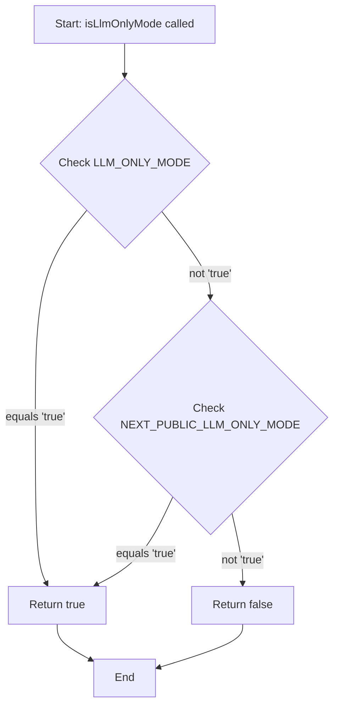
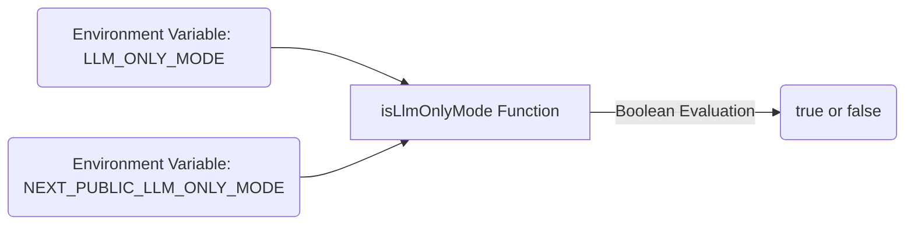

# Module: `env.ts`

## 1. Module Summary

The `env` module provides environment detection utilities for the Red Mansion platform. Specifically, it determines whether the application is running in "LLM-only mode," allowing the platform to disable Firebase and other external services for AI-only testing scenarios. This mode is critical for development workflows that focus solely on AI capabilities without requiring full backend infrastructure.

## 2. Module Dependencies

* **Internal Dependencies:** None. This module has zero dependencies and serves as a pure utility.
* **External Dependencies:** None. Uses only Node.js `process.env` for environment variable access.

## 3. Public API / Exports

* `isLlmOnlyMode(): boolean` - Returns `true` if the application should run in LLM-only mode (Firebase and external services disabled).

## 4. Code File Breakdown

### 4.1. `env.ts`

* **Purpose:** Provides a single environment detection function to determine if the platform is operating in LLM-only mode. This mode enables developers and QA engineers to test AI flows (like GenKit-based task grading) in isolation without Firebase dependencies. The function checks both server-side (`LLM_ONLY_MODE`) and client-side (`NEXT_PUBLIC_LLM_ONLY_MODE`) environment variables for maximum flexibility across SSR and CSR contexts.
* **Functions:**
    * `isLlmOnlyMode(): boolean` - Checks both `process.env.LLM_ONLY_MODE` and `process.env.NEXT_PUBLIC_LLM_ONLY_MODE` environment variables. Returns `true` if either is set to the string `'true'`, otherwise returns `false`. This dual-variable approach accommodates Next.js's environment variable scoping (server-only vs. publicly exposed).
* **Key Classes / Constants / Variables:** None.

## 5. System and Data Flow

### 5.1. System Flowchart (Control Flow)



### 5.2. Data Flow Diagram (Data Transformation)



## 6. Usage Example & Testing

* **Usage:**
```typescript
import { isLlmOnlyMode } from '@/lib/env';

if (isLlmOnlyMode()) {
  console.log('Running in LLM-only mode - Firebase disabled');
  // Skip Firebase initialization or use mocks
}
```
* **Testing:** This module is tested implicitly through integration tests. Unit tests would verify boolean logic by setting `process.env` values before invoking the function. No dedicated test file exists yet, but testing strategy would involve:
  - Test case 1: Both env vars unset → returns `false`
  - Test case 2: `LLM_ONLY_MODE='true'` → returns `true`
  - Test case 3: `NEXT_PUBLIC_LLM_ONLY_MODE='true'` → returns `true`
  - Test case 4: Both set to `'true'` → returns `true`
  - Test case 5: Values are `'false'` or other strings → returns `false`
