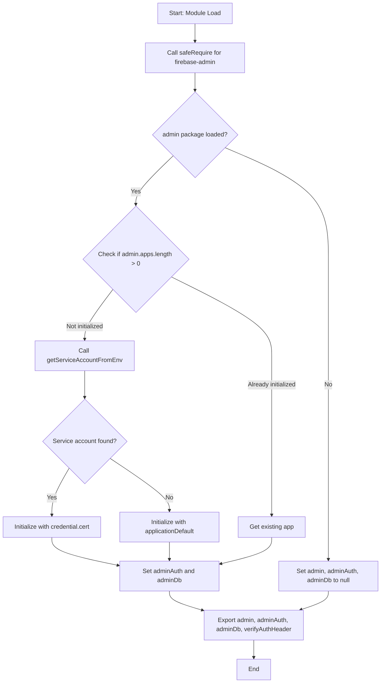
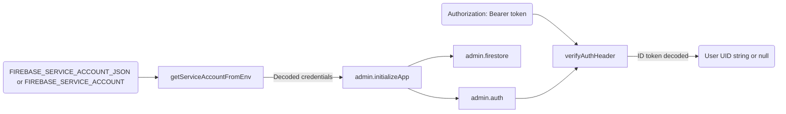

# Module: `firebase-admin.ts`

## 1. Module Summary

The `firebase-admin` module provides server-side Firebase Admin SDK initialization with graceful degradation for environments where Firebase is disabled or unavailable. This module supports privileged backend operations like user management, ID token verification, and elevated database writes that require admin permissions. The module is architected to avoid hard dependencies on the `firebase-admin` package, allowing the application to run in LLM-only mode or environments without Firebase credentials by returning `null` values instead of crashing.

## 2. Module Dependencies

* **Internal Dependencies:** None.
* **External Dependencies:**
  * `firebase-admin` (optional, loaded dynamically) - Firebase Admin SDK for server-side privileged operations. The module uses dynamic `require` to avoid build-time failures when this package is not installed.

## 3. Public API / Exports

* `admin: any | null` - The Firebase Admin SDK namespace, or `null` if unavailable.
* `adminAuth: any | null` - Admin Authentication service for ID token verification and user management.
* `adminDb: any | null` - Admin Firestore instance for privileged database operations.
* `verifyAuthHeader(header?: string | null): Promise<string | null>` - Verifies Firebase ID token from Authorization header and returns user UID on success.

## 4. Code File Breakdown

### 4.1. `firebase-admin.ts`

* **Purpose:** Initializes Firebase Admin SDK for server-side API routes that require elevated permissions. The module's primary innovation is its graceful degradation strategy: it attempts to load `firebase-admin` dynamically using `eval('require')` to bypass static analysis by bundlers. If the package is unavailable or initialization fails, all exports become `null`, allowing the application to continue running without admin capabilities. This design supports development workflows where Firebase is disabled (LLM-only mode) or testing environments without service account credentials.
* **Functions:**
    * `safeRequire(name: string): any | null` - Attempts to dynamically require a module using `eval('require')` to prevent webpack and other bundlers from statically resolving the dependency. Returns the module if successful, or `null` if the module doesn't exist or loading fails. This function is the key to avoiding hard dependencies on `firebase-admin`.
    * `getServiceAccountFromEnv(): any | null` - Extracts Firebase service account credentials from environment variables. Supports two input formats: (1) raw JSON string starting with `{`, or (2) base64-encoded JSON. Parses the credentials and returns an object with `projectId`, `clientEmail`, and `privateKey` (with escaped newlines fixed). Returns `null` if environment variables are missing or JSON parsing fails.
    * `verifyAuthHeader(header?: string | null): Promise<string | null>` - Validates Firebase ID tokens from HTTP Authorization headers. Checks if header starts with `"Bearer "`, extracts the token, and calls `adminAuth.verifyIdToken()`. Returns the user's UID string on success, or `null` if the header is malformed, token is invalid, or admin services are unavailable. Does not throw errors—always returns `null` on failure for graceful handling.
* **Key Classes / Constants / Variables:**
    * `admin: any | null` - The `firebase-admin` module namespace loaded via `safeRequire('firebase-admin')`. If loading fails, this is `null`, and no admin operations are available.
    * `adminAuth: any | null` - Admin Authentication service instance obtained via `admin.auth()` after successful initialization. Used for verifying ID tokens and managing users server-side. Is `null` if admin SDK is unavailable or initialization failed.
    * `adminDb: any | null` - Admin Firestore instance obtained via `admin.firestore()` after successful initialization. Provides elevated database access that bypasses security rules. Is `null` if admin SDK is unavailable or initialization failed.

## 5. System and Data Flow

### 5.1. System Flowchart (Control Flow)



### 5.2. Data Flow Diagram (Data Transformation)



## 6. Usage Example & Testing

* **Usage:**
```typescript
import { verifyAuthHeader, adminDb } from '@/lib/firebase-admin';
import { NextRequest, NextResponse } from 'next/server';

// API route with authentication
export async function POST(req: NextRequest) {
  const authHeader = req.headers.get('Authorization');
  const uid = await verifyAuthHeader(authHeader);

  if (!uid) {
    return NextResponse.json({ error: 'Unauthorized' }, { status: 401 });
  }

  // Perform privileged operation with adminDb
  if (adminDb) {
    const userDoc = await adminDb.collection('users').doc(uid).get();
    // ... admin-level database operations
  }

  return NextResponse.json({ success: true });
}
```
* **Testing:** Testing strategy involves mocking the dynamic `require` behavior and environment variables:
  - Test case 1: `firebase-admin` unavailable → all exports are `null`
  - Test case 2: Service account in env vars → initializes with `credential.cert`
  - Test case 3: No service account → initializes with `applicationDefault`
  - Test case 4: `verifyAuthHeader` with valid token → returns UID
  - Test case 5: `verifyAuthHeader` with invalid token → returns `null`
  - Test case 6: `verifyAuthHeader` with malformed header → returns `null`
  - Test case 7: Admin SDK unavailable → `verifyAuthHeader` returns `null` without crashing
