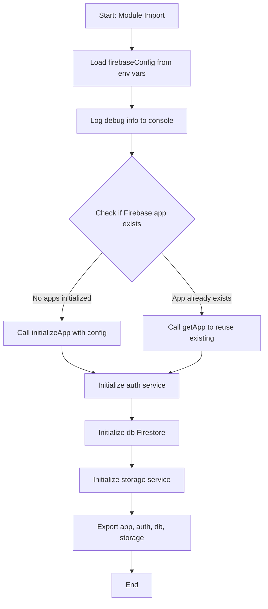
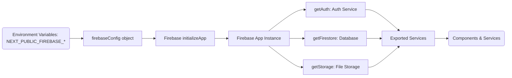

# Module: `firebase.ts`

## 1. Module Summary

The `firebase` module initializes and configures the Firebase client SDK for the Red Mansion platform, providing authentication, Firestore database, and cloud storage services. This module serves as the central point for all client-side Firebase operations, loading configuration from environment variables and preventing duplicate initialization during development hot reloads. All components and services that require Firebase functionality import the configured instances (`auth`, `db`, `storage`) from this module.

## 2. Module Dependencies

* **Internal Dependencies:** None. This is a foundational module with no internal dependencies.
* **External Dependencies:**
  * `firebase/app` - Core Firebase initialization and app management.
  * `firebase/auth` - Authentication services for user login, logout, and session management.
  * `firebase/firestore` - NoSQL database for storing user data, progress, community posts, and notes.
  * `firebase/storage` - Cloud storage for user uploads, images, and media files.

## 3. Public API / Exports

* `app: FirebaseApp` - The initialized Firebase app instance.
* `auth: Auth` - Firebase Authentication service for managing user sessions.
* `db: Firestore` - Firestore database instance for data operations.
* `storage: FirebaseStorage` - Cloud Storage instance for file operations.

## 4. Code File Breakdown

### 4.1. `firebase.ts`

* **Purpose:** Initializes the Firebase client SDK using environment variables and exports configured service instances. The module includes defensive initialization logic to prevent re-initialization errors during Next.js hot module reloading in development. Debug logging is included to help developers diagnose configuration issues by verifying that environment variables are properly loaded. This module is imported by nearly all client-side features including authentication, community posts, note-taking, and user progress tracking.
* **Functions:** No exported functions. This is a configuration module.
* **Key Classes / Constants / Variables:**
    * `firebaseConfig: FirebaseOptions` - Configuration object containing API keys, project IDs, and service endpoints. All values are loaded from `NEXT_PUBLIC_*` environment variables to ensure availability in both server-side rendering and client-side contexts. Missing values will cause Firebase services to fail at runtime.
    * `app: FirebaseApp` - The initialized Firebase app instance. Uses `!getApps().length ? initializeApp(firebaseConfig) : getApp()` pattern to prevent duplicate initialization during hot reloads. This is the root object for all Firebase services.
    * `auth: Auth` - Firebase Authentication service instance created via `getAuth(app)`. Used throughout the application for login, logout, registration, and session management.
    * `db: Firestore` - Firestore database instance created via `getFirestore(app)`. Used for storing and querying user data, community posts, notes, highlights, and progress tracking.
    * `storage: FirebaseStorage` - Cloud Storage instance created via `getStorage(app)`. Used for uploading and retrieving user-generated media files and assets.

## 5. System and Data Flow

### 5.1. System Flowchart (Control Flow)



### 5.2. Data Flow Diagram (Data Transformation)



## 6. Usage Example & Testing

* **Usage:**
```typescript
import { auth, db, storage } from '@/lib/firebase';
import { signInWithEmailAndPassword } from 'firebase/auth';
import { collection, addDoc } from 'firebase/firestore';

// Authentication example
const userCredential = await signInWithEmailAndPassword(auth, email, password);

// Firestore database example
const docRef = await addDoc(collection(db, 'posts'), {
  title: 'My Analysis',
  content: 'Character study...',
  userId: userCredential.user.uid
});

// Storage example (for future use)
// const storageRef = ref(storage, 'uploads/image.jpg');
```
* **Testing:** This module is tested through integration tests that mock Firebase services using Jest. The mocking strategy is defined in `tests/setup/jest.setup.js`. Testing strategy includes:
  - Mock `firebase/app` to return mock app instances
  - Mock `firebase/auth` to return stub authentication methods
  - Mock `firebase/firestore` to return in-memory data structures
  - Verify that services are exported correctly
  - Test initialization logic with and without existing apps
  - Verify environment variable loading and error handling
