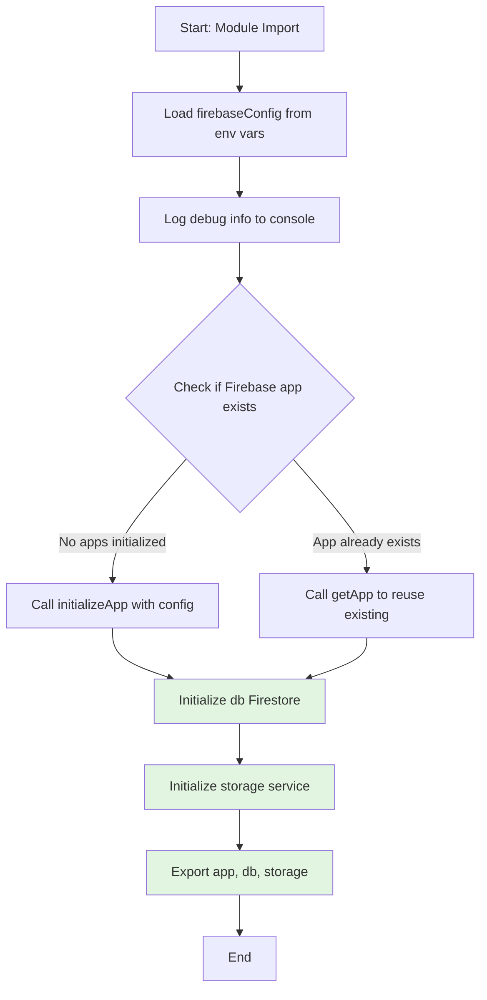
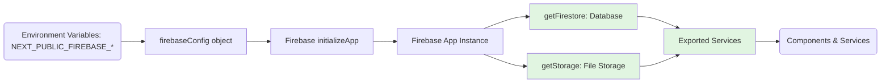

# Module: `firebase.ts`

## 1. Module Summary

The `firebase` module initializes and configures the Firebase client SDK for the Red Mansion platform, providing Firestore database and cloud storage services. **Authentication has been migrated to NextAuth.js (Phase 4 - SQLITE-024)**. This module serves as the central point for Firebase data operations, loading configuration from environment variables and preventing duplicate initialization during development hot reloads. All components and services that require Firestore or Storage functionality import the configured instances (`db`, `storage`) from this module.

## 2. Module Dependencies

* **Internal Dependencies:** None. This is a foundational module with no internal dependencies.
* **External Dependencies:**
  * `firebase/app` - Core Firebase initialization and app management.
  * `firebase/firestore` - NoSQL database for storing user data, progress, community posts, and notes.
  * `firebase/storage` - Cloud storage for user uploads, images, and media files.
* **Removed Dependencies (Phase 4 - SQLITE-024)**:
  * ~~`firebase/auth`~~ - Authentication migrated to NextAuth.js. Use `next-auth/react` and `next-auth/next` instead.

## 3. Public API / Exports

* `app: FirebaseApp` - The initialized Firebase app instance.
* `db: Firestore` - Firestore database instance for data operations.
* `storage: FirebaseStorage` - Cloud Storage instance for file operations.

**Removed Exports (Phase 4 - SQLITE-024)**:
* ~~`auth: Auth`~~ - Firebase Authentication removed. Use NextAuth `useSession()` hook or `getServerSession()` instead.

## 4. Code File Breakdown

### 4.1. `firebase.ts`

* **Purpose:** Initializes the Firebase client SDK using environment variables and exports configured service instances for Firestore and Storage. **Authentication has been removed (SQLITE-024)** and migrated to NextAuth.js. The module includes defensive initialization logic to prevent re-initialization errors during Next.js hot module reloading in development. Debug logging is included to help developers diagnose configuration issues by verifying that environment variables are properly loaded. This module is imported by client-side features that need Firestore database or Cloud Storage, including community posts, note-taking, and user progress tracking.
* **Functions:** No exported functions. This is a configuration module.
* **Key Classes / Constants / Variables:**
    * `firebaseConfig: FirebaseOptions` - Configuration object containing API keys, project IDs, and service endpoints. All values are loaded from `NEXT_PUBLIC_*` environment variables to ensure availability in both server-side rendering and client-side contexts. Missing values will cause Firebase services to fail at runtime.
    * `app: FirebaseApp` - The initialized Firebase app instance. Uses `!getApps().length ? initializeApp(firebaseConfig) : getApp()` pattern to prevent duplicate initialization during hot reloads. This is the root object for all Firebase services.
    * `db: Firestore` - Firestore database instance created via `getFirestore(app)`. Used for storing and querying user data, community posts, notes, highlights, and progress tracking.
    * `storage: FirebaseStorage` - Cloud Storage instance created via `getStorage(app)`. Used for uploading and retrieving user-generated media files and assets.
    * ~~`auth: Auth`~~ - **Removed in SQLITE-024**. Authentication now handled by NextAuth.js. See `@/app/api/auth/[...nextauth]/route.ts` for NextAuth configuration.

## 5. System and Data Flow

### 5.1. System Flowchart (Control Flow)

**Updated Post-SQLITE-024 (Authentication Removed)**



**Note**: Auth service initialization removed in SQLITE-024. Use NextAuth.js for authentication.

### 5.2. Data Flow Diagram (Data Transformation)

**Updated Post-SQLITE-024 (Authentication Removed)**



**Note**: Auth service removed in SQLITE-024. For authentication, use NextAuth.js via `getServerSession()` or `useSession()` hook.

## 6. Usage Example & Testing

* **Usage (Updated Post-SQLITE-024):**
```typescript
import { db, storage } from '@/lib/firebase';
import { collection, addDoc, getDocs, query, where } from 'firebase/firestore';
import { ref, uploadBytes, getDownloadURL } from 'firebase/storage';

// ❌ Authentication - NO LONGER AVAILABLE from this module
// Use NextAuth instead:
// import { useSession } from 'next-auth/react';
// const { data: session } = useSession();

// ✅ Firestore database example - Read community posts
const postsQuery = query(
  collection(db, 'posts'),
  where('authorId', '==', userId)
);
const querySnapshot = await getDocs(postsQuery);
const posts = querySnapshot.docs.map(doc => ({
  id: doc.id,
  ...doc.data()
}));

// ✅ Firestore database example - Create new note
const docRef = await addDoc(collection(db, 'notes'), {
  userId: session?.user?.id,
  content: 'My reading notes...',
  chapter: 1,
  createdAt: new Date()
});

// ✅ Storage example - Upload user avatar
const storageRef = ref(storage, `avatars/${userId}.jpg`);
await uploadBytes(storageRef, fileBlob);
const downloadURL = await getDownloadURL(storageRef);
```

* **Testing (Updated Post-SQLITE-024):** This module is tested through integration tests that mock Firebase services using Jest. The mocking strategy is defined in `tests/setup/jest.setup.js`. Testing strategy includes:
  - Mock `firebase/app` to return mock app instances
  - ~~Mock `firebase/auth` to return stub authentication methods~~ (**Removed in SQLITE-024**)
  - Mock `firebase/firestore` to return in-memory data structures
  - Mock `firebase/storage` to return stub storage methods
  - Verify that services (db, storage) are exported correctly
  - Test initialization logic with and without existing apps
  - Verify environment variable loading and error handling
  - **Note**: Authentication testing now uses NextAuth mocks instead (see `@/app/api/auth/[...nextauth]/route.ts`)
