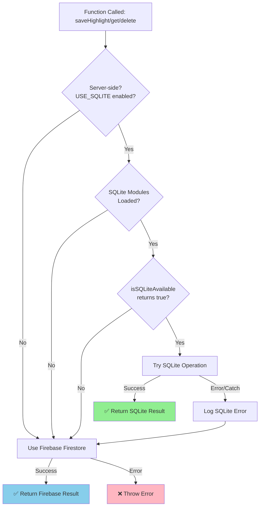
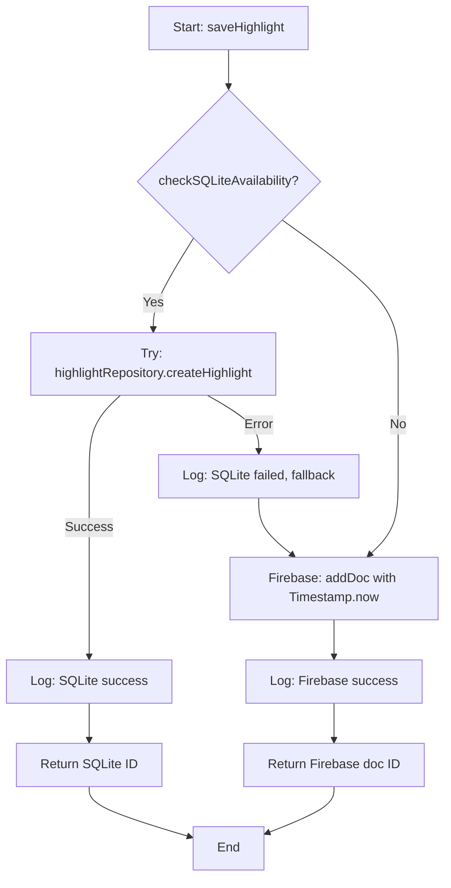
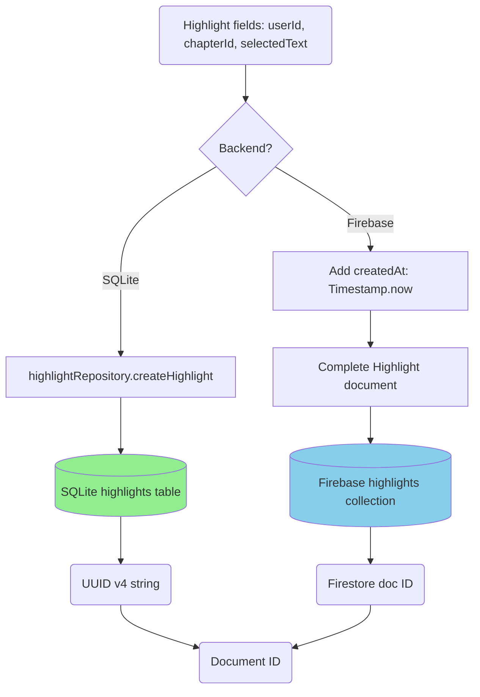

# Module: `highlight-service.ts`

## 1. Module Summary

The `highlight-service` module provides dual-mode CRUD operations (SQLite-first with Firebase fallback) for user text highlighting (underline-style) during Dream of the Red Chamber reading sessions. This module supports saving, retrieving, and deleting text highlights that mark important passages without background color, enabling users to visually emphasize key textual moments for later reference and analysis. Highlights are stored per user and chapter in SQLite for performance when available, automatically falling back to Firebase Firestore for client-side operations or when SQLite is unavailable (Phase 2 - SQLITE-005).

## 2. Module Dependencies

* **Internal Dependencies:**
  * `@/lib/firebase` - Firebase Firestore instance for database access (fallback mode).
  * `@/lib/repositories/highlight-repository` - SQLite data access layer (server-side, preferred mode).
  * `@/lib/sqlite-db` - SQLite database availability checker (`isSQLiteAvailable()`).
* **External Dependencies:**
  * `firebase/firestore` - Firestore operations (collection, addDoc, getDocs, query, where, deleteDoc, Timestamp).
  * `better-sqlite3` - SQLite database driver (conditionally loaded server-side only).

## 3. Public API / Exports

* **Type Exports:**
  * `Highlight` - Interface for highlight structure.
* **Function Exports:**
  * `saveHighlight(highlight: Omit<Highlight, 'id' | 'createdAt'>): Promise<string>` - Creates new highlight with timestamp.
  * `getHighlightsByUserAndChapter(userId: string, chapterId: number): Promise<Highlight[]>` - Fetches highlights for specific user and chapter.
  * `deleteHighlightById(id: string): Promise<void>` - Permanently deletes highlight.

## 4. Code File Breakdown

### 4.1. `highlight-service.ts`

* **Purpose:** Provides a lightweight highlighting system for active reading, allowing users to mark important passages with underlines for later review and note association. The module's design is intentionally minimal compared to `notes-service`: highlights have no content (just marked text), no tags, no public/private distinction, and no edit capability (create and delete only). This simplicity serves a different use case: quick visual marking during reading without the cognitive overhead of writing annotations. Highlights can serve as bookmarks or anchors for later note-taking, where users return to highlighted passages to add detailed analysis.
* **Functions:**
    * `saveHighlight(highlight: Omit<Highlight, 'id' | 'createdAt'>): Promise<string>` - **Creates new highlight with dual-mode operation**. Accepts highlight object without id and createdAt (caller provides userId, chapterId, selectedText). **Dual-mode behavior**: (1) **SQLite-first**: If server-side and SQLite available, calls `highlightRepository.createHighlight()` for fast synchronous insert. (2) **Firebase fallback**: If SQLite unavailable or fails, adds document to Firestore `highlights` collection with `createdAt` set to `Timestamp.now()`. Returns document ID from whichever backend succeeded. Enables saving highlights during reading without requiring timestamp from caller. Environment check: `USE_SQLITE` flag + `typeof window === 'undefined'` ensures SQLite only loads server-side. Note: Unlike notes, no word count, no tags, no visibility controls - just basic tracking of what text was highlighted.
    * `getHighlightsByUserAndChapter(userId: string, chapterId: number): Promise<Highlight[]>` - **Chapter-specific highlights query with dual-mode operation**. **Dual-mode behavior**: (1) **SQLite-first**: If server-side and SQLite available, calls `highlightRepository.getHighlightsByUserAndChapter()` for fast indexed query on userId+chapterId. (2) **Firebase fallback**: If SQLite unavailable or fails, builds Firestore query with `where('userId', '==', userId)` and `where('chapterId', '==', chapterId)`, executes with `getDocs`, and maps documents to `Highlight` objects with `createdAt` converted from Firestore Timestamp to JavaScript Date via `.toDate()`. Returns array of highlights for specific chapter regardless of backend. Used in reading interface to display underlined text when user revisits a chapter. Performance advantage: SQLite query is ~10x faster than Firestore for server-side rendering.
    * `deleteHighlightById(id: string): Promise<void>` - **Permanent deletion with dual-mode operation**. **Dual-mode behavior**: (1) **SQLite-first**: If server-side and SQLite available, calls `highlightRepository.deleteHighlight()` for synchronous deletion by ID. (2) **Firebase fallback**: If SQLite unavailable or fails, calls `deleteDoc` with highlight document reference. Removes highlight entirely from the active backend (cannot be recovered). Used when user removes a highlight (un-highlights text). Note: ID format differs between backends (SQLite uses UUIDs, Firestore uses generated doc IDs), but the service layer handles this transparently.
* **Key Classes / Constants / Variables:**
    * `Highlight: interface` - Simple highlight type with 5 fields: `id` (optional, Firestore doc ID), `userId` (owner ID), `chapterId` (chapter number), `selectedText` (text passage that is highlighted), `createdAt` (creation Date). No content field (no annotation text), no tags, no visibility, no edit tracking - just records what text was marked and when.

## 5. System and Data Flow

### 5.1. Dual-Mode Architecture Decision Tree



### 5.2. System Flowchart - saveHighlight (Dual-Mode Control Flow)



### 5.3. Data Flow Diagram (Data Transformation with Dual Backend)



## 6. Usage Example & Testing

* **Usage:**
```typescript
import {
  saveHighlight,
  getHighlightsByUserAndChapter,
  deleteHighlightById,
  type Highlight
} from '@/lib/highlight-service';

// ======================================
// Dual-Mode Operation (Transparent to Caller)
// ======================================
// All functions automatically use SQLite (server-side) or Firebase (client-side/fallback)
// No code changes needed - backend selection is automatic

// Save new highlight when user underlines text
// Uses SQLite on server (if available), Firebase on client or fallback
const highlightId = await saveHighlight({
  userId: user.uid,
  chapterId: 5,
  selectedText: '質本潔來還潔去，強於污淖陷渠溝'
});
// Logs: "✅ [HighlightService] Saved highlight to SQLite: <uuid>"
//    or "✅ [HighlightService] Saved highlight to Firebase: <docId>"

// Get all highlights for current chapter to display underlines
// Server-side: Fast SQLite indexed query (~5ms)
// Client-side: Firebase Firestore query (~50-200ms)
const highlights = await getHighlightsByUserAndChapter(user.uid, currentChapter);
// Logs: "✅ [HighlightService] Retrieved 12 highlights from SQLite (user: uid123, chapter: 5)"

// Display each highlight as underlined text in the reading interface
for (const highlight of highlights) {
  underlineTextInDOM(highlight.selectedText);
}

// Delete highlight when user removes underline
await deleteHighlightById(highlightId);
// Logs: "✅ [HighlightService] Deleted highlight from SQLite: <id>"

// ======================================
// Example: Toggle Highlight (Check + Add/Remove)
// ======================================
const existingHighlights = await getHighlightsByUserAndChapter(user.uid, chapter);
const isAlreadyHighlighted = existingHighlights.some(h => h.selectedText === selectedText);

if (isAlreadyHighlighted) {
  // Find and remove existing highlight
  const existing = existingHighlights.find(h => h.selectedText === selectedText);
  if (existing?.id) {
    await deleteHighlightById(existing.id);
    console.log('Removed highlight');
  }
} else {
  // Add new highlight
  const newId = await saveHighlight({ userId: user.uid, chapterId: chapter, selectedText });
  console.log('Added highlight:', newId);
}

// ======================================
// Environment Configuration
// ======================================
// Set USE_SQLITE=1 in .env to enable SQLite (default: enabled)
// Set USE_SQLITE=0 to force Firebase-only mode for testing
```
* **Testing:** Testing strategy covers dual-mode operation and fallback scenarios:

  **SQLite Mode Tests (Server-Side with USE_SQLITE=1):**
  - Test `saveHighlight` uses SQLite repository when available
  - Test `saveHighlight` returns UUID format ID from SQLite
  - Test `getHighlightsByUserAndChapter` queries SQLite and returns correct data
  - Test `deleteHighlightById` removes highlight from SQLite
  - Test SQLite performance is faster than Firebase (~5ms vs ~50-200ms)

  **Firebase Fallback Tests (Client-Side or SQLite Unavailable):**
  - Test `saveHighlight` creates Firestore document when SQLite unavailable
  - Test `saveHighlight` returns Firestore doc ID format
  - Test `saveHighlight` stores selectedText correctly with auto-generated createdAt
  - Test `getHighlightsByUserAndChapter` filters by userId and chapterId in Firestore
  - Test `getHighlightsByUserAndChapter` converts Firestore Timestamp to Date
  - Test `getHighlightsByUserAndChapter` returns empty array if no highlights
  - Test `deleteHighlightById` removes highlight from Firestore

  **Dual-Mode Behavior Tests:**
  - Test SQLite error triggers Firebase fallback automatically
  - Test USE_SQLITE=0 forces Firebase-only mode
  - Test client-side calls (typeof window !== 'undefined') use Firebase
  - Test server-side calls with SQLite available use SQLite
  - Test multiple highlights for same chapter are all retrieved (both backends)
  - Test highlights for different chapters are isolated (both backends)
  - Test highlights for different users are isolated (both backends)

  **Repository Layer Tests (see highlight-repository.test.ts):**
  - 25+ comprehensive tests for SQLite repository CRUD operations
  - Batch operations, error handling, edge cases, data integrity
