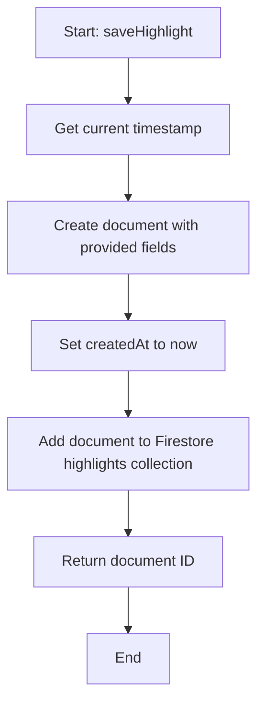
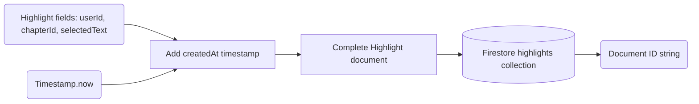

# Module: `highlight-service.ts`

## 1. Module Summary

The `highlight-service` module provides simple Firestore CRUD operations for user text highlighting (underline-style) during Dream of the Red Chamber reading sessions. This module supports saving, retrieving, and deleting text highlights that mark important passages without background color, enabling users to visually emphasize key textual moments for later reference and analysis. Highlights are stored per user and chapter, allowing users to see their marked passages when revisiting chapters.

## 2. Module Dependencies

* **Internal Dependencies:**
  * `@/lib/firebase` - Firebase Firestore instance for database access.
* **External Dependencies:**
  * `firebase/firestore` - Firestore operations (collection, addDoc, getDocs, query, where, deleteDoc, Timestamp).

## 3. Public API / Exports

* **Type Exports:**
  * `Highlight` - Interface for highlight structure.
* **Function Exports:**
  * `saveHighlight(highlight: Omit<Highlight, 'id' | 'createdAt'>): Promise<string>` - Creates new highlight with timestamp.
  * `getHighlightsByUserAndChapter(userId: string, chapterId: number): Promise<Highlight[]>` - Fetches highlights for specific user and chapter.
  * `deleteHighlightById(id: string): Promise<void>` - Permanently deletes highlight.

## 4. Code File Breakdown

### 4.1. `highlight-service.ts`

* **Purpose:** Provides a lightweight highlighting system for active reading, allowing users to mark important passages with underlines for later review and note association. The module's design is intentionally minimal compared to `notes-service`: highlights have no content (just marked text), no tags, no public/private distinction, and no edit capability (create and delete only). This simplicity serves a different use case: quick visual marking during reading without the cognitive overhead of writing annotations. Highlights can serve as bookmarks or anchors for later note-taking, where users return to highlighted passages to add detailed analysis.
* **Functions:**
    * `saveHighlight(highlight: Omit<Highlight, 'id' | 'createdAt'>): Promise<string>` - **Creates new highlight**. Accepts highlight object without id and createdAt (caller provides userId, chapterId, selectedText). Adds document to Firestore `highlights` collection with: all provided fields, `createdAt` set to `Timestamp.now()` (server timestamp). Returns Firestore document ID. Enables saving highlights during reading without requiring timestamp from caller. Note: Unlike notes, no word count, no tags, no visibility controls - just basic tracking of what text was highlighted.
    * `getHighlightsByUserAndChapter(userId: string, chapterId: number): Promise<Highlight[]>` - **Chapter-specific highlights query**. Builds Firestore query with: `where('userId', '==', userId)`, `where('chapterId', '==', chapterId)`. Executes query with `getDocs`. Maps documents to `Highlight` objects with: `id` from doc.id, all document data fields, `createdAt` converted from Firestore Timestamp to JavaScript Date via `.toDate()`. Returns array of highlights for specific chapter. Used in reading interface to display underlined text when user revisits a chapter.
    * `deleteHighlightById(id: string): Promise<void>` - **Permanent deletion**. Calls `deleteDoc` with highlight document reference. Removes highlight entirely from Firestore (cannot be recovered). Used when user removes a highlight (un-highlights text).
* **Key Classes / Constants / Variables:**
    * `Highlight: interface` - Simple highlight type with 5 fields: `id` (optional, Firestore doc ID), `userId` (owner ID), `chapterId` (chapter number), `selectedText` (text passage that is highlighted), `createdAt` (creation Date). No content field (no annotation text), no tags, no visibility, no edit tracking - just records what text was marked and when.

## 5. System and Data Flow

### 5.1. System Flowchart (Control Flow)



### 5.2. Data Flow Diagram (Data Transformation)



## 6. Usage Example & Testing

* **Usage:**
```typescript
import {
  saveHighlight,
  getHighlightsByUserAndChapter,
  deleteHighlightById,
  type Highlight
} from '@/lib/highlight-service';

// Save new highlight when user underlines text
const highlightId = await saveHighlight({
  userId: user.uid,
  chapterId: 5,
  selectedText: '質本潔來還潔去，強於污淖陷渠溝'
});

// Get all highlights for current chapter to display underlines
const highlights = await getHighlightsByUserAndChapter(user.uid, currentChapter);

// Display each highlight as underlined text in the reading interface
for (const highlight of highlights) {
  underlineTextInDOM(highlight.selectedText);
}

// Delete highlight when user removes underline
await deleteHighlightById(highlightId);

// Example: Check if text is already highlighted
const existingHighlights = await getHighlightsByUserAndChapter(user.uid, chapter);
const isAlreadyHighlighted = existingHighlights.some(h => h.selectedText === selectedText);

if (isAlreadyHighlighted) {
  // Find and remove existing highlight
  const existing = existingHighlights.find(h => h.selectedText === selectedText);
  if (existing?.id) {
    await deleteHighlightById(existing.id);
  }
} else {
  // Add new highlight
  await saveHighlight({ userId: user.uid, chapterId: chapter, selectedText });
}
```
* **Testing:** Testing strategy focuses on basic Firestore CRUD operations:
  - Test `saveHighlight` creates document with auto-generated createdAt
  - Test `saveHighlight` returns document ID
  - Test `saveHighlight` stores selectedText correctly
  - Test `getHighlightsByUserAndChapter` filters by userId and chapterId
  - Test `getHighlightsByUserAndChapter` converts Firestore Timestamp to Date
  - Test `getHighlightsByUserAndChapter` returns empty array if no highlights
  - Test `deleteHighlightById` removes highlight from Firestore
  - Test multiple highlights for same chapter are all retrieved
  - Test highlights for different chapters are isolated
  - Test highlights for different users are isolated
