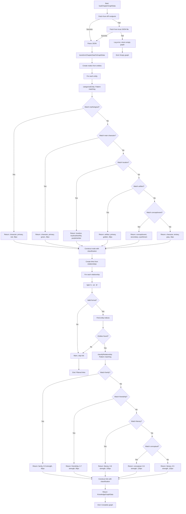

# Module: `knowledgeGraphUtils.ts`

## 1. Module Summary

The `knowledgeGraphUtils` module provides comprehensive utilities for transforming raw Dream of the Red Chamber chapter JSON data into D3.js-compatible force-directed knowledge graph visualizations, implementing domain-specific classification rules based on Chinese literary knowledge. This 428-line module encodes extensive domain expertise through pattern-based entity categorization (9 character patterns → 5 types: mythological/main/secondary characters, mystical/earthly locations, artifacts, concepts, events), relationship classification with strength/distance metrics (5 types with strength 0.5-0.9, distance 60-120px for optimal D3.js force simulation), hierarchical visual encoding (color scheme with 9 Traditional Chinese-themed colors, radius 18-35px based on importance), multi-source data loading strategy (API endpoint → local JSON fallback → empty graph graceful degradation), and comprehensive metadata preservation (processing time, clustering statistics, reduction ratios from AI extraction pipeline).

## 2. Module Dependencies

* **Internal Dependencies:** None. This is a pure utility module with no internal dependencies.
* **External Dependencies:** None. Uses only TypeScript types and native JavaScript for data transformation. Designed to be consumed by D3.js (external library used in components, not imported here).

## 3. Public API / Exports

* **Type Exports:**
  * `ChapterGraphJson` - Raw chapter graph data structure from AI extraction pipeline.
  * `KnowledgeGraphNode` - D3.js-compatible node with visualization properties.
  * `KnowledgeGraphLink` - D3.js-compatible link with force parameters.
  * `KnowledgeGraphData` - Complete graph data (nodes + links).
* **Function Exports:**
  * `transformChapterDataToGraphData(chapterData: ChapterGraphJson): KnowledgeGraphData` - Main transformation function converting raw JSON to graph data.
  * `loadChapterGraphData(chapterNumber: number): Promise<KnowledgeGraphData>` - Multi-source data loader with fallback strategy.
  * `loadChapterGraphFromDatabase(chapterNumber: number): Promise<KnowledgeGraphData>` - Future cloud database loader (currently delegates to loadChapterGraphData).

## 4. Code File Breakdown

### 4.1. `knowledgeGraphUtils.ts`

* **Purpose:** Transforms abstract literary knowledge (entities, relationships) into interactive visual representations using D3.js force-directed graphs, enabling readers to explore Dream of the Red Chamber's complex character networks, locations, and conceptual relationships. The module's design philosophy prioritizes domain expertise over machine learning: (1) **Pattern-based classification** - Uses hardcoded Chinese character patterns (氏, 仙, 媧 for mythological figures; 峰, 山, 崖 for mystical locations; 石, 玉, 記 for artifacts) rather than ML models, providing deterministic results, zero training overhead, smaller bundle size, transparent rules, and sufficient accuracy for this specific literary domain; (2) **Hierarchical visual encoding** - Maps semantic importance to multiple visual channels (color for type, radius for importance, group for clustering) following information visualization best practices for multi-attribute data; (3) **Force simulation optimization** - Carefully tuned strength (0.5-0.9) and distance (60-120px) parameters create readable graph layouts where family clusters are tight, conceptual relationships are loose, preventing both graph collapse and explosion; (4) **Graceful degradation** - Multi-tier fallback strategy (API → local JSON → empty graph) ensures app remains functional even when data sources fail; (5) **Metadata preservation** - Retains comprehensive processing statistics (chunks processed, clustering time, synonym merges, reduction ratios) from upstream AI extraction pipeline for transparency and debugging.
* **Functions:**
    * `categorizeEntity(entityName: string): {type, category, importance, color, group, radius}` - **Private pattern-based entity classifier**. Returns categorization object with 6 properties. **Character classification**: (1) Mythological - Pattern: includes('氏')||includes('仙')||includes('媧'). Returns: type='character', category='神話人物', importance='primary', color='#DC2626' (Traditional Chinese red), group=1, radius=35px (largest). Examples: 女媧氏, 僧仙. (2) Main characters - Pattern: includes('士隱')||includes('雨村')||includes('道人'). Returns: category='主要人物', color='#059669' (emerald green), group=2, radius=30px. Examples: 甄士隱, 賈雨村. (3) Secondary characters - Pattern: includes('英蓮')||includes('封氏'). Returns: importance='secondary', category='次要人物', color='#EC4899' (pink), group=2, radius=25px. **Location classification**: (4) Mystical locations - Pattern: includes('峰')||includes('山')||includes('崖')||includes('境'). Returns: type='location', category='神話地點', importance='primary', color='#8B5CF6' (purple), group=3, radius=28px. Examples: 青埂峰, 大荒山. (5) Earthly locations - Pattern: includes('城')||includes('蘇')||includes('廟')||includes('巷'). Returns: importance='secondary', category='世俗地點', color='#F59E0B' (amber), group=3, radius=24px. Examples: 蘇州城, 葫蘆廟. **Event classification** (checked before artifacts): (6) Events - Pattern: includes('功名')||includes('富貴')||includes('夢境')||includes('詩詞')||equals('功名夢'). Returns: type='event', category='情節事件', importance='secondary', color='#7C2D12' (brown), group=6, radius=20px. **Artifact classification**: (7) Artifacts - Pattern: includes('石')||includes('玉')||includes('記')||includes('夢')||includes('歌'). Returns: type='artifact', category='重要物品/文獻', importance='primary', color='#EAB308' (golden yellow), group=4, radius=30px. Examples: 石頭記, 通靈寶玉, 好了歌. **Concept classification**: (8) Concepts - Pattern: includes('情')||includes('還淚')||includes('紅塵')||includes('溫柔')||includes('火坑'). Returns: type='concept', category='哲學概念', importance='secondary', color='#0891B2' (cyan), group=5, radius=22px. Examples: 情根, 還淚, 溫柔鄉. **Default fallback**: (9) Other - Returns: type='character', category='其他人物', importance='tertiary', color='#6B7280' (gray), group=7, radius=18px (smallest). Used for author names and unclassified entities.
    * `classifyRelationship(relationshipText: string): {type, strength, distance}` - **Private relationship classifier for D3.js force parameters**. Converts relationshipText to lowercase for case-insensitive matching. Returns object with 3 properties: type (relationship category), strength (0-1 attraction force), distance (pixels for ideal spacing). **Family relationships** - Pattern: includes('女兒')||includes('妻子')||includes('夫妻'). Returns: type='family', strength=0.9 (strongest), distance=60px (shortest). Creates tight family clusters. **Friendship relationships** - Pattern: includes('資助')||includes('鄰居')||includes('寄居'). Returns: type='friendship', strength=0.7 (medium), distance=90px. Social connections with moderate spacing. **Literary relationships** - Pattern: includes('煉')||includes('變化')||includes('抄錄')||includes('整理'). Returns: type='literary', strength=0.8 (strong), distance=100px. Narrative connections like stone transformation, manuscript transcription. **Conceptual relationships** - Pattern: includes('居住')||includes('位於')||includes('棄')||includes('象徵'). Returns: type='conceptual', strength=0.6 (weak), distance=120px (longest). Abstract connections creating sparse layout. **Default fallback** - Returns: type='literary', strength=0.5 (weakest), distance=110px. Generic connection. Strength hierarchy (0.9→0.8→0.7→0.6→0.5) and distance inverse correlation create readable graph layouts where important relationships cluster tightly while abstract connections spread loosely.
    * `transformChapterDataToGraphData(chapterData: ChapterGraphJson): KnowledgeGraphData` - **Main transformation function converting raw JSON to D3-compatible format**. **Node creation**: Maps chapterData.entities array (string names) to KnowledgeGraphNode array. For each entity (with index): Calls `categorizeEntity(entityName)` to get classification. Constructs node object: id=`entity-${index}` (unique identifier), name=entityName (display name), type/importance/category/radius/color/group from classification, description=`來自第一回的重要${category}：${entityName}` (Traditional Chinese description). Returns array of complete nodes with all D3.js properties (x, y, vx, vy, fx, fy are optional simulation state). **Link creation**: Maps chapterData.relationships array (string format: "entityA - relationship - entityB") to KnowledgeGraphLink array. For each relationshipText: Splits by ' - ' separator. Validates 3 parts exist, warns and returns null if invalid format. Extracts [sourceEntity, relationshipType, targetEntity]. Finds sourceIndex and targetIndex in entities array via findIndex. Warns and returns null if entities not found. Constructs sourceId=`entity-${sourceIndex}` and targetId=`entity-${targetIndex}`. Calls `classifyRelationship(relationshipType)` for force parameters. Constructs link object: source=sourceId (D3 will resolve to node object), target=targetId, relationship=relationshipType, strength/type/distance from classification, description=`${sourceEntity}與${targetEntity}的關係：${relationshipType}` (Traditional Chinese relationship description). Filters out null links from invalid relationships. Returns KnowledgeGraphData with nodes and links arrays. **D3.js compatibility**: Node IDs match link source/target, enabling D3 to resolve string references to node objects during force simulation initialization.
    * `loadChapterGraphData(chapterNumber: number): Promise<KnowledgeGraphData>` - **Multi-source data loader with fallback strategy**. **Attempt 1 (API endpoint)**: Fetches `/api/chapters/${chapterNumber}/graph` (future cloud database integration). If response.ok: Parses JSON, calls `transformChapterDataToGraphData`, returns result. **Attempt 2 (Local JSON fallback)**: If API fails: Fetches `/read/chapterGraph/chapter${chapterNumber}.json` (local static files). If localResponse not ok: Throws error. Parses JSON, transforms, returns. **Attempt 3 (Graceful degradation)**: Catches all errors, logs error message to console. Returns empty graph: `{nodes: [], links: []}`. **Rationale for not throwing**: App remains functional without graph (better UX than error screen), component can display "No data" state, different chapters may have different data availability, errors logged for debugging. **Future enhancements** (commented in code): Cache successful API responses in localStorage, implement retry logic with exponential backoff, add loading indicators for each source attempt.
    * `loadChapterGraphFromDatabase(chapterNumber: number): Promise<KnowledgeGraphData>` - **Future cloud database loader placeholder**. Currently delegates to `loadChapterGraphData` (local files). TODO: Implement when cloud database ready. Catches errors and returns empty graph. Placeholder for future Firestore/database integration where graph data stored in cloud rather than static JSON files.
* **Key Classes / Constants / Variables:**
    * `ChapterGraphJson: interface` - Raw chapter graph JSON structure from AI extraction pipeline. Fields: `entities: string[]` (entity names extracted from text), `relationships: string[]` (format: "A - rel - B"), `metadata` object with 20+ fields: version, description, processing_time (AI extraction time), chunks_processed (text chunks analyzed), total_characters (input text length), clustering_time (entity clustering duration), clustered_entities (entities after clustering), phase3_time (post-processing), synonym_merges_applied (deduplication count), entities_merged (merged entity count), total_processing_time (end-to-end), strategy (extraction algorithm used), text_length (characters), original_entities/streamlined_entities (before/after counts), original_relationships/streamlined_relationships, reduction_ratio (e.g., "45%"), focus (content focus description), creation_date (ISO timestamp), notes (processing notes). Comprehensive metadata enables pipeline transparency and debugging.
    * `KnowledgeGraphNode: interface` - D3.js-compatible node with 14 fields. Core identification: id (unique string), name (display name). Classification properties: type (5 enum values: character/location/concept/event/artifact), importance (3 levels: primary/secondary/tertiary), description (Traditional Chinese), category (semantic category). Visual properties: radius (18-35px based on importance), color (9-color palette), group (1-7 for clustering). D3.js simulation state (optional): x/y (position), vx/vy (velocity), fx/fy (fixed position or null). D3 automatically adds/updates simulation properties during force layout.
    * `KnowledgeGraphLink: interface` - D3.js-compatible link with 7 fields. Node references: source (string ID or resolved KnowledgeGraphNode), target (string ID or node). Relationship data: relationship (relationship text), type (5 enum: family/friendship/conflict/literary/conceptual), description (Traditional Chinese). D3.js force parameters: strength (0-1, attraction force between nodes), distance (pixels, ideal spacing). D3 resolves string source/target to node objects when passed to forceLink().
    * `KnowledgeGraphData: interface` - Complete graph structure with 2 arrays: nodes (KnowledgeGraphNode[]), links (KnowledgeGraphLink[]). Return type for all loading/transformation functions.
    * Color scheme constants (embedded in categorizeEntity): 9 colors with semantic meanings. Mythological=#DC2626 (red, highest importance, divine), Main characters=#059669 (green, central plot), Secondary=#EC4899 (pink, supporting), Mystical locations=#8B5CF6 (purple, supernatural), Earthly locations=#F59E0B (amber, mundane), Artifacts=#EAB308 (golden, important objects), Concepts=#0891B2 (cyan, abstract ideas), Events=#7C2D12 (brown, plot points), Other=#6B7280 (gray, default).
    * Radius encoding (embedded in categorizeEntity): 5 size levels. Primary importance=35px (most prominent), Important entities=28-30px (clearly visible), Secondary=22-25px (supporting), Tertiary=18-20px (background). Size correlates with semantic importance.
    * Force parameters (embedded in classifyRelationship): Strength 0.5-0.9 (attraction force), Distance 60-120px (spacing). Family (0.9, 60px) creates tightest clusters. Literary (0.8, 100px) strong narrative connections. Friendship (0.7, 90px) medium social bonds. Conceptual (0.6, 120px) loosest abstract links. Default (0.5, 110px) generic. Parameters tuned for readable D3 force layouts.

## 5. System and Data Flow

### 5.1. System Flowchart (Control Flow)



### 5.2. Data Flow Diagram (Data Transformation)

```mermaid
graph LR
    Input1(chapterNumber) --> API[Fetch /api/chapters/{n}/graph];
    API -- Fail --> Local[Fetch /read/chapterGraph/chapter{n}.json];
    API -- Success --> JSON[ChapterGraphJson];
    Local -- Success --> JSON;
    JSON --> Entities[entities: string array];
    JSON --> Relationships[relationships: string array];
    Entities --> NodeMap[Map to KnowledgeGraphNode array];
    NodeMap --> Classify1[categorizeEntity for each];
    Patterns1(Chinese character patterns: 氏/仙/媧/峰/山/城/石/玉/情) --> Classify1;
    Classify1 --> NodeProps[Add: id, name, type, importance, color, radius, group];
    NodeProps --> Nodes(nodes: KnowledgeGraphNode array);
    Relationships --> LinkMap[Map to KnowledgeGraphLink array];
    LinkMap --> Split[Split 'A - rel - B'];
    Split --> Lookup[Find entity indices];
    Entities --> Lookup;
    Lookup --> Classify2[classifyRelationship];
    Patterns2(Relationship patterns: 女兒/妻子/資助/煉/居住) --> Classify2;
    Classify2 --> LinkProps[Add: source, target, relationship, strength, distance, type];
    LinkProps --> Links(links: KnowledgeGraphLink array);
    Nodes --> Output(KnowledgeGraphData);
    Links --> Output;
    Local -- Fail --> Empty(Empty graph: nodes=[], links=[]);
```

## 6. Usage Example & Testing

* **Usage:**
```typescript
import {
  loadChapterGraphData,
  transformChapterDataToGraphData,
  type KnowledgeGraphData,
  type ChapterGraphJson,
} from '@/lib/knowledgeGraphUtils';
import * as d3 from 'd3';

// Load chapter 1 graph data (with multi-source fallback)
const graphData = await loadChapterGraphData(1);

if (graphData.nodes.length === 0) {
  console.log('No graph data available for this chapter');
  // Show empty state in UI
} else {
  console.log('Loaded', graphData.nodes.length, 'nodes');
  console.log('Loaded', graphData.links.length, 'links');

  // Inspect node classifications
  const mythologicalNodes = graphData.nodes.filter(n => n.category === '神話人物');
  console.log('Mythological figures:', mythologicalNodes.map(n => n.name)); // ['女媧氏', '僧仙', ...]

  const mainCharacters = graphData.nodes.filter(n => n.category === '主要人物');
  console.log('Main characters:', mainCharacters.map(n => n.name)); // ['甄士隱', '賈雨村', ...]

  const locations = graphData.nodes.filter(n => n.type === 'location');
  console.log('Locations:', locations.map(n => n.name)); // ['青埂峰', '蘇州城', ...]

  const artifacts = graphData.nodes.filter(n => n.type === 'artifact');
  console.log('Artifacts:', artifacts.map(n => n.name)); // ['石頭記', '通靈寶玉', ...]

  // Inspect relationship classifications
  const familyLinks = graphData.links.filter(l => l.type === 'family');
  console.log('Family relationships:', familyLinks.length); // High strength (0.9), tight clusters

  const conceptualLinks = graphData.links.filter(l => l.type === 'conceptual');
  console.log('Conceptual relationships:', conceptualLinks.length); // Low strength (0.6), loose spacing

  // Create D3.js force-directed graph visualization
  const width = 800;
  const height = 600;

  const simulation = d3.forceSimulation(graphData.nodes)
    // Link force: Use distance property from classification
    .force('link', d3.forceLink(graphData.links)
      .id((d: any) => d.id)
      .distance((d: any) => d.distance) // 60-120px based on relationship type
      .strength((d: any) => d.strength) // 0.5-0.9 based on relationship type
    )
    // Charge force: Repulsion between nodes
    .force('charge', d3.forceManyBody().strength(-300))
    // Center force: Keep graph centered
    .force('center', d3.forceCenter(width / 2, height / 2))
    // Collision force: Prevent node overlap
    .force('collision', d3.forceCollide().radius((d: any) => d.radius + 5));

  // Create SVG
  const svg = d3.select('#graph-container')
    .append('svg')
    .attr('width', width)
    .attr('height', height);

  // Draw links
  const link = svg.append('g')
    .selectAll('line')
    .data(graphData.links)
    .join('line')
    .attr('stroke', '#999')
    .attr('stroke-opacity', 0.6)
    .attr('stroke-width', 2);

  // Draw nodes
  const node = svg.append('g')
    .selectAll('circle')
    .data(graphData.nodes)
    .join('circle')
    .attr('r', (d: any) => d.radius) // 18-35px based on importance
    .attr('fill', (d: any) => d.color) // Color by entity type
    .call(d3.drag()
      .on('start', dragstarted)
      .on('drag', dragged)
      .on('end', dragended)
    );

  // Add labels
  const label = svg.append('g')
    .selectAll('text')
    .data(graphData.nodes)
    .join('text')
    .text((d: any) => d.name)
    .attr('font-size', 12)
    .attr('dx', 15)
    .attr('dy', 4);

  // Update positions on each tick
  simulation.on('tick', () => {
    link
      .attr('x1', (d: any) => d.source.x)
      .attr('y1', (d: any) => d.source.y)
      .attr('x2', (d: any) => d.target.x)
      .attr('y2', (d: any) => d.target.y);

    node
      .attr('cx', (d: any) => d.x)
      .attr('cy', (d: any) => d.y);

    label
      .attr('x', (d: any) => d.x)
      .attr('y', (d: any) => d.y);
  });

  // Drag functions
  function dragstarted(event: any, d: any) {
    if (!event.active) simulation.alphaTarget(0.3).restart();
    d.fx = d.x;
    d.fy = d.y;
  }

  function dragged(event: any, d: any) {
    d.fx = event.x;
    d.fy = event.y;
  }

  function dragended(event: any, d: any) {
    if (!event.active) simulation.alphaTarget(0);
    d.fx = null;
    d.fy = null;
  }
}

// Direct transformation (if you already have JSON data)
const rawData: ChapterGraphJson = {
  entities: ['女媧氏', '甄士隱', '青埂峰', '石頭記', '情根'],
  relationships: [
    '女媧氏 - 煉石補天 - 青埂峰',
    '甄士隱 - 居住 - 蘇州城',
    '石頭記 - 記載 - 情根'
  ],
  metadata: {
    version: '1.0',
    description: 'Chapter 1 graph',
    processing_time: 5.2,
    chunks_processed: 10,
    total_characters: 15000,
    clustering_time: 1.5,
    clustered_entities: 20,
    phase3_time: 0.8,
    synonym_merges_applied: 5,
    entities_merged: 3,
    total_processing_time: 7.5,
    strategy: 'hybrid',
    text_length: 15000,
    original_entities: 25,
    streamlined_entities: 20,
    original_relationships: 18,
    streamlined_relationships: 15,
    reduction_ratio: '20%',
    focus: 'main_characters_and_mythology',
    creation_date: '2025-01-27',
    notes: 'Initial extraction'
  }
};

const transformed = transformChapterDataToGraphData(rawData);
console.log('Transformed graph:', transformed);

// Access node properties
const firstNode = transformed.nodes[0];
console.log('Entity:', firstNode.name); // '女媧氏'
console.log('Type:', firstNode.type); // 'character'
console.log('Category:', firstNode.category); // '神話人物'
console.log('Importance:', firstNode.importance); // 'primary'
console.log('Color:', firstNode.color); // '#DC2626' (red)
console.log('Radius:', firstNode.radius); // 35 (largest)
console.log('Description:', firstNode.description); // '來自第一回的重要神話人物：女媧氏'

// Access link properties
const firstLink = transformed.links[0];
console.log('Source:', firstLink.source); // 'entity-0'
console.log('Target:', firstLink.target); // 'entity-2'
console.log('Relationship:', firstLink.relationship); // '煉石補天'
console.log('Type:', firstLink.type); // 'literary'
console.log('Strength:', firstLink.strength); // 0.8
console.log('Distance:', firstLink.distance); // 100
console.log('Description:', firstLink.description); // '女媧氏與青埂峰的關係：煉石補天'

// Test multi-source fallback behavior
try {
  // Attempt to load chapter 999 (doesn't exist)
  const missingData = await loadChapterGraphData(999);
  console.log('Missing data handled gracefully:', missingData); // {nodes: [], links: []}
} catch (error) {
  // Will not throw - returns empty graph instead
}
```
* **Testing:** Testing strategy focuses on classification accuracy and graceful degradation:
  - Test `categorizeEntity` classifies mythological characters (氏/仙/媧) correctly
  - Test `categorizeEntity` classifies main characters (士隱/雨村/道人)
  - Test `categorizeEntity` classifies secondary characters (英蓮/封氏)
  - Test `categorizeEntity` classifies mystical locations (峰/山/崖/境)
  - Test `categorizeEntity` classifies earthly locations (城/蘇/廟/巷)
  - Test `categorizeEntity` classifies events before artifacts (功名夢)
  - Test `categorizeEntity` classifies artifacts (石/玉/記/夢/歌)
  - Test `categorizeEntity` classifies concepts (情/還淚/紅塵)
  - Test `categorizeEntity` returns default fallback for unmatched entities
  - Test `categorizeEntity` returns correct color codes for each type
  - Test `categorizeEntity` returns correct radius for each importance level
  - Test `classifyRelationship` classifies family relationships (女兒/妻子)
  - Test `classifyRelationship` classifies friendship relationships (資助/鄰居)
  - Test `classifyRelationship` classifies literary relationships (煉/變化/抄錄)
  - Test `classifyRelationship` classifies conceptual relationships (居住/位於)
  - Test `classifyRelationship` returns correct strength values (0.5-0.9)
  - Test `classifyRelationship` returns correct distance values (60-120px)
  - Test `classifyRelationship` is case-insensitive
  - Test `transformChapterDataToGraphData` creates correct node count
  - Test `transformChapterDataToGraphData` creates correct link count
  - Test `transformChapterDataToGraphData` assigns sequential IDs (entity-0, entity-1, ...)
  - Test `transformChapterDataToGraphData` includes all node properties
  - Test `transformChapterDataToGraphData` includes all link properties
  - Test `transformChapterDataToGraphData` handles invalid relationship format (warns, skips)
  - Test `transformChapterDataToGraphData` handles missing entities in relationships (warns, skips)
  - Test `transformChapterDataToGraphData` generates Traditional Chinese descriptions
  - Test `loadChapterGraphData` fetches from API first
  - Test `loadChapterGraphData` falls back to local JSON on API failure
  - Test `loadChapterGraphData` returns empty graph on all failures
  - Test `loadChapterGraphData` logs errors to console
  - Test `loadChapterGraphData` does not throw errors (graceful degradation)
  - Test `loadChapterGraphFromDatabase` delegates to loadChapterGraphData
  - Test metadata preservation from ChapterGraphJson
  - Test node radius hierarchy (35 > 30 > 28 > 25 > 24 > 22 > 20 > 18)
  - Test link strength hierarchy (0.9 > 0.8 > 0.7 > 0.6 > 0.5)
  - Test link distance inverse correlation (family 60px < literary 100px < conceptual 120px)
