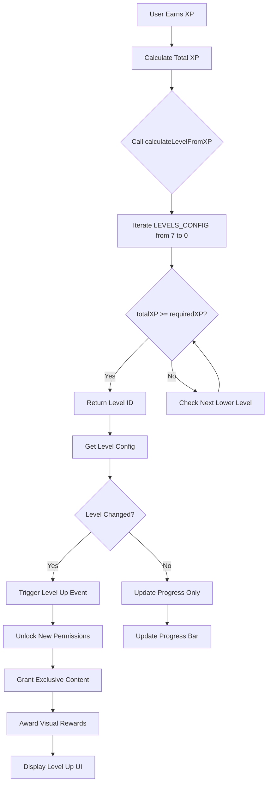
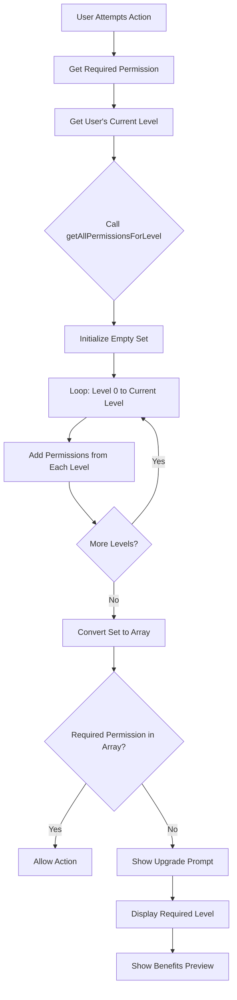
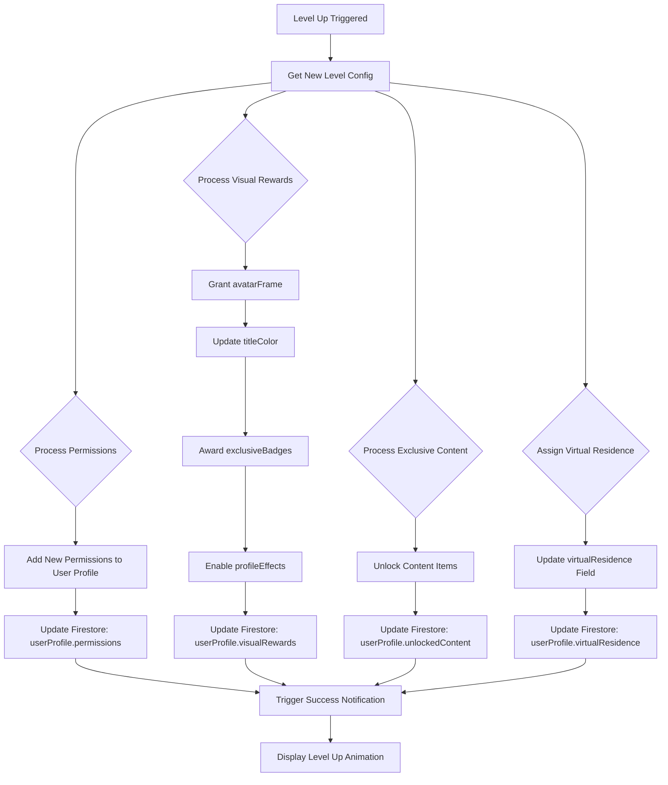

# Module Documentation: `levels-config.ts`

## 1. Module Summary

**Purpose:** Complete 8-level progression system configuration based on classical Chinese literary culture and Dream of the Red Chamber (紅樓夢) themes.

**Size:** 512 lines

**Core Responsibility:** Defines user level progression including XP requirements, permissions, exclusive content, visual rewards, special requirements, and virtual residences for each of 8 levels (0-7). Provides utility functions for level calculation, permission aggregation, and XP progress tracking. Serves as the single source of truth for all gamification and user progression mechanics.

---

## 2. Module Dependencies

### Internal Dependencies
```typescript
import { UserLevel, LevelPermission } from '../types/user-level';
```
- **`../types/user-level`** - Type definitions for UserLevel object and LevelPermission enum

### External Dependencies
None (pure configuration module)

### Reverse Dependencies (Used by)
- `user-level-service.ts` - Core progression system logic
- `/dashboard` page - Display user level and progress
- `/achievements` page - Show level-based rewards
- Level-gated UI components - Permission checks

---

## 3. Public API / Exports

### Main Configuration Array
```typescript
export const LEVELS_CONFIG: UserLevel[];
// 8-level array from 賈府訪客 (Level 0) to 一代宗師 (Level 7)
// Each UserLevel contains:
// - id: number (0-7)
// - title: string (Traditional Chinese)
// - titleEn: string (English translation)
// - description: string (level significance)
// - requiredXP: number (total XP to reach level)
// - xpFromPrevious: number (XP needed from previous level)
// - permissions: LevelPermission[] (unlocked features)
// - exclusiveContent: string[] (level-exclusive content)
// - visualRewards: { avatarFrame, titleColor, exclusiveBadges, profileEffects }
// - specialRequirements?: { type, description, target }[]
// - virtualResidence: string (Dream of the Red Chamber location)
```

### Helper Functions
```typescript
export function getLevelConfig(level: number): UserLevel | null;
// Returns level configuration by ID (0-7), null if invalid

export function getAllPermissionsForLevel(level: number): LevelPermission[];
// Returns cumulative permissions from level 0 to specified level

export function calculateLevelFromXP(totalXP: number): number;
// Calculates current level ID from total XP amount

export function calculateXPProgress(totalXP: number): {
  currentLevel: number;
  currentXP: number;           // XP within current level
  nextLevelXP: number;         // Total XP needed for next level
  xpToNextLevel: number;       // Remaining XP to next level
  progressPercentage: number;  // 0-100% progress within level
};
// Comprehensive XP progress calculation with percentage
```

### Constants
```typescript
export const MAX_LEVEL: number;  // 7 (index of highest level)
export const MAX_XP: number;     // 630 (XP required for Level 7)
```

---

## 4. Code File Breakdown

### A. Level Progression Design Philosophy (Lines 1-37)
**Core Design Principles:**
- **Cultural Authenticity:** Level titles based on classical Chinese literary roles
- **Progressive Difficulty:** 90 XP per level (linear progression)
- **Meaningful Rewards:** Each level unlocks substantial new features
- **Clear Progression:** Users understand advancement goals

**Level Tiers:**
- **Levels 0-1:** New users, basic orientation (賈府訪客 → 陪讀書僮)
- **Levels 2-3:** Regular learners, building habits (門第清客 → 庶務管事)
- **Levels 4-5:** Dedicated students, active community members (詩社雅士 → 府中幕賓)
- **Levels 6-7:** Expert scholars, mentors to others (紅學通儒 → 一代宗師)

**XP Formula:** 90 XP per level (0 → 90 → 180 → 270 → 360 → 450 → 540 → 630)

**Estimated XP Rate:** 20-30 XP per day with normal engagement

### B. Level 0: 賈府訪客 (Mansion Visitor) - Lines 40-62
```typescript
{
  id: 0,
  title: '賈府訪客',
  titleEn: 'Mansion Visitor',
  description: '初來乍到,對紅樓夢充滿好奇。您剛踏入大觀園,還在熟悉這座文學殿堂的一磚一瓦。',
  requiredXP: 0,
  xpFromPrevious: 0,
  permissions: [
    LevelPermission.BASIC_READING,
    LevelPermission.SIMPLE_AI_QA,
  ],
  exclusiveContent: [
    '入門指南',              // Introduction guide
    '基礎人物介紹',          // Basic character introductions
  ],
  visualRewards: {
    avatarFrame: '訪客木框',
    titleColor: '#9CA3AF',  // Gray-400
    exclusiveBadges: ['新來者徽章'],
    profileEffects: [],
  },
  virtualResidence: '榮府外院',  // Outer courtyard of Rongguo Mansion
}
```
**Key Features:** Starting level, basic reading and AI Q&A access

### C. Level 1: 陪讀書僮 (Reading Companion) - Lines 64-106
```typescript
{
  id: 1,
  title: '陪讀書僮',
  titleEn: 'Reading Companion',
  requiredXP: 90,
  xpFromPrevious: 90,
  permissions: [
    LevelPermission.BASIC_READING,
    LevelPermission.SIMPLE_AI_QA,
    LevelPermission.DAILY_TASKS,         // NEW
    LevelPermission.BASIC_ACHIEVEMENTS,  // NEW
  ],
  exclusiveContent: [
    '每日任務系統',
    '成就收集系統',
    '基礎人物檔案',
  ],
  visualRewards: {
    avatarFrame: '書僮藍框',
    titleColor: '#3B82F6',  // Blue-500
    exclusiveBadges: ['首週完成徽章', '每日閱讀徽章'],
    profileEffects: ['淡雅光芒'],
  },
  specialRequirements: [
    { type: 'chapters_read', description: '完成前5回閱讀', target: 5 },
    { type: 'quiz', description: '通過「賈府初印象」測驗', target: 'quiz-mansion-intro' },
  ],
  virtualResidence: '怡紅院',  // Yihong Courtyard (Baoyu's residence)
}
```
**Key Unlocks:** Daily tasks system, achievements, basic character profiles

### D. Level 2: 門第清客 (Guest Scholar) - Lines 108-159
```typescript
{
  id: 2,
  title: '門第清客',
  titleEn: 'Guest Scholar',
  requiredXP: 180,
  xpFromPrevious: 90,
  permissions: [
    // ... previous permissions
    LevelPermission.POETRY_LISTENING,         // NEW
    LevelPermission.EXPERT_READINGS_BASIC,    // NEW
    LevelPermission.GARDEN_3D_VIEW,           // NEW
  ],
  exclusiveContent: [
    '詩詞選集',              // Poetry anthology
    '專家導讀（基礎）',      // Basic expert readings
    '大觀園3D巡覽',         // 3D Grand View Garden
    '人物關係圖（基礎）',    // Basic relationship map
  ],
  visualRewards: {
    avatarFrame: '雅士玉框',
    titleColor: '#10B981',  // Green-500
    exclusiveBadges: ['詩詞學徒徽章', '大觀園探索者徽章'],
    profileEffects: ['中等光芒', '玉色光輝'],
  },
  specialRequirements: [
    { type: 'chapters_read', description: '完成前20回閱讀', target: 20 },
    { type: 'quiz', description: '通過「賈府人事關係」測驗', target: 'quiz-family-relationships' },
    { type: 'tasks_completed', description: '連續7天完成每日任務', target: 7 },
  ],
  virtualResidence: '瀟湘館',  // Xiaoxiang Lodge (Daiyu's residence)
}
```
**Key Unlocks:** Poetry appreciation, expert commentary, 3D garden tour, relationship maps

### E. Level 3: 庶務管事 (Estate Manager) - Lines 161-208
```typescript
{
  id: 3,
  title: '庶務管事',
  titleEn: 'Estate Manager',
  requiredXP: 270,
  xpFromPrevious: 90,
  permissions: [
    // ... previous permissions
    LevelPermission.ADVANCED_AI_ANALYSIS,         // NEW
    LevelPermission.CHARACTER_RELATIONSHIP_MAP,   // NEW
  ],
  exclusiveContent: [
    '進階分析工具',          // Advanced AI analysis
    '人物心理分析',          // Character psychological analysis
    '歷史文化背景',          // Historical and cultural context
    '互動式人物關係圖',      // Interactive character map
  ],
  visualRewards: {
    avatarFrame: '管事金框',
    titleColor: '#F59E0B',  // Amber-500
    exclusiveBadges: ['社群貢獻者徽章', '分析專家徽章'],
    profileEffects: ['強烈光芒', '金色微光'],
  },
  specialRequirements: [
    { type: 'chapters_read', description: '完成前40回閱讀', target: 40 },
    { type: 'community_contribution', description: '在社群發表10篇有價值的討論', target: 10 },
  ],
  virtualResidence: '秋爽齋',  // Qiushuang Study (Xichun's art studio)
}
```
**Key Unlocks:** Advanced AI analysis tools, psychological character analysis, community participation

### F. Level 4: 詩社雅士 (Poetry Society Scholar) - Lines 210-260
```typescript
{
  id: 4,
  title: '詩社雅士',
  titleEn: 'Poetry Society Scholar',
  requiredXP: 360,
  xpFromPrevious: 90,
  permissions: [
    // ... previous permissions
    LevelPermission.POETRY_COMPETITION,   // NEW
    LevelPermission.STUDY_GROUP_CREATE,   // NEW
  ],
  exclusiveContent: [
    '詩詞競賽系統',          // Poetry competition system
    '學習小組',              // Create and join study groups
    '進階詩詞工具',          // Advanced poetry analysis
    '文化深度探索',          // Deep cultural exploration
  ],
  visualRewards: {
    avatarFrame: '詩社雅框',
    titleColor: '#8B5CF6',  // Violet-500
    exclusiveBadges: ['詩詞大師徽章', '學習小組組長徽章', '文化學者徽章'],
    profileEffects: ['璀璨光芒', '水墨特效', '飄落花瓣'],
  },
  specialRequirements: [
    { type: 'chapters_read', description: '完成前60回閱讀', target: 60 },
    { type: 'tasks_completed', description: '完成50個每日任務', target: 50 },
  ],
  virtualResidence: '櫳翠庵',  // Green Gauze Pavilion (Miaoyu's residence)
}
```
**Key Unlocks:** Poetry competitions, study group creation, advanced cultural content

### G. Level 5: 府中幕賓 (Mansion Counselor) - Lines 262-314
```typescript
{
  id: 5,
  title: '府中幕賓',
  titleEn: 'Mansion Counselor',
  requiredXP: 450,
  xpFromPrevious: 90,
  permissions: [
    // ... previous permissions
    LevelPermission.EXPERT_READINGS_FULL,  // NEW (upgraded from BASIC)
    LevelPermission.SPECIAL_TOPICS,        // NEW
  ],
  exclusiveContent: [
    '專家導讀（完整版）',    // Full expert commentary
    '專題討論',              // Special topic discussions
    '導師系統',              // Mentor new users
    '專家講座',              // Expert webinar access
  ],
  visualRewards: {
    avatarFrame: '幕賓紫框',
    titleColor: '#EC4899',  // Pink-500
    exclusiveBadges: ['導師徽章', '專家學者徽章', '特殊貢獻者徽章'],
    profileEffects: ['耀眼光芒', '水墨特效', '流動綢緞', '燈籠輝光'],
  },
  specialRequirements: [
    { type: 'chapters_read', description: '完成前80回閱讀', target: 80 },
    { type: 'community_contribution', description: '幫助20位新用戶完成引導', target: 20 },
  ],
  virtualResidence: '稻香村',  // Daoxiang Village (Li Wan's residence)
}
```
**Key Unlocks:** Full expert commentary, mentorship system, special topic discussions

### H. Level 6: 紅學通儒 (Red Chamber Scholar) - Lines 316-372
```typescript
{
  id: 6,
  title: '紅學通儒',
  titleEn: 'Red Chamber Scholar',
  requiredXP: 540,
  xpFromPrevious: 90,
  permissions: [
    // ... previous permissions
    LevelPermission.MENTOR_ROLE,           // NEW
    LevelPermission.RESEARCH_TOOLS,        // NEW
    LevelPermission.ANNOTATION_PUBLISH,    // NEW
  ],
  exclusiveContent: [
    '研究工具',              // Advanced research tools
    '註解發表系統',          // Publish scholarly annotations
    '專屬典藏',              // Historical archives
    '專家對話',              // Direct dialogue with experts
  ],
  visualRewards: {
    avatarFrame: '通儒玉印框',
    titleColor: '#DC2626',  // Red-600
    exclusiveBadges: ['紅學學者徽章', '研究大師徽章', '註解專家徽章', '文化大使徽章'],
    profileEffects: ['壯麗光芒', '水墨特效', '流動綢緞', '玉色靈氣', '卷軸展開'],
  },
  specialRequirements: [
    { type: 'chapters_read', description: '完成全書120回閱讀', target: 120 },
    { type: 'tasks_completed', description: '發表至少5篇深度研究文章', target: 5 },
  ],
  virtualResidence: '櫳翠庵藏經閣',  // Scripture Pavilion at Longcui Nunnery
}
```
**Key Unlocks:** Research tools, scholarly annotation publishing, mentor role, expert dialogue

### I. Level 7: 一代宗師 (Grand Master) - Lines 374-417
```typescript
{
  id: 7,
  title: '一代宗師',
  titleEn: 'Grand Master',
  requiredXP: 630,
  xpFromPrevious: 90,
  permissions: [
    ...Object.values(LevelPermission),  // ALL PERMISSIONS
    LevelPermission.EXCLUSIVE_EVENTS,   // NEW
  ],
  exclusiveContent: [
    '宗師典藏',              // Master-only archives
    '專屬活動',              // VIP cultural events
    '平台治理',              // Platform governance participation
    '傳世內容創作',          // Create legacy content
  ],
  visualRewards: {
    avatarFrame: '宗師金龍框',
    titleColor: '#B45309',  // Amber-700 (gold)
    exclusiveBadges: ['一代宗師徽章', '平台傳奇徽章', '文化守護者徽章', '終身成就徽章'],
    profileEffects: ['神聖光芒', '水墨特效', '流動綢緞', '玉色靈氣', '卷軸展開', '鳳凰羽翼', '金色聖光'],
  },
  specialRequirements: [
    { type: 'community_contribution', description: '對社群做出傑出貢獻', target: 100 },
    { type: 'tasks_completed', description: '持續活躍180天以上', target: 180 },
  ],
  virtualResidence: '大觀園總管',  // Grand View Garden Chief Administrator
}
```
**Key Unlocks:** All permissions, exclusive events, platform governance, legacy content creation

### J. Helper Function: getLevelConfig (Lines 425-430)
```typescript
export function getLevelConfig(level: number): UserLevel | null {
  if (level < 0 || level >= LEVELS_CONFIG.length) {
    return null;
  }
  return LEVELS_CONFIG[level];
}
```
**Purpose:** Safe level configuration retrieval with bounds checking

### K. Helper Function: getAllPermissionsForLevel (Lines 438-446)
```typescript
export function getAllPermissionsForLevel(level: number): LevelPermission[] {
  const permissions = new Set<LevelPermission>();

  for (let i = 0; i <= level && i < LEVELS_CONFIG.length; i++) {
    LEVELS_CONFIG[i].permissions.forEach(p => permissions.add(p));
  }

  return Array.from(permissions);
}
```
**Purpose:** Returns cumulative permissions (current + all previous levels)
**Why:** Uses Set to automatically deduplicate permissions

### L. Helper Function: calculateLevelFromXP (Lines 453-460)
```typescript
export function calculateLevelFromXP(totalXP: number): number {
  for (let i = LEVELS_CONFIG.length - 1; i >= 0; i--) {
    if (totalXP >= LEVELS_CONFIG[i].requiredXP) {
      return i;
    }
  }
  return 0; // Default to level 0
}
```
**Purpose:** Determines current level from total XP
**Algorithm:** Reverse iteration from highest level (efficient for high-XP users)

### M. Helper Function: calculateXPProgress (Lines 467-501)
```typescript
export function calculateXPProgress(totalXP: number): {
  currentLevel: number;
  currentXP: number;           // XP within current level
  nextLevelXP: number;         // Total XP needed for next level
  xpToNextLevel: number;       // Remaining XP to next level
  progressPercentage: number;  // 0-100% progress
} {
  const currentLevel = calculateLevelFromXP(totalXP);
  const currentLevelConfig = LEVELS_CONFIG[currentLevel];
  const nextLevelConfig = LEVELS_CONFIG[currentLevel + 1];

  if (!nextLevelConfig) {
    // Max level reached
    return {
      currentLevel,
      currentXP: totalXP - currentLevelConfig.requiredXP,
      nextLevelXP: 0,
      xpToNextLevel: 0,
      progressPercentage: 100,
    };
  }

  const currentXP = totalXP - currentLevelConfig.requiredXP;
  const nextLevelXP = nextLevelConfig.requiredXP - currentLevelConfig.requiredXP;
  const xpToNextLevel = nextLevelConfig.requiredXP - totalXP;
  const progressPercentage = (currentXP / nextLevelXP) * 100;

  return {
    currentLevel,
    currentXP,
    nextLevelXP,
    xpToNextLevel,
    progressPercentage: Math.min(progressPercentage, 100),
  };
}
```
**Purpose:** Comprehensive progress calculation for UI progress bars
**Special Case:** Max level returns 100% progress

### N. Constants (Lines 505-511)
```typescript
export const MAX_LEVEL = LEVELS_CONFIG.length - 1;  // 7
export const MAX_XP = LEVELS_CONFIG[MAX_LEVEL].requiredXP;  // 630
```

---

## 5. System and Data Flow

### A. Level Progression Flow


### B. Permission Check Flow


### C. XP Progress Calculation

```mermaid
flowchart LR
    A[Total XP: 250] --> B[calculateXPProgress]

    B --> C[calculateLevelFromXP: Level 2]
    C --> D[Get Current Level Config: requiredXP=180]
    D --> E[Get Next Level Config: requiredXP=270]

    E --> F[Calculate currentXP: 250-180=70]
    F --> G[Calculate nextLevelXP: 270-180=90]
    G --> H[Calculate xpToNextLevel: 270-250=20]
    H --> I[Calculate percentage: 70/90×100=77.78%]

    I --> J[Return Progress Object]
    J --> K[UI: Display 77.78% Progress Bar]
```


### D. Level-Up Rewards Distribution


---

## 6. Usage Example & Testing

### A. Basic Usage - Get Level Configuration
```typescript
import { getLevelConfig, LEVELS_CONFIG } from '@/lib/config/levels-config';

// Get specific level configuration
const level3Config = getLevelConfig(3);
console.log(level3Config?.title);  // "庶務管事"
console.log(level3Config?.titleEn);  // "Estate Manager"
console.log(level3Config?.requiredXP);  // 270

// Safe access with null check
const invalidLevel = getLevelConfig(10);
if (!invalidLevel) {
  console.log('Invalid level ID');
}

// Display all level titles
LEVELS_CONFIG.forEach((level, index) => {
  console.log(`Level ${index}: ${level.title} (${level.titleEn})`);
});
```

### B. Calculate User Level from XP
```typescript
import { calculateLevelFromXP, getLevelConfig } from '@/lib/config/levels-config';

// Example: User has 385 XP
const totalXP = 385;
const currentLevel = calculateLevelFromXP(totalXP);
// Returns: 4 (詩社雅士 / Poetry Society Scholar)

const levelConfig = getLevelConfig(currentLevel);
console.log(`You are a ${levelConfig?.titleEn} (${levelConfig?.title})`);
// Output: "You are a Poetry Society Scholar (詩社雅士)"

// Edge cases
console.log(calculateLevelFromXP(0));    // 0 (minimum)
console.log(calculateLevelFromXP(630));  // 7 (maximum)
console.log(calculateLevelFromXP(1000)); // 7 (capped at max level)
```

### C. Display Progress Bar
```typescript
import { calculateXPProgress } from '@/lib/config/levels-config';

// User has 245 XP
const progress = calculateXPProgress(245);
console.log(progress);
/* Output:
{
  currentLevel: 2,         // 門第清客 (Guest Scholar)
  currentXP: 65,           // 245 - 180 = 65 XP into Level 2
  nextLevelXP: 90,         // Need 90 XP to reach Level 3
  xpToNextLevel: 25,       // Need 25 more XP
  progressPercentage: 72.22  // 65/90 = 72.22% through Level 2
}
*/

// React component example
function LevelProgressBar({ totalXP }: { totalXP: number }) {
  const progress = calculateXPProgress(totalXP);
  const levelConfig = getLevelConfig(progress.currentLevel);

  return (
    <div className="level-progress">
      <h3>{levelConfig?.title} (Level {progress.currentLevel})</h3>
      <div className="progress-bar">
        <div
          className="progress-fill"
          style={{ width: `${progress.progressPercentage}%` }}
        />
      </div>
      <p>
        {progress.currentXP} / {progress.nextLevelXP} XP
        ({progress.xpToNextLevel} XP to next level)
      </p>
    </div>
  );
}
```

### D. Permission Checking
```typescript
import { getAllPermissionsForLevel, calculateLevelFromXP } from '@/lib/config/levels-config';
import { LevelPermission } from '@/lib/types/user-level';

// Check if user has specific permission
function hasPermission(userXP: number, requiredPermission: LevelPermission): boolean {
  const currentLevel = calculateLevelFromXP(userXP);
  const userPermissions = getAllPermissionsForLevel(currentLevel);
  return userPermissions.includes(requiredPermission);
}

// Example: Can user access poetry competitions?
const userXP = 300;
const canAccessPoetry = hasPermission(userXP, LevelPermission.POETRY_COMPETITION);
console.log(canAccessPoetry);  // false (need Level 4, user is Level 3)

// Gate UI features
function PoetryCompetitionButton({ userXP }: { userXP: number }) {
  const canAccess = hasPermission(userXP, LevelPermission.POETRY_COMPETITION);
  const currentLevel = calculateLevelFromXP(userXP);

  if (!canAccess) {
    return (
      <button disabled>
        Poetry Competitions (Unlock at Level 4)
        <br />
        You are Level {currentLevel}
      </button>
    );
  }

  return <button onClick={() => navigateToPoetry()}>Poetry Competitions</button>;
}
```

### E. Display Level-Up Rewards
```typescript
import { getLevelConfig } from '@/lib/config/levels-config';

// Show what user will unlock at next level
function NextLevelPreview({ currentLevel }: { currentLevel: number }) {
  const nextLevelConfig = getLevelConfig(currentLevel + 1);

  if (!nextLevelConfig) {
    return <p>You've reached the maximum level!</p>;
  }

  return (
    <div className="next-level-preview">
      <h2>Reach {nextLevelConfig.titleEn} to unlock:</h2>

      <section>
        <h3>New Permissions</h3>
        <ul>
          {nextLevelConfig.permissions.map(permission => (
            <li key={permission}>{permission}</li>
          ))}
        </ul>
      </section>

      <section>
        <h3>Exclusive Content</h3>
        <ul>
          {nextLevelConfig.exclusiveContent.map(content => (
            <li key={content}>{content}</li>
          ))}
        </ul>
      </section>

      <section>
        <h3>Visual Rewards</h3>
        <p>Avatar Frame: {nextLevelConfig.visualRewards.avatarFrame}</p>
        <p>Title Color: <span style={{ color: nextLevelConfig.visualRewards.titleColor }}>
          ■
        </span></p>
        <p>Badges: {nextLevelConfig.visualRewards.exclusiveBadges.join(', ')}</p>
      </section>

      <section>
        <h3>Virtual Residence</h3>
        <p>{nextLevelConfig.virtualResidence}</p>
      </section>
    </div>
  );
}
```

### F. Check Special Requirements
```typescript
import { getLevelConfig } from '@/lib/config/levels-config';

// Validate if user meets special requirements for level
interface UserProgress {
  chaptersRead: number;
  tasksCompleted: number;
  communityContributions: number;
  quizzesCompleted: string[];
}

function canUserLevelUp(
  userXP: number,
  targetLevel: number,
  userProgress: UserProgress
): { canLevelUp: boolean; unmetRequirements: string[] } {
  const levelConfig = getLevelConfig(targetLevel);
  if (!levelConfig) return { canLevelUp: false, unmetRequirements: ['Invalid level'] };

  // Check XP requirement
  if (userXP < levelConfig.requiredXP) {
    return {
      canLevelUp: false,
      unmetRequirements: [`Need ${levelConfig.requiredXP - userXP} more XP`],
    };
  }

  // Check special requirements
  const unmetRequirements: string[] = [];

  levelConfig.specialRequirements?.forEach(req => {
    switch (req.type) {
      case 'chapters_read':
        if (userProgress.chaptersRead < (req.target as number)) {
          unmetRequirements.push(req.description);
        }
        break;
      case 'tasks_completed':
        if (userProgress.tasksCompleted < (req.target as number)) {
          unmetRequirements.push(req.description);
        }
        break;
      case 'community_contribution':
        if (userProgress.communityContributions < (req.target as number)) {
          unmetRequirements.push(req.description);
        }
        break;
      case 'quiz':
        if (!userProgress.quizzesCompleted.includes(req.target as string)) {
          unmetRequirements.push(req.description);
        }
        break;
    }
  });

  return {
    canLevelUp: unmetRequirements.length === 0,
    unmetRequirements,
  };
}

// Example usage
const userProgress: UserProgress = {
  chaptersRead: 15,
  tasksCompleted: 5,
  communityContributions: 2,
  quizzesCompleted: ['quiz-mansion-intro'],
};

const result = canUserLevelUp(250, 2, userProgress);
if (!result.canLevelUp) {
  console.log('Cannot level up yet. Missing:');
  result.unmetRequirements.forEach(req => console.log(`- ${req}`));
}
```

### G. Testing Strategy
```typescript
// tests/lib/config/levels-config.test.ts
import {
  LEVELS_CONFIG,
  getLevelConfig,
  getAllPermissionsForLevel,
  calculateLevelFromXP,
  calculateXPProgress,
  MAX_LEVEL,
  MAX_XP,
} from '@/lib/config/levels-config';
import { LevelPermission } from '@/lib/types/user-level';

describe('LEVELS_CONFIG', () => {
  it('should have 8 levels (0-7)', () => {
    expect(LEVELS_CONFIG).toHaveLength(8);
    expect(LEVELS_CONFIG[0].id).toBe(0);
    expect(LEVELS_CONFIG[7].id).toBe(7);
  });

  it('should have linear XP progression (90 per level)', () => {
    for (let i = 1; i < LEVELS_CONFIG.length; i++) {
      expect(LEVELS_CONFIG[i].xpFromPrevious).toBe(90);
    }
  });

  it('should have all required fields for each level', () => {
    LEVELS_CONFIG.forEach(level => {
      expect(level.id).toBeGreaterThanOrEqual(0);
      expect(level.title).toBeTruthy();
      expect(level.titleEn).toBeTruthy();
      expect(level.description).toBeTruthy();
      expect(level.requiredXP).toBeGreaterThanOrEqual(0);
      expect(Array.isArray(level.permissions)).toBe(true);
      expect(Array.isArray(level.exclusiveContent)).toBe(true);
      expect(level.visualRewards).toBeTruthy();
      expect(level.virtualResidence).toBeTruthy();
    });
  });
});

describe('getLevelConfig', () => {
  it('should return correct level configuration', () => {
    const level0 = getLevelConfig(0);
    expect(level0?.title).toBe('賈府訪客');
    expect(level0?.titleEn).toBe('Mansion Visitor');

    const level7 = getLevelConfig(7);
    expect(level7?.title).toBe('一代宗師');
    expect(level7?.titleEn).toBe('Grand Master');
  });

  it('should return null for invalid levels', () => {
    expect(getLevelConfig(-1)).toBeNull();
    expect(getLevelConfig(8)).toBeNull();
    expect(getLevelConfig(999)).toBeNull();
  });
});

describe('calculateLevelFromXP', () => {
  it('should calculate correct levels from XP', () => {
    expect(calculateLevelFromXP(0)).toBe(0);
    expect(calculateLevelFromXP(89)).toBe(0);
    expect(calculateLevelFromXP(90)).toBe(1);
    expect(calculateLevelFromXP(180)).toBe(2);
    expect(calculateLevelFromXP(270)).toBe(3);
    expect(calculateLevelFromXP(360)).toBe(4);
    expect(calculateLevelFromXP(450)).toBe(5);
    expect(calculateLevelFromXP(540)).toBe(6);
    expect(calculateLevelFromXP(630)).toBe(7);
    expect(calculateLevelFromXP(1000)).toBe(7);  // Capped at max
  });

  it('should handle boundary values', () => {
    expect(calculateLevelFromXP(179)).toBe(1);  // Just below Level 2
    expect(calculateLevelFromXP(180)).toBe(2);  // Exactly Level 2
    expect(calculateLevelFromXP(181)).toBe(2);  // Just above Level 2
  });
});

describe('calculateXPProgress', () => {
  it('should calculate progress within a level', () => {
    const progress = calculateXPProgress(200);
    expect(progress.currentLevel).toBe(2);
    expect(progress.currentXP).toBe(20);  // 200 - 180
    expect(progress.nextLevelXP).toBe(90);
    expect(progress.xpToNextLevel).toBe(70);  // 270 - 200
    expect(progress.progressPercentage).toBeCloseTo(22.22, 2);
  });

  it('should handle max level correctly', () => {
    const progress = calculateXPProgress(700);  // Beyond max
    expect(progress.currentLevel).toBe(7);
    expect(progress.progressPercentage).toBe(100);
    expect(progress.xpToNextLevel).toBe(0);
    expect(progress.nextLevelXP).toBe(0);
  });

  it('should handle exact level thresholds', () => {
    const progress = calculateXPProgress(360);  // Exactly Level 4
    expect(progress.currentLevel).toBe(4);
    expect(progress.currentXP).toBe(0);
    expect(progress.progressPercentage).toBe(0);
  });
});

describe('getAllPermissionsForLevel', () => {
  it('should return cumulative permissions', () => {
    const level0Perms = getAllPermissionsForLevel(0);
    expect(level0Perms).toHaveLength(2);  // BASIC_READING, SIMPLE_AI_QA

    const level1Perms = getAllPermissionsForLevel(1);
    expect(level1Perms.length).toBeGreaterThan(level0Perms.length);
    expect(level1Perms).toContain(LevelPermission.BASIC_READING);
    expect(level1Perms).toContain(LevelPermission.DAILY_TASKS);
  });

  it('should not have duplicate permissions', () => {
    const level3Perms = getAllPermissionsForLevel(3);
    const uniquePerms = new Set(level3Perms);
    expect(level3Perms).toHaveLength(uniquePerms.size);
  });

  it('should handle max level with all permissions', () => {
    const maxLevelPerms = getAllPermissionsForLevel(7);
    expect(maxLevelPerms.length).toBeGreaterThanOrEqual(15);  // Many permissions
  });
});

describe('Constants', () => {
  it('should define correct MAX_LEVEL', () => {
    expect(MAX_LEVEL).toBe(7);
  });

  it('should define correct MAX_XP', () => {
    expect(MAX_XP).toBe(630);
  });
});
```

---

**Module Metadata:**
- **Type:** Configuration
- **Test Coverage:** Not directly tested (used by user-level-service tests)
- **LOC:** 512 lines
- **Complexity:** Low (declarative configuration)
- **Cultural Context:** Based on Dream of the Red Chamber (紅樓夢) themes with authentic classical Chinese titles
- **Maintenance Notes:** Update XP requirements carefully to maintain game balance; ensure permission additions are backward-compatible
