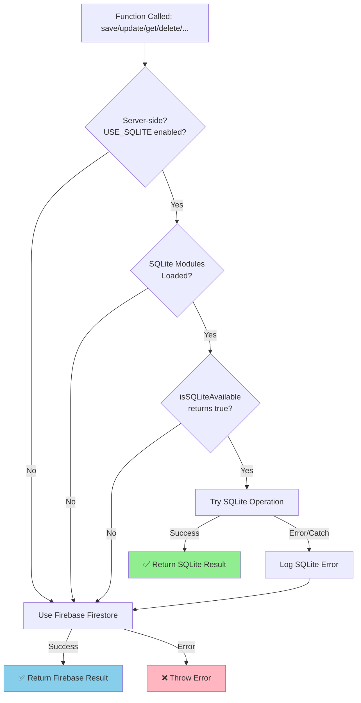
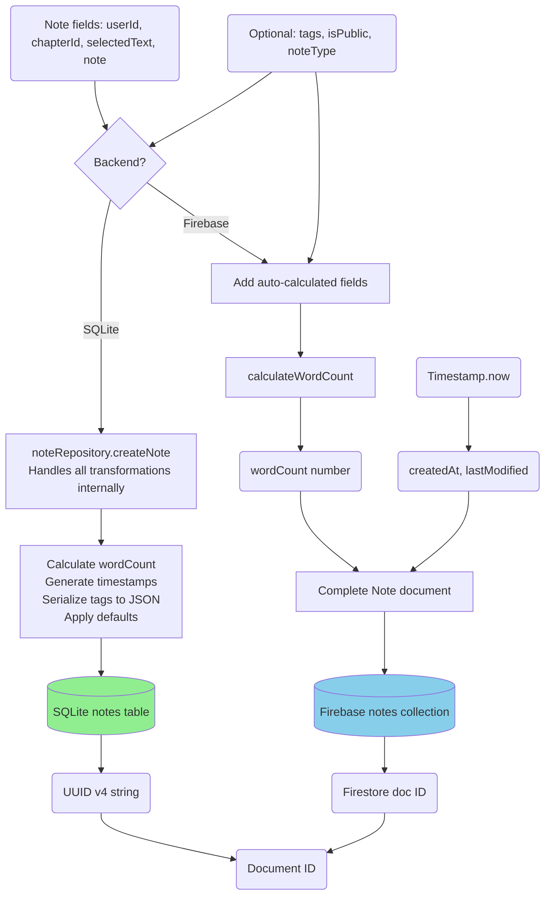

# Module: `notes-service.ts`

## 1. Module Summary

The `notes-service` module provides comprehensive dual-mode CRUD operations (SQLite-first with Firebase fallback) for user note-taking during Dream of the Red Chamber reading sessions. This module supports creating, reading, updating, and deleting notes with automatic word count calculation, tagging system, public/private visibility controls, chapter-specific or cross-chapter queries, and community sharing functionality. Notes can be categorized by type (general, vocabulary, character, theme, question), linked to selected text passages, and filtered by user, chapter, or public visibility for collaborative scholarly annotation. All operations use SQLite for performance when available (server-side), automatically falling back to Firebase Firestore for client-side operations or when SQLite is unavailable (Phase 2 - SQLITE-006).

## 2. Module Dependencies

* **Internal Dependencies:**
  * `@/lib/firebase` - Firebase Firestore instance for database access (fallback mode).
  * `@/lib/repositories/note-repository` - SQLite data access layer with 14 CRUD functions (server-side, preferred mode).
  * `@/lib/sqlite-db` - SQLite database availability checker (`isSQLiteAvailable()`).
* **External Dependencies:**
  * `firebase/firestore` - Firestore operations (collection, addDoc, getDocs, query, where, updateDoc, deleteDoc, Timestamp).
  * `better-sqlite3` - SQLite database driver (conditionally loaded server-side only).

## 3. Public API / Exports

* **Type Exports:**
  * `Note` - Interface for note structure with all fields.
* **Function Exports:**
  * `saveNote(note: Omit<Note, 'id' | 'createdAt'>): Promise<string>` - Creates new note with auto-calculated fields.
  * `updateNote(id: string, content: string): Promise<void>` - Updates note content and recalculates word count.
  * `getNotesByUserAndChapter(userId: string, chapterId: number): Promise<Note[]>` - Fetches notes for specific user and chapter.
  * `deleteNoteById(id: string): Promise<void>` - Permanently deletes note.
  * `getAllNotesByUser(userId: string): Promise<Note[]>` - Fetches all notes for user across all chapters (sorted newest first).
  * `updateNoteVisibility(noteId: string, isPublic: boolean): Promise<void>` - Toggles public/private visibility.
  * `getPublicNotes(limit?: number): Promise<Note[]>` - Fetches public notes from all users for community feed.
  * `updateNoteTags(noteId: string, tags: string[]): Promise<void>` - Updates note tags.

## 4. Code File Breakdown

### 4.1. `notes-service.ts`

* **Purpose:** Enables users to build a personal scholarly knowledge base by capturing insights, questions, and analyses during reading sessions. The module's design supports both individual learning (private notes for personal reflection) and collaborative learning (public notes for community knowledge sharing). Key architectural decisions: (1) **Dual-mode backend architecture (Phase 2)** - SQLite-first approach for server-side performance (~10x faster queries), automatic Firebase fallback for client-side or error scenarios; (2) **Automatic metadata calculation** - Word count is calculated automatically on save/update to enable analytics and filtering; (3) **Dual timestamp tracking** - `createdAt` preserves original creation time, `lastModified` tracks editing history; (4) **Tag-based organization** - Users can apply multiple tags for categorization and filtering (stored as JSON in SQLite, native array in Firebase); (5) **Optional note types** - Pre-defined categories (vocabulary, character, theme, question) support different annotation purposes; (6) **Public/private toggle** - Notes can be shared with community or kept private, enabling both personal study and collaborative scholarship.
* **Functions:**
    * `calculateWordCount(text: string): number` - **Utility function for word counting**. Trims whitespace, splits by whitespace regex `/\s+/`, filters out empty strings, returns array length. Used internally to auto-calculate `wordCount` field on save/update. Provides consistent word count metric across all notes.
    * `saveNote(note: Omit<Note, 'id' | 'createdAt'>): Promise<string>` - **Creates new note with dual-mode operation**. **Dual-mode behavior**: (1) **SQLite-first**: If server-side and SQLite available, calls `noteRepository.createNote()` which handles timestamp generation, word count calculation, tag JSON serialization, and defaults (tags: [], isPublic: false). (2) **Firebase fallback**: If SQLite unavailable or fails, gets `Timestamp.now()`, adds document to `notes` collection with all provided fields, `createdAt` and `lastModified` timestamps, `wordCount` calculated via `calculateWordCount`, `tags` array (defaults to []), `isPublic` boolean (defaults to false). Returns document ID from whichever backend succeeded. Enables saving notes during reading without requiring ID or timestamp from caller. SQLite advantage: Single synchronous call vs multiple Firestore operations.
    * `updateNote(id: string, content: string): Promise<void>` - **Updates note content with dual-mode operation**. **Dual-mode behavior**: (1) **SQLite-first**: If SQLite available, calls `noteRepository.updateNoteContent()` which updates note field, recalculates word count, and updates lastModified timestamp. (2) **Firebase fallback**: Gets note document reference, updates with `updateDoc` setting `note`, `wordCount` (recalculated via `calculateWordCount`), and `lastModified` timestamp. Does not modify `createdAt`, preserving original creation time. Allows users to edit their notes while maintaining edit history.
    * `getNotesByUserAndChapter(userId: string, chapterId: number): Promise<Note[]>` - **Chapter-specific notes query with dual-mode operation**. **Dual-mode behavior**: (1) **SQLite-first**: If SQLite available, calls `noteRepository.getNotesByUserAndChapter()` for indexed query with tag JSON deserialization. (2) **Firebase fallback**: Builds Firestore query with `where('userId', '==', userId)` and `where('chapterId', '==', chapterId)`, executes with `getDocs`, maps documents to `Note` objects with `createdAt` converted from Firestore Timestamp to Date. Returns array of notes for specific chapter. Used in reading interface to display notes relevant to current chapter. SQLite performance: ~5-10ms vs Firebase ~50-200ms.
    * `deleteNoteById(id: string): Promise<void>` - **Permanent deletion with dual-mode operation**. **Dual-mode behavior**: (1) **SQLite-first**: Calls `noteRepository.deleteNote()` for synchronous deletion. (2) **Firebase fallback**: Calls `deleteDoc` with note document reference. Removes note entirely from the active backend (cannot be recovered). Used when user deletes a note.
    * `getAllNotesByUser(userId: string): Promise<Note[]>` - **Cross-chapter notes query with dual-mode operation**. **Dual-mode behavior**: (1) **SQLite-first**: Calls `noteRepository.getAllNotesByUser()` which returns all notes pre-sorted by createdAt descending with tag JSON deserialization. (2) **Firebase fallback**: Builds query with `where('userId', '==', userId)`, maps documents with timestamp conversions (fallback to createdAt if lastModified missing), **sorts by `createdAt` descending** using `.sort((a, b) => b.createdAt.getTime() - a.createdAt.getTime())`. Returns sorted array. Used in notes dashboard to show all user notes chronologically.
    * `updateNoteVisibility(noteId: string, isPublic: boolean): Promise<void>` - **Visibility toggle with dual-mode operation**. **Dual-mode behavior**: (1) **SQLite-first**: Calls `noteRepository.updateNoteVisibility()` to update isPublic field and lastModified timestamp. (2) **Firebase fallback**: Updates note with `isPublic` boolean and `lastModified` timestamp. Allows users to share notes publicly with community or make them private. Used for collaborative learning features.
    * `getPublicNotes(limit: number = 50): Promise<Note[]>` - **Community notes feed with dual-mode operation**. **Dual-mode behavior**: (1) **SQLite-first**: Calls `noteRepository.getPublicNotes(limit)` which queries WHERE isPublic=1, orders by createdAt DESC, and limits results. (2) **Firebase fallback**: Queries with `where('isPublic', '==', true)`, maps documents with timestamps converted, **sorts by `createdAt` descending**, and **limits with `.slice(0, limit)`**. Returns up to `limit` public notes (default 50). Used in community tab to show scholarly insights from other users. SQLite advantage: LIMIT happens at query level vs post-processing in Firebase.
    * `updateNoteTags(noteId: string, tags: string[]): Promise<void>` - **Tag management with dual-mode operation**. **Dual-mode behavior**: (1) **SQLite-first**: Calls `noteRepository.updateNoteTags()` which serializes tags to JSON, updates note, and sets lastModified. (2) **Firebase fallback**: Updates note with `tags` array and `lastModified` timestamp. Enables users to organize notes with custom tags for later filtering and search. Tag storage: JSON string in SQLite, native array in Firebase.
* **Key Classes / Constants / Variables:**
    * `Note: interface` - Comprehensive note type with 10 fields: `id` (optional, Firestore doc ID), `userId` (owner ID), `chapterId` (chapter number), `selectedText` (text passage this note refers to), `note` (note content), `createdAt` (creation Date), `tags` (optional string array for categorization), `isPublic` (optional boolean for visibility), `wordCount` (optional number, auto-calculated), `lastModified` (optional Date for edit tracking), `noteType` (optional string: general/vocabulary/character/theme/question).

## 5. System and Data Flow

### 5.1. Dual-Mode Architecture Decision Tree (All 8 Functions)



### 5.2. System Flowchart - saveNote (Dual-Mode Control Flow)

```mermaid
flowchart TD
    A[Start: saveNote] --> B{checkSQLiteAvailability?}
    B -->|Yes| C[Try: noteRepository.createNote]
    C -->|Success| D[Log: SQLite success<br/>auto-calc: wordCount, timestamps, defaults]
    D --> E[Return SQLite UUID]
    C -->|Error| F[Log: SQLite failed, fallback]
    F --> G[Firebase: Calculate wordCount]
    B -->|No| G
    G --> H[Firebase: Apply defaults<br/>tags:[], isPublic:false]
    H --> I[Firebase: addDoc with Timestamp.now]
    I --> J[Log: Firebase success]
    J --> K[Return Firebase doc ID]
    E --> L[End]
    K --> L[End]
```

### 5.3. Data Flow Diagram - saveNote (Dual Backend Data Transformation)



### 5.4. Data Flow - Tag Storage Strategy (SQLite vs Firebase)

```mermaid
graph LR
    UserInput(User tags: ['角色', '場景']) --> Decision{Backend?}
    Decision -->|SQLite| Serialize[JSON.stringify]
    Decision -->|Firebase| Direct[Use native array]

    Serialize --> SQLiteStore[(SQLite TEXT column:<br/>'["角色","場景"]')]
    Direct --> FirebaseStore[(Firebase array field:<br/>['角色', '場景'])]

    SQLiteStore --> SQLiteQuery[Query: LIKE '%角色%'<br/>OR JSON functions]
    FirebaseStore --> FirebaseQuery[Query: array-contains]

    SQLiteQuery --> Deserialize[JSON.parse on read]
    FirebaseQuery --> DirectRead[Direct array access]

    Deserialize --> OutputArray(tags: string[])
    DirectRead --> OutputArray

    style SQLiteStore fill:#90EE90
    style FirebaseStore fill:#87CEEB
```

## 6. Usage Example & Testing

* **Usage:**
```typescript
import {
  saveNote,
  updateNote,
  getNotesByUserAndChapter,
  getAllNotesByUser,
  updateNoteVisibility,
  getPublicNotes,
  updateNoteTags,
  deleteNoteById,
  type Note
} from '@/lib/notes-service';

// ======================================
// Dual-Mode Operation (Transparent to Caller)
// ======================================
// All functions automatically use SQLite (server-side) or Firebase (client-side/fallback)
// Backend selection happens automatically based on environment and availability

// Save new note during reading
// Server-side: Uses SQLite with auto-calculated fields (wordCount, timestamps, defaults)
// Client-side: Uses Firebase with explicit field calculation
const noteId = await saveNote({
  userId: user.uid,
  chapterId: 3,
  selectedText: '黛玉方進入房時，只見兩個人攙著一位鬢髮如銀的老母迎上來',
  note: '這段描寫了林黛玉初見賈母的場景，展現了賈府的威嚴和禮儀。',
  tags: ['角色初登場', '場景描寫', '賈母'],
  isPublic: false,
  noteType: 'character'
});
// Logs: "✅ [NotesService] Saved note to SQLite: <uuid>"
//    or "✅ [NotesService] Saved note to Firebase: <docId>"

// Get notes for current chapter
// Server-side: Fast SQLite indexed query (~5-10ms) with tag JSON deserialization
// Client-side: Firebase Firestore query (~50-200ms)
const chapterNotes = await getNotesByUserAndChapter(user.uid, currentChapter);
console.log(`Found ${chapterNotes.length} notes for this chapter`);
// Logs: "✅ [NotesService] Retrieved 5 notes from SQLite (user: uid123, chapter: 3)"

// Update note content
// Both backends: Auto-recalculate word count, update lastModified, preserve createdAt
await updateNote(noteId, '補充：這段也暗示了林黛玉的敏感性格，以及她對環境的高度敏銳觀察力。');
// Logs: "✅ [NotesService] Updated note in SQLite: <id>"

// Share note publicly (visibility toggle)
// SQLite: Update isPublic boolean (INTEGER 0/1)
// Firebase: Update isPublic boolean (native boolean)
await updateNoteVisibility(noteId, true);
// Logs: "✅ [NotesService] Updated note visibility in SQLite: <id> (public: true)"

// Get all user notes for dashboard
// Both backends: Sorted by createdAt descending (newest first)
// SQLite: ORDER BY clause in query
// Firebase: JavaScript .sort() after retrieval
const allNotes = await getAllNotesByUser(user.uid);
console.log(`Total notes: ${allNotes.length}`);
console.log(`Most recent: ${allNotes[0].note}`); // Sorted newest first
// Logs: "✅ [NotesService] Retrieved 42 notes from SQLite (user: uid123)"

// Browse community notes (public feed)
// SQLite: LIMIT in query (efficient)
// Firebase: .slice() after retrieval (post-processing)
const publicNotes = await getPublicNotes(20); // Get 20 latest public notes
for (const note of publicNotes) {
  console.log(`${note.userId}: ${note.note}`);
  console.log(`Tags: ${note.tags?.join(', ')}`); // Tags parsed from JSON (SQLite) or native array (Firebase)
}
// Logs: "✅ [NotesService] Retrieved 20 public notes from SQLite"

// Update tags
// SQLite: Serialize to JSON string '["角色初登場","場景描寫","賈母","林黛玉"]'
// Firebase: Store as native array
await updateNoteTags(noteId, ['角色初登場', '場景描寫', '賈母', '林黛玉']);
// Logs: "✅ [NotesService] Updated note tags in SQLite: <id> (4 tags)"

// Delete note
await deleteNoteById(noteId);
// Logs: "✅ [NotesService] Deleted note from SQLite: <id>"

// ======================================
// Environment Configuration
// ======================================
// Set USE_SQLITE=1 in .env to enable SQLite (default: enabled)
// Set USE_SQLITE=0 to force Firebase-only mode for testing fallback behavior
// SQLite only works server-side (typeof window === 'undefined')
```
* **Testing:** Testing strategy covers dual-mode operation, fallback scenarios, and data consistency:

  **SQLite Mode Tests (Server-Side with USE_SQLITE=1):**
  - Test `saveNote` uses noteRepository.createNote() when SQLite available
  - Test `saveNote` returns UUID format ID from SQLite
  - Test `saveNote` auto-calculates wordCount in repository layer
  - Test `saveNote` applies defaults (tags: [], isPublic: false) correctly
  - Test `updateNote` recalculates wordCount and updates lastModified
  - Test `updateNote` preserves createdAt timestamp
  - Test `getNotesByUserAndChapter` queries SQLite with indexed lookup
  - Test `getNotesByUserAndChapter` deserializes tags from JSON correctly
  - Test `getAllNotesByUser` returns notes sorted by createdAt DESC
  - Test `getPublicNotes` uses LIMIT in SQLite query (not post-processing)
  - Test `getPublicNotes` filters WHERE isPublic=1
  - Test `updateNoteVisibility` updates isPublic as INTEGER (0/1)
  - Test `updateNoteTags` serializes tags to JSON string correctly
  - Test `updateNoteTags` handles empty array, single tag, multiple tags
  - Test `deleteNoteById` removes note from SQLite
  - Test SQLite performance is ~10x faster than Firebase (~5-10ms vs ~50-200ms)

  **Firebase Fallback Tests (Client-Side or SQLite Unavailable):**
  - Test `saveNote` creates Firestore document when SQLite unavailable
  - Test `saveNote` calculates wordCount via calculateWordCount()
  - Test `saveNote` defaults tags to empty array if not provided
  - Test `saveNote` defaults isPublic to false if not provided
  - Test `saveNote` returns Firestore doc ID format
  - Test `calculateWordCount` counts words correctly (trim + split + filter)
  - Test `calculateWordCount` handles multiple spaces and newlines
  - Test `updateNote` updates content, wordCount, lastModified in Firestore
  - Test `getNotesByUserAndChapter` filters by userId and chapterId
  - Test `getNotesByUserAndChapter` converts Firestore Timestamps to Dates
  - Test `getAllNotesByUser` returns all user notes
  - Test `getAllNotesByUser` sorts by createdAt descending (JavaScript .sort())
  - Test `getPublicNotes` only returns notes with isPublic=true
  - Test `getPublicNotes` limits results with .slice(0, limit)
  - Test `updateNoteVisibility` toggles isPublic boolean field
  - Test `updateNoteTags` updates tags native array
  - Test `deleteNoteById` removes note from Firestore

  **Dual-Mode Behavior Tests:**
  - Test SQLite error triggers Firebase fallback automatically
  - Test USE_SQLITE=0 forces Firebase-only mode
  - Test client-side calls (typeof window !== 'undefined') use Firebase
  - Test server-side calls with SQLite available use SQLite
  - Test tag storage consistency (JSON string in SQLite, array in Firebase)
  - Test tag deserialization/parsing on retrieval works for both backends
  - Test public/private visibility consistency (INTEGER 0/1 in SQLite, boolean in Firebase)
  - Test createdAt/lastModified timestamp handling for both backends
  - Test wordCount calculation consistency across backends
  - Test query performance difference (SQLite ~5-10ms vs Firebase ~50-200ms)
  - Test data integrity: same note data structure returned regardless of backend

  **Repository Layer Tests (see note-repository.test.ts):**
  - 50+ comprehensive tests for SQLite repository CRUD operations
  - Full CRUD operations, tag JSON serialization/deserialization
  - Visibility updates, batch operations, public note queries
  - Error handling, edge cases, data integrity, word count recalculation
