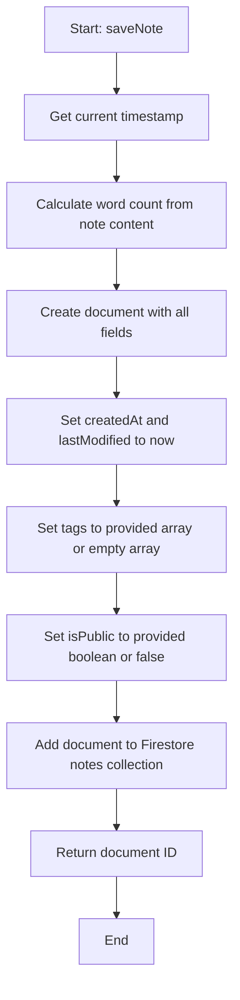
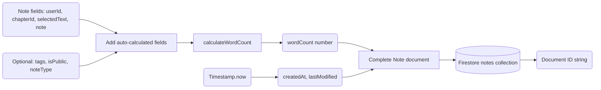

# Module: `notes-service.ts`

## 1. Module Summary

The `notes-service` module provides comprehensive Firestore CRUD operations for user note-taking during Dream of the Red Chamber reading sessions. This module supports creating, reading, updating, and deleting notes with automatic word count calculation, tagging system, public/private visibility controls, chapter-specific or cross-chapter queries, and community sharing functionality. Notes can be categorized by type (general, vocabulary, character, theme, question), linked to selected text passages, and filtered by user, chapter, or public visibility for collaborative scholarly annotation.

## 2. Module Dependencies

* **Internal Dependencies:**
  * `@/lib/firebase` - Firebase Firestore instance for database access.
* **External Dependencies:**
  * `firebase/firestore` - Firestore operations (collection, addDoc, getDocs, query, where, updateDoc, deleteDoc, Timestamp).

## 3. Public API / Exports

* **Type Exports:**
  * `Note` - Interface for note structure with all fields.
* **Function Exports:**
  * `saveNote(note: Omit<Note, 'id' | 'createdAt'>): Promise<string>` - Creates new note with auto-calculated fields.
  * `updateNote(id: string, content: string): Promise<void>` - Updates note content and recalculates word count.
  * `getNotesByUserAndChapter(userId: string, chapterId: number): Promise<Note[]>` - Fetches notes for specific user and chapter.
  * `deleteNoteById(id: string): Promise<void>` - Permanently deletes note.
  * `getAllNotesByUser(userId: string): Promise<Note[]>` - Fetches all notes for user across all chapters (sorted newest first).
  * `updateNoteVisibility(noteId: string, isPublic: boolean): Promise<void>` - Toggles public/private visibility.
  * `getPublicNotes(limit?: number): Promise<Note[]>` - Fetches public notes from all users for community feed.
  * `updateNoteTags(noteId: string, tags: string[]): Promise<void>` - Updates note tags.

## 4. Code File Breakdown

### 4.1. `notes-service.ts`

* **Purpose:** Enables users to build a personal scholarly knowledge base by capturing insights, questions, and analyses during reading sessions. The module's design supports both individual learning (private notes for personal reflection) and collaborative learning (public notes for community knowledge sharing). Key architectural decisions: (1) **Automatic metadata calculation** - Word count is calculated automatically on save/update to enable analytics and filtering; (2) **Dual timestamp tracking** - `createdAt` preserves original creation time, `lastModified` tracks editing history; (3) **Tag-based organization** - Users can apply multiple tags for categorization and filtering; (4) **Optional note types** - Pre-defined categories (vocabulary, character, theme, question) support different annotation purposes; (5) **Public/private toggle** - Notes can be shared with community or kept private, enabling both personal study and collaborative scholarship.
* **Functions:**
    * `calculateWordCount(text: string): number` - **Utility function for word counting**. Trims whitespace, splits by whitespace regex `/\s+/`, filters out empty strings, returns array length. Used internally to auto-calculate `wordCount` field on save/update. Provides consistent word count metric across all notes.
    * `saveNote(note: Omit<Note, 'id' | 'createdAt'>): Promise<string>` - **Creates new note**. Gets current timestamp via `Timestamp.now()`. Adds document to `notes` collection with: all provided fields, `createdAt` timestamp, `lastModified` timestamp (same as createdAt initially), `wordCount` calculated via `calculateWordCount`, `tags` array (defaults to empty array if not provided), `isPublic` boolean (defaults to false if not provided). Returns Firestore document ID. Enables saving notes during reading without requiring ID or timestamp from caller.
    * `updateNote(id: string, content: string): Promise<void>` - **Updates note content**. Gets note document reference. Updates with `updateDoc`: `note` field with new content, `wordCount` recalculated from new content, `lastModified` set to current timestamp. Does not modify `createdAt`, preserving original creation time. Allows users to edit their notes while maintaining edit history.
    * `getNotesByUserAndChapter(userId: string, chapterId: number): Promise<Note[]>` - **Chapter-specific notes query**. Builds Firestore query with: `where('userId', '==', userId)`, `where('chapterId', '==', chapterId)`. Executes query with `getDocs`. Maps documents to `Note` objects with: `id` from doc.id, all document data fields, `createdAt` converted from Firestore Timestamp to JavaScript Date via `.toDate()`. Returns array of notes for specific chapter. Used in reading interface to display notes relevant to current chapter.
    * `deleteNoteById(id: string): Promise<void>` - **Permanent deletion**. Calls `deleteDoc` with note document reference. Removes note entirely from Firestore (cannot be recovered). Used when user deletes a note.
    * `getAllNotesByUser(userId: string): Promise<Note[]>` - **Cross-chapter notes query**. Builds query with single filter: `where('userId', '==', userId)`. Maps documents to `Note` objects with: `createdAt` and `lastModified` both converted to Date (fallback to createdAt if lastModified missing). **Sorts results by `createdAt` descending** (newest first) using `.sort((a, b) => b.createdAt.getTime() - a.createdAt.getTime())`. Returns sorted array. Used in notes dashboard to show all user notes chronologically.
    * `updateNoteVisibility(noteId: string, isPublic: boolean): Promise<void>` - **Visibility toggle**. Updates note with: `isPublic` boolean, `lastModified` timestamp. Allows users to share notes publicly with community or make them private. Used for collaborative learning features.
    * `getPublicNotes(limit: number = 50): Promise<Note[]>` - **Community notes feed**. Queries with `where('isPublic', '==', true)` to get only public notes. Maps documents to `Note` objects with timestamps converted. **Sorts by `createdAt` descending** and **limits results** with `.slice(0, limit)`. Returns up to `limit` public notes (default 50). Used in community tab to show scholarly insights from other users.
    * `updateNoteTags(noteId: string, tags: string[]): Promise<void>` - **Tag management**. Updates note with: `tags` array, `lastModified` timestamp. Enables users to organize notes with custom tags for later filtering and search.
* **Key Classes / Constants / Variables:**
    * `Note: interface` - Comprehensive note type with 10 fields: `id` (optional, Firestore doc ID), `userId` (owner ID), `chapterId` (chapter number), `selectedText` (text passage this note refers to), `note` (note content), `createdAt` (creation Date), `tags` (optional string array for categorization), `isPublic` (optional boolean for visibility), `wordCount` (optional number, auto-calculated), `lastModified` (optional Date for edit tracking), `noteType` (optional string: general/vocabulary/character/theme/question).

## 5. System and Data Flow

### 5.1. System Flowchart (Control Flow)



### 5.2. Data Flow Diagram (Data Transformation)



## 6. Usage Example & Testing

* **Usage:**
```typescript
import {
  saveNote,
  updateNote,
  getNotesByUserAndChapter,
  getAllNotesByUser,
  updateNoteVisibility,
  getPublicNotes,
  updateNoteTags,
  deleteNoteById,
  type Note
} from '@/lib/notes-service';

// Save new note during reading
const noteId = await saveNote({
  userId: user.uid,
  chapterId: 3,
  selectedText: '黛玉方進入房時，只見兩個人攙著一位鬢髮如銀的老母迎上來',
  note: '這段描寫了林黛玉初見賈母的場景，展現了賈府的威嚴和禮儀。',
  tags: ['角色初登場', '場景描寫', '賈母'],
  isPublic: false,
  noteType: 'character'
});

// Get notes for current chapter
const chapterNotes = await getNotesByUserAndChapter(user.uid, currentChapter);
console.log(`Found ${chapterNotes.length} notes for this chapter`);

// Update note content
await updateNote(noteId, '補充：這段也暗示了林黛玉的敏感性格...');

// Share note publicly
await updateNoteVisibility(noteId, true);

// Get all user notes for dashboard
const allNotes = await getAllNotesByUser(user.uid);
console.log(`Total notes: ${allNotes.length}`);
console.log(`Most recent: ${allNotes[0].note}`); // Sorted newest first

// Browse community notes
const publicNotes = await getPublicNotes(20); // Get 20 latest public notes
for (const note of publicNotes) {
  console.log(`${note.userId}: ${note.note}`);
}

// Update tags
await updateNoteTags(noteId, ['角色初登場', '場景描寫', '賈母', '林黛玉']);

// Delete note
await deleteNoteById(noteId);
```
* **Testing:** Testing strategy focuses on Firestore operations and data transformation:
  - Test `saveNote` creates document with all auto-calculated fields
  - Test `saveNote` defaults tags to empty array if not provided
  - Test `saveNote` defaults isPublic to false if not provided
  - Test `calculateWordCount` counts words correctly
  - Test `calculateWordCount` handles multiple spaces and newlines
  - Test `updateNote` modifies content and recalculates word count
  - Test `updateNote` updates lastModified but not createdAt
  - Test `getNotesByUserAndChapter` filters by userId and chapterId
  - Test `getNotesByUserAndChapter` converts Firestore Timestamps to Dates
  - Test `getAllNotesByUser` returns all user notes
  - Test `getAllNotesByUser` sorts by createdAt descending
  - Test `getPublicNotes` only returns notes with isPublic=true
  - Test `getPublicNotes` limits results to specified count
  - Test `updateNoteVisibility` toggles isPublic field
  - Test `updateNoteTags` updates tags array
  - Test `deleteNoteById` removes note from Firestore
