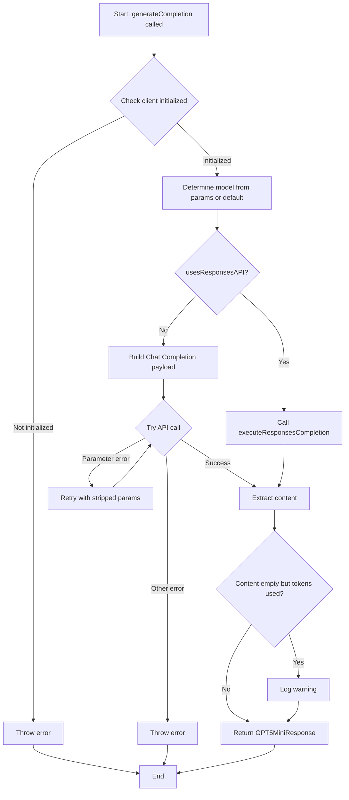
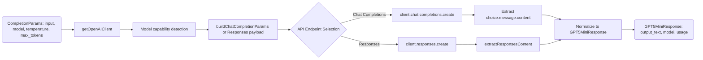

# Module: `openai-client.ts`

## 1. Module Summary

The `openai-client` module provides a configured OpenAI client for GPT-5-Mini (and GPT-4o-mini) integration throughout the daily tasks system. This module handles API key management, timeout configuration, model-specific parameter handling, streaming and non-streaming completions, and comprehensive error handling with automatic retry logic. The module includes sophisticated detection logic for different OpenAI model generations, adapting API parameters based on model capabilities (Responses API vs. Chat Completions API, temperature enforcement, token parameter naming).

## 2. Module Dependencies

* **Internal Dependencies:** None.
* **External Dependencies:**
  * `openai` - Official OpenAI Node.js SDK for API interactions.

## 3. Public API / Exports

* `getOpenAIClient(): OpenAI` - Returns the initialized OpenAI client instance (throws if not initialized).
* `generateCompletion(params: CompletionParams): Promise<GPT5MiniResponse>` - Generates a completion using the specified model with automatic API selection and retry logic.
* `isOpenAIAvailable(): boolean` - Returns `true` if OpenAI client is configured and available.
* `generateCompletionWithFallback<T>(params: CompletionParams, fallbackValue: T, timeoutMs?: number): Promise<GPT5MiniResponse | T>` - Generates completion with timeout and fallback value if API fails or times out.
* `openaiClient: OpenAI | null` - The client instance (exported for advanced use cases).
* `OPENAI_CONSTANTS` - Configuration constants (timeout, maxRetries, defaultModel).
* `GPT5MiniResponse` - TypeScript interface for completion response.
* `CompletionParams` - TypeScript interface for completion request parameters.

## 4. Code File Breakdown

### 4.1. `openai-client.ts`

* **Purpose:** Provides a centralized, configured OpenAI client that handles the complexity of different OpenAI model generations. The module's key innovation is its automatic detection and adaptation logic: it determines whether a model uses the Responses API (`gpt-5`, `o3`, `o4`) or Chat Completions API based on model name, adjusts parameter names (`max_tokens` vs. `max_completion_tokens`), enforces temperature rules (some models require default temperature=1.0), and implements retry logic for unsupported parameter errors. Extensive logging outputs request/response details to terminal in Traditional Chinese for debugging.
* **Functions:**
    * `validateApiKey(): void` - Checks if `OPENAI_API_KEY` environment variable is set. Throws descriptive error with API key URL if missing. Called internally before client usage.
    * `getOpenAIClient(): OpenAI` - Returns the singleton OpenAI client instance. Validates API key and throws if client is not initialized (e.g., called on client-side). Used by all completion functions.
    * `usesResponsesAPI(model: string): boolean` - Returns `true` if model name starts with `gpt-5`, `o4`, or `o3`, indicating it uses the newer Responses API instead of Chat Completions. Determines API endpoint selection.
    * `requiresMaxCompletionTokens(model: string): boolean` - Returns `true` if model uses `max_completion_tokens` parameter instead of `max_tokens` (GPT-5, GPT-4o, GPT-4.1, O3, O4, omni models).
    * `enforcesDefaultTemperature(model: string): boolean` - Returns `true` if model enforces default temperature=1.0 and ignores custom temperature values (GPT-5, GPT-4.1, GPT-4o, O3, O4, omni models).
    * `buildChatCompletionParams(params: CompletionParams, model: string, options?: BuildChatParamsOptions): ChatCompletionCreateParamsNonStreaming` - Constructs Chat Completions API payload with model-specific adaptations. Handles temperature enforcement, token parameter naming, and optional parameter stripping. Returns API-ready payload.
    * `isParameterCompatibilityError(error: unknown): boolean` - Detects if error is due to unsupported parameters (400 status with `unsupported_parameter` or `unsupported_value` code). Triggers retry with stripped parameters.
    * `generateCompletion(params: CompletionParams): Promise<GPT5MiniResponse>` - **Primary completion function**. Determines API endpoint (Responses vs. Chat), builds request payload, executes with retry logic, extracts content from response (handles multiple response formats), logs request/response details in Traditional Chinese, and returns standardized response with `output_text`, `model`, and `usage` fields. Handles `refusal` messages gracefully with default Chinese fallback.
    * `isOpenAIAvailable(): boolean` - Checks if client is initialized and API key is configured. Returns `false` if client is `null` or API key is missing. Used for graceful degradation.
    * `generateCompletionWithFallback<T>(params: CompletionParams, fallbackValue: T, timeoutMs?: number): Promise<GPT5MiniResponse | T>` - Wrapper around `generateCompletion` with timeout and fallback. Uses `Promise.race` to timeout after specified milliseconds (default 10s). Returns fallback value if API unavailable, timeout occurs, or error thrown. Prevents blocking user workflows.
    * `extractResponsesContent(response: any): string` - Extracts text content from Responses API response structure. Handles nested `output` arrays with `content` arrays containing `text` chunks. Joins all text segments with newlines.
    * `normalizeResponsesUsage(usage: any): GPT5MiniResponse['usage'] | undefined` - Converts Responses API usage format (`input_tokens`, `output_tokens`) to standardized Chat Completions format (`prompt_tokens`, `completion_tokens`, `total_tokens`).
* **Key Classes / Constants / Variables:**
    * `OPENAI_CONFIG: const` - Configuration object with `timeout: 10000` ms, `maxRetries: 2`, and `defaultModel` from env var or `'gpt-5-mini'`. Centralized config constants.
    * `openaiClient: OpenAI | null` - Singleton client instance initialized only on server-side (`typeof window === 'undefined'`) with API key present. Remains `null` on client-side or without API key.
    * `OPTIONAL_SAMPLING_KEYS: const` - Array of parameter keys that can be stripped during retry: `['temperature', 'top_p', 'presence_penalty', 'frequency_penalty', 'reasoning_effort', 'verbosity']`. Used for compatibility retry logic.

## 5. System and Data Flow

### 5.1. System Flowchart (Control Flow)



### 5.2. Data Flow Diagram (Data Transformation)



## 6. Usage Example & Testing

* **Usage:**
```typescript
import { generateCompletion, generateCompletionWithFallback, isOpenAIAvailable } from '@/lib/openai-client';

// Basic completion
const response = await generateCompletion({
  input: '評估這段回答的文學素養：...',
  model: 'gpt-5-mini', // Optional, defaults to OPENAI_MODEL env var
  temperature: 0.7,
  max_tokens: 500,
});
console.log(response.output_text); // AI-generated feedback

// With fallback (graceful degradation)
const feedbackOrDefault = await generateCompletionWithFallback(
  { input: 'Grade this answer...', max_tokens: 300 },
  { output_text: '感謝您的作答。', model: 'fallback', usage: undefined },
  8000 // 8 second timeout
);

// Check availability before calling
if (isOpenAIAvailable()) {
  // API is configured, safe to call
}
```
* **Testing:** Tested via `tests/lib/openai-client.test.ts`. Testing strategy:
  - Mock `openai` module to return controlled responses
  - Test `generateCompletion` with various models (gpt-5-mini, gpt-4o-mini, o3-mini)
  - Verify correct API endpoint selection (Chat vs. Responses)
  - Test parameter adaptation (max_tokens vs. max_completion_tokens)
  - Test temperature enforcement for models that require default temperature
  - Test retry logic when unsupported parameter errors occur
  - Test content extraction from different response formats
  - Test fallback behavior when client unavailable or timeout occurs
  - Test refusal handling with default Chinese message
