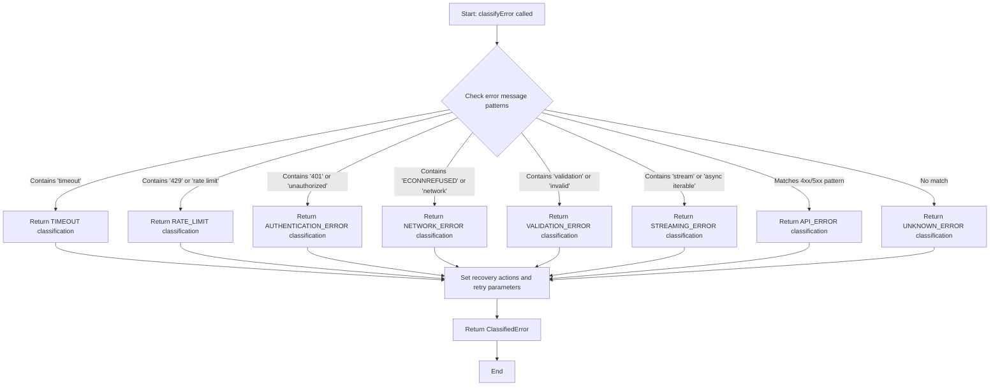
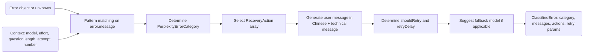

# Module: `perplexity-error-handler.ts`

## 1. Module Summary

The `perplexity-error-handler` module provides a centralized error classification and recovery strategy system for Perplexity API failures. This module analyzes errors (timeout, rate limit, authentication, network, validation, streaming, API, unknown), determines retry strategies, calculates backoff delays, recommends fallback models, and generates user-friendly Traditional Chinese error messages with actionable recovery suggestions. The module implements Phase 3 reliability improvements by transforming technical errors into classified errors with context-aware recovery actions.

## 2. Module Dependencies

* **Internal Dependencies:**
  * `@/ai/perplexity-config` - Type definitions for `PerplexityModelKey` and `ReasoningEffort`.
* **External Dependencies:** None. Pure TypeScript utility module with no external dependencies.

## 3. Public API / Exports

* `PerplexityErrorCategory` - Enum of error categories (TIMEOUT, RATE_LIMIT, API_ERROR, NETWORK_ERROR, AUTHENTICATION_ERROR, VALIDATION_ERROR, STREAMING_ERROR, UNKNOWN_ERROR).
* `RecoveryAction` - Enum of recovery actions (RETRY_SAME_MODEL, RETRY_FALLBACK_MODEL, RETRY_WITH_REDUCED_TIMEOUT, SIMPLIFY_QUESTION, WAIT_AND_RETRY, CHECK_NETWORK, CHECK_API_KEY, CONTACT_SUPPORT, NO_RETRY).
* `ClassifiedError` - Interface for classified error result with category, original error, user message, technical message, recovery actions, retry recommendation, retry delay, fallback model, and context.
* `classifyError(error: Error | unknown, context?: {...}): ClassifiedError` - Main classification function that analyzes error and returns structured classification.
* `formatErrorForUser(classifiedError: ClassifiedError): { title: string; message: string; suggestions: string[] }` - Converts classified error to user-friendly display format.
* `logError(classifiedError: ClassifiedError, additionalContext?: Record<string, any>): void` - Logs error with comprehensive context for debugging.
* `shouldAttemptRetry(classifiedError: ClassifiedError, attemptNumber: number, maxAttempts?: number): boolean` - Determines if retry should be attempted based on error type and attempt count.
* `calculateBackoffDelay(attemptNumber: number, baseDelay?: number): number` - Calculates exponential backoff delay with max 30 seconds.

## 4. Code File Breakdown

### 4.1. `perplexity-error-handler.ts`

* **Purpose:** Centralizes error handling logic to provide consistent, user-friendly error experiences across the Perplexity QA system. The module transforms low-level errors (network failures, HTTP status codes, timeout exceptions) into high-level classified errors with actionable guidance. Key design decision: All user messages are in Traditional Chinese to match the platform's primary language, while technical messages remain in English for developer debugging. Recovery actions are prioritized by likelihood of success and user effort required.
* **Functions:**
    * `classifyError(error: Error | unknown, context?: { modelKey, reasoningEffort, questionLength, attemptNumber }): ClassifiedError` - **Main classification logic**. Analyzes error message and name to determine category. Pattern matching: (1) Timeout - checks for 'timeout', 'ETIMEDOUT', 'exceeded' → suggests retry with reduced timeout or fallback model, 2s delay, fallback to 'sonar-pro'; (2) Rate limit - checks for 'rate limit', '429', 'too many requests' → suggests waiting, 60s delay; (3) Authentication - checks for '401', 'unauthorized', 'API key' → suggests check API key, no retry; (4) Network - checks for 'ECONNREFUSED', 'ENOTFOUND', 'network', 'fetch failed' → suggests check network, retry same model, 3s delay; (5) Validation - checks for 'validation', 'invalid', ValidationError name → suggests simplify question, no retry; (6) Streaming - checks for 'stream', 'async iterable', 'SSE' → suggests retry same model, 1s delay; (7) API errors - regex match for 4xx/5xx status codes → suggests fallback model, 5s delay; (8) Unknown - default fallback with retry recommended. Returns `ClassifiedError` with all fields populated.
    * `formatErrorForUser(classifiedError: ClassifiedError): { title, message, suggestions }` - Converts `ClassifiedError` to user-facing display format. Maps recovery actions to Traditional Chinese bullet points: RETRY_SAME_MODEL → '點擊重試按鈕再次嘗試', RETRY_FALLBACK_MODEL → '嘗試使用較快的模型（Sonar Pro）', WAIT_AND_RETRY → '等待片刻後再試（建議等待 1-2 分鐘）', etc. Generates title based on category (處理超時, 請求限制, 網絡錯誤, 認證失敗, API 錯誤). Returns structured object for UI rendering.
    * `logError(classifiedError: ClassifiedError, additionalContext?: Record<string, any>): void` - Comprehensive error logging for production debugging. Constructs log object with timestamp, category, technical message, retry flags, recovery actions, error stack, and merged context. Logs to console.error (skipped in test environment). In production, this would integrate with logging service (Sentry, CloudWatch, etc.).
    * `shouldAttemptRetry(classifiedError: ClassifiedError, attemptNumber: number, maxAttempts: number = 3): boolean` - Retry decision logic. Returns `false` if: (1) classified error has `shouldRetry: false`, (2) attempt number >= max attempts, (3) category is AUTHENTICATION_ERROR or VALIDATION_ERROR. Otherwise returns `true`. Prevents infinite retry loops and stops retries for non-recoverable errors.
    * `calculateBackoffDelay(attemptNumber: number, baseDelay: number = 1000): number` - Exponential backoff calculation: `baseDelay * 2^attemptNumber`, capped at 30000ms. Example: attempt 0 → 1s, attempt 1 → 2s, attempt 2 → 4s, attempt 3 → 8s, attempt 4 → 16s, attempt 5+ → 30s max. Prevents overwhelming the API during failures.
* **Key Classes / Constants / Variables:**
    * `PerplexityErrorCategory: enum` - 8 error categories for classification: TIMEOUT, RATE_LIMIT, API_ERROR, NETWORK_ERROR, AUTHENTICATION_ERROR, VALIDATION_ERROR, STREAMING_ERROR, UNKNOWN_ERROR.
    * `RecoveryAction: enum` - 9 recovery action types: RETRY_SAME_MODEL, RETRY_FALLBACK_MODEL, RETRY_WITH_REDUCED_TIMEOUT, SIMPLIFY_QUESTION, WAIT_AND_RETRY, CHECK_NETWORK, CHECK_API_KEY, CONTACT_SUPPORT, NO_RETRY.
    * `ClassifiedError: interface` - Comprehensive error structure with 9 fields: category, originalError, userMessage (Traditional Chinese), technicalMessage (English), recoveryActions array, shouldRetry boolean, retryDelay milliseconds, fallbackModel suggestion, context object.

## 5. System and Data Flow

### 5.1. System Flowchart (Control Flow)



### 5.2. Data Flow Diagram (Data Transformation)



## 6. Usage Example & Testing

* **Usage:**
```typescript
import {
  classifyError,
  formatErrorForUser,
  logError,
  shouldAttemptRetry,
  calculateBackoffDelay,
  PerplexityErrorCategory
} from '@/lib/perplexity-error-handler';

try {
  const response = await perplexityClient.completionRequest(input);
} catch (error) {
  const classified = classifyError(error, {
    modelKey: 'sonar-reasoning-pro',
    reasoningEffort: 'high',
    questionLength: input.userQuestion.length,
    attemptNumber: 1,
  });

  // Log for debugging
  logError(classified, { userId: user.uid, questionId: question.id });

  // Format for user display
  const userError = formatErrorForUser(classified);
  showErrorToast({
    title: userError.title, // "處理超時"
    message: userError.message, // "處理您的問題時發生超時..."
    suggestions: userError.suggestions, // ["• 點擊重試按鈕再次嘗試", ...]
  });

  // Decide whether to retry
  if (shouldAttemptRetry(classified, 1, 3)) {
    const delay = calculateBackoffDelay(1, classified.retryDelay);
    await new Promise(resolve => setTimeout(resolve, delay));
    // Retry with fallback model if suggested
    const retryModel = classified.fallbackModel || input.modelKey;
    // ... retry logic
  }
}
```
* **Testing:** Unit tests verify classification logic:
  - Test timeout errors → classified as TIMEOUT with retry recommended
  - Test rate limit errors → classified as RATE_LIMIT with 60s delay
  - Test authentication errors → classified as AUTHENTICATION_ERROR with no retry
  - Test network errors → classified as NETWORK_ERROR with retry
  - Test validation errors → classified as VALIDATION_ERROR with no retry
  - Test streaming errors → classified as STREAMING_ERROR with retry
  - Test API errors (4xx/5xx) → classified as API_ERROR with fallback model
  - Test unknown errors → classified as UNKNOWN_ERROR with retry
  - Test `shouldAttemptRetry` respects max attempts and non-retryable categories
  - Test `calculateBackoffDelay` implements exponential backoff with cap
  - Test `formatErrorForUser` generates Chinese messages and suggestions
