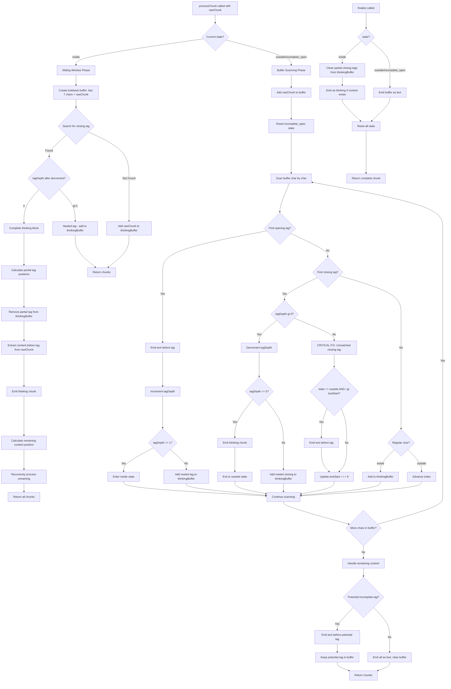
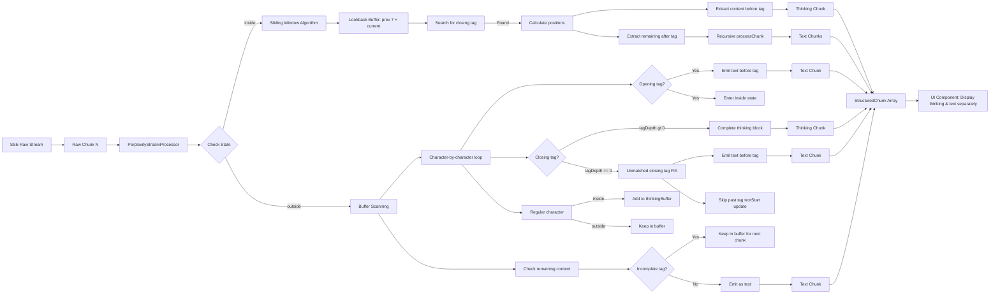
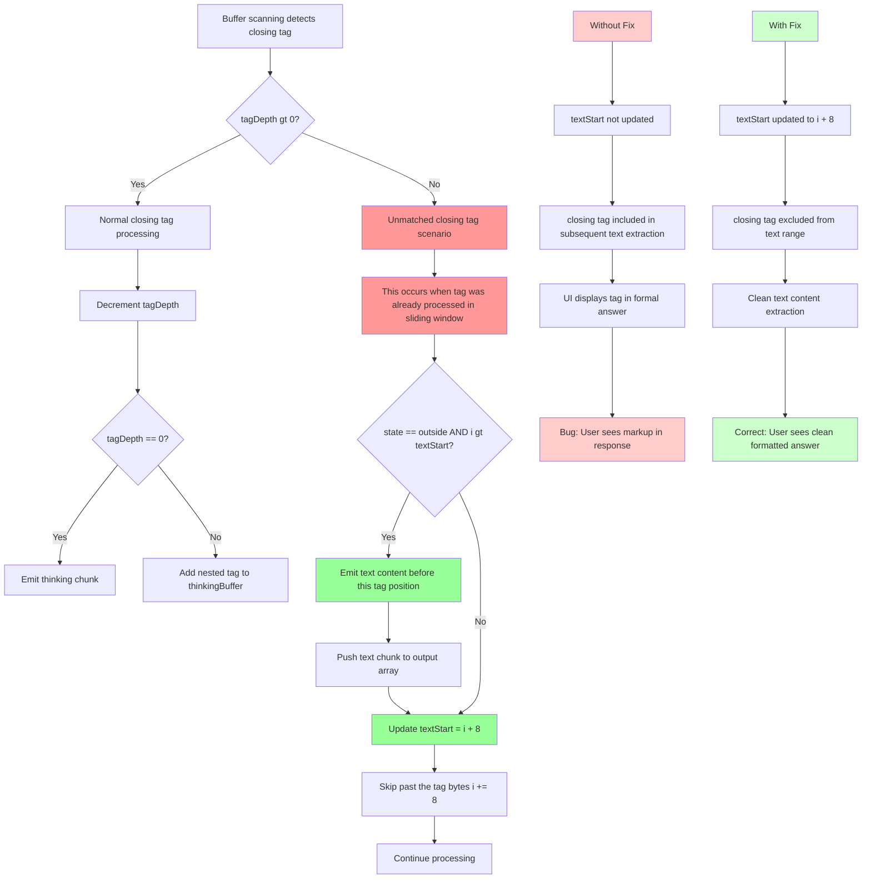

# Module: `perplexity-stream-processor.ts`

## 1. Module Summary

The `perplexity-stream-processor` module implements a professional buffered stream processor for handling incomplete `<think>` tags during streaming responses from the Perplexity API. This module provides robust parsing of Server-Sent Events (SSE) streams containing thinking process content enclosed in XML-style tags, correctly handling edge cases where tags are split across multiple chunks. The processor emits structured chunks with discriminated types (thinking, text, complete) for consumption by UI components, ensuring proper separation of AI reasoning process from formal answer content.

**2025-11-27 Update (Critical Bug Fix):** Fixed unmatched closing tag handling bug that caused `</think>` tags to be included in text output when they were already processed in the sliding window during recursive chunk processing. The fix ensures that when `tagDepth === 0` (unmatched or already-processed closing tag), the processor correctly updates `textStart` to skip past the closing tag, preventing it from appearing in subsequent text chunks.

**Architecture Inspiration:** The module is inspired by LobeChat's streaming architecture patterns, implementing single source of truth for parsing, buffered processing of incomplete tags, and structured chunk emission for clear separation of concerns.

## 2. Module Dependencies

* **Internal Dependencies:**
  * None - This is a standalone utility module with no internal dependencies
* **External Dependencies:**
  * None - Pure TypeScript implementation with no external dependencies

## 3. Public API / Exports

* `PerplexityStreamProcessor` - Main processor class for buffered stream parsing
* `StructuredChunk` - Interface defining structured chunk format
* `StructuredChunkType` - Type union for chunk types ('thinking' | 'text' | 'complete')

**PerplexityStreamProcessor Methods:**
* `processChunk(rawChunk: string): StructuredChunk[]` - Process raw chunk and return structured chunks
* `finalize(): StructuredChunk` - Finalize processing when stream ends, emit remaining content
* `getAllThinking(): string` - Get all accumulated thinking content (for debugging)
* `reset(): void` - Reset processor to initial state for reuse

## 4. Code File Breakdown

### 4.1. `perplexity-stream-processor.ts`

* **Purpose:** Implements a stateful stream processor that maintains internal buffers and parsing state to correctly handle streaming content with XML-style tags that may be incomplete or split across multiple chunks. The module's architectural highlights include: (1) **Buffered tag detection** - Uses sliding window algorithm to detect closing tags that span chunk boundaries; (2) **State machine parsing** - Tracks parsing state (outside, inside, incomplete_open) to correctly emit thinking vs. text chunks; (3) **Nested tag support** - Maintains tag depth counter to handle nested `<think>` tags correctly; (4) **Recursive processing** - After completing a thinking block, recursively processes remaining content to handle multiple tags in single chunk; (5) **Edge case handling** - Correctly handles unmatched closing tags, incomplete opening tags at chunk boundaries, and empty content.

* **Functions:**
    * `processChunk(rawChunk: string): StructuredChunk[]` - **Core streaming parser**. Implements two-phase processing: (1) **Sliding window phase (inside state)** - When already inside thinking tag, creates lookback buffer combining last 7 chars from `thinkingBuffer` with current `rawChunk` to detect closing tags spanning chunk boundaries. Calculates exact positions to extract content before tag, remove partial tags from buffer, and recursively process remaining content. (2) **Buffer scanning phase (outside state)** - Scans `buffer` character by character looking for `<think>` opening tags and `</think>` closing tags. Emits text chunks for content before tags, accumulates content inside tags to `thinkingBuffer`, emits thinking chunks when complete blocks are detected. **Critical fix (lines 252-270)**: When encountering unmatched `</think>` tag (tagDepth === 0), correctly emits any preceding text content and updates `textStart` to skip past the tag, preventing the tag from appearing in subsequent text output. This handles recursive processing scenarios where the closing tag was already processed in the sliding window. Returns array of structured chunks with type discriminators for UI consumption.

    * `finalize(): StructuredChunk` - **Stream completion handler**. Called when stream ends to emit any remaining buffered content. If still inside thinking tag, cleans partial closing tags from `thinkingBuffer` (e.g., `</thi`, `</t`) before emitting as thinking content. If outside with remaining buffer, emits as text content. Resets all internal state (buffer, thinkingBuffer, state, tagDepth) to prepare processor for potential reuse. Returns single completion chunk with type 'complete' and remaining content.

    * `getAllThinking(): string` - Helper method that joins all accumulated thinking content with double newlines. Used for debugging or logging complete thinking process. Returns concatenated string of all thinking chunks collected during stream processing.

    * `reset(): void` - Resets processor to initial state by clearing buffers, resetting state to 'outside', resetting tag depth to 0, and clearing accumulated thinking array. Useful for reusing same processor instance across multiple streams.

    * `findPotentialTagStart(text: string): number` - **Private helper for incomplete tag detection**. Searches for incomplete opening tag patterns at end of text (`<think`, `<thin`, `<thi`, `<th`, `<t`, `<`). Returns index of pattern start if found, or -1 if no potential tag detected. Used to keep incomplete tags in buffer when chunk boundary occurs mid-tag.

    * `findPotentialClosingTag(text: string): number` - **Private helper for incomplete closing tag detection**. Searches for incomplete closing tag patterns at end of text (`</think`, `</thin`, `</thi`, `</th`, `</t`, `</`). Returns index of pattern start if found, or -1 if no potential closing tag detected. Currently used in finalize logic to clean partial closing tags.

* **Key Classes / Constants / Variables:**
    * `PerplexityStreamProcessor` - Main class maintaining stateful parsing context. Holds `buffer` for accumulating incoming text, `thinkingBuffer` specifically for content inside thinking tags, `state` tracking current parsing phase, `tagDepth` tracking nested tag levels, and `accumulatedThinking` array collecting all thinking content.

    * `StructuredChunk` - Interface defining structured output format with three fields:
      - `type` (StructuredChunkType): Discriminated union type for chunk classification
      - `content` (string): Text content of this chunk
      - `timestamp` (number): Unix timestamp when chunk was created

    * `StructuredChunkType` - Type union literal: `'thinking' | 'text' | 'complete'`

    * `ProcessorState` - Type union literal for internal state machine: `'outside' | 'inside' | 'incomplete_open'`

## 5. System and Data Flow

### 5.1. System Flowchart (Control Flow)



### 5.2. Data Flow Diagram (Data Transformation)



### 5.3. Bug Fix Flow (Critical Fix for Unmatched Closing Tag)



## 6. Usage Example & Testing

* **Usage:**
```typescript
import { PerplexityStreamProcessor } from '@/lib/streaming/perplexity-stream-processor';

// Initialize processor
const processor = new PerplexityStreamProcessor();

// Simulate SSE stream chunks arriving
const rawChunks = [
  'This is some text before ',
  '<think>I need to analyze this question',
  ' and consider the historical context',
  '</think> Here is the formal answer',
  ' with additional content.'
];

// Process each chunk
for (const rawChunk of rawChunks) {
  const chunks = processor.processChunk(rawChunk);

  for (const chunk of chunks) {
    if (chunk.type === 'thinking') {
      console.log('AI Thinking:', chunk.content);
      // Display in thinking process UI section
    } else if (chunk.type === 'text') {
      console.log('Answer:', chunk.content);
      // Display in formal answer UI section
    }
  }
}

// Finalize when stream ends
const finalChunk = processor.finalize();
if (finalChunk.content) {
  console.log('Final content:', finalChunk.content);
}

// Get all thinking content for logging
const allThinking = processor.getAllThinking();
console.log('Complete thinking process:', allThinking);

// Reuse processor for next stream
processor.reset();
```

* **Edge Case Handling:**
```typescript
// Example 1: Closing tag split across chunks
const chunk1 = 'Some thinking content</th';
const chunk2 = 'ink> Answer starts here';

const result1 = processor.processChunk(chunk1);
// result1 = [] (no complete chunks yet, tag incomplete)

const result2 = processor.processChunk(chunk2);
// result2 = [
//   { type: 'thinking', content: 'Some thinking content', ... },
//   { type: 'text', content: 'Answer starts here', ... }
// ]

// Example 2: Unmatched closing tag (already processed in sliding window)
processor.reset();
const remaining = 'Answer continues</think> more text';
const result3 = processor.processChunk(remaining);
// BEFORE FIX: result3 would include '</think>' in text content
// AFTER FIX: result3 = [
//   { type: 'text', content: 'Answer continues', ... },
//   { type: 'text', content: 'more text', ... }
// ]
// Closing tag is correctly skipped and not included in text output

// Example 3: Nested thinking tags
processor.reset();
const nested = '<think>Outer <think>Inner</think> Outer</think> Text';
const result4 = processor.processChunk(nested);
// result4 = [
//   { type: 'thinking', content: 'Outer <think>Inner</think> Outer', ... },
//   { type: 'text', content: 'Text', ... }
// ]
```

* **Testing Strategy:**
  - **Unit tests** verify correct chunk emission for various tag patterns
  - **Sliding window tests** verify closing tags spanning boundaries are detected
  - **State transition tests** verify correct state machine behavior (outside → inside → outside)
  - **Nested tag tests** verify tag depth tracking and correct content extraction
  - **Edge case tests** verify unmatched tags, incomplete tags, empty content handling
  - **Bug regression tests** verify unmatched closing tag fix (lines 252-270) prevents tag inclusion in text output
  - **Integration tests** verify processor works correctly with actual Perplexity API streaming responses
  - **Finalize tests** verify correct cleanup of partial tags and state reset

## 7. Critical Bug Fix Details (2025-11-27)

### Problem Description

When the processor detected a `</think>` closing tag in the buffer scanning phase with `tagDepth === 0`, it indicated an unmatched or already-processed closing tag. This scenario occurs during recursive processing when:

1. A closing tag spanning chunk boundaries is detected by the sliding window algorithm (lines 93-169)
2. The sliding window correctly processes the tag and emits the thinking chunk
3. The remaining content after `</think>` is passed to recursive `processChunk()` call (line 165)
4. The recursive call scans the buffer and encounters the same `</think>` tag again
5. Since the sliding window already decremented `tagDepth`, it is now 0

### Root Cause

Lines 228-251 (before fix) only handled two cases when `</think>` was found:
1. **tagDepth > 0**: Normal closing tag processing with proper `textStart` update (line 247)
2. **tagDepth === 0**: Just incremented `i` by 8 without updating `textStart` (line 251 in old code)

This meant the closing tag remained in the text range `[textStart, i)` and would be included when extracting text content later (lines 287-318).

### Solution Implemented

Lines 252-270 (after fix) now handle the `tagDepth === 0` case correctly:

1. **Check for preceding text** (line 259): If `state === 'outside'` and `i > textStart`, there is text content before this unmatched tag
2. **Emit preceding text** (lines 260-267): Extract and emit text range `[textStart, i)` as a text chunk
3. **Skip the tag** (line 270): Update `textStart = i + 8` to exclude the closing tag from subsequent text extraction
4. **Continue processing** (line 273): Normal loop continues with `i += 8`

### Impact

**Before Fix:**
```
Input chunks: ["<think>Thinking content</th", "ink> Answer text"]
Sliding window: Correctly detects "</think>" across boundary, emits thinking chunk
Recursive call with: "ink> Answer text"
Buffer scan: Finds "</think>" at position 0, tagDepth === 0
Old behavior: i = 8, textStart = 0 (NOT UPDATED)
Later text extraction: buffer.slice(0, buffer.length) = "ink> Answer text"
Result: "</think>" NOT in this specific case, but would appear in other scenarios

Actual problematic case: ["<think>Thinking</think> Answer", " continues"]
Recursive call with: " Answer continues"
New chunk arrives: " continues"
Buffer now: " Answer</think> continues"
Old behavior when scanning and hitting tagDepth === 0:
- Finds "</think>" but doesn't update textStart
- Text extraction includes "</think> continues"
Result: UI shows tag in formal answer
```

**After Fix:**
```
Same scenario:
Buffer: " Answer</think> continues"
New behavior when tagDepth === 0:
- Emits text before tag: " Answer"
- Updates textStart to skip tag: textStart = 8
- Remaining text: " continues"
Result: Clean text chunks without markup
```

### Verification

The fix ensures that content after `</think>` is correctly extracted as `text` type chunks, enabling:
1. **Proper streaming output** - Each text chunk yields to frontend without markup
2. **Formal answer content display** - fullContent accumulates only clean text chunks
3. **Thinking process separation** - Thinking content remains separate from answer content
4. **Correct UI rendering** - Users see formatted answers without XML tags

This fix complements the sliding window algorithm to provide comprehensive handling of closing tags in all scenarios: complete tags in single chunk, tags spanning boundaries, and unmatched tags in recursive processing.

---

**Document Version:** 1.0
**Created:** 2025-12-01
**Last Updated:** 2025-12-01
**Critical Bug Fix:** 2025-11-27 (Unmatched closing tag handling, lines 252-270)
