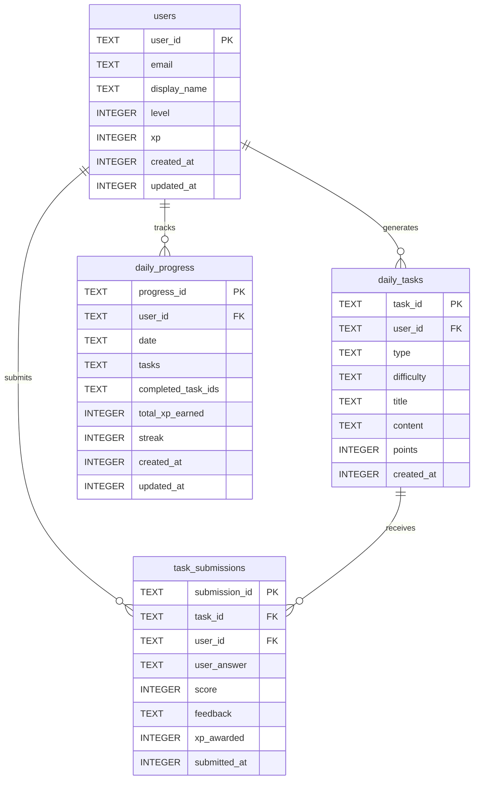
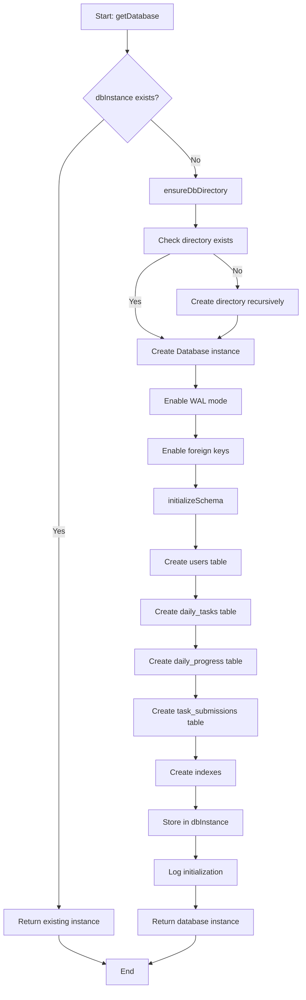

# Module: `sqlite-db.ts`

## 1. Module Summary

The `sqlite-db` module provides SQLite database initialization, schema creation, and connection management for local data storage, replacing Firebase Firestore for the daily task system. This module handles automatic database directory creation, comprehensive schema setup with 4 tables (users, daily_tasks, daily_progress, task_submissions), transaction support, and Firebase Timestamp compatibility functions for seamless migration from Firebase. The module ensures data persistence in a local SQLite database (`data/local-db/redmansion.db`) and provides type-safe database operations through better-sqlite3.

## 2. Module Dependencies

* **Internal Dependencies:**
  * None (foundational database layer)
* **External Dependencies:**
  * `better-sqlite3` - High-performance synchronous SQLite3 bindings for Node.js
  * `path` - Node.js path utilities for database file location
  * `fs` - Node.js file system for directory creation

## 3. Public API / Exports

* **Function Exports:**
  * `getDatabase(): Database.Database` - Get or create singleton database instance
  * `closeDatabase(): void` - Close database connection and clear singleton
  * `transaction<T>(fn: (db: Database.Database) => T): T` - Execute operations in transaction
  * `toUnixTimestamp(timestamp?: { seconds?: number; toMillis?: () => number }): number` - Convert Firebase Timestamp to Unix milliseconds
  * `fromUnixTimestamp(unixMs: number): { seconds: number; nanoseconds: number; toMillis: () => number }` - Convert Unix milliseconds to Firebase Timestamp format
  * `clearDatabase(): Promise<void>` - Clear all data from database (testing only)
* **Constant Exports:**
  * `SQLITE_CONFIG: { dbPath: string; verbose: boolean }` - Database configuration object

## 4. Code File Breakdown

### 4.1. `sqlite-db.ts`

* **Purpose:** Provides comprehensive SQLite database management for local data persistence, implementing singleton pattern for connection management, automatic schema creation with proper indexes, and Firebase compatibility layer for seamless migration from Firestore.

* **Functions:**
    * `ensureDbDirectory(): void` - **Directory creation helper**. Extracts directory path from `DB_CONFIG.dbPath`. Checks if directory exists using `fs.existsSync`. Creates directory recursively with `fs.mkdirSync({ recursive: true })` if missing. Logs success message with green checkmark emoji. Ensures database file parent directory exists before initialization.

    * `initializeSchema(db: Database.Database): void` - **Schema initialization**. Logs initialization message. **Creates users table** with columns: user_id (TEXT PRIMARY KEY), email (TEXT), display_name (TEXT), level (INTEGER DEFAULT 0), xp (INTEGER DEFAULT 0), created_at (INTEGER), updated_at (INTEGER). **Creates daily_tasks table** with columns: task_id (TEXT PRIMARY KEY), user_id (TEXT), type (TEXT), difficulty (TEXT), title (TEXT), content (TEXT), points (INTEGER), created_at (INTEGER). **Creates daily_progress table** with columns: progress_id (TEXT PRIMARY KEY format: userId_date), user_id (TEXT), date (TEXT format: YYYY-MM-DD), tasks (TEXT JSON array), completed_task_ids (TEXT JSON array), total_xp_earned (INTEGER), streak (INTEGER), created_at (INTEGER), updated_at (INTEGER). **Creates task_submissions table** with columns: submission_id (TEXT PRIMARY KEY), task_id (TEXT), user_id (TEXT), user_answer (TEXT), score (INTEGER), feedback (TEXT), xp_awarded (INTEGER), submitted_at (INTEGER). **Creates indexes**: idx_tasks_user_id, idx_progress_user_id, idx_progress_date, idx_submissions_task_id, idx_submissions_user_id. Logs completion message with database emoji.

    * `getDatabase(): Database.Database` - **Singleton database accessor**. Returns existing `dbInstance` if already initialized. Calls `ensureDbDirectory()` to create database directory. Creates new Database instance from `better-sqlite3` with `DB_CONFIG.dbPath`. Enables WAL mode with `PRAGMA journal_mode = WAL` for better concurrency. Enables foreign keys with `PRAGMA foreign_keys = ON`. Calls `initializeSchema()` to create tables. Stores instance in `dbInstance` variable. Logs initialization message. Returns database instance. Primary entry point for database access.

    * `closeDatabase(): void` - **Connection cleanup**. Checks if `dbInstance` exists. Calls `dbInstance.close()` to close connection. Sets `dbInstance` to null. Logs closure message. Used for testing cleanup and graceful shutdown.

    * `transaction<T>(fn: (db: Database.Database) => T): T` - **Transaction wrapper**. Gets database instance via `getDatabase()`. Wraps `db.transaction()` from better-sqlite3. Executes provided function within transaction. Returns result of type T. Provides atomic operations for multiple database changes.

    * `toUnixTimestamp(timestamp?: { seconds?: number; toMillis?: () => number }): number` - **Firebase to Unix converter**. Returns current timestamp if parameter undefined. Checks if timestamp has `toMillis()` method (Firebase Timestamp). Returns `timestamp.toMillis()` if method exists. Falls back to `timestamp.seconds * 1000` if only seconds property. Converts Firebase Timestamp objects to Unix milliseconds for SQLite storage.

    * `fromUnixTimestamp(unixMs: number): { seconds: number; nanoseconds: number; toMillis: () => number }` - **Unix to Firebase converter**. Calculates seconds from milliseconds with `Math.floor(unixMs / 1000)`. Calculates nanoseconds from remainder with `(unixMs % 1000) * 1000000`. Returns object with seconds, nanoseconds, and `toMillis()` method. Implements Firebase Timestamp-compatible interface. Allows seamless migration from Firebase to SQLite by maintaining same data structures.

    * `clearDatabase(): Promise<void>` - **Test cleanup utility**. Gets database instance. Deletes all records from task_submissions table. Deletes all records from daily_progress table. Deletes all records from daily_tasks table. Deletes all records from users table. Logs cleanup message with test tube emoji. **WARNING: Only for testing** - destroys all data.

* **Key Classes / Constants / Variables:**
    * `DB_CONFIG: const` - Configuration object with `dbPath: path.join(process.cwd(), 'data', 'local-db', 'redmansion.db')` and `verbose: process.env.NODE_ENV === 'development'`. Defines database file location and debug mode.
    * `dbInstance: Database.Database | null` - Singleton database instance. Starts as null, initialized on first `getDatabase()` call.
    * `Database` - Type from better-sqlite3 for database instance.

## 5. System and Data Flow

### 5.1. Database Schema Diagram



### 5.2. Database Initialization Flow



## 6. Usage Example & Testing

* **Usage:**
```typescript
import { getDatabase, closeDatabase, transaction, toUnixTimestamp, fromUnixTimestamp } from '@/lib/sqlite-db';

// Get database instance (singleton)
const db = getDatabase();
console.log('Database initialized');

// Execute raw SQL query
const users = db.prepare('SELECT * FROM users WHERE level >= ?').all(5);
console.log(`Found ${users.length} users at level 5 or higher`);

// Use transaction for atomic operations
transaction((db) => {
  const insertUser = db.prepare(`
    INSERT INTO users (user_id, email, display_name, level, xp, created_at, updated_at)
    VALUES (?, ?, ?, ?, ?, ?, ?)
  `);

  const updateProgress = db.prepare(`
    UPDATE daily_progress
    SET total_xp_earned = total_xp_earned + ?, updated_at = ?
    WHERE progress_id = ?
  `);

  insertUser.run('user123', 'test@example.com', 'Test User', 1, 100, Date.now(), Date.now());
  updateProgress.run(50, Date.now(), 'user123_2025-01-28');
});
console.log('Transaction completed atomically');

// Convert Firebase Timestamp to Unix milliseconds
const firebaseTimestamp = {
  seconds: 1738022400,
  nanoseconds: 123456789,
  toMillis: function() { return this.seconds * 1000 + Math.floor(this.nanoseconds / 1000000); }
};
const unixMs = toUnixTimestamp(firebaseTimestamp);
console.log('Unix timestamp:', unixMs); // 1738022400123

// Convert Unix milliseconds back to Firebase Timestamp format
const timestamp = fromUnixTimestamp(unixMs);
console.log('Seconds:', timestamp.seconds); // 1738022400
console.log('Nanoseconds:', timestamp.nanoseconds); // 123000000
console.log('Millis:', timestamp.toMillis()); // 1738022400123

// Close database connection (cleanup)
closeDatabase();
console.log('Database closed');

// Testing: Clear all data
import { clearDatabase } from '@/lib/sqlite-db';
await clearDatabase();
console.log('All data cleared for fresh test');
```

* **Testing:** Testing focuses on database initialization, schema creation, and Firebase compatibility:
  - Test `getDatabase` creates database file in correct location
  - Test `getDatabase` returns same instance on multiple calls (singleton)
  - Test `initializeSchema` creates all 4 tables (users, daily_tasks, daily_progress, task_submissions)
  - Test `initializeSchema` creates all indexes (5 indexes for query optimization)
  - Test `ensureDbDirectory` creates directory if missing
  - Test `ensureDbDirectory` handles existing directory gracefully
  - Test `transaction` executes operations atomically
  - Test `transaction` rolls back on error
  - Test `toUnixTimestamp` converts Firebase Timestamp with toMillis() method
  - Test `toUnixTimestamp` converts Firebase Timestamp with seconds property only
  - Test `toUnixTimestamp` returns current timestamp when parameter undefined
  - Test `fromUnixTimestamp` creates Firebase Timestamp-compatible object
  - Test `fromUnixTimestamp` toMillis() method returns correct value
  - Test `closeDatabase` closes connection and clears singleton
  - Test `clearDatabase` deletes all records from all tables
  - Test database survives process restart (data persistence)
  - Test WAL mode enables concurrent reads during write
  - Test foreign key constraints are enforced
