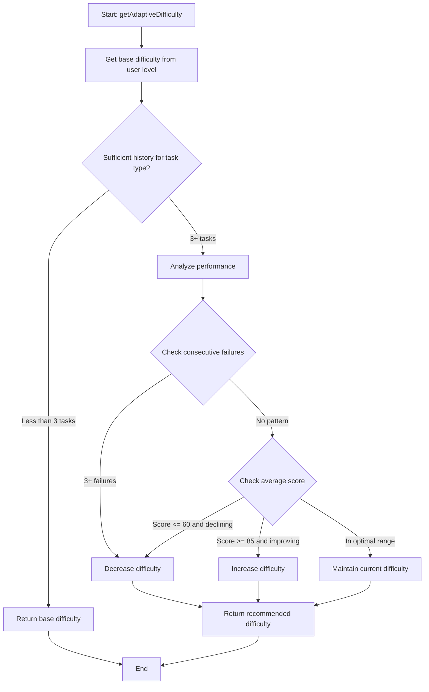
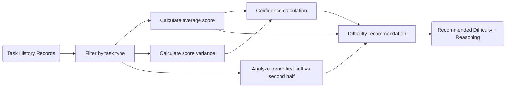

# Module: `task-difficulty-adapter.ts`

## 1. Module Summary

The `task-difficulty-adapter` module implements intelligent adaptive learning for the daily task system, dynamically adjusting task difficulty based on user performance history. This module analyzes completion patterns per task type, calculates confidence levels using score variance, detects performance trends (improving/stable/declining), and recommends difficulty changes with anti-frustration safeguards (max 1-level jump, consecutive failure detection). The adapter optimizes learning by keeping users in the "flow zone" - challenging enough to engage but not so hard as to frustrate - implementing the Zone of Proximal Development pedagogical principle.

## 2. Module Dependencies

* **Internal Dependencies:**
  * `@/lib/types/daily-task` - Type definitions for task types, difficulty levels, and history records.
* **External Dependencies:** None. Pure TypeScript logic module.

## 3. Public API / Exports

* `TaskDifficultyAdapter` - Main adapter class with performance analysis methods.
* `taskDifficultyAdapter: TaskDifficultyAdapter` - Singleton instance exported for global use.
* **Type Exports:**
  * `TaskTypePerformance` - Performance metrics for a specific task type.
  * `DifficultyRecommendation` - Detailed recommendation result with reasoning.
* **TaskDifficultyAdapter Methods:**
  * `analyzePerformance(taskType, history, currentDifficulty): TaskTypePerformance` - Analyzes user performance for task type.
  * `getDifficultyRecommendation(taskType, history, currentDifficulty): DifficultyRecommendation` - Gets detailed recommendation with reasoning.
  * `getAdaptiveDifficulty(userLevel, taskType, history): TaskDifficulty` - Gets recommended difficulty for next task.
  * `getAllTaskTypesPerformance(history, currentLevel): Record<DailyTaskType, TaskTypePerformance>` - Analyzes all task types.
  * `getOverallProgress(history, statistics): { overallConfidence, strongestTaskType, weakestTaskType, overallTrend, recommendedFocus }` - Comprehensive progress summary.

## 4. Code File Breakdown

### 4.1. `task-difficulty-adapter.ts`

* **Purpose:** Provides personalized difficulty adaptation to maximize learning effectiveness and engagement. The module's design implements evidence-based adaptive learning principles: (1) **Optimal challenge level** - Keeps users in flow zone where tasks are neither too easy (boring) nor too hard (frustrating); (2) **Performance-based progression** - Increases difficulty when avg score > 85, decreases when < 60; (3) **Trend-aware adjustments** - Considers whether user is improving/stable/declining, preventing premature difficulty increases during declining trends; (4) **Confidence calculation** - Combines average score (70% weight) with consistency (30% weight), rewarding both high performance and stable performance; (5) **Anti-frustration safeguards** - Auto-decreases difficulty after 3 consecutive failures, limits changes to 1 level at a time; (6) **Per-task-type tracking** - Different task types are tracked independently, recognizing that users may excel at poetry but struggle with cultural exploration.
* **Functions:**
    * `analyzePerformance(taskType, history, currentDifficulty): TaskTypePerformance` - Filters history for specific task type. Returns defaults if no history (averageScore=0, completedCount=0, confidenceLevel=0, trend='stable'). Calculates average score across filtered history. Calls `calculateConfidenceLevel` with filtered history. Calls `analyzeTrend` to determine improving/stable/declining. Calls `recommendDifficulty` to get recommended difficulty. Returns comprehensive performance object.
    * `getDifficultyRecommendation(taskType, history, currentDifficulty): DifficultyRecommendation` - Gets performance analysis via `analyzePerformance`. Determines shouldIncrease and shouldDecrease flags via helper methods. Generates Traditional Chinese reason text via `generateRecommendationReason`. Generates performance summary text via `generatePerformanceSummary`. Returns detailed recommendation object with reasoning.
    * `getAdaptiveDifficulty(userLevel, taskType, history): TaskDifficulty` - Gets base difficulty from user level (level 0-2=EASY, 3-5=MEDIUM, 6-7=HARD). Filters history for task type. Returns base difficulty if < 3 tasks (insufficient data for adaptation). Otherwise analyzes performance and returns recommended difficulty. Entry point for task generation system.
    * `calculateConfidenceLevel(history): number` - Calculates average score. Calculates score variance and standard deviation. Converts std dev to consistency score (100 - stdDev, capped at 0-100). Computes weighted confidence: 70% average score + 30% consistency. Returns rounded confidence 0-100. Higher confidence = high scores with low variance.
    * `analyzeTrend(history): 'improving' | 'stable' | 'declining'` - Returns 'stable' if < 3 tasks. Takes up to 5 most recent tasks. Splits into first half and second half. Calculates average score for each half. Compares: improvement > 10 → 'improving', < -10 → 'declining', otherwise 'stable'. Detects momentum in user performance.
    * `recommendDifficulty(taskType, history, currentDifficulty, averageScore, trend): TaskDifficulty` - Checks for consecutive failures (3+ scores < 60) → auto-decrease difficulty (anti-frustration). If avgScore >= 85 and trend != declining → increase difficulty (too easy). If avgScore <= 60 and trend != improving → decrease difficulty (too hard). If in optimal range [65-80] → maintain current difficulty. Returns recommended difficulty with safeguards.
    * `hasConsecutiveFailures(history): boolean` - Takes last 3 tasks. Returns true if all have score < 60. Triggers auto-decrease to prevent user frustration.
    * `increaseDifficulty(current): TaskDifficulty` - EASY → MEDIUM, MEDIUM → HARD, HARD → HARD (cap). Single-level increase only (MAX_DIFFICULTY_JUMP=1).
    * `decreaseDifficulty(current): TaskDifficulty` - HARD → MEDIUM, MEDIUM → EASY, EASY → EASY (floor). Single-level decrease only.
    * `getBaseDifficultyFromLevel(userLevel): TaskDifficulty` - Level 6-7 → HARD, 3-5 → MEDIUM, 0-2 → EASY. Starting point before adaptation.
    * `shouldIncreaseDifficulty(performance): boolean` - Checks: avgScore >= 85, trend != declining, not already at HARD, completedCount >= 3. All conditions must be true.
    * `shouldDecreaseDifficulty(performance): boolean` - Checks: (avgScore <= 60 and trend != improving) OR (not at EASY and completedCount >= 3). Allows decrease even with adequate scores if user is declining.
    * `generateRecommendationReason(performance, shouldIncrease, shouldDecrease): string` - Returns Traditional Chinese reason text. Examples: "需要完成至少 3 個任務才能進行難度調整。", "您的表現優異（平均分數 87.5），建議提升難度以保持挑戰性。", "您的分數偏低（平均分數 55.2），建議降低難度以提升學習體驗。".
    * `generatePerformanceSummary(performance): string` - Returns Traditional Chinese summary with emojis. Example: "已完成 5 次，平均分數 75.3，信心指數 72%，趨勢：進步中 📈".
    * `getAllTaskTypesPerformance(history, currentLevel): Record<DailyTaskType, TaskTypePerformance>` - Iterates all task types. Analyzes performance for each. Returns complete performance map. Used for dashboard analytics.
    * `getOverallProgress(history, statistics): {...}` - Calculates overall confidence from average score. Finds strongest and weakest task types by score. Analyzes overall trend across all tasks. Identifies recommended focus areas (task types with avg < 70). Returns comprehensive progress summary for user dashboard.
* **Key Classes / Constants / Variables:**
    * `DIFFICULTY_ADAPTATION_CONFIG: const` - Configuration object with thresholds: INCREASE_THRESHOLD=85, DECREASE_THRESHOLD=60, STABLE_RANGE=[65,80], MIN_TASKS_FOR_ADAPTATION=3, CONFIDENCE_SCORE_WEIGHT=0.7, CONFIDENCE_CONSISTENCY_WEIGHT=0.3, RECENT_TASKS_WINDOW=5, MAX_DIFFICULTY_JUMP=1, CONSECUTIVE_FAILURES_THRESHOLD=3.
    * `TaskTypePerformance: interface` - Performance metrics with 7 fields: taskType, averageScore, completedCount, currentDifficulty, recommendedDifficulty, confidenceLevel (0-100), trendDirection.
    * `DifficultyRecommendation: interface` - Recommendation result with 6 fields: recommended difficulty, reason (Traditional Chinese), confidenceLevel, shouldIncrease boolean, shouldDecrease boolean, performanceSummary (Traditional Chinese with emojis).

## 5. System and Data Flow

### 5.1. System Flowchart (Control Flow)



### 5.2. Data Flow Diagram (Data Transformation)



## 6. Usage Example & Testing

* **Usage:**
```typescript
import { taskDifficultyAdapter } from '@/lib/task-difficulty-adapter';
import { DailyTaskType, TaskDifficulty } from './types/daily-task';

// Get adaptive difficulty for next task
const nextDifficulty = taskDifficultyAdapter.getAdaptiveDifficulty(
  5, // user level
  DailyTaskType.MORNING_READING,
  taskHistory // user's completion history
);

// Get detailed recommendation with reasoning
const recommendation = taskDifficultyAdapter.getDifficultyRecommendation(
  DailyTaskType.CHARACTER_INSIGHT,
  taskHistory,
  TaskDifficulty.MEDIUM
);

console.log(recommendation.reason); // "您的表現優異（平均分數 87.5），建議提升難度以保持挑戰性。"
console.log(recommendation.performanceSummary); // "已完成 8 次，平均分數 87.5，信心指數 85%，趨勢：進步中 📈"

if (recommendation.shouldIncrease) {
  console.log('Increase difficulty to:', recommendation.recommended);
}

// Analyze all task types for dashboard
const allPerformance = taskDifficultyAdapter.getAllTaskTypesPerformance(
  taskHistory,
  userLevel
);

console.log('Poetry performance:', allPerformance[DailyTaskType.POETRY]);
// { taskType: 'poetry', averageScore: 82.5, completedCount: 10, confidenceLevel: 78, ... }

// Get overall learning progress
const progress = taskDifficultyAdapter.getOverallProgress(
  taskHistory,
  taskStatistics
);

console.log('Overall confidence:', progress.overallConfidence); // 75%
console.log('Strongest:', progress.strongestTaskType); // 'poetry'
console.log('Weakest:', progress.weakestTaskType); // 'cultural-exploration'
console.log('Focus on:', progress.recommendedFocus); // ['cultural-exploration', 'commentary']
```
* **Testing:** Testing strategy focuses on adaptation logic:
  - Test insufficient history (< 3 tasks) returns base difficulty
  - Test high average score (> 85) with improving trend increases difficulty
  - Test low average score (< 60) with declining trend decreases difficulty
  - Test consecutive failures (3 scores < 60) triggers auto-decrease
  - Test optimal range [65-80] maintains current difficulty
  - Test confidence calculation with high variance lowers confidence
  - Test trend detection: improving vs declining vs stable
  - Test difficulty cannot increase beyond HARD
  - Test difficulty cannot decrease below EASY
  - Test per-task-type independence (poetry difficulty independent of reading difficulty)
  - Test recommendation reason generation in Traditional Chinese
  - Test performance summary includes emoji indicators
  - Test overall progress identifies strongest and weakest areas

