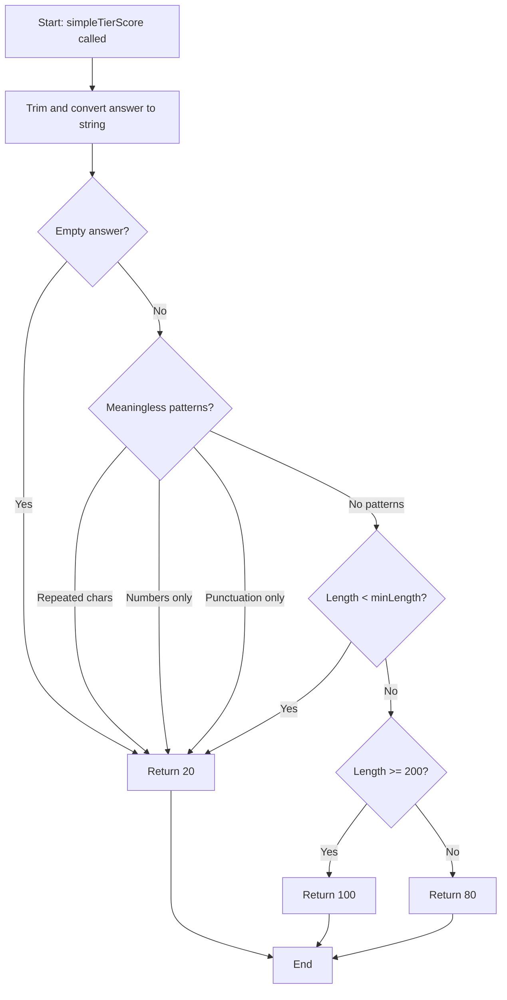
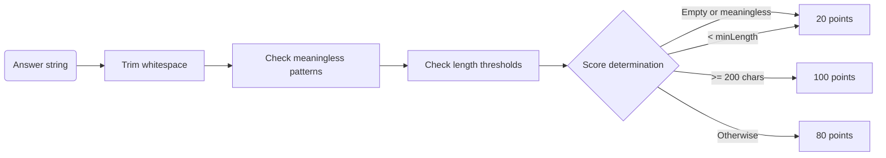

# Module: `task-evaluator.ts`

## 1. Module Summary

The `task-evaluator` module provides simple three-tier scoring (20/80/100) for LLM-only mode task evaluation without AI dependencies. This module implements fallback scoring logic that evaluates user answers based on length and basic quality heuristics (meaningless patterns, repeated characters, numbers-only, punctuation-only), enabling task grading when AI services are unavailable. The evaluator supports minimum length thresholds and provides consistent, deterministic scoring for testing and offline scenarios.

## 2. Module Dependencies

* **Internal Dependencies:** None. This is a pure utility module with zero dependencies.
* **External Dependencies:** None. Uses only JavaScript string operations and regex.

## 3. Public API / Exports

* `simpleTierScore(answer: string, minLength?: number): number` - Evaluates answer and returns 20 (poor), 80 (good), or 100 (excellent).

## 4. Code File Breakdown

### 4.1. `task-evaluator.ts`

* **Purpose:** Provides deterministic, lightweight scoring for task answers when sophisticated AI evaluation is unavailable. The module's design philosophy is simplicity: instead of complex rubrics or NLP analysis, it uses three basic quality indicators (length, meaningfulness, minimum threshold) to categorize answers into three discrete score buckets. This approach trades grading nuance for reliability and speed, making it ideal for: (1) **LLM-only mode** - When Firebase/AI services are disabled for development/testing; (2) **Fallback scenarios** - When AI grading services timeout or fail; (3) **Integration tests** - Deterministic scores enable consistent test assertions; (4) **Offline operation** - No network calls required.
* **Functions:**
    * `simpleTierScore(answer: string, minLength?: number): number` - **Core scoring logic**. Converts answer to string and trims whitespace. Returns 20 if empty. Checks for meaningless patterns: (1) Repeated same character 11+ times (`/(.)\1{10,}/`) → 20 (e.g., "aaaaaaaaaaaaa"); (2) Numbers only (`/^[0-9]+$/`) → 20 (e.g., "12345"); (3) Punctuation/symbols only (`/^[\p{P}\p{S}\s]+$/u`) → 20 (e.g., "..., ???, !!!"). Determines minLength: uses provided value or defaults to 30 characters. Returns 20 if length < minLength (insufficient content). Returns 100 if length >= 200 characters (comprehensive answer). Returns 80 for all other cases (adequate answer between minLength and 200).
* **Key Classes / Constants / Variables:** None. This is a single pure function module.

## 5. System and Data Flow

### 5.1. System Flowchart (Control Flow)



### 5.2. Data Flow Diagram (Data Transformation)



## 6. Usage Example & Testing

* **Usage:**
```typescript
import { simpleTierScore } from '@/lib/task-evaluator';

// Excellent answer (comprehensive)
const score1 = simpleTierScore('林黛玉初入賈府時展現出極度謹慎的心理狀態，原文中「步步留心，時時在意，不肯輕易多說一句話，多行一步路」充分體現了她作為寄人籬下者的敏感與自我保護意識。這種謹小慎微不是天性使然，而是環境造就。她深知自己的特殊身份——外來者、孤女、依附者，任何不當言行都可能招致他人輕視。因此她選擇以極端的自律來維護尊嚴，這種心理防禦機制貫穿了她整個在賈府的生活。'); // 216 chars
console.log(score1); // 100

// Good answer (adequate)
const score2 = simpleTierScore('林黛玉初到賈府時非常小心謹慎，因為她知道自己是寄人籬下，擔心被人看不起。她步步留心，時時在意，不敢輕易多說話或多走路。'); // 61 chars
console.log(score2); // 80

// Poor answer (too short)
const score3 = simpleTierScore('她很緊張。'); // 5 chars
console.log(score3); // 20 (below minLength default of 30)

// Poor answer (meaningless)
const score4 = simpleTierScore('aaaaaaaaaaaaa'); // Repeated character
console.log(score4); // 20

const score5 = simpleTierScore('12345678'); // Numbers only
console.log(score5); // 20

// Custom minimum length
const score6 = simpleTierScore('這段文字描述了賈府的繁華景象', 50); // 16 chars, minLength=50
console.log(score6); // 20 (below custom minLength)

const score7 = simpleTierScore('這段文字描述了賈府的繁華景象，展現了清代貴族的生活方式和社會等級制度。', 50); // 41 chars
console.log(score7); // 20 (still below 50)

const score8 = simpleTierScore('這段文字描述了賈府的繁華景象，展現了清代貴族的生活方式和社會等級制度。林黛玉初入賈府時的觀察反映了她敏銳的洞察力。', 50); // 63 chars
console.log(score8); // 80 (above minLength 50, below 200)
```
* **Testing:** Testing strategy focuses on pattern detection and threshold logic:
  - Test empty answer returns 20
  - Test repeated character pattern (11+ same char) returns 20
  - Test numbers-only pattern returns 20
  - Test punctuation-only pattern returns 20
  - Test answer < default minLength (30) returns 20
  - Test answer < custom minLength returns 20
  - Test answer >= 200 chars returns 100
  - Test answer between minLength and 200 returns 80
  - Test with Traditional Chinese characters (multi-byte) counts correctly
  - Test edge case: exactly minLength characters returns 80
  - Test edge case: exactly 200 characters returns 100
